# 集成运算放大器

## 基本分析方法

一个集成运算放大器的典型形式如下

分析它的基本方式是：

1. 虚短：$u_+=u_-$
2. 虚断：$i_+=i_-=0$

以下是集成运算放大器的一些参数：

1. $u_{id}=u_{i+}-u_{i-}$：差模输入电压
2. $A_{uo}$：集成运放的开环电压放大倍数
3. $R_i$：集成运放的输入电阻
4. $R_o$：集成运放的输出电阻

其中理想条件是$R_i\to\infty,R_o\to 0,A_{uo}\to\infty,i_+=i_-=0$。

## 电压传输特性

后记：假设把一个正的电压接到同相输入端，则输出端为正；把一个正的电压接到反相输入端，则输出为负。这个在后面的反馈分析中有用。

## 基本运算电路

### 反向比例运算电路

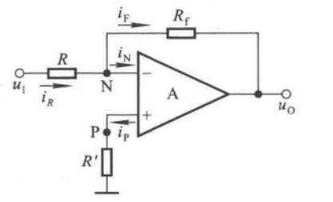

（根据虚短虚断）可以计算得到

$$
u_O = -\dfrac{R_f}{R}u_I
$$

其中输出电阻$R_o=0$，输入电阻$R_i=R$

### 同相比例运算电路

$$
u_O = (1+\dfrac{R_f}{R})u_I
$$

引入了电压串联负反馈，可以认为输入电阻无穷大，输出电阻为$0$

### 电压跟随器

$$
u_O = u_I
$$

### 反向求和运算电路

$$
u_O = -R_f\bigg(\dfrac{u_{I1}}{R_1}+\dfrac{u_{I2}}{R_2}+\dfrac{u_{I3}}{R_3}\bigg)
$$

可以看作是反相比例放大器的叠加电路，输入电阻取决于不同的端口。

### 同相求和运算电路

$$
u_O = R_f\cdot\dfrac{R_P}{R_N}\cdot
\bigg(\dfrac{u_{I1}}{R_1}+\dfrac{u_{I2}}{R_2}+\dfrac{u_{I3}}{R_3}\bigg)
$$

其中，$R_P = R_1\parallel R_2\parallel R_3\parallel R_4, R_N = R\parallel R_f$，若$R_P=R_N$，则

$$
u_O = R_f\cdot
\bigg(\dfrac{u_{I1}}{R_1}+\dfrac{u_{I2}}{R_2}+\dfrac{u_{I3}}{R_3}\bigg)
$$

### 加减运算电路

其实就是把上面两个电路结合一下。

$$
u_O = R_f\bigg(\dfrac{u_{I3}}{R_3}+\dfrac{u_{I4}}{R_4}-\dfrac{u_{I1}}{R_1}-\dfrac{u_{I2}}{R_2}\bigg)
$$

要求$R_1\parallel R_2\parallel R_f=R_3\parallel R_4\parallel R_5$

### 差分比例运算电路

是加减运算电路的一种特例，其只有两个输入，且参数对称

$$
u_O = \dfrac{R_f}{R}(u_{I2}-u_{I1})
$$

### 积分器

$$
u_O = -\dfrac{1}{RC}\int u_Idt
$$

### 微分器

$$
u_O = -RC\dfrac{du_I}{dt}
$$

## 滤波器

滤波器可以分为无源和有源滤波器。如果滤波电路仅由无源元件（电阻、电容、电感）组成，则称为无源滤波电路。如果滤波电路由无源元件和有源元件（双极型管，单极型管、集成运放）共同组成，则称为有源滤波电路。

我们主要讨论有源滤波器。在分析有源滤波电路时，常常通过拉普拉斯变换将电压、电流、以及无源元件变换为等效电路（具体见[信号与系统学习笔记](../信号与系统学习笔记/#电路的s域模型)）。输出量与输入量之比称为传递函数，即

$$
A_u(s) = \dfrac{U_o(s)}{U_i(s)}
$$

下面介绍的都是有源滤波电路。

### 一阶同相输入低通滤波器

其传递函数为

$$
A_u(s)=\dfrac{U_o(s)}{U_i(s)}=\bigg(1+\dfrac{R_2}{R_1}\bigg)\dfrac{U_p(s)}{U_i(s)}=\bigg(1+\dfrac{R_2}{R_1}\bigg)\dfrac{1}{1+sRC}
$$

用$jw$取代$s$，令$f_0=\dfrac{1}{2\pi RC}$，得到

$$
\dot{A}_u = \bigg(1+\dfrac{R_2}{R_1}\bigg)\cdot\dfrac{1}{1+j\dfrac{f}{f_0}}
$$

式中$f_0$称为特征频率。令$f=0$，得到通带放大倍数。

$$
\dot A_{up}=1+\dfrac{R_2}{R_1}
$$

当$f=f_0$时，$\dot A_u=\dfrac{\dot A_{up}}{\sqrt 2}$，故通带截止频率$f_p=f_0$。

### 二阶同相输入低通滤波器

假设$C_1=C_2=C$

$$
A_u(s) = \bigg(1+\dfrac{R_2}{R_1}\bigg)\dfrac{1}{1+3sRC+(sRC)^2}
$$

用$jw$取代$s$，令$f_0=\dfrac{1}{2\pi RC}$，得到

$$
\dot A_u = \dfrac{1+\dfrac{R_2}{R_1}}{1-\bigg(\dfrac{f}{f_0}\bigg)^2+j3\dfrac{f}{f_0}}
$$

称$f_0$为特征频率。令上式分母的模等于$\sqrt 2$，可以解出通带截止频率为$f_p\approx 0.37f_0$。

### 一阶反向输入低通滤波器

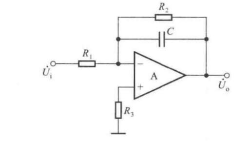

通带放大倍数为

$$
\dot A_{up} = -\dfrac{R_2}{R_1}
$$

电路的传输函数为

$$
A_u(s) = -\dfrac{R_2\parallel\dfrac{1}{sC}}{R_1}=\dfrac{R_2}{R_1}\dfrac{1}{1+sR_2C}
$$

用$jw$取代$s$，令$f_0=\dfrac{1}{2\pi R_2C}$

$$
\dot A_u = \dfrac{\dot A_{up}}{1+j\dfrac{f}{f_0}}
$$

截止频率$f_p=f_0$

### 二阶反向输入低通滤波器

$$
\dot A_{up} = -\dfrac{R_f}{R_1}
$$

教材上并没有给出$\dot A_u$的表达式和截止频率。

$$
f_0=\dfrac{1}{2\pi\sqrt{C_1C_2R_2R_f}}
$$

### 二阶高通滤波器

$$
\dot A_{up} = 1+\dfrac{R_f}{R_1}
$$

$$
f_p = \dfrac{1}{2\pi RC}
$$

### 带通滤波器

将低通和高通串联，就得到带通。

设前者的截止频率为$f_{p1}$，后者的截止频率为$f_{p2}$，则$f_{p2}应该小于$$f_{p1}$，则通带为$(f_{p1}-f_{p2})$

$$
\dot A_{uf} = 1+\dfrac{R_f}{R_1}
$$

当$C_1=C_2=C,R_1=R,R_2=2R$，令$f_0=\dfrac{1}{2\pi RC}$（中心频率）

$$
\dot A_u = \dfrac{1}{1+j\dfrac{1}{3-\dot A_{uf}}\bigg(\dfrac{f}{f_0}-\dfrac{f_0}{f}\bigg)}\dfrac{\dot A_{uf}}{3-\dot A_{uf}}
$$

当$f=f_0$

$$
\dot A_{up}=\dfrac{\dot A_{uf}}{|3-\dot A_{uf}|}
$$

$$
f_{p1} = \dfrac{f_0}{2}\bigg(\sqrt{(3-\dot A_{uf})^2+4}-(3-\dot A_{uf})\bigg)
$$

$$
f_{p2} = \dfrac{f_0}{2}\bigg(\sqrt{(3-\dot A_{uf})^2+4}+(3-\dot A_{uf})\bigg)
$$

### 带阻滤波器

将输入电压同时作用于低通和高通，再将两个电路的输出电压求和，就可以得到带阻滤波器。$f_{p1}<f_{p2}$，阻带为$(f_{p2}-f_{p1})$

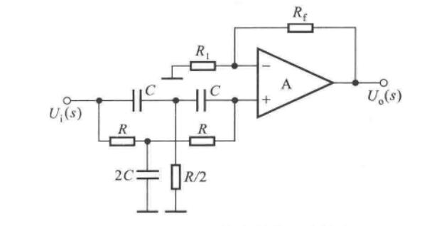

$$
\dot A_{up} = 1+\dfrac{R_f}{R_1}
$$

### 全通滤波器（移相器）

$$
\dot A_u = \dfrac{1-jwRC}{1+jwRC}
$$

也即

$$
|\dot A_u| = 1
$$

$$
\varphi = 180\degree-2arctan\dfrac{f}{f_0},f_0=\dfrac{1}{2\pi RC}
$$

## 滤波器判断

为了避免积分、微分运算，把电路转变为拉普拉斯变换下的等效电路是必要的。

通过拉普拉斯变换，我们可以更容易地得到输入-输出关系，或者就是求出系统函数（传递函数）。通过系统函数我们可以方便地判断滤波器的类型。

**一阶还是二阶**

传递函数中，分子分母的多项式，如果其中一个最高含有$s^2$项，则是二阶。如果两个都最高只含$s$项，就是一阶。

**二阶低通**

传递函数常见为

$$
H(s) = \dfrac{H(0)w_0^2}{s^2+\dfrac{w_0}{Q}s+w_02}
$$

其零极点图，包含了两个共轭的极点。

**二阶高通**

传递函数常见为

$$
H(s) = \dfrac{H(\infty)s^2}{s^2+\dfrac{w_0}{Q}s+w_02}
$$

其零极点图，包含了两个共轭的极点，一个取值为零的二阶零点。

**二阶带通**

传递函数常见为

$$
H(s) = \dfrac{H(w_0)\dfrac{w_0}{Q}s}{s^2+\dfrac{w_0}{Q}s+w_02}
$$

其零极点图，包含了一个取值为$0$的零点，两个共轭极点。$Q$为品质因数，越大，带宽越窄，选频性能越好。

**二阶带阻**

传递函数常见为

$$
H(s) = \dfrac{H(0)(s^2+w_0^2)}{s^2+\dfrac{w_0}{Q}s+w_02}
$$

其零极点图，两个零点，两个共轭极点。$Q$越大，陷波特性越尖锐。这两个零点是共轭的，在$jw$轴上。

**二阶全通**

传递函数常见为

$$
H(s) = \dfrac{H(0)(s^2-\dfrac{w_0}{Q}s+w_0^2)}{s^2+\dfrac{w_0}{Q}s+w_02}
$$

其零极点图，两个共轭零点，两个共轭极点。构成一个矩形。

**一阶**

不知道为什么书上没讲一阶电路判断。但是根据传递函数多少也能看明白。

# 半导体器件

## 半导体基础知识

**本征半导体**

纯净的具有晶体结构的半导体称为本征半导体。例如硅和锗的纯净半导体。

本征半导体中，共价键的价电子可以获得足够大的能量，挣脱共价键的束缚，游离出去，成为自由电子，并在共价键处留下带有一个单位的正电荷的空穴。这个过程称为本征激发。

本征激发产生成对的自由电子和空穴，所以本征半导体中自由电子和空穴的数量相等。

价电子的反向递补运动等价为空穴在半导体中自由移动。因此，在本征激发的作用下，本征半导体中出现了带负电的自由电子和带正电的空穴，二者都可以参与导电，统称为载流子。

**杂质半导体**

往本征半导体里掺入少量合适的杂质元素，便可得到杂质半导体。按掺入的杂质元素不同，可以分成N型半导体和P型半导体。

**N型半导体**

在本征半导体中掺入五价原子，即构成N型半导体。N型半导体中每掺杂一个杂质元素的原子，就提供一个自由电子，从而大量增加了自由电子的浓度。

N型半导体中，自由电子的浓度大于空穴的浓度，故称自由电子为多数载流子，空穴为少数载流子，前者也称为多子，后者也称为少子，由于杂质原子可以提供电子，故称为施主原子。

**P型半导体**

在本征半导体中掺入三价原子，即构成P型半导体。P型半导体中每掺杂一个杂质元素的原子，就提供一个空穴，从而大量增加了空穴的浓度。

P型半导体中，空穴为多子，自由电子为少子，主要靠空穴导电。因杂质原子中的空位吸收电子，故称之为受主原子。

**漂移电流和扩散电流**

漂移电流：在电场的作用下，自由电子会逆着电场方向漂移，而空穴则顺着电场方向漂移，这样产生的电流称为漂移电流，该电流的大小主要取决于载流子的浓度，迁移率和电场强度。

扩散电流：半导体中载流子浓度不均匀分布时，载流子会从高浓度区向低浓度区扩散，从而形成扩散电流，该电流的大小正比于载流子的浓度差即浓度梯度的大小。

**PN结**

通过掺杂工艺，把本征半导体的一边做成 P 型半导体，另一边做成 N 型半导体，则 P 型半导体和 N 型半导体的交接面处会形成一个有特殊物理性质的薄层，称为 PN 结。 

在无外电场和其他激发作用下，参与扩散运动的多子数目等于参与漂移运动的少子数目，从而达到动态平衡，形成PN结。

由于扩散到P区的自由电子与空穴复合，而扩散到N区的空穴与自由电子复合，所以在交界面附近多子的浓度下降，P区出现负离子区，N区出现正离子区，它们是不能移动的，称为空间电荷区（耗尽层），从而形成内电场。

当外加电压极性不同时，PN结表现出截然不同的导电性能。

当电源的正极接到PN结的P端，且电源的负极接到PN结的N端时，称PN结外加正向电压，也称正向接法或正向偏置。此时空间电荷区变窄，削弱内电场，使扩散运动加剧，漂移运动减弱。由于电源的作用，扩散运动将源源不断地进行，从而形成正向电流，PN结导通。

当电源的正极接到PN结的N端，且电源的负极接到PN结的P端时，称PN结外加反向电压，也称反向接法或反向偏置。加强了内电场，阻止扩散运动，加剧漂移运动。但是少子数目极少，反向电流非常小，所以常常忽略不计，认为PN结外加反向电压时处于截止状态。

**PN结的电流方程**

PN结所加端电压$u$与流过它的电流$i$的关系为

$$
i = I_S(e^{\frac{qu}{kT}}-1)
$$

其中$I_S$为反向饱和电流，$q$为电子的电量，$k$为玻尔兹曼常数，$T$为热力学温度，将$kT/q$用$U_T$取得，得到

$$
i = I_S(e^{u/U_T}-1)
$$

常温下，即$T=300K$时，$U_T\approx26\text{mV}$，称$U_T$为温度的电压当量。

**PN结的伏安特性、击穿特性**

当施加正向电压，且$u>>U_T$时，$i\approx I_Se^{u/U_T}$，即指数变化。反向电压时，当$|u|>>U_T$，$i\approx -I_S$。画出图如下

$u>0$时为正向特性，$u<0$时为反向特性。

当反向电压超过一定数值$U_{(BR)}$后，反向电流急剧增加，称之为反向击穿。击穿可以分为齐纳击穿和雪崩击穿。

在高掺杂的情况下，因为耗尽层的宽度很窄，不大的反向电压就可以在耗尽层形成很强的电场，从而直接破坏共价键，使价电子脱离共价键束缚，产生电子-空穴对，致使电流急剧加大，这种击穿称为**齐纳击穿**。齐纳击穿电压较低。

如果掺杂浓度低，耗尽层宽度较宽，那么低反向电压下不会产生齐纳击穿。当反向电压较大，耗尽层的电场使少子加快漂移速度，从而与共价键中的价电子相碰撞，把价电子撞出共价键，产生电子-空穴对。新产生的电子与空穴被电场加速后又撞出其他价电子，载流子雪崩式地倍增，致使电流急剧增加，称为**雪崩击穿**。

**PN结的电容特性**

一定条件下，PN结具有电容效应，根据产生的原因不同分为势垒电容$C_b$和扩散电容$C_d$

PN结的结电容$C_j=C_b+C_d$

一般两个电容都很小，对于低频信号呈现出很大的容抗，可以忽略不计。只有在信号频率较高时才考虑结电容的作用。

## 二极管

将PN结用外壳封装起来加上电极引线就构成了半导体二极管，简称二极管。P区的电极称为阳极，N区的称为阴极。

### 二极管的伏安特性

和PN结差不多，但是由于二极管存在半导体体电阻和引线电阻，所以当外加正向电压时，在电流相同的情况下，二极管的端电压大于PN结上的压降。并且二极管表面有漏电流，在外加反向电压时反向电流增大。

实测发现，只有当正向电压足够大的时候，正向电流才指数增长。使得二极管开始导通的临界电压称为开启电压$U_{on}$。施加反向电压足够大的反向电流为$I_S$，太大则会击穿。

硅管的典型导通电压为$0.7V$，锗管的典型导通电压为$0.2V$。

二极管的特性对温度很敏感。

### 二极管的等效电路

等效电路是理想二极管串联电压源$U_{on}$和电阻$r_D$，且$r_D=\Delta U/\Delta I$

在做题算直流电阻的时候，直接把某个点的电压除以电流即可。算交流电阻时，用$U_T$除以该点的电流即可。

### 稳压二极管

稳压管在反向击穿时，在一定的电流范围内，端电压几乎不变，表现出稳压特性。

- 稳定电压$U_Z$是在规定电流下稳压管的反向击穿电压。
- 稳定电流$I_Z(I_{Zmin})$是稳压管工作在稳压状态时的参考电流。
- 最大稳定电流$I_{ZM}(I_{Zmax})$，电流超过这个值时，功耗会过大，超过额定功耗$P_{ZM}$，可能烧坏PN结。

### 二极管应用电路

**整流电路**

**限幅电路**

**电平选择电路**

## 晶体三极管

### 基本类型

NPN型三极管如上。

PNP型三极管如上。

使晶体管工作在放大状态的外部条件是，发射结正偏且集电结反偏。NPN型，就是$U_{be}>U_{on}$，并且$U_{bc}<0$。$PNP$型就是$U_{be}<-U_{on}$且$U_{bc}>0$。

晶体管的放大作用体现在小的基极电流可以控制大的集电极电流。

### 内部载流子运动与外部电流

以NPN型为例

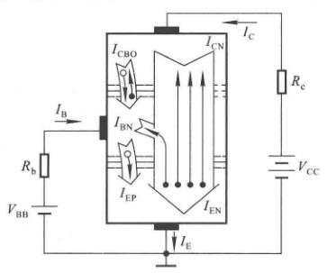

内部看

$$
I_E = I_{EN}+I_{EP}=I_{CN}+I_{BN}+I_{EP}
$$

$$
I_C=I_{CN}+I_{CBO}
$$

$$
I_B = I_{BN}+I_{EP}-I_{CBO} = I'_B-I_{CBO}
$$

从外部看

$$
I_E = I_C+I_B
$$

注意从外部看PNP型的方程一样，但是三个电流方向都相反。

**共发射极放大倍数**

$$
\bar\beta = \dfrac{I_{CN}}{I'_B}=\dfrac{I_C-I_{CBO}}{I_B+I_{CBO}}
$$

一般情况下$I_B>>I_{CBO},\bar\beta>>1$，所以

$$
I_C\approx\bar\beta I_B,\quad I_E\approx(1+\bar\beta)I_B
$$

如果输入电压是动态电压，则

$$
\beta = \dfrac{\Delta i_C}{\Delta i_B}
$$

在$|\Delta i_B|$不太大时，可以认为$\beta\approx\bar\beta$

**共基极直流放大倍数**

$$
\bar\alpha = \dfrac{I_{CN}}{I_E}
$$

同样一般有

$$
I_C\approx \bar\alpha I_E
$$

我们可以得到关系式

$$
\bar\beta = \dfrac{\bar\alpha}{1-\bar\alpha},\quad\bar\alpha=\dfrac{\bar\beta}{1+\bar\beta}
$$

同样

$$
\alpha = \dfrac{\Delta i_C}{\Delta i_E} = \dfrac{\beta}{1+\beta}
$$

通常$\beta>>1$，故$\alpha\approx1$；而且与$\beta\approx\bar\beta$相同，$\alpha\approx\bar\alpha$

这两个放大倍数在NPN和PNP型处于放大区都可以用，注意电流方向即可。

### 共射特性曲线

**输入特性曲线**

输入特性曲线描述在管降压$U_{CE}$一定的情况下，基极电流$i_B$与发射结降压$U_{BE}$之间的函数关系，即

$$
i_B = f(U_{BE})\bigg|_{U_{CE}=常数}
$$

**输出特性曲线**

输出特性曲线描述基极电流$I_B$为一常量时，集电极电流$i_C$与管降压$U_{CE}$之间的函数关系，即

$$
i_C = f(U_{CE})\bigg|_{I_B=常数}
$$

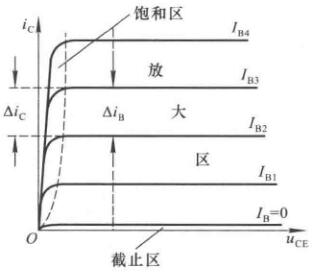

*截止区*

其特征是发射结电压小于开启电压且集电结反向偏置。对于共射电路，$u_{BE}\leq U_{on}$且$u_{CE}>u_{BE}$。此时$I_B=0$，近似认为$i_c\approx0$

*放大区*

其特征是发射结电压正向偏置且集电结反向偏置。对于共射电路，$u_{BE}>U_{on}$且$u_{CE}\geq u_{BE}$。此时$i_C$几乎仅仅决定于$i_B$，而与$u_{CE}$无关。$I_C=\bar\beta I_B, \Delta i_C=\beta\Delta i_B$

*饱和区*

其特征是发射极与集电极均正向偏置。对于共射电路，$u_{BE}>U_{on}$且$u_{CE}<u_{BE}$。此时$i_C$不仅与$i_B$有关，而且明显随$u_{CE}$增大而增大，$i_C$小于$\bar\beta I_B$。此时$u_{CE}=U_{CE(sat)}$，通常为$0.2\sim 0.3\text{V}$

# 放大电路的分析方法

## 放大的主要性能指标

**放大倍数**

电压放大倍数$\dot A_{uu}=\dot A_{u}=\dfrac{\dot U_o}{\dot U_i}$

电流放大倍数$\dot A_{ii}=\dot A_{i}=\dfrac{\dot I_o}{\dot I_i}$

互阻放大倍数$\dot A_{ui}=\dfrac{\dot U_o}{\dot I_i}$

互导放大倍数$\dot A_{ui}=\dfrac{\dot I_o}{\dot U_i}$

**输入电阻**

$$
R_i = \dfrac{U_i}{I_i}
$$

输入电阻与信号源内阻无关。

**输出电阻**

$$
R_o = \bigg(\dfrac{U_o'}{U_o}-1\bigg)R_L
$$

其中$U_o'$为空载时输出电压的有效值，$U_o$为带负载后输出电压的有效值，$R_L$为负载电阻。但是，这个只是计算方法，输出电阻与负载无关。

## 静态工作点

以共射放大电路为例。

当$u_i=0$时，称放大电路处于静态。$V_{BB}$使得$U_{BE}>U_{on}$并且与$R_b$共同决定$I_B$，$V_{CC}$应该足够高，使得集电极反向偏置，从而保持在放大状态，此时$I_C=\beta I_B$，并确定了$U_{CE}=V_{CC}-I_CR_c$

图中的输入回路和输出回路以发射极为公共端，故称为共射放大电路。

输入信号为零，直流电源单独作用时晶体管的$I_{B},I_{C},U_{BE},U_{CE}$称为放大电路的静态工作点$Q$，常记作$I_{BQ},I_{CQ},U_{BEQ},U_{CEQ}$，通常认为$U_{BEQ}$为已知量，硅管为$0.7V$，锗管为$0.2V$，并且认为$\bar\beta=\beta$

令$\dot U_i=0$，从上面的电路可以解出

$$
\left\{\begin{matrix}
I_{BQ}=\dfrac{V_{BB}-U_{BEQ}}{R_b} \\
I_{CQ}=\bar\beta I_{BQ}=\beta I_{BQ} \\
U_{CEQ} = V_{CC}-I_{CQ}R_c
\end{matrix}\right.
$$

## 直流通路与交流通路

**直流通路是在直流电源作用下直流电流流经的通路,** 也就是静态电流流经的通路,用于研究静态工作点。对于直流通路,

1. 电容视为开路;
2. 电感线圈视为短路(即忽略线圈电阻);
3. 信号源视为短路,但应保留其内阻。

**交流通路是输入信号作用下交流信号流经的通路,** 用于研究动态参数。对于交流通路,

1. 容量大的电容(如耦合电容)视为短路,
2. 无内阻的直流电源(如$V_{CC}$)视为短路。

## 三极管等效电路

**晶体管等效（在做题中几乎无用）**

直流模型是在静态工作时的模型。必须在放大区才可以使用，并且要求$\beta=\bar\beta$

**交流小信号模型（在做题中，注意$r_{be}$是怎么求的）**

忽略$r_{bc}$的影响后，

$$
r_{be} = r_{bb'}+(1+\beta)\dfrac{U_T}{I_{CQ}}
$$

$$
g_mU_{b'e}=\beta I_b
$$

这里的$r_{bb'}$是基区体电阻，$r_{b'e}$是发射结电阻。部分题目会用到来求$r_{be}$。$r_{bb'}$一般在几十到几百欧，题目没说就取$200$欧。

**h参数等效模型（最主要用这个分析题目）**

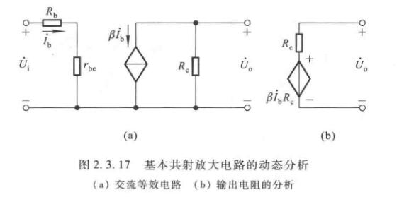

这是静态工作点一节中的电路的等效。$r_{ce}$和$R_c$并联，它很大，可以忽略。

可以计算

$$
\dot A_u = \dfrac{\dot U_o}{\dot U_i} = -\dfrac{\beta R_c}{R_b+r_{be}}
$$

$$
R_i = R_b+r_{be}
$$

$$
R_o = R_c
$$

特别指出，放大电路的输入电阻与信号源内阻无关，输出电阻与负载无关。

这个等效电路可以用来分析交流情况。

## 图解法

### 静态工作点的分析

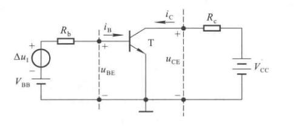

如图，当$\Delta u_I=0$时，静态工作点既应在晶体管的输入特性曲线上，又应满足

$$
u_{BE}=V_{BB}-i_BR_b
$$

在输出回路中，静态工作点既应在$I_B=I_{BQ}$的那条输出特性曲线上，又应满足外电路的回路方程

$$
u_{CE} = V_{CC}-i_CR_c
$$

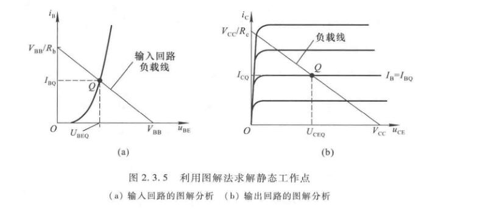

于是我们就可以从图中读出静态工作点的数据。如果$I_B=I_{BQ}$的那条曲线没有，则应当补测。

### 电压放大倍数的分析

$$
u_{BE}=V_{BB}+\Delta u_I-i_BR_b
$$

$$
A_u = \dfrac{\Delta u_{CE}}{\Delta u_I} = \dfrac{\Delta u_O}{\Delta u_I}
$$

### 波形非线性失真的分析

假设静态工作点设置合适并且信号输入幅值较小，则可以正常工作，如下

如果$Q$点过低，输入信号负半周期峰值的某段时间内，晶体管b-e间电压总量小于开启电压，晶体管截止。因此基极电流$i_b$将产生底部失真，最后导致$u_O$顶部失真。这种情况叫做**截止失真**。解决办法是加大$V_{BB}$

如果$Q$点过高，虽然$i_B$本身不失真，但是在输出回路中，$i_B$的正半周期可能会进入饱和区，导致了$i_c$产生顶部失真，最后导致$u_O$底部失真。这种情况叫做**饱和失真**。解决办法是增大$R_b$而减小$I_{BQ}$，从而减小$I_{CQ}$；也可以减小$R_c$，从而增大$U_{CEQ}$；或者更换一只$\beta$较小的管子，以便在$I_{BQ}$相同的情况下减小$I_{CQ}$

**计算最大不失真参数**

如果将晶体管理想化，即认为在管压降总量$u_{CE}$最小值大于饱和管压降$U_{CES}$（即管子不饱和），且基极电流总量$i_{B}$大于$0$（即管子不截肢）的情况下，非线性失真可以忽略不计，那么就可以得出放大电路的最大不失真电压$U_{om}$

从图2.3.7(b)可以计算，其方法是以$U_{CEQ}$为中心，取$V_{CC}-U_{CEQ}$和$V_{CEQ}-U_{CES}$这两段距离中较小的数值，并除以$\sqrt{2}$，则得到其有效值$U_{om}$

为了使$U_{om}$尽可能大，应该将$Q$点放置在放大区内负载线的终点，即横坐标$\dfrac{V_{CC}+U_{CES}}{2}$的位置，此时的$U_{om}=\dfrac{V_{CC}-U_{CEQ}}{\sqrt{2}}$

或者你需要计算其他电路中的参数，按照此时的设置，$U_{CEQ}=\dfrac{V_{CC}+U_{CES}}{2}$，用这个东西去计算$I_{CQ},I_{BQ},I_{EQ}$等等都是可以的。

### 直流、交流负载线

直流通路所确定的负载线$u_{CE}=V_{CC}-i_CR_c$称为直流负载线，而动态信号遵循的负载线称为交流负载线。

交流负载线有两个特点

1. 输入电压为零时，其实就是静态工作点，所以负载线必过$Q$点
2. 由于集电极电流$i_c$仅取决于基极动态电流$i_b$，而动态管压降$u_{ce}$等于$i_c$与$R_{c}\parallel R_L$之积，所以它的斜率为$-1/(R_c\parallel R_L)$

但其实也不一定要找出斜率。我们可以再找一个不同于$Q$的点即可。

## 三极管的三种接法

### 共射

之前的例子都是共射电路，其特征是发射极为输出回路与输入回路的公共端（这个画出交流通路比较好判断，不要在原来的电路上判断）。

静态工作点、放大倍数、输入输出阻抗见前。

### 共集

即输出输入回路（交流通路上）以集电极为公共端。

$$
\left\{\begin{matrix}
I_{BQ}=\dfrac{V_{BB}-U_{BEQ}}{R_b+(1+\beta)R_e} \\
I_{EQ}=(1+\beta)I_{BQ} \\
U_{CEQ} = V_{CC}-I_{EQ}R_e
\end{matrix}\right.
$$

$$
\dot A_u = \dfrac{(1+\beta)R_e}{R_b+r_{be}+(1+\beta)R_e}
$$

显然$\dot A_u$在$0$到$1$之间，输入输出同向，输出小于输入。当$(1+\beta)R_e>>R_b+r_{be}$时，$\dot A_u\approx 1$，即$\dot U_o\approx\dot U_i$，故常称共集放大电路为射极跟随器。虽然电路没有电压放大能力但是输出电流$I_e$远大于输入电流$I_b$，仍有功率放大作用。

$$
R_i = R_b+r_{be}+(1+\beta)R_e
$$

$$
R_o = R_e\parallel\dfrac{R_b+r_{be}}{1+\beta}
$$

### 共基

即输出输入回路（交流通路上）以基极为公共端。

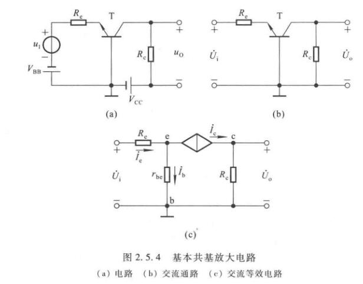

$$
\left\{\begin{matrix}
I_{EQ}=\dfrac{V_{BB}-U_{BEQ}}{R_e} \\
I_{BQ}=\dfrac{I_{EQ}}{1+\beta} \\
U_{CEQ} = U_{CQ}-U_{EQ}=V_{CC}-I_{CQ}R_c+U_{BEQ}
\end{matrix}\right.
$$

$$
\dot A_u = \dfrac{\beta R_c}{r_{be}+(1+\beta)R_e}
$$

$$
R_i=R_e+\dfrac{r_{be}}{1+\beta}
$$

$$
R_o=R_c
$$

由于共基电路的输入回路电流为$i_E$，而输出回路电流为$i_C$，所以无电流放大能力。但有足够的电压放大能力，从而实现功率放大。此外输入电压和输出电压同相。

### 三种接法的比较

1. 共射电路既能放大电流又能放大电压，输入电阻居三种电路之中，输出电阻较大,频带较窄。常作为低频电压放大电路的单元电路。
2. 共集电路只能放大电流不能放大电压，是三种接法中输入电阻最大、输出电阻最小的电路，并具有电压跟随的特点。常用于电压放大电路的输入级和输出级，在功率放大电路中也常采用射极输出的形式。
3. 共基电路只能放大电压不能放大电流，具有电流跟随的特点；输人电阻小，电压放大倍数、输出电阻与共射电路相当，是三种接法中高频特性最好的电路。常作为宽频带放大电路。

# 集成运放的内部电路

## 多级放大电路的一般问题

### 耦合方式

**直接耦合**

将前一级的输出端直接连接到后一级的输入端。

采用直接耦合方式使各级之间的直流通路相连，因静态工作点相互影响，这样就给电路的分析、设计和调试带来困难。计算静态工作点和放大倍数都要考虑前后级的影响。最大的问题是存在零点漂移现象。

优点是具有良好的低频特性，可以放大变化缓慢的信号。由于没有大电容，易于集成在一片硅片上，构成集成放大电路。

**阻容耦合**

前级输出端通过电容接到后级输入端。

阻容耦合的电路各级之间的直流通路各不相通，静态工作点相互独立，在求解和调试$Q$点时可以按单级处理。而且，只要输入信号频率较高，耦合电容容量较大，前级的输出就可以几乎无损地传递到后级。

缺点是低频特性差，不能放大缓慢变化的信号。以及不便于集成化。所以一般只有频率高、输出功率大等情况下才会采用阻容耦合。

**变压器耦合**

前级输出端通过变压器接到后级输入端或负载电阻上。

静态工作点相互独立，在求解和调试$Q$点时可以按单级处理。

低频特性差，不能放大缓慢的信号。比阻容耦合还不能集成化。

但其最大的特点是可以实现阻抗变换。

**光电耦合**

以光信号为媒介来实现电信号的耦合和传递，通过将发光二极管与光电三极管相互绝缘地组合在一起来实现。

书上没有提到优缺点

### 多级放大电路的动态分析

无论什么耦合，放大电路中前级的输出电压就是后级的输入电压，即$\dot U_{o1}=\dot U_{i2},\dot U_{o2}=\dot U_{i3},\cdots,\dot U_{o(N-1)}=\dot U_{iN}$

所以总体的放大倍数为

$$
\dot A_u = \dfrac{\dot U_{o1}}{\dot U_i}\cdot\dfrac{\dot U_{o2}}{\dot U_i2}\cdot\cdots\cdot\dfrac{\dot U_{o}}{\dot U_{iN}}=\dot A_{u1}\cdot\dot A_{u2}\cdot\dots\cdot\dot A_{uN} = \prod^{N}_{j=1}\dot A_{uj}
$$

输入电阻就是第一级的输入电阻，输出电阻就是最后一级的输出点租。

$$
R_i = R_{i1}, R_o = R_{oN}
$$

注意，当共集放大电路作为输入级时，它的输入电阻与其负载，即与第二级的输入电阻有关；共集放大电路作为输出级时，它的输出电阻与其信号源内阻，即倒数第二级的输出电阻有关。

## 差分放大电路

共模信号：大小相等、极性相同的输入信号。

差模信号：大小相等、极性相反的输入信号。

差分放大电路对于共模信号有很强的抑制作用（不仅因为其电路参数对称，还因为其反馈作用），所以能克服零点漂移的问题。

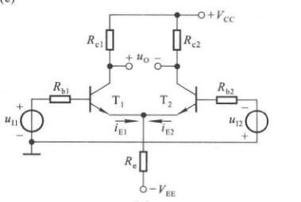

由于输入的是差模信号，电路参数对称，集电极电位的变化也是大小相等且方向相反的，即$\Delta u_{c1}=-\Delta u_{c2}$，所以输出电压为$\Delta u_o=\Delta u_{c1}-\Delta u_{c2}=2\Delta u_{c1}$，从而实现了电压放大。

显然的，在差模信号作用下，$R_e$中的电流变化为零，即$R_e$对差模信号没有反馈作用，相当于短路。而$R_e$对共模信号有负反馈作用，可以抑制零点漂移。

### 长尾式差分放大电路

如图，$R_e$接到一个$-V_{EE}$上，故称长尾式电路。参数理想对称，即$R_{b1}=R_{b2}=R_b,R_{e1}=R_{e2}=R_e$；$T_1$与$T_2$的特性相同，$\beta_1=\beta_2=\beta,r_{be1}=r_{be2}=r_{be}$

**静态分析**

当$u_{I1}=u_{I2}=0$时，

$$
I_{R_e} = I_{EQ1} + I_{EQ2} = 2I_{EQ}
$$

根据基极回路方程

$$
I_{BQ}R_b + U_{BEQ} + 2I_{EQ}R_e = V_{EE}
$$

可以求出$I_{BQ}$或$I_{EQ}$从而解出静态工作点。通常，由于$R_b$很小，很多情况下$R_b$就是信号源内阻，而且$I_{BQ}$也很小，所以$R_b$上的电压可忽略不计，从而$U_{EQ}\approx-U_{BEQ}$，因而

$$
I_{EQ}\approx\dfrac{V_{EE}-U_{BEQ}}{2R_e}
$$

$$
I_{BQ} = \dfrac{I_{EQ}}{1+\beta}
$$

$$
U_{CEQ} = U_{CQ}-U_{EQ}\approx V_{CC}-I_{CQ}R_c+U_{BEQ}
$$

由于$U_{CQ1}=U_{CQ2}$，所以$u_O=U_{CQ1}-U_{CQ2}=0$

**对共模信号的抑制作用**

之前提到过由于参数对称，输入共模信号时集电极的电压也是共模的，从而输出电压为零。

除此之外还有负反馈作用，见下图

$R_e$越大，负反馈作用越强。但也不宜过大，应该受到$V_{EE}$的限制，以防止$I_{EQ}$过小。为了描述对共模信号的抑制能力，引入共模放大倍数$A_c$

$$
A_c = \dfrac{\Delta u_{Oc}}{\Delta u_{Ic}}
$$

理想情况下$A_c = 0$

**对差模信号的放大作用**

当给差分放大电路输入一个差模信号$\Delta u_{Id}$时，由于电路参数的对称性，$\Delta u_{Id}$经分压后，加在$T_1$管一边的为$+\Delta u_{Id}/2$，加在$T_2$管一边的为$-\Delta u_{Id}/2$

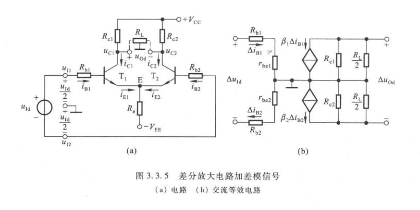

$E$点在差模信号下电位不变，相当于接地。负载电阻的中点电位在差模信号的作用下电位也不变，相当于接地。交流等效通路如图。

差模放大倍数为

$$
A_d = \dfrac{\Delta u_{Od}}{\Delta u_{Id}}
$$

由交流等效电路可得$\Delta u_{Id}=2\Delta i_{B1}(R_b+r_{be}),\Delta u_{Od}=-2\Delta i_{C1}\bigg(R_c\parallel\dfrac{R_L}{2}\bigg)$，所以

$$
A_d = \dfrac{\beta\bigg(R_c\parallel\dfrac{R_L}{2}\bigg)}{R_b+r_{be}}
$$

可见，用了两只晶体管，放大能力只相当于一只晶体管，牺牲了一只管子为代价换来了低温漂的效果。

从等效电路也可以看出

$$
R_i = 2(R_b+r_{be})
$$

$$
R_o = 2R_c
$$

为了综合考察对差模信号的放大能力和对共模信号的抑制能力，引入共模抑制比

$$
K_{CMR} = \bigg|\dfrac{A_d}{A_c}\bigg|
$$

理想情况下$K_{CMR}=\infty$

当然这些输入输出电阻、差模放大倍数等东西，都是从这个图中推出来的，如果某个题中的电路没有某个电阻什么的，要自己学会用这个方法推断。

### 四种接法

**双入双出**

之前介绍的叫做双入双出接法。

**双入单出**

其中右边的直流通路是用戴维南定理来算的，有

$$
V'_{CC} = \dfrac{R_L}{R_c+R_L}\cdot V_{CC}
$$

$$
R'_c = R_c\parallel R_L
$$

现在输出回路不对称了，$T_1$管和$T_2$管的集电极电位$U_{CQ1}\neq U_{CQ2}$，从而$U_{CEQ1}\neq U_{CEQ2}$。由图可得

$$
U_{CQ1} = V'_{CC}-I_{CQ}R'_c
$$

$$
U_{CQ2} = V_{CC}-I_{CQ}R_c
$$

静态工作点和之前的计算方法一致。

在差模信号作用时，负载电阻只取得$T_1$管集电极电位的变化量，所以与双出电路相比，差模放大倍数的数值减小。画出等效电路如下，

易计算输出电压为$\Delta u_{Od}=-\Delta i_C(R_c\parallel R_L)$，输入电压为$\Delta u_{Id}=2\Delta i_b(R_b+r_{be})$

差模放大倍数变为

$$
A_d = \dfrac{\Delta u_{Od}}{\Delta u_{Id}} = -\dfrac{1}{2}\cdot\dfrac{\beta(R_c\parallel R_L)}{R_b+r_{be}}
$$

输入电阻仍然为$R_i=2(R_b+r_{be})$，输出电阻为$R_o=R_c$，是双端输出电路的一半。

分析$A_c$时，输入共模电压，我们注意到$\Delta i_{Re} = 2\Delta i_E,\Delta u_e = 2\Delta i_ER_e$，对于每只管子，可以认为是$\Delta i_E$流过阻值为$2R_e$的电阻造成的，如下

可以计算得到

$$
A_c = \dfrac{\Delta u_{Oc}}{\Delta u_{Ic}} = -\dfrac{\beta(R_c\parallel R_L)}{R_b+r_{be}+2(1+\beta)R_e}
$$

$$
K_{CMR} = \bigg|\dfrac{A_d}{A_c}\bigg| = \dfrac{R_b+r_{be}+2(1+\beta)R_e}{2(R_b+r_{be})}
$$

增大$R_e$，$K_{CMR}$越大，电路性能越好。

**单入双出**

这个也叫做射极耦合电路，因为$T_2$管的信号是从$T_1$管传来的。

将电路等效为右边，如果$A_c$不等于零，则输出电压不仅有差模信号产生的，还有共模信号产生的。

$$
\Delta u_{O} = A_d\Delta u_I + A_c\cdot\dfrac{\Delta u_I}{2}
$$

当然理想状况下$A_c=0$。单入双出和双入双出分析完全一样，不再介绍。

**单入单出**

对于单出电路，常把不输出信号一边的$R_c$省掉。对$Q$点、$A_d$、$A_c$、$R_i$、$R_o$的分析和双入单出一样，对于输入信号作用的分析和单入双出一样。

**总结**

四种解法的特点：

1. 输入电阻均为$2(R_b+r_{be})$
2. $A_d,A_c,R_o$与输出方式有关，双端输出时，$A_d$见前，$A_c=0,R_o=2R_c$；单端输出时$A_d,A_c$见前，$R_o=R_c$
3. 单端输入时，差模信号输入的同时总伴随着共模输入。若输入信号为$\Delta u_I$，则$\Delta u_{Id}=\Delta u_{I},\Delta u_{Ic}=+\Delta u_{I}/2$，输出电压表达式见前。

### 改进型差分放大电路

在差分放大电路中，提高$R_e$能抑制温漂，提高共模抑制比。

我们可以利用工作点稳定电路来取代$R_e$，得到下图的恒流源差分放大电路

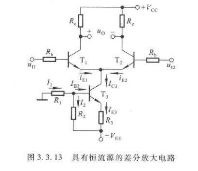

电源$V_{EE}$可取几伏，电路参数应满足$I_2>>I_{B3}$。这样$I_1\approx I_2$，所以$R_2$上的电压为

$$
U_{R2}\approx\dfrac{R_2}{R_1+R_2}\cdot V_{EE}
$$

$$
I_{C3}\approx I_{E3} = \dfrac{U_{R2}-U_{BE3}}{R_3}
$$

若$U_{BE3}$的变换可忽略不计，则$I_{C3}$基本不受温度影响。由于没有动态信号可以作用到$T_3$的基极和发射极，因此$I_{C3}$为恒流，发射极所接电路可以等效成一个恒流源。有

$$
I_{EQ1}=I_{EQ2}=\dfrac{I_{C3}}{2}
$$

当$T_3$管输出特性为理想特性时，$T_3$在放大区的输出特性曲线是横轴的平行线时，恒流源的内阻为无穷大，即相当于$T_1,T_2$接了一个无穷大的电阻，此时$A_c=0,K_{CMR}=\infty$

## 电流源电路

### 单管电流源电路

（题外话，这和改进型差分放大器中的下面接的那个电流源一模一样）

$$
I_O = I_C\approx I_E = \bigg(\dfrac{R_2}{R_1+R_2}|U_{EE}|-U_{BE}\bigg)\bigg/R_3
$$

$$
R_O = r_{ce}\bigg(1+\dfrac{\beta R_3}{r_{be}+R_3+R_1\parallel R_2}\bigg)>>r_{ce}
$$

### 镜像电流源

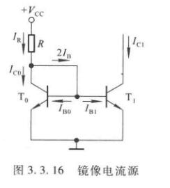

它由两只特性完全相同的管子构成，由于$T_0$的管压降$U_{CE0}$与其$b-e$间电压$U_{BE0}$相等，从而保证$T_0$工作在放大状态。所以$I_{C0}=\beta_0I_{B0}$，由于图中$T_0,T_1$的$b-e$间电压相等，所以有$I_{B0}=I_{B1}=I_B$；由于放大系数相等，所以$I_{C0}=I_{C1}=I_C=\beta I_B$。由于电流相等的关系，所以叫做镜像电流源，$I_{C1}$为输出电流。

电阻$R$中的电流称为基准电流，其表达式为

$$
I_R = \dfrac{V_{CC}-U_{BE}}{R} = I_C+2I_B = I_C + 2\cdot\dfrac{I_C}{\beta}
$$

所以集电极电流

$$
I_C = \dfrac{\beta}{\beta+2}I_R
$$

$\beta>>2$时，输出电流

$$
I_C \approx I_R = \dfrac{V_{CC}-U_{BE}}{R}
$$

镜像电流源具有一定的温度补偿作用，如下

这个电路不好用的地方在于，如果要求$I_{C1}$较大，$I_R$就要大，$R$的功耗也要很大。如果要求$I_{C1}$很小，那么$R$的数值就要很大。这两点在集成电路中都难以做到。

### 比例电流源

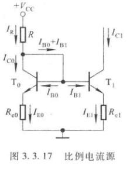

$$
U_{BE0} + I_{E0}R_{e0} = U_{BE1} + I_{E1}R_{e1}
$$

根据晶体管发射结电压与发射极电流的近似关系可得

$$
U_{BE}\approx U_T\ln \dfrac{I_E}{I_S}
$$

（上述公式是忽略基区电阻$r_{bb'}$上的电压时，晶体管发射极电流与$b-e$间电压的关系，$I_E\approx I_S\exp({U_{BE}/U_T})$，推导得到的）

由于两只管的特性完全相同，所以

$$
U_{BE0}-U_{BE1}\approx U_T\ln\dfrac{I_{E0}}{I_{E1}}
$$

代入前式整理得

$$
I_{E1}R_{e1}\approx I_{E0}R_{e0}+U_{T}\ln\dfrac{I_{E0}}{I_{E1}}
$$

当$\beta>>2$时，$I_{C0}\approx I_{E0}\approx I_{R},I_{C1}\approx I_{E1}$，所以

$$
I_{C1}\approx\dfrac{R_{e0}}{R_{e1}}\cdot I_R+\dfrac{U_T}{R_{e1}}\ln\dfrac{I_R}{I_{C1}}
$$

在一定的取值范围内，如果对数项可以忽略，那么

$$
I_{C1}\approx\dfrac{R_{e0}}{R_{e1}}\cdot I_R
$$

当然我们可以很容易地算出

$$
I_{R}\approx\dfrac{V_{CC}-U_{BE0}}{R+R_{e0}}
$$

### 微电流源

如果不想用很大的电阻，又要使得输出电流较小，可以把$R_{e0}$直接舍弃掉，如下图

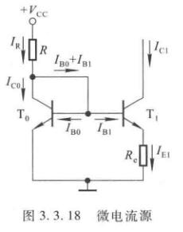

当$\beta>>1$时，有

$$
I_{C1}\approx I_{E1}=\dfrac{U_{BE0}-U_{BE1}}{R_e}
$$

其中这个电压差只有几十豪富，甚至更小。只需要几千欧的$R_e$就可以得到几十微安的输出电流。

两管完全相同，则

$$
I_{C1}\approx \dfrac{U_T}{R_e}\ln\dfrac{I_R}{I_{C1}}
$$

在$R_e$已知的情况下，上式对$I_{C1}$是超越方程，可以通过图解法或累试法解出$I_{C1}$（做题意义上，题目会直接给出一些数据方便你求解）。

易算

$$
I_{R}\approx \dfrac{V_{CC}-U_{BE0}}{R}
$$

### 改进型电流源

上面三个电路很多分析结果都要$\beta$很大时才成立，也就是没考虑基极电流的影响。

**加射极输出器的电流源**

加了$T_2$后，利用放大作用，减小了$I_{B0},I_{B1}$对于$I_R$的分流。三个管特性要完全相同，即$\beta_0=\beta_1=\beta_2=\beta$，而由于$U_{BE1}=U_{BE0},I_{B1}=I_{B0}=I_B$，因此输出电流

$$
I_{C1}=I_{C0} = I_R-I_{B2} = I_R-\dfrac{I_{E2}}{1+\beta}=I_R-\dfrac{2I_B}{1+\beta} = I_R-\dfrac{2I_{C1}}{(1+\beta)\beta}
$$

最后整理得

$$
I_{C1} = \dfrac{I_R}{1+\dfrac{2}{(1+\beta)\beta}}\approx I_R
$$

有时会加上图中的$R_{e2}$，用于提高$T_2$管的$\beta$

**威尔逊电流源**

如上图，三个管子也是特性一致。由于$c-e$间等效电阻非常大，所以可以使$I_{C2}$高度稳定。$\beta_0=\beta_1=\beta_2=\beta,I_{C1}=I_{C0}=I_C$

$$
I_{E2} = I_C + 2I_B = I_C + \dfrac{2I_C}{\beta}
$$

所以

$$
I_C = \dfrac{\beta}{\beta+2}\cdot I_{E2}=\dfrac{\beta}{\beta+2}\cdot\dfrac{1+\beta}{\beta}I_{C2} = \dfrac{\beta+1}{\beta+2}\cdot I_{C2}
$$

在上图的$B$点有

$$
I_R = I_{B2}+I_C = \dfrac{I_{C2}}{\beta}+\dfrac{\beta+1}{\beta+2}\cdot I_{C2}=\dfrac{\beta^2+2\beta+2}{\beta^2+2\beta}\cdot I_{C2}
$$

整理得

$$
I_{C2} = (1-\dfrac{2}{\beta^2+2\beta+2})I_R\approx I_R
$$

### 多路电流源

$I_R$为基准电流，$I_{C1},I_{C2},I_{C3}$为三路输出电流。

$$
U_{BE0}+I_{E0}R_{e0}=U_{BE1}+I_{E1}R_{e1}=U_{BE2}+I_{E2}R_{e2}=U_{BE3}+I_{E3}R_{e3}
$$

由于各管的$U_{BE}$大致相等，则

$$
I_{E0}R_{e0}\approx I_{E1}R_{e1}\approx I_{E2}R_{e2}\approx I_{E3}R_{e3}
$$

当$I_{E0}$确定之后，只要选择合适的电阻，就可以得到所需的电流。注意这里有$I_R\approx I_{C0}\approx I_{E0}$，其他路有$I_{Ci}\approx I_{Ei}$

当然可能会遇到$R_e$全都等于零的情况，那么输出电流全部都等于$I_R$。

上图的叫做多集电极管，集电极电流之比等于它们的集电区面积之比

$$
\dfrac{I_{C1}}{I_{C0}}=\dfrac{S_1}{S_0},\dfrac{I_{C2}}{I_{C0}}=\dfrac{S_2}{S_0}
$$

### 有源负载共射放大电路

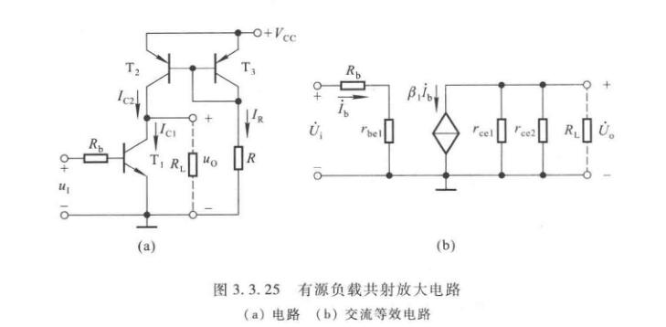

如上图，$T_1$为放大管，$T_2,T_3$构成镜像电流源。$T_2$是$T_1$的有源负载。设$T_2,T_3$管特性相同，从而$\beta_2=\beta_3=\beta,I_{C2}=I_{C3}$。基准电流有

$$
I_R = \dfrac{V_{CC}-U_{EB3}}{R}
$$

根据前面镜像电流源的讨论，空载时$T_1$管有

$$
I_{CQ1} = I_{C2} = \dfrac{\beta}{\beta+2}\cdot I_R
$$

可见设置$I_{CQ1}$只需要$V_{CC}$和$R$相配合。

应当指出，输入端$u_I$中应含有直流分量，为$T_1$提供静态基极电流$I_{BQ1}=I_{CQ1}/\beta_1$，而不与镜像电流源提供的$I_{C2}$产生冲突。带上负载电阻$R_L$后，由于分流作用，$I_{CQ1}$会有所变化。

$$
\dot A_u=-\dfrac{\beta_1(r_{ce1}\parallel r_{ce2}\parallel R_L)}{R_b+r_{be1}}
$$

若$R_L << (r_{ce1}\parallel r_{ce2})$，则

$$
\dot A_u\approx -\dfrac{\beta_1 R_L}{R_b+r_{be1}}
$$

# 频率响应

我们学院的模电学时很少，没有涉及这方面，主要介绍一下波特图的横纵坐标。可能会在放大倍数中用到

## 波特图

波特图由对数幅频特性和对数相频特性两部分组成，它们的横轴采用对数刻度$\lg f$，幅频特性的纵轴采用$20\lg |\dot A_u|$表示，单位是分贝$(dB)$，相频特性的纵轴仍采用$\varphi$表示。这样不但开阔了视野，还能将放大倍数的乘除运算转换成加减运算。

# 反馈

## 反馈的基本概念

在电子电路中，将输出量的一部分或全部通过一定的电路形式作用到输入回路，来影响其输入量的措施称为反馈。

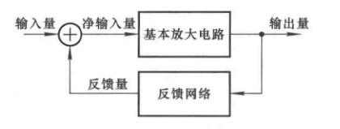

使得净输入量增大的反馈称为正反馈，减小的称为负反馈。由于净输入影响输出，所以也有使得输出变化增大的称为正反馈，减小的称为负反馈。

如果反馈量只含有直流量，则成为直流反馈。如果反馈量只含有交流量，则成为交流反馈。或者说，仅在直流通路中存在的反馈是直流反馈，仅在交流通路中存在的反馈是交流反馈。很多电路中二者都有。

## 反馈的判断

### 有无反馈

如果放大电路中存在将输出回路与输入回路相连的通路，并且影响了净输入，则引入了反馈，否则没有引入。

### 反馈极性的判断

我们用到了瞬时极性法。

规定电路输入信号在某一时刻对地的极性，并以此为依据，逐级判断电路中各相关点电流的流向和电位的极性，从而得到输出信号的极性。根据输出信号的极性判断反馈信号的极性；若反馈信号使基本放大电路的净输入增大，则为正反馈，反之为负反馈。

书上描述的并没有很详细。其实是将信号源断开，然后在输入端加上一个“上升”信号，记为"+"，然后推其他相关点的极性。

对于集成放大器，从同相输入端输入，则输出端与输入相同。从反相输入端输入，则输出端与输入相反。

对于三极管，无论是PNP还是NPN，基极和发射极相同，基极和集电极相反。

经过电阻不变。由于交流、直流分开讨论，所以不需要讨论电容。

对于集成放大器，如果反馈电路接到与输入不同的那一端，一般我们会考察那一端输入电压的变化。如果是反馈到相同的一端，一般我们会考察这一端输入电流的变化。对于三极管，我们可以考察净输入电压（$U_{be},U_{eb}$）或者净输入电流$I_B,I_E$。

有一个好用的规律：从集成运放的输出端通过电阻、电容等反馈通路引回到其反相输入端的电路必然构成负反馈电路。从集成运放的输出端通过电阻、电容等反馈通路引回到其同相输入端的电路必然构成正反馈电路

不方便做笔记，这个靠做题和解析来弄明白。

特别指出，反馈量仅仅取决于输出量，与输入量无关。

### 直流反馈与交流反馈的判断

画出直流通路和交流通路，存在于哪个电路中，就是哪种反馈。

### 电压负反馈与电流负反馈的判断

令负反馈放大电路的输出电压$u_O=0$，然后判断反馈量。如果反馈量也立即归零，则为电压负反馈。否则为电流负反馈。

注意这里是反馈量$u_F,i_F$，不是某个器件上的电压电流，有可能那个器件上的电压电流并没有归零，但是，由于输出电压作用引起的电流电压值归零了，则是电压负反馈。它们还可能有其他东西作用，所以并不一定全部归零。

这个东西不能用于实验，强制接地将会导致集成运放烧坏。只能用于理论判断。

### 串联反馈与并联反馈的判断

若反馈信号为电压量，与输入电压求差而获得净输入电压，则为串联反馈。若反馈信号为电流量，与输入电流求差获得净输入电流，则为并联反馈。

## 负反馈放大电路的四种基本组态

分为电压串联负反馈、电流串联负反馈、电压并联负反馈、电流并联负反馈。

## 负反馈放大电路的方块图及一般表达式

任何负反馈都可以用这个图来表示。图中$\dot X_i$为输入量，$\dot X_f$为反馈量，$\dot X_i'$为净输入量，$\dot X_o$为输出量。另外箭头表示信号是单向流通的。

显然，由图

$$
\dot X_i' = \dot X_i-\dot X_f
$$

在信号的中频段，$\dot X_i,\dot X_i',\dot X_f$都为实数，所以可以写为

$$
|\dot X_i'| = |\dot X_i| - |\dot X_f|\quad \text{or}\quad X_i' = X_i-X_f
$$

**基本放大器传输增益（放大倍数）、开环增益、开环放大倍数**

$$
\dot A = \dfrac{\dot X_o}{\dot X_i'}
$$

**反馈网络的传输系数、反馈系数**

$$
\dot F = \dfrac{\dot X_f}{\dot X_o}
$$

**反馈放大器的传输增益、闭环增益、闭环放大倍数**

$$
\dot A_f=\dfrac{\dot X_o}{\dot X_i}
$$

**环路增益、环路放大倍数**

$$
\dot T = \dot A\dot F = \dfrac{\dot X_f}{\dot X_i'}
$$

由此可以推出闭环增益的另一个表达式

$$
\dot A_f=\dfrac{\dot A}{1+\dot A\dot F}
$$

以上这些在中频段都可以把头上的点去掉。

注意到若$\dot A\dot F<0$，则$|\dot A_f|>|\dot A|$，则说明引入了正反馈。若$\dot A\dot F=-1$，则说明电路在没有输入的时候就有输出，称电路产生了自激震荡。正反馈时$X_i'=X_i+X_f,A_f=\dfrac{A}{1-AF}$（此时$AF>0$）

### 四种组态的方块图

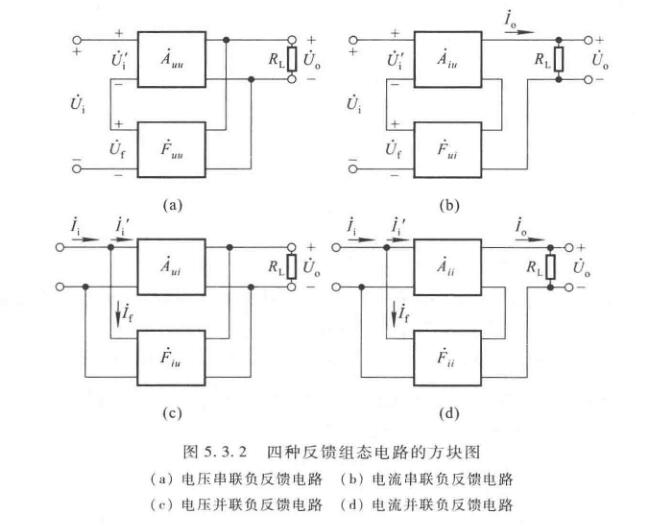

显然不同电路的输入输出反馈量不同，得到的各种放大倍数量纲都不同，功能也就不同。除了环路放大倍数的量纲，它们都为一。

## 深度负反馈

方便我打字起见，后面不打字母上面的点了。

定义反馈深度为

$$
D = 1+AF = \dfrac{X_i}{X_i'}
$$

若$D>>1$即$AF>>1$时，有

$$
A_f \approx \dfrac{1}{F}
$$

此时引入了深度负反馈。又因为

$$
A_f = \dfrac{X_o}{X_i},\quad F=\dfrac{X_f}{X_o},\quad A_f\approx\dfrac{1}{F}=\dfrac{X_o}{X_f}
$$

所以有$X_i\approx X_f$。可见深度负反馈的实质是在近似分析中忽略净输入量。

求解深度负反馈放大电路放大倍数的一般步骤是

1. 正确判断反馈组态
2. 求解反馈系数
3. 利用$F$求解$A_f$

## 负反馈对放大电路性能的影响

### 稳定放大系数

$$
\dfrac{dA_f}{A_f} = \dfrac{1}{1+AF}\dfrac{dA}{A}
$$

也就是说，负反馈放大电路放大倍数的相对变化量$dA_f/A_f$仅为其开环增益相对变化量的$(1+AF)$分之一。也就是说$A_f$的稳定性是$A$的$(1+AF)$倍。

但是，这是以损失了放大倍数为代价的，$A_f$是$A$的$(1+AF)$分之一。

### 对输入电阻的影响

**串联负反馈时**

$$
R_{if} = (1+AF)R_i
$$

注意，有些输入电阻是有多个的，有些并联有些串联，这里引入串联负反馈，只影响在反馈环上的输入电阻，其他并联的输入电阻不变，将这些电阻最后全部并联起来再计算。之后也有类似的情况，不再讨论。

**并联负反馈时**

$$
R_{if} = \dfrac{R_{i}}{1+AF}
$$

### 对输出电阻的影响

**电压负反馈时**

$$
R_{of} = \dfrac{R_o}{1+AF}
$$

**电流负反馈时**

$$
R_{of} = (1+AF)R_o
$$

### 展宽频带

原来的频带，假设中频段放大倍数为$A_m$，则低频使得放大倍数为$0.707A_m$或$A_m-3dB$的频率叫做下限频率$f_L$。高频使得放大倍数为$0.707A_m$或$A_m-3dB$的频率叫做上限频率$f_H$。

$$
f_{Lf} = \dfrac{f_L}{1+A_mF}
$$

一般情况下，由于$f_H>>f_L,f_{Hf}>>f_{Lf}$，因此，近似有

$$
f_{bw} = f_H-f_L \approx f_H
$$

$$
f_{bwf} = f_{Hf}-f_{Lf}\approx f_{Hf}
$$

即引入负反馈使频带展宽到基本放大电路的$(1+AF)$倍。

### 减小非线性失真

$$
THD_f=\dfrac{THD}{1+AF}
$$

### 提高信噪比

提高$(1+AF)$倍。
