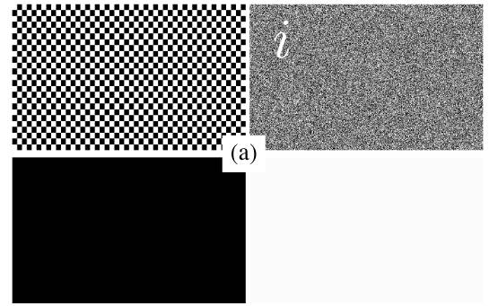
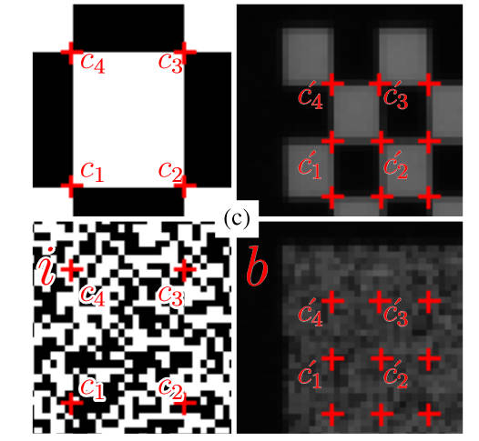
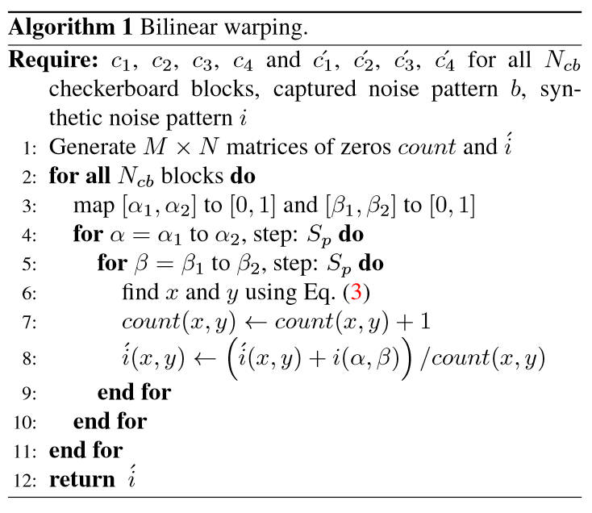
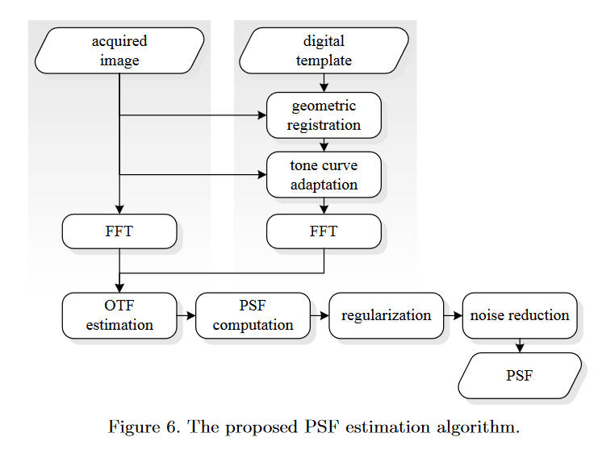
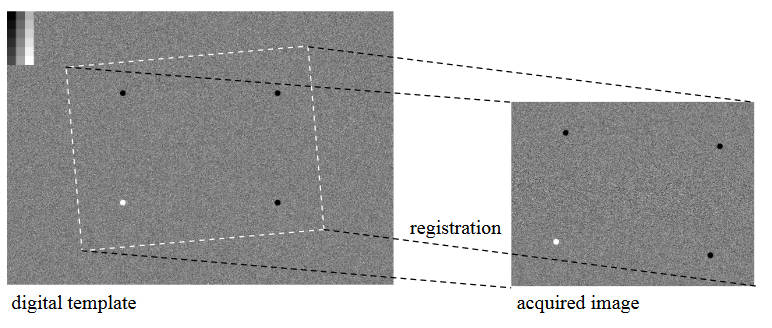
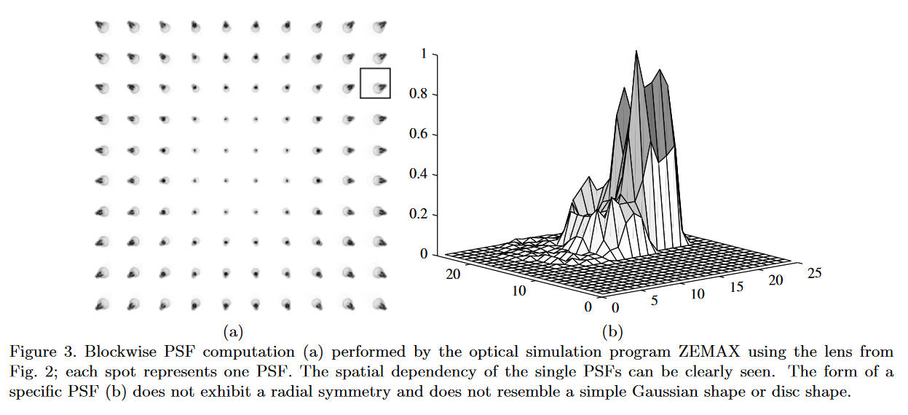
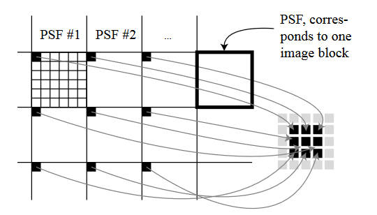
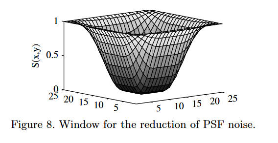

# 前言

TODO

介绍PSF的作用。

# Camera Intrinsic Blur Kernel Estimation: A Reliable Framework

[https://openaccess.thecvf.com/content_cvpr_2015/html/Mosleh_Camera_Intrinsic_Blur_2015_CVPR_paper.html](https://openaccess.thecvf.com/content_cvpr_2015/html/Mosleh_Camera_Intrinsic_Blur_2015_CVPR_paper.html)

本文给出的成像模型如下

$$
b = S(v(d(h(i)))\ast k)+n
$$

其中$i$是物平面，$h$是一个平面映射(planar homography)，将物平面透视投影到像平面上。而紧随其后的$d$则代表着几何畸变(geometric distortion)，这是由于真实相机并不是完美的小孔成像系统。之后的$v$则代表着光学晕影(optical vignetting)，然后这一串的结果和PSF核$k$进行卷积，再通过采样函数$S$和一个加性噪声$n$（零均值高斯噪声），就得到了最终的图像$b$。

以往的工作为了估计$k$，通常都会依次估计$h,d,v$，然后再来估计$k$。这个估计鲁棒性不是很好，作者这里使用的方法绕过了对这三者的估计，记$u=v(d(h(i)))$，作者要直接获取到这个$u$，成像模型变为

$$
b = S(u\ast k) + n
$$

首先作者弄了四张图

第一张为棋盘格图，第二张图为期望为$0.5$的伯努利分布噪声，第三第四张图则为全黑和全白图。这些图像都是直接在电脑上合成的，然后将其在高分辨率显示屏上显示，再用待测相机去拍摄。之后需要将拍摄到的图和原始合成的图进行对齐。

首先从棋盘格图入手

作者使用Harris corner detector来进行角点检测。由于拍摄的时候是正对着拍的，所以各个角点之间的空间关系不变，合成图和拍摄图的映射关系非常直观。

对于一个格子内的四个角点，我们就可以通过双线性插值的方法，将拍摄图上的任意坐标映射到合成图上。首先，记合成图上的四个角点分别为$c_1=(\alpha_1, \beta_1),c_2=(\alpha_2, \beta_1),c_3=(\alpha_2, \beta_2),c_4=(\alpha_1, \beta_2)$，然后记拍摄图上的对应四个角点的坐标为$c_1'=(x_1, y_1),c_2'=(x_2, y_2),c_3'=(x_3, y_3),c_4'=(x_4, y_4)$

于是，任意在方格$C'$内的点的坐标$(x,y)$都可以用方格$C$内的坐标$(\alpha,\beta)$表示，

$$
\begin{bmatrix}
 x & y
\end{bmatrix}=
\begin{bmatrix}
 \alpha\beta & \alpha & \beta & 1
\end{bmatrix}
\begin{bmatrix}
1 & -1 & -1 & 1 \\
-1 & 1 & 0 & 0 \\
-1 & 0 & 1 & 0 \\
1 & 0 & 0 & 0
\end{bmatrix}
\begin{bmatrix}
c_1' \\
c_2' \\
c_3' \\
c_4'
\end{bmatrix}
$$

当然，这其中的坐标以方格的左下角为圆点，并且进行归一化。

下一步，我们就可以通过warping的方式来获取前文提到的$u$（注，前文提到的$b$就是相机直接拍摄得到的伯努利噪声图像），算法如下

这里的图片$i$即为合成得到的伯努利噪声原图。这里描述的是对每一个棋盘格的方格内的坐标，在$i$上进行采样，然后将其值放到相机拍摄图像的对应坐标位置上。这一步主要是模拟了相机几何畸变和平面映射的过程。接下来再模拟晕影的过程

$$
u(x,y)=l(x,y)+i'(x,y)(w(x,y)-l(x,y))
$$

这里的$l$指的是相机对着全黑图片拍摄的结果，而$w$则是对着全白图片拍摄的结果。这样我们就得到了需要的$u$。

设$b,u$的大小为$M\times N$，PSF核的大小为$R\times R$，如果将成像模型转换成向量形式，并且省略掉采样函数的话（因为只是简单的线性映射），有

$$
\mathbf{b}=\mathbf{uk}+\mathbf{n}
$$

其中$\mathbf{b}\in\mathbb{R}^{MN},\mathbf{n}\in\mathbb{R}^{MN},\mathbf{k}\in\mathbb{R}^{RR},\mathbf{u}\in\mathbb{R}^{MN\times RR}$

伯努利噪声有均匀的谱密度函数（SDF），如果在理想的无噪声环境下，那么有

$$
|\mathcal{F}(b)|^2=
|\mathcal{F}(i)|^2
|\mathcal{F}(k)|^2
$$

其中$\mathcal F$是傅里叶变换。于是理想的PSF就是

$$
|\mathcal{F}(k')|^2=\dfrac{|\mathcal{F}(b)||\overline{\mathcal{F}(b)}|}{|\mathcal{F}(u)||\overline{\mathcal{F}(u)}|}
$$

使用梯度下降法来估计这里的$k$，就有

$$
\min_k E(k)=||\mathbf{\hat u}\mathbf{k}-\mathbf{\hat b}||^2+\lambda||\mathbf{k}||^2+\mu||\nabla \mathbf{k}||^2+\gamma|||\mathcal{F}(\mathbf{k})|-|\mathcal{F}(\mathbf{k'})|||^2
$$

其中第一项是为了更符合远图数据，第二项是为了让核稀疏，第三项是平滑项，第四项是为了更接近理想PSF。为了允许采集多张图像，这里的$\mathbf{\hat u}$是多个$\mathbf{u}$上下堆叠在一起的，同理$\mathbf{\hat b}$也是，这之后还有展开形式和其梯度，详情见原文，这里不再赘述。

总而言之，对着这个目标函数使用梯度下降法最后求得了我们需要的PSF核$k$。

# Direct PSF estimation using a random noise target

[https://www.spiedigitallibrary.org/conference-proceedings-of-spie/7537/75370B/Direct-PSF-estimation-using-a-random-noise-target/10.1117/12.837591.short](https://www.spiedigitallibrary.org/conference-proceedings-of-spie/7537/75370B/Direct-PSF-estimation-using-a-random-noise-target/10.1117/12.837591.short)

整个流程如下，首先是进行几何配准(geometric registration)，如下图

左边是数字图像原图，右边是相机拍摄到的图片。使用图中的四个标志点进行对准，计算得到一个投影矩阵，能够将数字图投影到拍摄图上。和其他思路差不多，都是通过模拟投影来应对相机的几何畸变等问题。现在两张图剩下的差异就为亮度、噪声、锐度等。

于是在几何配准后的下一步是色调映射，这里使用的是非线性的一条曲线。为了估计这条曲线的参数就需要使用数字图像左上角的灰度梯度图，需要用摄像机重新拍摄一张。在每一个灰色梯度块内提取出一个平均值，来和数字图像上的值建立映射关系，进而估计出曲线参数。然后对数字图像全局使用这个曲线，来让其亮度和拍摄的图像保持一致。

然后将图片分为$96\times 80$的小块，然后对每一个小块使用FFT，然后再通过计算就可以得到OTF（光传递函数），进一步的得到PSF。我们下面来解析一下这个过程。

在本文的模型中，相机的PSF是具有平移可变性的，每个空间位置的PSF是不一样的。如图

可以看到位于中间位置的PSF比较理想，而靠近边缘的则已经无法保持圆形了。于是，成像模型为

$$
i(x,y)=\sum_{x_0,y_0}h(x,y;x_0,y_0)\cdot o(x_0,y_0)+n(x,y)
$$

其中$o(\cdot,\cdot)$是输入信号，而$i(\cdot,\cdot)$是经过PSF后变模糊的图像。这里的$h$就是PSF，而$n$是加性噪声。

实践上我们不需要考虑每一个位置的PSF来计算某个点的输出，因为PSF能取值的范围很小，大部分都取$0$，又因为相近位置的PSF非常相似，所以可以考虑将图片分为$96\times 80$的小块，每一块内共享一个PSF。于是，成像模型变为

$$
i(x,y)=(p\ast o)(x,y)+n(x,y)
$$

在频域内就变为

$$
I(u,v)=P(u,v)O(u,v)+N(u,v)
$$

这里的$P$就是OTF。于是它的估计就很简单

$$
\hat P(u,v)=\dfrac{I(u,v)}{\hat O(u,v)}
$$

对OTF使用逆FFT就得到了PSF。

现在再来说一说数字图像的选择，这里选择的除了灰阶和标志物之外，背景是白噪声。由于白噪声在FFT之后还是白噪声，所以它是均匀的（homogeneous，我不是很理解什么意思），频域上也就不会出现在$0$附近的分量。如果分母上有$0$附近的分量就会影响OTF的估计（我不知道为什么）。

在图像块上估计PSF确实避免了很多计算开销，但是也降低了估计的稳定性，于是本文又提出一个算法来规则化相邻的PSF。

如图，左边的大框表示了之前对图像进行切割的$96\times 80$的图像块，里面的小框表示了块内的像素。显然，根据前文所描述的，每个大框拥有一个PSF，这个PSF也是用$96\times 80$的图像进行表示的。为了进行PSF的平滑，将9个PSF的同一位置的像素提取出来（图中这一次选择了左上角），然后将其排列成$3\times 3$的一个矩阵，对其进行中值滤波，然后再将矩阵的值放回到原来的9个PSF中。如果在算法中发现PSF估计错误（例如异常值），则将其替换为邻居的PSF值。这里使用的滤波核为

$$
H = \begin{bmatrix}
 1 & 2 & 1\\
 2 & 4 & 2\\
 1 & 2 & 1
\end{bmatrix}
$$

最后就是一个阈值处理，将PSF中小于某一个值的量直接设置为0，从而进行降噪。显然，主要需要降噪的部分为PSF图像的边界部分，阈值窗的形状如下

形式化的定义如下

$$
S(x,y)=1-T(x)T(y)
$$

$$
T(n)=\begin{cases}
 1 & \text{ if } 0\leq|n|\leq\alpha\frac{N}{2} \\
 0.5\left[1+\cos\left(\pi\dfrac{n-\alpha\frac{N}{2}}{2(1-\alpha)\frac{N}{2}}\right)\right] & \text{ if } \alpha\frac{N}{2}\leq|n|\leq\frac{N}{2}
\end{cases}
$$

其中$N$为窗口大小，$\alpha$为可调参数。阈值过滤如下

$$
p(x,y)=\begin{cases}
 0 & \text{ if } \tilde{p}(x,y)<\tilde{p}_{max}S(x,y) \\
 \tilde{p}(x,y) & \text{ otherwise }
\end{cases}
$$

其中$\tilde{p}(x,y)$是过滤前的PSF，而$\tilde{p}_{max}$则是PSF中的最大值。

# A system for estimating optics blur PSFs from test chart images

TODO

# Large depth-of-field ultra-compact microscope by progressive optimization and deep learning

[https://www.nature.com/articles/s41467-023-39860-0](https://www.nature.com/articles/s41467-023-39860-0)

本文主要是针对手机相机进行优化，让它能够较好的实现显微任务。作者指出过往的端到端方法计算开销太大，所以本文提出了一种渐进式的优化方法。

首先第一个需要优化的是镜头设计。首先考虑传统的镜头设计方法，例如光线追踪等等，来手动设计一系列镜头，后续的优化算法在每个镜头上都进行一次，选出最好的那一个。使用这种方法减小了参数量，从而减小开销。

关于镜头是如何设计的笔者不懂，也不是PSF估计的重点，就跳过。但是我们需要记得一些概念。在设计镜头的时候要考虑一个两难问题：景深和横向分辨率的关系，横向分辨率越大，景深越小。而对于一个显微镜来说景深是比较重要的。传统的增加景深的做法是减小数字孔径（NA），也就通常意味着减小物理孔径（光圈）或者增大焦距。但是减小光圈会导致进光量减小，从而减小信噪比；而增长焦距则会增大体积，对手机这种设备来说是不行的。

为了解决这个问题，本文开发了一种叫diffractive optical element (DOE)的物理元件，放在光圈之前。这个DOE在这里是一个三次曲面，表示为$\alpha(x^3,y^3)$。这里的$\alpha$是唯一一个参数，用于控制在不同的defocus（离焦）下PSF的扩散，从而控制景深大小。

针对这个$\alpha$，本文均匀选择了$[0.005,0.075]$上的15个值，每一个都做成一套系统（顺带一提材料便宜、工艺简单、成本很低），然后在神经网络上训练，选出最好的。最后选出来的是$\alpha=0.03$，使得景深增加了10倍。这里的神经网络是要重点介绍的。

网络架构基于pix2pix，可以很好的适应细节丰富的图像复原任务。

由于相机系统拥有大FOV和大NA，导致PSF就更不像一个冲激函数了。为了解决这个问题，提出了一个考虑到PSF平移可变性的前向模型，并且优化了计算开销。假设具有平移可变性PSF的光学模型如下

$$
i(x,y)=\sum_{u,v,z}s(u,v)p(u,v,x-u,y-v,z)
$$

其中$(u,v)$和$(x,y)$分别是物平面和像平面的坐标，而$z$代表不同的深度，每个像$s(u,v)$都对应一个PSF矩阵，表示为$p(u,v,x,y,z)$。由上式也看得出来计算他要迭代所有PSF，复杂度很高，需要对其进行降维。作者这里的想法是进行矩阵分解，将PSF分成一系列基$h_i(x,y)$的加权和

$$
p(u,v,x,y,z) = \sum^N_{i} w_i(u,v,z)h_i(x,y,z)
$$

其中$N$是具有平移不变性的基$h_i$的个数。在实践上，对每个深度$z$，都只标定一共$M$个PSF，最后得到一个PSF集合$\{p(u,v,x_i,y_i,z)\},1\leq i\leq M$。这些PSF经过下采样、剪裁、向量化，最后合并成一个矩阵$\mathbf{P}$，同样的也有基矩阵$\mathbf{H}$和权重矩阵$\mathbf{W}$，于是我们就可以通过数值方法估计$\mathbf{H,W}$

$$
\mathbf{\hat H},\mathbf{\hat W}=\underset{\mathbf{H},\mathbf{W}}{\arg\min}||\mathbf{H}\times\mathbf{W}-\mathbf{P}||^2_2
$$

估计完成后，就可以将成像系统表示为

$$
i(x,y,z)=\sum^N_{i=1}\sum_{u,v}s(u,v)w_i(u,v)h_i(x-u,y-v,z)
$$

使用卷积表示则更简单

$$
i(x,y)=\sum^N_{i=1}\{(s(u,v)\times w_i(u,v))\ast h_i(u,v)\}[x,y]
$$

作者使用一个电动控制台和一个显微镜来获取训练数据。首先用显微镜在正好对上焦的位置拍摄一张图片（文中称作一个sample），然后在$[-150\mu m,150\mu m]$的范围上以$10\mu m$为步长移动显微镜来拍摄，从而得到一系列配对的训练数据。

TODO：有待补完，Deconvolution部分本文说的很模糊，并且疑似有公式错误。另外本文的PSF是如何进行测量的没有详细说明。
