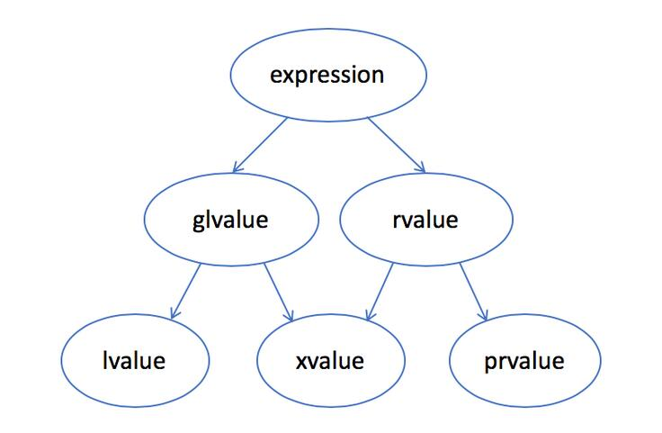
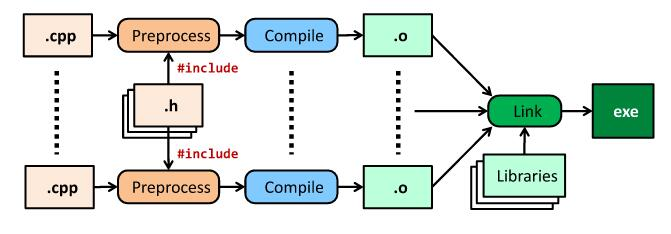

本笔记会记录一些`C++`中，自己以前不常用、不是很熟悉需要记录来复习的、新标准（相较于`C++11`）引入的、可能有用的功能。不适合详细阅读过某一本`C++`大部头教材的人，比较适合对于`C++`的知识只停留在算法竞赛的人。

本文的内容大多是我看了`cppreference`、`hackingcpp.com`、`freegeektime.com`、知乎和各类博客网站的文章、部分经典教材后，加上自己的理解，写作而成的。

# std::endl

`std::endl`会立即刷新字符缓冲区，然后输出。但是`'\n'`不会。如果频繁地使用`std::endl`换行可能会导致性能问题，除非你非常确定这条消息在换行后必须要立即输出。

# std::clog

其写入字符到`stderr`中，但不是立即输出。而`std::cerr`会立即输出和刷新`stderr`。

# <=>（三路比较 ）运算符

这个运算符是`C++20`引入的，

- 如果a<b，那么(a<=>b) < 0
- 如果a>b，那么(a<=>b) > 0
- 如果a和b相等或等价，那么(a<=>b) == 0

其实`<=>`返回的是`std::strong_ordering`类型，某些时候给自己的类重载多种比较运算符会简单不少。其中a<b时返回`std::strong_ordering::less`，a == b时返回`std::strong_ordering::equal`，a>b时返回`std::strong_ordering::greater`。

# std::numeric_limits\<T\>

这个命名空间包含在\<limits\>头文件里，其可以给出一个基本数据类型的数据范围，例如

```cpp
std::numeric_limits<T>::lowest();//给出T的最小取值（有符号时为绝对值最大的负数）
std::numeric_limits<T>::min();//对于整数，给出最小取值，对于浮点数，给出最小的正数
std::numeric_limits<T>::max();//给出T的最大取值
std::numeric_limits<T>::epsilon();//浮点数给出最小精度，比如第一个大于1的数和1的差
```

# 大括号初始化变量

我们可以用如下方法初始化变量

```cpp
float a = 1.5f;
float b {1.5f};
```

第一种是传统方法，第二种方法有一点好处是，在隐式的基本类型转换中，如果类型收窄（Type Narrowing）会给出Warning，甚至会直接给出error。

```cpp
int i = 2.5f;//编译器无warning
float f = 2.5f;
int j {f};//编译器产生warning，有时候类型收窄确实可能导致错误。
int k {2.5f};//编译器会直接给出error
```

如果你确定类型收窄是你需要的，那么用显式的强制类型转换。

# \[\[nodiscard\]\]修饰

`C++17`引入。这个修饰是给函数使用的，如果函数有返回值，并且希望返回值不会被忽略，就可以使用这个修饰。

比如

```cpp
void normalize(vec3f & v);//把v变成单位向量
vec3f normalized(vec3f const & v);//返回v的单位向量，但v不变
```

这组可能分辨不清的函数，我们就可以把第二个函数加上这个修饰，编译器会在返回值没有被接收的时候发出warning。

# vector扩容（初步）

这里是一个简易版本的介绍，后续可能会专门出博客来详细解析`STL`的各种容器与算法（TODO）。

我们要首先明白`vector`的内存布局是怎样的。一般来说，除非你在全局变量里面声明`vector`，不然`vector`对象都是在栈中的。但是`vector`的内容（即`buffer`）却是分布在堆里。

首先我们区分一下`size`和`capacity`，前者是`vector`里面拥有的元素的个数，后者是`vector`可以放多少元素。

当`size=capacity`时，此时如果我们进行`push_back`，容量不够，不能放进去。之后`vector`就要进行扩容。此时，实际上的内存不是在`buffer`后面再给你新分配一些，与前面的连起来。而是重新找一块更大的内存，将原来的`buffer`整体复制到堆中的新位置，再把新的插入元素放到最后。栈中的`vector`对象则简单的把指向的`buffer`地址改成新的即可（当然还有修改`size`和`capacity`）。

每次扩容，`capacity`会变为原来大小的$1.1$至$2$倍。

由于扩容的时候要复制，这是很大的开销。所以如果你提前知道数据个数的具体、或者大概的范围，那么最好使用`vector<int> vec(n);`或者`vec.reserve(n);`（区别是前者会有`n`个初值为`0`的元素，后者没有元素，只有`capacity==n`；当然`resize(n)`时，如果新大小大于原来的大小，会把多出来的空间用`0`填补）来提前给够空间。如果你不确定那么没有什么办法，大概只能这样。

另外，扩容之后，之前的迭代器、指针都可能会失效。包括指向vector对象的指针和指向元素的指针。

# auto与“C-Like”字符串字面量

`auto a = "test";`这个语句，`a`不会是`std::string`类型，而是`char const[]`类型。这也就意味着你也无法使用`auto b = "123"+"456";`。

# std::string的字符串字面量

这个特性是在`C++14`引入的。`auto s = "test"s;`，在原来的基础上，字符串后面加上`s`，即可推断为`std::string`类型。

不过使用之前要先`using namespace std::string_literals;`

# 原始字符串字面量

其用法为`R"(此处填入原始字符串)"`，这里面的原始字符串，不需要转义符，原本是什么，直接输出出来就是什么，而且转行也会被输出出来。这在我们的字符串是Windows目录时可能会比较方便，例如`auto s = R"(C:\Windows\SysWOW64\IME\SHARED)"`，不需要再像以前一样，给每个`\`换成`\\`了。

另外，`auto s = R"(C:\Windows\SysWOW64\IME\SHARED)"`还是被推断为`char const[]`，在`C++14`之后，声明`using namespace std::string_literals;`，之后`auto s = R"(C:\Windows\SysWOW64\IME\SHARED)"s;`可以推断为`std::string`

# std::string_view

`C++17`引入的功能，具体的用法和应该使用的地方都和`std::string const &`差不多，都是对于一个`string`的只读，并且不开额外空间。区别是，`const &`版本是建立了对原`string`的引用。`string`和`vector`很像，都是对象和`buffer`分开，而`std::string_view`就是一个对原`string`的`buffer`的只读的工具。推荐在新版本`C++`中使用这个功能。

比`const &`有一个好处，如果用在函数参数里，而传入的是字符串字面量，则`const &`会有一次复制操作，而`string_view`没有。

但是，如果你不在函数参数里使用，而是

```cpp
std::string_view sv2 {"std::string Literal"s};
cout << sv2;
```

则是错误的，因为字符串对象已经被销毁。所以推荐只在函数参数里使用。

# 函数参数什么时候用const &?

可能会有人在第一次学习到用`const &`来修饰形参，觉得这东西简直太好了，可以不用花费额外开销去复制。但其实不总是这样。

如果你传入的数据是`double`，`int`等开销本来就很小的变量，根本就不需要用`const &`，那反而还会增加开销。

- 在变量复制开销本来就很小时，不需要修饰符
- 如果你想要防止自己不小心修改了变量，只加`const`即可
- 如果你想要修改实参，则显然必须加且只加`&`传入引用（例如swap函数）
- 如果你传入的复制开销很大（例如一个图片类），又不需要修改，加`const &`

# 左值、纯右值、亡值



曾经是只有左值和右值的。左值意味着可以取地址，而右值意味着不可以取地址。叫左值右值则是因为左值一般在赋值号左边，而右值在右边。

现代C++中，值类别必定属于三者其一：左值、亡值、纯右值。

**左值（lvalue）**

左值是有标识符、可以取地址的表达式。例如变量名、函数名确定的值。返回类型为左值引用的函数返回的值（除了自定义的，还有赋值运算符、`++a`、`--a`）。字符串字面量（`const char*`类型的左值）

**纯右值（prvalue）**

右值正好相反，就是没有标识符、不可获取地址的表达式。例如字面常量（除了字符串字面量），操作符的临时结果（例如`a=b+c;`中的`b+c`）（其实可以归类为下一条的），函数的返回值（除了返回左值引用和右值引用的）（例如`x++`）。

但是，右值引用变量，是一个左值。因为它再怎么说也是一个变量。

**亡值（xvalue）**

可以看作是有名字的右值，跟无名的纯右值区分开。所以实际上`std::move(x)`这样的函数，返回的是亡值。返回类型是对象的右值引用的函数调用，返回的都是亡值。

**泛左值（glvalue）**

即左值和亡值。其特点是有标识符。但左值不可移动而亡值可移动。

**右值（rvalue）**

即纯右值和亡值。其特点是可移动。但亡值有标识符而纯右值没有。

**&引用**

`&`只能引用左值。也就是说`void fun(int & a);`这个函数，你传入`fun(1);`会编译失败，但是`int b=1;fun(b);`是可以编译成功的。引用本身是个左值。

**const &引用**

`const &`既可以引用左值，又可以引用右值。其本身是一个左值。

**&&引用**

即右值引用，只能绑定右值。本身是个左值。

如果函数重载里只有`const &`，那么传入右值会调用这个函数重载。如果重载有`&&`形式的，那么会优先调用`&&`形式的重载。这种特性允许了移动构造函数的存在。

**转发引用（万能引用）**

这个只会出现在模板中

```cpp
template<class T>
int f(T&& x){                  // x 是转发引用
    return g(std::forward<T>(x)); // 从而能被转发
}
```

见后写的完美转发部分。

# 右值引用（或常左值引用）延长生命周期

```cpp
std::string s1 = "test";
std::string const & s2 = s1+s1; // 这个右值的生命周期被延长到和s2一样，但是不可修改
std::string && s3 = s1+s1; // 同上，但是可修改
```

但是，延长生命周期只能对纯右值使用，而不能对亡值使用。例如`A && x = std::move(y)`，此时对`x`进行解引用，是未定义行为。因为`y`已经析构。

# 移动语义

把一头大象从一台冰箱里移动到另一台冰箱里需要几步？C++曾经的做法是，首先完整地在冰箱B里复制一个一模一样的大象，然后蒸发掉冰箱A中的大象。

正常人的想法是，把大象从A中拉出来，把大象推进B冰箱中，关上冰箱门。

C++11的移动语义实现了这个正常人的想法。例如

```cpp
std::vector<int> v1{1,2,3,4,5,6};
std::vector<int> v2(std::move(v1));
```

可以把`v1`移动到`v2`中，而非拷贝一个一样的到`v2`中。发挥了关键作用的是`std::move`和其对应的移动构造（和移动赋值）函数。

注意，`std::move`仅仅是将一个值强制转换到右值（亡值），而不进行其他操作。真正的移动行为是在移动构造（和移动赋值）函数中实现的。

# 小心返回引用的函数

例如

```cpp
int& fun(int x){
    int y = x+1;
    return y;
}
```

显然`y`的生命周期只能持续到函数结束，返回的引用就指向了一个无效的内存，这个要特别小心。但是如果你通过`new`分配了一个对象，再返回引用，则是可以的，这个对象的生命周期持续到你手动使用`delete`或者程序结束。不过并不推荐总是这样做，有时最好直接返回值。

# 引用可能会像迭代器一样失效

比如对`vector`进行的操作会涉及`capacity`的修改，比如在`set`中进行插入和删除操作，这些是会使原来的迭代器无效的。这同时会使引用失效。就比如我们介绍过`vector`在扩容时会复制元素到新的内存，原来的引用指向的内存就会被释放，变成无效内存，此时再进行操作是`UB`。

# 不要用引用来延长函数返回值的生命周期

```cpp
std::vector<int> fun(){...}

auto const & v = fun();//现在fun的返回值的周期延长到和v一样，通常不会造成问题
auto const & v2 = fun()[0];//这是最危险的情况，fun的返回值其实生命周期已结束，v2引用的元素已经变成了无效内存，对v2的操作是UB
```

鉴于上述情况，最好不要用引用接受函数返回值，直接用传值的方式更好。

# struct/class的大括号初值

```cpp
struct St{
    int x;
    double y;
};

St st{1, 2.0};//也可以St st = {1, 2.0};
```

像这样，用大括号给结构体、类赋初值，其顺序和结构体内部声明的顺序要一致。

# 类拷贝（copy）

C++与Java、Python等不同，在下面的例子中

```cpp
struct Point{
    double x,y;
};

Point p1{1.0, 2.0};
Point p2 = p1;
```

用到了`p2 = p1`这一语句。在Java和Python中，`p1`、`p2`现在都指向同一个对象`Point(1.0, 2.0)`，而其本身并不是对象。在C++中，`p2`把`p1`的所有内容拷贝赋值给自己，它们两个是两个不同的对象（即使内容相等）。

在C++中，拷贝默认是深拷贝，而Java和Python中是浅拷贝。如果要在C++里面使用浅拷贝，则使用`Point & p3 = p1`即可（也可以用指针）。

除了是否新建一个对象以为，这两者的生命周期也不同。C++的对象在`p1`销毁时就销毁了，而在Java中`p1`销毁之后，由于还有`p2`指向这个对象，所以对象本身不会销毁。如果所有指向全都销毁，那么垃圾回收机制才会销毁这个对象。

另外，通常“相等”的概念也不同。在Java中，对两个对象变量使用`==`运算符，如果它们指向不同的对象，则不相等，否则相等。在C++中，我们一般会重载`==`运算符，判断两者的内容是否相等。

## 拷贝构造函数

## 赋值构造函数

# argc, argv

```cpp
int main(int argc, char* argv[]){
    //...
}
```

main函数可以带两个参数，按照传统我们把第一个参数叫`argc`，第二个参数叫`argv`。argc是一个整数，代表命令行中参数的个数，argv是每个参数的字符串。

命令行中参数通常由空格分开，例如

```bash
./g++.exe 1.cpp -o 1.exe -Wall
```

其中有五个参数，第一个为可运行文件本身的路径，后面的为运行它的参数。意味着argc等于5，argv存有五个字符串。一般我们会用atoi把字符串里的数字转化为int类型。

# file stream

在NOIP、NOI等竞赛中，一般会用freopen函数。这是一个C的函数，如果要更C++一点，我们会使用file stream。

```cpp
#include <fstream>

int main(){
    std::ofstream os{"1.txt"};

    if(os.good()){//在每次使用时都应该确保good
        os<<"hello world\n";
    }
    
    return 0;
}

```

如上为写数据时的使用例子。可以看到和cout的用法很像。

```cpp
#include <fstream>

int main(){
    std::ifstream is{"2.txt"};

    if(is.good()){//在每次使用时都应该确保good
        double x,y;
        is>>x>>y;
        std::cout<<x<<" "<<y<<"\n";
    }
    
    return 0;
}
```

如上为读数据的例子。可以看到和cin的用法很像。

另外，例如写到末尾还是覆盖，是文本还是二进制，这些都是可以设置的。具体参考[https://zh.cppreference.com/w/cpp/header/fstream](https://zh.cppreference.com/w/cpp/header/fstream)，这里简短的给出几个常用的

```cpp
std::ofstream os{"out.txt", std::ios::app}; //append而不是覆盖

std::ifstream is2{"in.tga", std::ios::binary}; //写二进制
std::ofstream os2{"out.tga", std::ios::binary}; //读二进制
```

# 重载<<和>>运算符

```cpp
struct Vec{
    double x,y;
};

std::istream& operator>>(std::istream& is, Vec& v){
    return is>>v.x>>v.y;
}

std::ostream& operator<<(std::ostream& os, Vec& v){
    return os<<v.x<<" "<<v.y;
}

std::cout<<Vec(2.0,3.0)<<"\n";//可以像对int一样使用cin cout
```

主要是方便打印、输入数据，例如你在编写一个数值计算库，需要用到很多向量、矩阵的输出。

# mutable和const的成员函数

```cpp
class Vec{
public:
    double x,y;
    int mutable sth;
    int sth2;

    void foo() const {
        sth++;//不会报错
    }

    void bar() const{
        sth2++;//会报错
    }
};
```

把类成员函数用const修饰（放在参数列表之后），意味着，这个函数声称不会改变类内的所有成员变量的值。如果你想让几个特例可以修改，那么就把那个特例变量声明为mutable的即可。

# 类成员初始化

在C++ 11以前，我们初始化类成员一般只能在构造函数里进行，如

```cpp
class Vec{
public:
    double x,y;
    Vec():y(0),x(0){}
};
```

其中`:`后面跟着的这个叫做初始化列表，成员后跟着的括号里面的写入初始值，即可完成初始化。

注意，初始化列表里面的赋值顺序并不是初始化列表写出来的顺序，而是按照成员变量的声明顺序。例如上例，是先初始化x，再初始化y。这有时会导致UB，建议绝大部分时候，都要保持两者顺序一致。

当然你也有可能这样写

```cpp
Vec(int x_, int y_){ //而不是写:x(x_),y(y_)
    x = x_;
    y = y_;
}
```

这其实能看出一个C++程序员的水平。对于int、double这种内置类型还好。但如果x、y是class，那么`=`意味着拷贝赋值，意味着可能会先构造一个新的对象实例，再拷贝给x和y。而是用初始化列表，则会直接调用构造函数，总体上少了拷贝这一个步骤。

在C++ 11之后，我们也可以这样给初始值

```cpp
class Vec{
public:
    double x=0.0, y=0.0;
    Vec(){}
};
```

#  explicit关键字


```cpp
class Cl{
public:
    int n;
    explicit Cl(int n_):n(n_){}
};

void foo (Cl a) {}

foo(1);  //隐式调用Cl的构造函数，但因为其构造函数是explicit的，会报错
foo(Cl(1));//正常

```

个人认为这主要是方便强调一下传入的数据的类型，可能在调试环节比较有用。

# 构造函数相互调用

```cpp
Class Vec{
public:
    double x, y;
    Vec():Vec(0){}
    Vec(double a):Vec(a,a){}
    Vec(double x_, double y_):x(x_),y(y_){}
};
```

# 在C++里最好用nullptr而不是null

C++和C语言的`NULL`定义是不同的，在C++中`#define NULL 0`，而在C中`#define NULL ((void*)0)`。不得不这样改的原因是：C++不支持`void*`的隐式转换。可见NULL就是一个数字0，它会有如下问题

```cpp
void foo(int n){}
void foo(void *n){}
```

此时如果你调用

```cpp
foo(NULL);
```

则会有二义性问题。编译可能会无法通过。用nullptr则不会有这个问题。

当然，有时候我们会有以下三种写法

```cpp
if(p){}
if(p!=NULL){}
if(p!=nullptr){}
```

这更多的是一种风格问题，争论这个似乎是无用的。但是之前的二义性还是要小心的。

如果你懒得管，那么就永远使用nullptr。

# const与指针

众所周知，在指针类型的声明里，const放的位置不同会导致语义的不同。主要是指针是否可变，以及指针指向的内容是否可变。 如下表

|声明|所指内容可变？|指针本身可变？|
|-|-|-|
|T \*|是|是|
|T const \*|否|是|
|T \* const |是|否|
|T const \* const|否|否|

简单来说就是const在星号右边则指针自己不可变，在左边则所指内容不可变。也可以理解为，const修饰的是它左边的东西。要么修饰指针（即星号），要么修饰值（即T）

所以说，我更推荐`T const`的写法，而不是`const T`。但是我们也要知道，`const T *`是修饰值不可变。

# 智能指针

C++11后只有三种智能指针，`unique_ptr`，`shared_ptr`，`weak_ptr`。还有一种`auto_ptr`已经移除。智能指针可以方便管理资源的所有权，以及提供对于资源的RAII。

`unique_ptr`，如同名字一样，是独占资源的。在实现上，他只能移动构造和赋值，而不能拷贝构造和赋值，保证了其所有权无法复制，同一时间只能有一个`unique_ptr`拥有该资源的所有权。

```cpp
std::unique_ptr<int> p = std::make_unique<int>(1);
std::cout<<*p<<"\n"; // 输出1
```

这里的`p`就独占了一个`int`对象的所有权。

```cpp
auto p2 = p; // 报错，无法拷贝构造
auto p3 = std::move(p); // 可以编译，p3获得所有权而p失去所有权
```

在`make_unique`时（C++14之后），相当于调用了`unique_ptr<T>(new T(std::forward<Args>(args)...))`。然后在`unique_ptr`生命周期结束（和所有权转移）时，会自动调用删除器来释放资源。默认的删除器通过`delete`实现，即对其包装的指针进行`delete`。

`shared_ptr`，也如同名字一样，允许多个`shared_ptr`拥有同一个资源。在实现上，他可以移动构造移动赋值，也可以拷贝构造和拷贝赋值。其RAII的实现方法是，加入一个引用计数器，表明有多少`shared_ptr`在使用这个资源，每次复制时计数器加一，每当一个`shared_ptr`析构时计数器减一。如果计数器归零，那么销毁分配的对象。

`weak_ptr`，它的出现是为了解决`shared_ptr`中的一个问题。假如我们有一个双向链表，它支持多个线程来读数据，所以我们理所当然地使用`shared_ptr`来管理其中的指针（例如`next`和`prev`）。但是在某种情况下就有问题，假设我们在局部作用域分配了一个链表，插入两个元素，然后就等待作用域结束后析构。此时会发生内存泄漏，为什么呢？

我们就分析这两个节点的引用计数。其中第一个节点被`head`和第二个节点的`prev`指针指向，而第二个节点被`tail`和第一个节点的`next`指针指向。当`list`析构时，`list`只包含`head`和`tail`指针，这两个`shared_ptr`析构，将两个节点的计数器各减一，但是两个节点仍然互相有指针指向对面，所以两个节点的计数器都为一。所以两个节点无法自动销毁，造成内存泄漏。

`weak_ptr`的思想在于，创建一个弱引用，不增加引用计数器的值。当我们需要使用被管理的对象时，手动转换成`shared_ptr`（此时计数器加一），再进行使用。而使用结束后再变回弱引用（计数器减一）。

```cpp
std::weak_ptr<int> wp;
{
    auto sp = std::make_shared<int>(42);
    wp = sp;

    std::cout<<wp.use_count()<<"\n";// 输出1
    if(std::shared_ptr<int> spt = wp.lock()) // 需要手动转化shared_ptr
        std::cout<<*spt<<"\n";
}
std::cout<<wp.use_count()<<"\n";// 输出0
if(std::shared_ptr<int> spt = wp.lock()) // spt为nullptr
    std::cout<<*spt<<"\n";

```

对于上面所说的链表，只需要把内部的`next`和`prev`换成`weak_ptr`即可解决问题。

# make_shared和make_unique

[https://zh.cppreference.com/w/cpp/memory/unique_ptr/make_unique](https://zh.cppreference.com/w/cpp/memory/unique_ptr/make_unique)，其中指出，`make_unique`和`unique_ptr<T>(new ...)`是等价的。但我觉得下面关于`make_shared`的几点也适用于`make_unique`

而[https://zh.cppreference.com/w/cpp/memory/shared_ptr/make_shared](https://zh.cppreference.com/w/cpp/memory/shared_ptr/make_shared)中指出，`make_shared`和`shared_ptr<T>(new ...)`是有略微的区别的：

1. 因为`shared_ptr`有引用计数器，所以使用`shared_ptr<T>(new ...)`会先`new`出一个对象，然后再`new`一个控制块。这就是两次`new`，并且这两次的内存是可能不连续的。而`make_shared`只进行一次`new`并且控制块和对象连续分配（标准推荐而非强制）
2. `make_shared`创造出来的资源，在所有`shared_ptr`生命期结束后，如果还有`weak_ptr`引用，则该资源会持续存在，直到所有`weak_ptr`结束。
3. 如果当前语境可以访问非公开构造函数，那么`shared_ptr<T>(new ...)`可以正常使用。但`make_shared`只能调用公开的构造函数。
4. `make_shared`不能自定义删除器
5. `make_shared`使用`::new`，如果类重载了`new`运算符，则不同于`shared_ptr<T>(new ...)`

# placement new

`A *p = new A;`完成了两个操作首先是在堆上分配了一块内存，然后将`A`在这块内存上默认构造。

而placement new做的操作是，给定一块内存的首地址，在这块内存上构造对象。这样，我们就可以在栈上构造对象了。这样做的好处可以参考内存池，如果有一块内存可以复用，就不用反复分配内存了，节约开销。

```cpp
char mem[100];
A *p = new (mem) A;
```

# this指针

有点类似于Python里的self参数，都是只能用在类里的。是一个指向对象自己的指针。

# 析构函数的析构顺序

在析构函数执行完毕后，类成员变量的析构顺序，是按照其声明顺序的反方向进行的。

# 有时候可以尝试集中处理Exception

```cpp
void handle_errors(){
    try{
        throw; //必要的，进行re-throw
    }
    catch(...){}
    catch(...){}
    catch(...){}
}

void foo(...){
    try{
        ...
    }
    catch(...){
        handle_errors();
    }
}

void bar(...){
    try{
        ...
    }
    catch(...){
        handle_errors();
    }
}
```

这可以复用代码，尤其是你的东西可能会抛出一样的exception的时候。

# RAII思想和其对于Exception内存泄漏的保护

RAII是Resource Acquisition Is Initialization的缩写，意为资源获取就是初始化。

其要求，对象在构造函数中获取资源，在析构函数中释放资源。为什么这是好的呢？他可以减少你管理内存的工作量，你不需要手动去到处写delete来释放内存。它会在对象生命周期结束的时候自动释放，也就避免了内存泄漏。

而对于Exception，它也可以很好的保护内存。C++的Exception在throw的时候，保证可以释放创建的局部对象。于是就可以自动释放内存，而不用担心是否在throw前正确处理了内存。

像C语言这样的东西，申请完内存需要free才能释放，如果在函数中提前返回了，无法运行到free这一行，那么内存就泄漏了。如下例

```c
void foo(){
    int *a = malloc(...);
    ...
    if(...){
        ...
        return; // 这里没有释放内存，产生泄漏
    }
    ...
    free(a);
    return;
}
```

所以如果C++调用了某个C库，又没有很好的释放内存，就可能会造成泄漏。如果你想避免这个，可能可以尝试用C++的类包装一下，提供析构函数。

上例在exception结构中类似下例

```cpp
void foo(){
    int *a = new...;
    ...
    if(...){
        ...
        throw ...;// 这里没有释放内存，产生泄漏。但是如果有析构函数则可以避免
    }
    ...
    delete a;
    return;
}
```

另外，RAII也就要求你，不能在析构函数本身中出现提前的throw。

# noexcept修饰

修饰函数时，如果给出noexcept，则意味着你保证：

- 函数的操作不会失败
- 从外部来看，任何Exception是不可见的。或者说所有Exception都在内部处理了。

如果noexcept函数还是抛出了一个Exception，那么程序会终止。

我们可以给noexcept提供一个条件，满足条件是函数才是noexcept的。

```cpp
void foo() noexcept(n<9){...} // 当n<9时noexcept
void bar() noexcept( noexcept(foo) ){...} // 当foo是noexcept时，bar是noexcept
```

# 注意给assert的参数加上括号

因为assert其实是宏，所以

```cpp
assert(min(a,b)==a); //不好
assert((min(a,b)==a)); //好
```

否则，宏替换可能会出问题，而且你无法察觉。

# static_assert

assert是给运行时用的，而static_assert就是给编译时用的。

```
static_assert(bool_exp, "msg"); // C++11可用
static_assert(bool_exp); //C++17可用
```

# 用-DNDBUG忽略所有assert

这是g++的编译选项，只需使用这个参数即可

```
g++ -DNDBUG ...
```

# 编译器warning的编译参数

默认编译并不会打开很多warning，在生产环境中，推荐使用

```
-Wall -Wextra -Wpedantic -Wshadow -Werror -fsanitize=undefined,address
```

来开启更多warning。

# Cmake使用

TODO

# doctest/catch2/gtest使用

TODO

# 不要在调试的时候到处写cout、cerr

首先这会干扰到原本的代码逻辑，你删除的时候可能会删错、忘删。另外，这并不适合写测试样例来检测是否正确，更好的办法是，定义一个函数

```cpp
void log(std::ostream& os, ...) {...}
```

把要输出测试的东西放到ostream里，方便测试样例获取

```cpp
std::ostringstream oss;
log(oss, ...);
ASSERT_STREQ(oss.str(), "123");
```

如果要调试最好使用GDB等工具。

# GDB使用

TODO

# 使用g++/clang检测内存错误使用、未定义行为等

即之前介绍到的，只需要添加`-fsanitize=undefined,address`编译选项即可。在运行的时候，如果出现这种错误，就会提供报错信息。

# 使用valgrind检测内存泄漏、死锁问题等

我们首先编译好程序，然后通过

```
valgrind [options] ./program [program options]
```

来执行检查。可选参数有

- `--tool=memcheck`，用来检查内存泄漏、对无效内存读写等
- `--tool=helgrind`，用来检查死锁
- `--leak-check=full`，用来显示内存泄漏的详细信息
- `-v/--verbose`，用来显示额外信息

# 使用end迭代器的值是未定义行为

```cpp
std::vector<int> vec;
auto it = vec.end();
std::cout<<*it; // UB
```

# std::distance

求得左闭右开区间`[it1, it2)`的大小。

```cpp
std::vector<int> vec{1,2,3};
auto x = std::distance(std::begin(vec), std::end(vec)); // 3
```

如果满足老式随机访问迭代器，那么复杂度是常数。否则复杂度为线性。

# 所有序列容器都是所谓的regular types

也即下面四个特点：

1. 深可拷贝：在拷贝赋值、拷贝构造的时候，都是把容器内的每个值拷贝到新容器中
2. 深可赋值：即给容器内的元素赋值时，都是把源数据进行拷贝（而非移动）
3. 深可比较：即两个容器相等时，当且仅当每个元素相等
4. 深所有权：容器析构时会析构所有元素

# std::span

C++20引入的功能。span对于vector、array，相当于string_view对于string。声明方法如下

```cpp
std::span<int> // 声明一个可修改的
std::span<int const> // 声明一个不可更改的
std::span<int, 5> // 声明一个固定大小的，大小需要是编译期常数
```

和string_view一样，推荐只用在函数参数中。对于字面量，也会存在访问已经销毁的对象的问题。

```cpp
void foo(std::span<int const> s);

std::vector<int> v{1,2,3,4};
foo(v);
foo({v.begin()+1, v.end()});
```

span可以使用size、empty等获取大小信息，可以通过`[]`获取数据。对于比较两个span是否相同，和其他序列容器略有不同

```cpp
sv.data() == sw.data();  // 对比sv和sw是否是同一个内存位置上的对象
std::ranges::equal(sv,sw);  // 对比sv和sw的值是否都相同
```

# Map和Set查询元素是否存在的新方法

在C++20之后，引入了`contains`函数。如下

```cpp
std::set<int> s{1, 2, 3};
if (s.contains(7)) {…} 
```

比起`find`简单，比`count`不用转换类型。

# 用equal_range获取multiset中所有给定值

```cpp
std::multiset<int> s {2,4,4,4,6};
auto e4 = s.equal_range(4);
cout << *(e4.first)
     << *(e4.second);// e4.first是第一个元素的迭代器，e4.second是最后一个元素之后的元素的迭代器
```

# 不要用迭代器遍历unordered_map和unordered_set

这两个容器的begin和end迭代器指向的是bucket，而不是元素。所以用迭代器遍历是不能达到目的的。但是可以使用`for(auto x:ust)`来遍历

# map和set的判断元素相同的依据

这两个容器一样，都不是按照equal的意义去判断两个元素是否相同，而是按照equivalent去判断。

```cpp
a==b // equal
!(a<b) && !(b<a) // equivalent
```

所以说，我们只要重载小于运算符，就可以让map和set运行起来，不需要大于和等于运算符。

# 自定义unordered容器的哈希函数

一般都会新建一个类，重定义其函数调用运算符，返回值是size_t。

```cpp
struct MyHash{
  constexpr std::size_t
  operator () (A const & a) const noexcept {
      //...
  }
};

std::unordered_set<A, MyHash> s;
```

默认使用的是`std::hash<Key>`，设计新哈希时，可以考虑把自定义类型的各个成员变量的`std::hash`组合起来，形成新哈希。

# 标准库算法的执行策略

在C++17之后，许多标准库里的算法都可以选择执行策略，例如

```cpp
sort(std::execution::par, begin(v), end(v), cmp);
```

这是`sort`函数的又一个重载，其函数声明为

```cpp
template< class ExecutionPolicy, class RandomIt, class Compare > 
void sort( ExecutionPolicy&& policy,  
           RandomIt first, RandomIt last, Compare comp );
```

其中执行策略有四种：

```cpp
std::execution::seq // 算法的执行不能并行化、向量化
std::execution::par // 算法的执行可以并行化，但是不能向量化
std::execution::par_unseq // 算法的执行可以并行化、向量化
std::execution::unseq // 算法的执行不可以并行化，但是可以向量化。C++20后可用
```

并行执行时，算法本身不会避免数据竞争，这是程序员需要考虑的事，例如

```cpp
int a[] = {0, 1};
std::vector<int> v;
std::for_each(std::execution::par, std::begin(a), std::end(a), [&](int i)
{
  v.push_back(i*2+1); // 错误：数据竞争
});
```

# 新for循环反向遍历的方法

C++20可用，让`for(:)`也能反向遍历。

```cpp
for (int x : v | std::views::reverse) { cout << x << '\n'; }
```

# 泛型Lambda

泛型lambda不需要`template`，只需要用`auto`即可，例如

```cpp
[] (auto a, auto b){ return a+b;}
[] (auto const & a, auto const & b){ return a+b;}
```

# std::memcpy的重叠问题

`memcpy`的定义如下：

```cpp
void* memcpy( void* dest, const void* src, std::size_t count );
```

其把`src`中的字节复制到`dest`中，但是，如果`src+count>dest`，就会出现重叠的问题。根据cppreference，这是未定义的。此时我们要使用`std::memmove`。它可以规避这个问题，标准规定其要如同复制字符到临时数组，再从该数组到`dest`一般发生复制。

同时，cppreference补充说，尽管说明了“如同”使用临时缓冲区，此函数的实际实现并不会带来二次复制或额外内存的开销。对于小`count`，它可能加载并写入寄存器；对于更大的内存块，常用方法是若目标在源之前开始，则从缓冲区开始正向复制，否则从末尾反向复制，完全无重叠时回落到更高效的`std::memcpy`。 

我自己看过gnu实现的标准库，确实是这样。内存中，若`dest`在`src`之前，就正向复制，否则，逆向复制类似于如下的循环

```cpp
for(int i=count-1;i>=0;i--){
    dest[i] = src[i];
}
```

# std::copy的重叠问题

类似于上一节的纯C库，这个C++库也有这个问题。

```cpp
template< class InputIt, class OutputIt >
OutputIt copy( InputIt first, InputIt last,
               OutputIt d_first );
```

如果`d_first`在`[first, last)`中，行为未定义。此时用`std::copy_backward`替代（如果`d_last`在`[first, last)`中，则未定义，应该用`std::copy`）。

# std::random_shuffle随机重排数组

```cpp
std::vector<int> v {0,1,2,3,4,5,6,7,8};
std::random_shuffle(begin(v)+2, begin(v)+7);  
```

在pytorch中打乱数据集用到了类似的东西。

# std::fill

在某种意义上是比`memset`好的，`memset`是按字节赋值的，而`std::fill`是按元素赋值。比如

```cpp
int arr[100];
std::fill(arr, arr+100, 100000);
```

这个是memset不方便做到的。

# std::generate

```cpp
auto gen = [i=0]() mutable { i += 2; return i; };

std::vector<int> v(7, 0);
generate(begin(v)+1, begin(v)+5, gen);
for (int x : v) { cout << x << ' '; }  // 0 2 4 6 8 0 0
```

即在迭代器的这个范围内，每个元素使用一次`gen`并对其赋值。

# std::transform

```cpp
template< class InputIt, class OutputIt, class UnaryOp >
OutputIt transform( InputIt first1, InputIt last1,
                    OutputIt d_first, UnaryOp unary_op );
```

对每一个`[first1, last1)`中的元素使用一元函数`unary_op`，然后将值依次赋值给`d_first`开始的元素。

```cpp
template< class InputIt1, class InputIt2,
          class OutputIt, class BinaryOp >
OutputIt transform( InputIt1 first1, InputIt1 last1, InputIt2 first2,
                    OutputIt d_first, BinaryOp binary_op );
```

对每一个`[first1, last1)`中的元素，和`first2`开始的对应元素，使用二元函数`binary_op`，然后将值依次赋值给`d_first`开始的元素。

# std::accumulate和std::reduce

二者都是进行`[first, last)`的加和（或自定义运算）的操作，区别在于`std::reduce`是可以并行化的。

```cpp
reduce(v.begin(), v.end()); // 执行累加，返回累加和，初值默认为T()
reduce(v.begin(), v.end(), 1.0, std::multiplies<>{}); // 第三个参数为初值，第四个参数为运算。这里就是累乘
```

# std::tuple

可以说是一个扩展维度的`std::pair`。使用例如下

```cpp
std::tuple<double, int, char> t{1.2, 3, 'a'};
std::cout<<std::get<0>(t);
std::cout<<std::get<1>(t);
std::cout<<std::get<2>(t);
```

比`std::array`好的地方在于其可以有不同的元素类型。但是，用作函数返回值、参数可能不是一个很好的想法。因为可读性较差，不如`struct`。

`std::tie`可以返回左值引用的元组。如下场景会比较好用

```cpp
struct S
{
    int n;
    std::string s;
    float d;
 
    friend bool operator<(const S& lhs, const S& rhs) noexcept
    {
        // 比较 lhs.n 与 rhs.n,
        // 然后为 lhs.s 与 rhs.s,
        // 然后为 lhs.d 与 rhs.d
        // 返回这个次序中第一个不相等的结果
        // 或者当所有元素都相等时返回 false
        return std::tie(lhs.n, lhs.s, lhs.d) < std::tie(rhs.n, rhs.s, rhs.d);
    }
};
```

以及，拆包函数返回值，

```cpp
std::tuple<int, int, double> foo(){
    return {1, 2, 0.3};
}

int main(){
    int a, b;
    double c;
    std::tie(a, b, c) = foo(); // 或者可以写 auto [a, b, c] = foo()，只不过前者可以在c++11后使用，后者只能在c++17后使用
    return 0;
}
```

# std::optional

C++17引入的新工具，在以前，我们生成新的资源时，通常会返回指向该资源的指针。如果返回的是`nullptr`，则说明分配失败。更现代的方法是使用`std::optional`

```cpp
std::optional<std::string> create(bool b)
{
    if (b)
        return "test";
    return {}; // 等价于返回 std::nullopt
}
```

检测返回的东西是否有效，可以像`bool`类型一样使用

```cpp
auto r = create(true);
if(r){
    //...
}
else{
    //...
}
```

也可以使用`r.has_value()`。如果要使用其包装的值，则可以使用如下两种办法

```cpp
r->push_back('b'); // 像指针一样使用
r.value().push_back('c'); // 把值拿出来，再使用
```

# std::variant

是在C++17提供的一种类型安全的联合体。一个 `std::variant` 的实例在任意时刻要么保有它的可选类型之一的值，要么在错误情况下无值。`union`的问题是，如果成员之一需要析构函数来释放资源，那么`union`定义的变量在结束生命周期时，不会自动调用析构函数。或者类似于，三个成员分别为`int,double,char*`的`union`，其被分配了一个`new char[]`给`char *`，那么在生命周期末尾时，不会自动调用`delete []`去释放空间。`std::variant`的出现解决了这个问题

```cpp
std::variant<int, double, std::string> x, y;
x = 1;
y = "test";
x = 2.0;
```

`std::variant`的变量在同时只能拥有一个具体的类型。如上，`x`不是`int`，就是`double`或者`std::string`。不过，可以方便地通过重新赋值的方式改变其具体类型。如果要知道当前的是哪种类型，可以通过

```cpp
x.index()
```

来获取，是`int`就返回`0`，`double`就返回`1`，即为声明时的下标，以此类推。

获取值可以用

```cpp
std::get<double>(x);
std::get<1>(x);
```

来获取当前的值。如果试图获取非当前类型的值，就会抛出异常

```cpp
try
{
    std::get<int>(x); // x 含 double 而非 int：会抛出异常
}
catch (const std::bad_variant_access& ex)
{
    std::cout << ex.what() << '\n';
}
```

如果获取本就不可能存在的值，则会编译报错，例如`std::get<float>, std::get<3>`。当然，不想抛异常的话，可以使用

```cpp
int *i = std::get_if<int>(&x);
if(i==nullptr){}
else{}
```

# std::any

实现了一种类似于`python`的动态类型，可以把任何可复制构造类型的单个值放在里面。

```cpp
std::any a = 1;
std::cout << a.type().name() << ": " << std::any_cast<int>(a) << '\n';
a = 3.14;
std::cout << a.type().name() << ": " << std::any_cast<double>(a) << '\n';
a = true;
std::cout << a.type().name() << ": " << std::any_cast<bool>(a) << '\n';
```

有点类似于C语言中的`void *`，想赋值什么就赋值什么，需要的时候再转成具体类型（对应这里的`std::any_cast<...>(...)`）。当然，这里可能会有转换失败的场景，会抛出异常。

```cpp
try
{
    a = 1;
    std::cout << std::any_cast<float>(a) << '\n';
}
catch (const std::bad_any_cast& e)
{
    std::cout << e.what() << '\n';
}
```

可以通过`has_value`来检测有没有值，`reset`来清除值。

# C++构建模型

基本上都是继承C语言的框架，C++的源码文件也分为头文件`.h, .hpp`和翻译单元（Translation Units，TUs）`.cpp, .cc, .cxx`两部分。编译成可执行文件的流程，可以看下图



预处理器一般是进行文本替换的，就是把翻译单元中`#define`，`#include`的内容换成对应的内容等操作。然后送进编译阶段，将翻译单元转换成汇编，再转成目标文件。最后通过链接器将各个目标文件链接成可执行文件（主要负责将机器码组合，以及确定函数调用的地址等）。

可以通过

```bash
g++ -E A.cpp -o A.i # 生成预处理后的结果
g++ -S A.cpp -o A.s # 生成编译后的汇编代码
g++ -c A.cpp -o A.o # 生成编译后的目标文件
```

# 重复include导致的编译错误

重复`include`会导致重复定义，从而无法通过编译，例如

```cpp
// a.h
void foo(){}
```

```cpp
// b.h
#include "a.h"
void bar(){
    foo();
}
```

```cpp
// c.cpp
#include "a.h"
#include "b.h"

int main(){
    foo();
    bar();
}
```

在预处理过后，`c.cpp`就会变成

```cpp
//这部分来源于a.h
void foo(){}

//这部分来源于b.h
void foo(){}
void bar(){
    foo();
}

int main(){
    foo();
    bar();
    return 0;
}
```

于是`foo()`就重复定义了，编译报错。一般来说处理办法是

```cpp
// a.h
#ifndef A_H
#define A_H

void foo(){}

#endif
```

```cpp
// b.h
#ifndef B_H
#define B_H

#include "a.h"
void bar(){
    foo();
}

#endif
```

这样在其他文件里就可以随意`include`了。

# 重复include导致的链接报错

发生在如下情况

```cpp
// foo.h
void foo(){}
```

```cpp
// a.cpp
#include "foo.h"
void bar1(){
    foo();
}
```

```cpp
// b.cpp
#include "foo.h"
void bar2(){
    foo();
}
```

如果，最终需要把`a.cpp`和`b.cpp`链接在一起形成一个可执行文件，那么，由于两个目标文件中都有一份`foo()`的完整定义，链接器就不知道具体调用的是哪个`foo`，产生报错。

解决办法：

1. 新建一个`foo.cpp`，头文件中只声明，`foo.cpp`中定义，让其他两个目标文件来链接它
2. 使用`inline`
3. 使用`namespace{}`（匿名）

```cpp
inline void foo(){}
```

```cpp
namespace{
    void foo(){}
}
```

其中前一种被称作`External Linkage`，后面这两种称为`Internal Linkage`

类似的，`static`类型的成员变量（但其实大部分`static`并不是外部链接），也是默认进行外部链接，需要把定义和声明分在两个文件里。否则需要使用`static inline`变量，才可以直接在头文件里定义。

具体有哪些东西是外部链接，哪些东西是内部链接，可以看[https://zh.cppreference.com/w/cpp/language/storage_duration](https://zh.cppreference.com/w/cpp/language/storage_duration)

# 使用namespace来防止命名冲突

```cpp
namespace n1{
    class set{...};
}

namespace n2{
    class set{...};
}

```

如上，区分了两种不同的`set`，也和`std::set`区分开。

`namespace`可以嵌套。可以通过`using n1::set`，来免去前置的命名空间说明，直接使用`set`来表示`n1`中的`set`。可以使用`using namespace n1`来导入整个`n1`中的东西。区别相当于python中的`from n1 import set`和`from n1 import *`之间的区别。

可以使用`using sc = std::chrono`来给命名空间取别名，当然我也常用`using LL = long long`来给类型取别名。

# inline namespace

标准的描述是：命名空间内的声明将在它的外围命名空间可见。例如

```cpp
namespace n1{
    inline namespace current{
        class A{...};
    }
    namespace old{
        class A{...};
    }
}

n1::A a; // 调用的current的A
n1::old::A aa;
```

用在这里，可以说是一种嵌套命名空间中的默认值，默认使用最新版本。

# friend

`friend`关键词提供了一种让其他类、函数访问自己私有成员的方法。例如

```cpp
class A{
    friend class B;
    friend void foo(A const &);
};
```

标准规定，如果在非局部的类定义中，定义一个友元函数（而非仅仅声明），那么他是一个非成员函数。可以通过函数名直接从外部调用

```cpp
class A{
    friend void bar(){} // 非成员函数
};

bar();// 直接调用
```

# public, protected, private

用在成员声明时，`public`声明的成员可在任意位置访问；`protected`成员只能被该类成员、友元、子类的成员和友元访问；`private`成员只能被该类成员和友元访问。注意这里说的都是类的成员，而不要求必须是同一个实例才能访问自己的`private`成员，同一类的各个实例可以访问各自的`private`

用在继承时，代表了三种继承方式。`public`继承时，保留父类的成员访问说明符；`protected`继承时，父类的`public`成员在子类中转为`protected`；`private`继承时，所有父类成员在子类中都是`private`的。注意，如果不提供继承方式，则默认为`private`继承。

# override标识符

这是一个可选的标识符，使用或者不使用并不影响子类函数是否复写基类函数。只要签名一致，并且该父类函数是`virtual`函数，就会复写。但是，他是一种检测手段，写在子类函数中，如果忘写`virtual`，或者签名不一致，就会编译报错（因为没有复写任何函数）。

# 析构函数务必声明为virtual

原因是，如果使用父类指针指向子类实例，在析构时，应当通过多态来调用子类的析构函数。如果没有声明为`virtual`，那么就会调用父类的析构函数，从而无法对子类析构，从而内存泄漏。

# final标识符

`class A final : public B{};`代表这个类`A`无法被继承

```cpp
class A : public B{
public:
    void print() const override final;
};
```

代表这个`print`无法被子类复写。

# 不要继承成员变量，组合优于继承

这是一种设计规范，即父类不应该设置成员变量。原因在于，子类并不一定会用上所有的父类成员变量，这会导致浪费内存。并且，子类实现可能和父类成员变量有冲突。与直接在父类中定义数据相反，我们应该单独定义一个数据的类。

```cpp
class A{
public:
    // 只定义一些函数接口
};

class Data{};

class B : public A{
public:
    // ...
private:
    Data d_;
};

class C : public A{
public:
    // ...
    // 假设C无须数据，就不需要声明
};
```

# 不要在构造函数里调用virtual函数

我们都知道，构造的时候会从父类一路构造下来。所以，如果在构造函数里调用`virtual`函数，则会调用父类的函数。

# 不能被继承的成员函数

分别是构造函数、析构函数、赋值运算符、友元函数。

不过构造函数可以委托构造，并且在构造子类时，会从祖先一路构造下来。析构子类时，会从子类往上析构所有祖先。

# RTTI

全称Runtime type identification，即运行时类型识别。如果我们想要知道父类指针具体指向了哪种对象，就需要用到这个东西。这里用到的关键词是`typeid`

如果指针指向的是同一种对象，那么`typeid(a)==typeid(b)`。如果指向不同的子类对象，或者一个指向父类一个指向子类，那么`typeid(a)!=typeid(b)`。用`typeid(a).name()`可以输出具体类型的名字，不过这个名字被编译器加工过，不是你声明的类名。

# C++四个异常安全等级

从子集到超集排列的话

1. 不抛出。函数始终不会抛出异常。c++中`noexcept`表示此等级，析构函数默认是`noexcept`的。`swap`、移动构造函数、及为提供强异常保证所使用的其他函数，都被期待为不会失败（函数总是成功）。 
2. 强异常保证。如果函数抛出异常，那么程序的状态会恰好被回滚到该函数调用前的状态。（例如 std::vector::push_back）。
3. 基本异常保证。如果函数抛出异常，那么程序处于某个有效状态。不泄漏任何资源，且所有对象的不变式都保持完好。 
4. 无异常保证。如果函数抛出异常，那么程序可能不会处于有效的状态：可能已经发生了资源泄漏、内存损坏，或其他摧毁不变式的错误。 

# 普通构造和拷贝构造是可以抛异常的，但是移动构造和析构最好noexcept

[https://isocpp.org/wiki/faq/exceptions#ctor-exceptions](https://isocpp.org/wiki/faq/exceptions#ctor-exceptions)，[https://isocpp.org/wiki/faq/exceptions#ctors-can-throw](https://isocpp.org/wiki/faq/exceptions#ctors-can-throw)

这里说明，当你无法正确初始化时，就可以抛出异常。如果构造函数通过抛出异常来结束，那么与对象本身相关联的内存就会被清理掉——不存在内存泄漏。另外，如果在抛出之前，构造函数已经进行了一些在失败时需要修改的操作，也是需要恢复的。更好的办法是使用`shared_ptr`之类的包装类，在失败时会自动恢复原状。

移动构造函数只是推荐`noexcept`，但是析构理应`noexcept`，否则会出现很多糟糕的情况。

当析构失败的时候，上面的网站提到，最好就是记录日志，终止程序，但是不要抛异常。

# vector的元素最好有noexcept的移动构造函数

因为`vector`通常有强异常保证，如果元素不拥有`noexcept`的移动构造函数，那么`vector`就会用拷贝构造函数。这在`vector`内部的元素移动时会有很大的性能开销。

# copy & swap

具体可看[https://stackoverflow.com/questions/3279543/what-is-the-copy-and-swap-idiom/3279550#3279550](https://stackoverflow.com/questions/3279543/what-is-the-copy-and-swap-idiom/3279550#3279550)，我这里也简单解释下。

这里以一个拷贝赋值运算符为例

```cpp
array& operator=(array const & other){
    if(this==&other) return *this;
    delete [] data_;
    data_ = nullptr;

    size_ = other.size_;
    data_ = mSize_ ? new int[size_] : nullptr;
    std::copy(other.data_, other.data_ + size_, data_);
}
```

这里有几个问题：

1. 首先是判断是否自赋值。众所周知，条件分支会降低CPU的效率，而实际工程中，出现自赋值的情况是比较少的，所以CPU的周期被白白浪费在了这个判断上。
2. 这不提供强异常保证。如果`new`的时候失败了，不仅自己的`size_`被改了，自己之前的`data_`更是消失了。无法再分配失败之后保持之前的状态。
3. 代码整体和拷贝构造函数很像，累赘。

更好的方法如下

```cpp
class array{
public:
    //...
    friend void swap(array& first, array& second) noexcept {
        using std::swap;

        swap(first.size_, second.size_);
        swap(first.data_, second.data_);
    }

    array(array const & other): size_(other.size_), 
                                data_(size_?new int[size_]:nullptr){
        std::copy(other.data_, other.data_ + size_, data_);
    } // 即使分配失败，也不会内存泄漏，更不会改变原有的状态（因为没有原有的状态）

    array& operator=(array other){ // 在参数中拷贝构造了，少写代码
        swap(*this, other); 
        return *this;
    }
private:
    std::size_t size_;
    int* data_;
};
```

在`c++11`之后还可以方便地实现移动构造

```cpp
array(array && other) noexcept
    : array(){
    swap(*this, other);
}
```

# 完美转发，类型折叠
