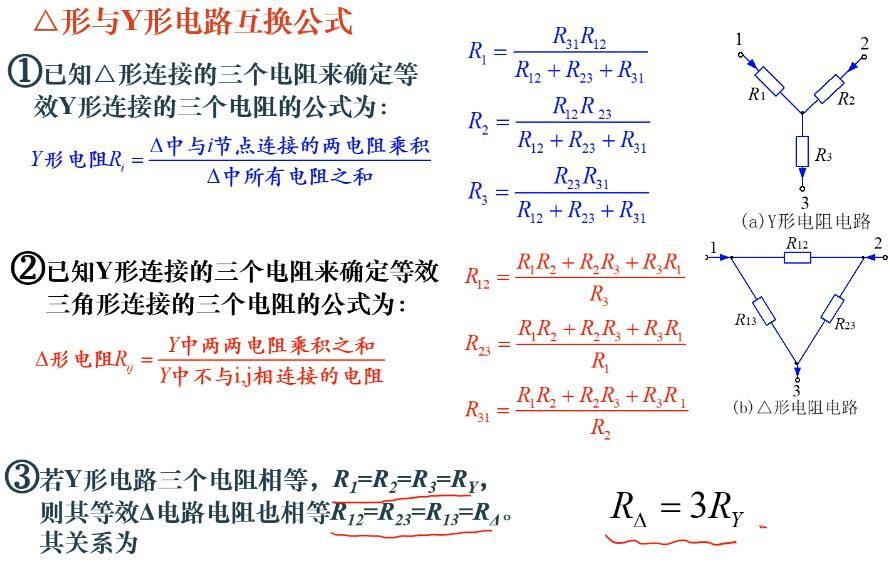
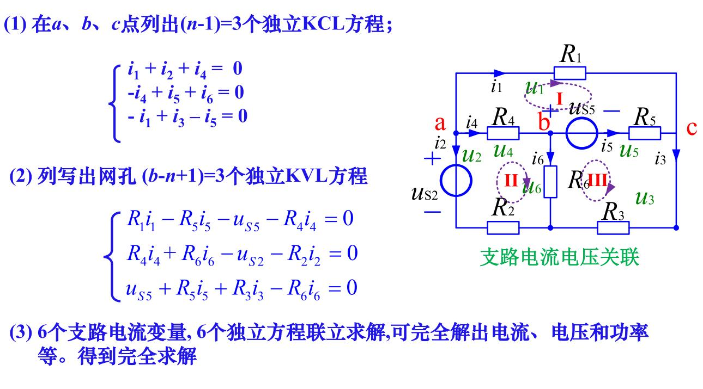
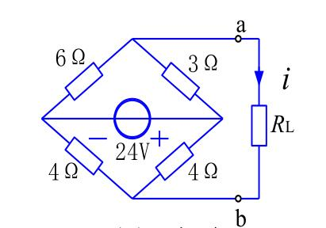
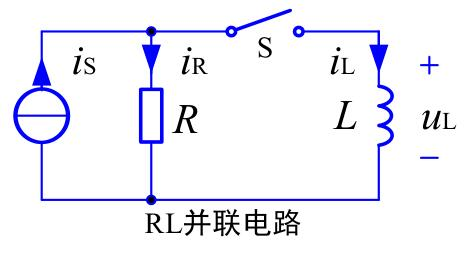
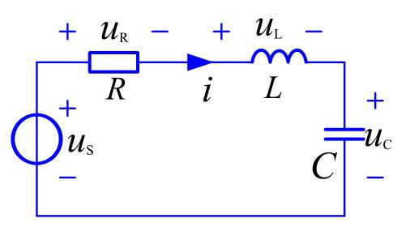
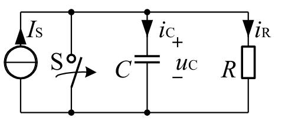

# 电路的基本规律

## 集中（或集总）参数电路

实际电路的几何尺寸远小于工作波长时，我们用能足够精确反映其电磁性质的一些理想电路元件或他们的组合来模拟实际元件，这种理想化的电路元件称为集中参数元件。由其连接组成的电路称为集中参数电路。

而一些远距离输电线就不能看做集中参数电路，称作分布参数电路，要用其他理论来研究。

## 电流

单位时间内通过导体横截面的电荷量$q$定义为电流强度，简称电流，用$i,i(t)$表示，即

$$
i(t)=\frac{dq(t)}{dt}
$$

电荷量的单位是库伦，时间的单位是秒，电流的单位是安培。

方向，一般把正电荷运动的方向定义为电流的实际方向。但在具体电路中，电流的实际方向常常随时间变化。通常在分析电路时会指定某一方向为电流方向，称为电流的参考方向。如果参考方向和实际方向一致，则电流$i>0$，否则$i<0$。

电流的参考方向是任意指定的，一般用箭头和双下标表示，如$i_{ab}$指$a$到$b$的电流。

## 电压

电路中，电场力将单位正电荷从某点移到另一点所作的功定义为该两点之间的电压，也称电位差，用$u,u(t)$表示，即

$$
u(t)=\frac{dw(t)}{dq(t)}
$$

功的单位是焦耳，电压的单位是伏特。

通常，高电位为正极，低电位为负极。

和电路的参考方向一样，我们也可以为电压指定参考极性。在分析电路问题时，先指定电压的参考极性，$+$表示高电位，$-$表示低电位。如果电压的参考极性和实际极性一致，则$u>0$，否则$u<0$。

电流参考方向给定，若电流流入的方向是电压的高电位，流出的方向是电压的低电位，则称此时电流、电压是关联参考方向。反之为非关联参考方向。

## 能量

正电荷从电路元件上电压的正极经元件移动到负极是电场力对电荷做功的结果，此时元件吸收能量。反之发出能量。

若某元件两端的电压为$u$，在$dt$时间内流过该元件的电荷量为$dq$，那么，根据电压的定义式，电场力做的功$dw(t)=u(t)dq(t)$。

在关联参考方向时，$dw(t)=u(t)i(t)dt$

## 功率

能量对时间的变化率称为电功率。

$$
p(t)=u(t)i(t)
$$

## 基尔霍夫定律

**电路图**

如果仅研究各元件的连接关系，暂不关心元件本身的特性，则可用一条线段来代表元件。

**支路**

电路图中的每一个元件，即图中的每一条线段，称为支路。

**节点**

支路的连接点称为节点。

**路径**

在图中，从某一节点出发。连续地经过一些支路和节点（只能各经过一次），到达另一节点，就构成路径。

**回路**

如果路径的最后到达点就是出发点，则这样的闭合路径称为回路。

### 基尔霍夫 电流定律

对于集中参数电路中的任一节点，在任意时刻，流出该节点电流的和等于流入该节点电流的和。

$$
\sum_{流出} i(t) = \sum_{流入} i(t)\quad \forall t
$$

### 基尔霍夫电压定律

在集中参数电路中，任意时刻沿任一回路绕行，回路中所有支路电压的代数和恒为零

$$
\sum u(t) = 0\quad\forall t 
$$

注意，上式在计算时，需要任意指定一个回路的绕行方向，凡是之路电压的参考方向与回路的绕行方向一致者，该电压前面去+号；否则取-号。

## 电阻元件

### 二端电阻

二端电阻元件可以定义为：一个二端元件，如果在任意时刻$t$，其两端电压$u$与流经它的电流$i$之间的关系(VCR)能用$u-i$平面上通过原点的曲线所确定，就称其为二端电阻元件，简称电阻元件。

由于电压和电流的单位是V和A，因而电阻元件的特性称为伏安特性或伏安关系。

如果电阻元件的伏安特性不随时间变化，则称其为非时变的。否则就是时变的。

如果伏安特性是通过原点的直线，则称为线性的，否则是非线性的。

**欧姆定律**

在电压、电流参考方向相关联时，其电压与电流的关系就是熟知的欧姆定律

$$
u(t)=Ri(t)\quad\forall t
$$

或者

$$
i(t) = Gu(t)\quad\forall t
$$

其中电阻$R$的单位是欧姆$\Omega$，电导$G$的单位是西$S$。对于线性非时变电阻元件，$R$和$G$都是常实数，他们的关系是

$$
G=\frac{1}{R}
$$

### 分立电阻与集成电阻

任何材料都有电阻。导体、半导体和绝缘体三者的区别是材料的电阻率$\rho$。通常$\rho<10^{-4}\Omega\cdot m$的材料称为导体，$\rho>10^4\Omega\cdot m$的材料称为绝缘体，介于其中的称为半导体。

一段长度为$L$、截面积为$S$、电阻率为$\rho$的材料，其电阻值为

$$
R = \rho\frac{L}{S}
$$

**分立电阻器的主要参数**

电子电路中单个使用的具有电阻特性的元件，称为分立电阻器。电阻元件是由实际电阻器抽象出来的理想化模型。

电阻元件和电阻器不是一个概念。电阻元件的参数只有一个电阻值，而电阻器的元件参数包括标称值、容差、额定功率、温度系数等。

**集成电阻**

集成电阻又称扩散电阻、薄层电阻。

通过复杂的扩散工艺在硅片上生成一定尺寸的薄层而制成的电阻，称为扩散电阻。

无论是分离电阻器还是集成电阻，分析时都应该抽象为电阻元件。

## 电源

### 电压源

一个二端元件，如果其端口电压总能保持为给定的电压$u_s(t)$，而与通过它的电流无关，则称其为电压源。

如果$u_s(t)$为恒定值，则称其为直流电压源或恒定电压源。

电压源具有如下特点：

1. 无论通过它的电流为何值，电压源的端口电压$u$总保持$u(t)=u_s(t)$
2. 电压源的电流由电压源和与它相连的外电路共同决定。

### 电流源

一个二端元件，如其端口电流值总能保持为给定的电流$i_s(t)$，而与其端口电压无关，则称其为电流源。

如果$i_s(t)$为恒定值，则称其为直流电流源或恒定电流源。

电流源具有如下特点：

1. 无论其端口电压$u$为何值，电流源的电流$i$总保持$i(t)=i_s(t)$
2. 电流源的端口电压源由电流源和与它相连的外电路共同决定。

### 电路中的参考点

在电路分析中，常常指定电路中的某点为参考点，计算或测量其它各节点对参考点的电位差，称其为各节点的电位，或各节点的电压。

### 受控源

非独立电源是指电压源的电压或电流源的电流不是给定的时间函数，而是受电路中某支路电压或电流控制的，因此常称为受控源。

受控源的符号通常用菱形，而不是圆形。

## 电路等效

### 概念

对于两部分结构、元件参数完全不同的电路，若它们具有完全相同的端口电压电流关系，就称它们是等效的。

### 电阻的串联和并联

**串联**

$$
R_{eq}=R_1+R_2+\cdots
$$

串联时，电流相等；各电阻的电压如下

$$
u_k=R_k i =\frac{R_k}{R_{eq}}u
$$

**并联**

电导有

$$
G_{eq}=G_1+G_2+\cdots
$$

电阻有

$$
\frac{1}{R_{eq}}=\frac{1}{R_{1}}+\frac{1}{R_{2}}+\cdots
$$

并联时，电压相同，各电阻的电流如下

$$
i_k=G_iu=\frac{G_k}{G_{eq}}i
$$

### 电阻Y型和三角形电路的等效变换

## 含独立源电路的等效

### 独立源的串联和并联

**电压源串联**

电压源串联时，得到的净电压等于电压极性相同的各个电源电压总和，减去极性相反的各电源电压总和。净电压方向与大的那个相同。

**电压源并联**

只有两端电压是相同的电压源才可以并联。可以增加输出电流的能力。

**电流源串联**

只有电流大小相同的电流源能串联。

**电流源并联**

电流源并联时，得到的等效电流源电流大小等于极性相同的各个电源流总和，减去极性相反的各电源电流总和。净电流方向与大的那个相同。

**实际电源的等效变换**

实际电源，比如电池，我们在高中通常会说它含有一个内阻。也就是等价为一个理想电压源+一个电阻的串联。我们也可以将其等价为一个理想电流源+一个电阻的并联。如下图

**电压源的等效转移**

电流源可以转移到各并联支路上，如下图

可以证明，此时电路中的KVL仍然保持不变。

**电流源的等效转移**

电流源可以转移成如下形式

# 电阻电路分析

## 图与电路方程

**图的基本概念**

图的定义和离散数学、算法竞赛图论部分没有什么差别。

主要介绍基本回路：仅包含一条连支（其余为树枝，即树加了任意一条连支）的回路称为单连支回路或基本回路

基本割集：仅包含一条树枝（其余为连支）的割集称为单树支割集或基本割集。

**KCL与KVL的独立方程**

根据我们的朴素想法，我们会把每一个节点的KCL方程和每一个回路的KVL方程列出来，试图求解电路中的所有未知量。这的确是可行的，但是，我们会发现我们有一些方程是可以由其他方程推出的，这就导致了不是所有方程都是独立的。

可以证明，对于有$n$个节点的连通图，任选$n-1$个节点所列的$KCL$方程是独立的。这些对应的节点叫独立节点，另外一个节点叫参考节点。

对于$n$个节点、$b$条支路的连通图，有$L=b-n+1$个基本回路，可以列出$L$个独立的KVL方程。

或者说，对于平面图，有$L$个网孔，可以根据这$L$个网孔列出独立的KVL方程。

在平面图中，网孔就是内部不包含边的回路。

## 2b法和支路法

### 2b法

对一个具有$b$条支路和$n$个节点的电路，当以支路电压和支路电流为变量列写方程时，共有$2b$个未知变量，根据KCL可列出$n-1$个独立方程，根据KVL可列出$b-n+1$个独立方程；根据元件的伏安关系，每条支路可以列出$b$个支路电压和电流关系的方程。于是总共列出了$2b$个方程。

这个方法称为$2b$法，可行，但是对于手算不方便

### 支路法

如果以支路电流（或支路电压）为电路变量列出方程，求解支路电流（或支路电压），则称为支路电流（支路电压）法。

步骤如下

1. 选定各支路电流的参考方向
2. 对$n-1$个独立节点，列出KCL方程
3. 对所有的网孔，按指定回路绕行方向，根据KVL，列出电压方程

总共列出了$b$个方程。

例如：

任一回路内，电阻上电压的代数和等于电压源电压的代数和，其中支路电流参考方向与回路方向一致者，$R_ki_k$前取$+$号，否则取$-$号，电压源$u_{sk}$的参考方向与回路方向相反者取$+$号，否则取$-$号。（当然在本例中电压源写在了方程等号左边，上面说的符号是写在右边时的符号）

## 回路法和网孔法

以独立回路电流为未知变量列出并求解方程的方法称为回路法。若选平面电路的网孔作独立回路，则这样的回路法又常称为网孔法。

回路电流实际上并不存在，只是为了方便分析而引入的概念。

回路法的步骤归纳如下

1. 选定一组独立回路，并指定各回路电流的参考方向
2. 列出回路方程（注意电阻和电压源的符号）
3. 解方程

例如：

## 节点法

以节点电压为未知变量列出并求解方程的方法称为节点法

在电路中任选一个节点为参考节点，其余节点与参考节点之间的电压称为节点电压或节点电位。

但以上方程不需要推导，可以直观的列出

规律如下：

1. $G_{ii}$称为节点$i$的自电导，等于与节点$i$相连的所有支路的电导之和，恒取$+$
2. $G_{ij}(i\neq j)$称为节点$i,j$之间的互电导，等于两节点之间的电导之和，恒取$-$
3. $(\sum I_s)_i$称为节点$i$的等效电流源，等于流入节点$i$的所有电流源电流的代数和。流入为$+$，流出为$-$

## 齐次定理和叠加定理

首先介绍齐次性和叠加性，对于线性映射$f$，它满足

1. 齐次性（比例性），即

$$
f(ax)=af(x)
$$

2. 可加性（叠加性）

$$
f(x_1+x_2) = f(x_1)+f(x_2)
$$

两者也可以结合使用。

例如$f(x)=ax$是线性的，但$f(x)=ax+b$就不是线性的。

### 齐次定理

对于有唯一解的线性电路，当只有一个激励源（独立电压源或独立电流源，必须是独立的）x(t)作用时，其响应y(t)（电路任意处的电压或电流）与激励成齐次关系。例如

注意：

1. 只能用于有唯一解的线性电路，不能用于非线性电路
2. 响应也称为输出，指电路中任意处的电流或电压；功率与激励源之间不存在线性关系
3. 激励也称为输入，指电路中的独立源，受控源不是激励源

### 叠加定理

对于有唯一解的线性电路，多个激励源共同作用时引起的响应（电路中各处的电流、电压）等于各个激励源单独作用时（其他激励源置零，具体表现为电压源变成导线，电流源变成开路）所引起的响应之和

## 替代定理

对于有唯一解的线性或非线性电路，若某支路的电压$u$或电流$i$已知，则该支路可用方向和大小与$u$相同的电压源替代，或用方向和大小与$i$相同的电流源替代，而不会影响其他点的电流和电压。

注意，替换成电流源后电压不变，替换成电压源后电流也不变。

## 等效电源定理

### 戴维南定理

任意一个线性二端含源电路$N$，对其外部而言，可以用一个电压源和电阻的串联组合来等效。该电压源的电压值$U_{OC}$等于电路$N$二端子间的开路电压，其串联电阻值$R_0$等于电路N内部所有独立源置零时二端子的等效电阻。

例如

求其等效电源，先将$ab$断开，计算等效电压

$$
U_{OC}=\frac{6}{6+3}\times 24-\frac{4}{4+4}\times 24 = 4V
$$

将电压源置零，得到一根导线，计算等效电阻为

$$
R_0=\frac{18}{9}+\frac{16}{8}=4\Omega
$$

得到的等效电源为

### 诺顿定理

诺顿定理与戴维南不同的地方是，诺顿定理等效为一个电流源和一个电阻并联。本质上是等效的。

我们可以选择先计算戴维南等效，再电源等效为电流源。

也可以选择将两个端子短路来计算等效电流源，将独立源置零来计算等效并联电阻。

### 计算技巧

等效的电流源和电压源是容易计算的，电流源将两个端子短路，电压源将两个端子开路。

没有受控源时，将独立源置零，根据串并联关系，等效电阻也是容易计算的。

当有受控源时

**外加电源法**

**开路短路法**

即计算开路电压$u_{oc}$和短路电流$i_{sc}$，得到$R_0=u_{oc}/i_{sc}$

**伏安关系法**

直接对二端线性电路$N$，推导出两端子上的电压$u$和电流$i$之间的一次关系式，通常是以下形式

$$
u=u_{oc}-R_0i
$$

就可以得到开路电压和等效内阻。

## 最大传输功率电源定理

在电子技术中，常要求负载从给定电源（或给定电路）获得最大功率，即最大功率传输问题。

实际应用常遇到这样的问题：一个有源二端电路，向负载电阻$R_L$供电。问$R_L$为何值时其上获得最大功率？

由于电路$N$给定，可以将其等效为戴维南等效电路来分析。

设等效电压为$u_{oc}$，电源内阻为$R_0$，则

$$
P_L = \bigg(\frac{u_{oc}}{R_0+R_L}\bigg)^2R_L
$$

可以用求导等方式证明，$R_L=R_0$时，其$P_L$最大。这称为最大功率匹配条件。

## 特勒根定理和互易定理

### 特勒根定理

**定理1**

对于任意一个具有$b$条支路$n$个节点的集总参数电路，设支路电压、支路电流分别为$u_k,i_k$，且各支路电压和电流取关联参考方向，对任何时间$t$，有

$$
\sum^b_{k=1}u_ki_k=0
$$

**定理2**

对于任意两个拓扑结构完全相同（即图完全相同，各支路组成元件性质任意）的集中参数电路$N$和$N'$。设它们具有$b$条支路$n$个节点，其相对应的各支路和各节点的编号相同。设它们的支路电压分别为$u_k$和$u'_k$，支路电流分别为$i_k$和$i'_k(k=1,2,\cdots,b)$，且各支路电压和电流取关联参考方向，则对任意时刻$t$，有

$$
\sum^b_{k=1}u_ki'_k=0
$$
$$
\sum^b_{k=1}u'_ki_k=0
$$

### 互易定理

互易定理表明: 对于一个仅含线性电阻的二端口电路$N_R$，在只有一个激励源的情况下，当激励与响应互换位置时，同一激励所产生的响应相同。

有三个形式

# 动态电路

## 动态元件

### 电容

一个二端元件，若在任一时刻$t$，其电荷$q(t)$与电压$u(t)$之间的关系能用$q\sim u$平面上的曲线表征，即具有代数关系$f(u,q)=0$，则称该元件为电容元件，简称电容。

电容分为时变的和非时变的、线性的和非线性的，我们主要讨论线性非时变电容。

此时电容的库伏特性是

$$
q(t) = Cu(t)
$$

其中$C$与时间无关，是电容的大小，单位为法拉（电量单位为库伦时）。

**电容的VAR**

当电容两端的电压变化时，聚集在电容上的电荷也相应发生变化，表明连接电容的导线上电荷移动，即电流流过；若电容上电压不变化，电荷也不变化，即电流为零。

*微分关系*

若电容上电压与电流参考方向关联，则有

$$
i(t) = C\frac{du(t)}{dt}
$$

*积分关系*

$$
u(t) = \frac{1}{C}\int^t_{-\infty}i(\xi)d\xi
$$

设$t=t_0$为初始观察时刻，上式可改写为

$$
u(t) = \frac{1}{C}\int^{t_0}_{-\infty}i(\xi)d\xi+\frac{1}{C}\int^{t}_{t_0}i(\xi)d\xi=u(t_0)+\frac{1}{C}\int^{t}_{t_0}i(\xi)d\xi,t\geq t_0
$$

其中

$$
u(t_0)=\frac{1}{C}\int^{t_0}_{-\infty}i(\xi)d\xi
$$

称电容电压在$t_0$时刻的初始值，或初始状态，它包含了在$t_0$以前电流的“全部历史”信息。一般取$t_0=0$。

注意

1. 电容的伏安关系是微积分关系，因此电容元件是动态元件。而电阻元件的伏安关系是代数关系，电阻是一个即时(瞬时)元件。
2. 
    1. 任意时刻，通过电容的电流与该时刻电压的变化率成正比。当电容电流$i$为有限值时，其$du/dt$也为有限值，则电压$u$必定是连续函数，此时电容电压不会跃变。
    2. 当电容电压为直流电压时，则电流$i = 0$，此时电容相当于开路，故电容有隔直流的作用。
3. 由电容VAR的积分形式可知:在任意时刻t，电容电压u是此时刻以前的电流作用的结果，它“记载”了以前电流的“全部历史”。即电容电压具有“记忆”电流的作用，故电容是一个记忆元件，而电阻是无记忆元件。

**电容的功率和储能**

*功率*

当电压和电流为关联方向时，电容吸收的瞬时功率为

$$
p(t) = u(t)i(t) = Cu(t)\frac{du(t)}{dt}
$$

电容是储能元件，它不消耗能量。释放的能量不会超过吸收的能量。电容不能产生能量，因此为无源元件。

*储能*

对功率从$-\infty$到$t$进行积分，即得$t$时刻电容上的储能：

$$
w_c(t)=\int^t_{-\infty}p(\xi)d\xi=\int^{u(t)}_{u(-\infty)}Cu(\xi)du(\xi)=\frac{1}{2}Cu^2(t)-\frac{1}{2}Cu^2(-\infty)
$$

而未充电时应有$u(-\infty)=0$，所以

$$
w_c(t) = \frac{1}{2}Cu^2(t)
$$

电容在某一时刻$t$的储能**仅**取决于此时刻的电压，而与电流无关，并且大于等于零。

### 电感

一个二端元件，若在任一时刻$t$，其磁链$\varPsi(t)$与电流$i(t)$之间的关系能用$\varPsi\sim i$平面上的曲线表征，即具有代数关系$f (\varPsi, i ) = 0$，则称该元件为电感元件，简称电感。

电感也分为时变的和非时变的、线性的和非线性的。

主要讨论的是线性非时变电感。

线性时不变电感的外特性（韦安特性）是$\varPsi\sim i$平面上一条过原点的直线，且其斜率$L$不随时间变化，

$$
\varPsi(t) = Li(t)
$$

磁链单位是韦伯，电感单位是亨利。

**电感的VAR**

电感中，当电流变化时，磁链也发生变化，从而产生感应电压。在电流与电压参考方向关联时，若电压参考方向与磁通的方向符合右手法则，根据法拉第电磁感应定律，感应电压$u_L(t)$与磁链的变化率成正比，即：

*微分关系*

$$
u_L(t)=\frac{d\varPsi(t)}{dt}=L\frac{di(t)}{dt}
$$

*积分关系*

$$
i(t) = \frac{1}{L}\int^t_{-\infty}u(\xi)d\xi
$$

设$t=t_0$为初始观察时刻，上式可改写为

$$
i(t) = \frac{1}{L}\int^{t_0}_{-\infty}u(\xi)d\xi+\frac{1}{L}\int^{t}_{t_0}u(\xi)d\xi=i(t_0)+\frac{1}{L}\int^{t}_{t_0}u(\xi)d\xi,t\geq t_0
$$

其中

$$
i(t_0)=\frac{1}{L}\int^{t_0}_{-\infty}u(\xi)d\xi
$$

称电感电流在$t_0$时刻的初始值，或初始状态，它包含了在$t_0$以前电压的“全部历史”信息。一般取$t_0=0$。

注意

1. 电感元件是动态元件。
2. 电感的电压与该时刻电流的变化率成正比
3. 电流$i$是连续函数，电感电流不会跃变
4. 电感对直流相当于短路。
5. 电感电流$i$是此时刻以前的电压作用的结果，它“记载” 了以前电压的“全部历史”。即电感也是一个记忆元件。
6. 电感是一个储能元件，它从外部电路吸收的能量，以磁场能量的形式储存于自身的磁场中。电感$L$在某一时刻的储能只与该时刻$t$电感电流有关。

**电感的功率与储能**

*功率*

当电压和电流为关联方向时，电感吸收的瞬时功率为

$$
p(t) = u(t)i(t) = Li(t)\frac{di(t)}{dt}
$$

电感是储能元件，它不消耗能量。释放的能量不会超过吸收的能量。电感不能产生能量，因此为无源元件。

*储能*

对功率从$-\infty$到$t$进行积分，即得$t$时刻电感上的储能：

$$
w_c(t)=\int^t_{-\infty}p(\xi)d\xi=\int^{i(t)}_{i(-\infty)}Li(\xi)di(\xi)=\frac{1}{2}Li^2(t)-\frac{1}{2}Li^2(-\infty)
$$

而未充电时应有$i(-\infty)=0$，所以

$$
w_c(t) = \frac{1}{2}Li^2(t)
$$

电感在某一时刻$t$的储能**仅**取决于此时刻的电流，而与电压无关，并且大于等于零。

### 电容的串并联

**串联**

$$
\frac{1}{C_{eq}}=\frac{1}{C_1}+\frac{1}{C_2}+\cdots+\frac{1}{C_n}
$$

**并联**

$$
C_{eq}=C_1+C_2+\cdots+C_n
$$

### 电感的串并联

**串联**

$$
L_{eq}=L_1+L_2+\cdots+L_n
$$

**并联**

$$
\frac{1}{L_{eq}}=\frac{1}{L_1}+\frac{1}{L_2}+\cdots+\frac{1}{L_n}
$$

## 动态电路方程及其解

### 动态电路方程

**一阶电路**

由KCL等可得

$$
\frac{du_C}{dt}+\frac{1}{\tau}u_C = \frac{1}{RC}u_S
$$

其中$\tau=RC$，量纲为秒，称为时常数。

由$KVL$等可得

$$
\frac{i_L}{dt} + \frac{1}{\tau}i_L = \frac{R}{L}i_s
$$

其中$\tau=L/R$，其量纲也为秒。

观察两个方程，除了变量不同，均为典型的一阶微分方程，因此均为一阶电路。一般形式为

$$
y'(t)+ay(t) = bf(t)
$$

其中$y(t)$为响应，$f(t)$为激励。

**二阶电路**

$$
\frac{d^2 u_C}{dt^2} + \frac{R}{L}\frac{du_C}{dt}+\frac{1}{LC}u_c = \frac{1}{LC}u_S
$$

**建立动态方程的一般步骤**

1. 根据电路建立KCL或KVL方程，写出各个元件的伏安关系
2. 在以上方程中消去中间变量，得到所需变量的微分方程
3. 对于较复杂的动态电路，常用拉普拉斯变换进行分析

### 动态电路方程的求解

同高数内容，不再赘述。对于电路的一些形式可以在三要素部分介绍。

## 电路的初始值

### 换路定律

若电容电流$i_C$和电感电压$u_L$在$t=0$时为有限制，则换路前后瞬间电容电压$u_C$和电感电流$i_L$是连续的，即

$$
\left\{\begin{matrix}
u_C(0_+) =u_C(0_-)\\
i_L(0_+) = i_L(0_-)
\end{matrix}\right.
$$

而除了这两个值（独立初始值），其余各处的电压电流（非独立初始值）不受换路定律的约束，可以出现跃变。

### 独立初始值的求解

在换路之前，也就是$t<0$时，直流电源作用下电路处于稳态。此时电容可以视为开路，电感视为短路，由此我们可以直接计算$u_C(0_-)$和$i_L(0_-)$，就像没有动态元件时所做的那样。

然后根据换路定律就可以求出$t=0_+$时的独立初始值。

### 非独立初始值的求解

在$t=0_+$时刻，将电容用电压等于$u_C(0_+)$的电压源替代，电感用电流等于$i_L(0_+)$的电流源替代，再去计算各处的电流电压。

## 动态电路的响应

### 零输入响应

外加激励均为零时，仅由初始状态所引起的响应，称为零输入响应，记为$y_x(t)$或$y_{zi}(t)$。

例如

通过某种手段先给$C$充电到电压为$u_C$，然后接入电阻

此时方程为

$$
RC\frac{du_C}{dt}+u_C=0
$$

解得

$$
u_C(t) = Ke^{-t/\tau}
$$

其中$\tau = RC$，$K=u_C(0_+)$

### 零状态响应

当电路的初始储能为零(即初始状态为零)时，仅由外加激励所引起的响应，称为零状态响应，记为$y_f(t)$或$y_{zs}(t)$。

例如

$t=0$突然将开关打开，给右侧电路一个激励。

方程解得

$$
i_c = I_Se^{-t/\tau}
$$

其中$\tau=RC$

若有多个激励，零状态响应与各激励之间也满足可加性。这种性质称之为零状态线性。

### 全响应

电路在外加激励和初始状态共同作用下所产生的响应，称为全响应。

全响应=零输入响应+零状态响应，即

$$
y(t) = y_{zi}(t) + y_{zs}(t)
$$

计算只要

1. 将独立源置零计算零输入响应
2. 将电容、电感的状态置零计算零状态响应

## 一阶电路的三要素

对于直流激励下的一阶电路中任意一处的电流和电压，只要计算出其在$t=0_+$和$t=\infty$时的值以及整个电路的时常数，就可以直接列出它随时间的函数

$$
y(t) = y(\infty) + [y(0_+)-y(\infty)]e^{-t/\tau}
$$

如果起始时间是$t=t_0$，则

$$
y(t) = y(\infty) + [y(t_{0_+})-y(\infty)]exp(-(t-t_0)/\tau)
$$

**计算$y(0_+)$**

独立初始值和非独立初始值的计算已经介绍过，不再重复。

**计算$y(\infty)$**

$t\to\infty$时，电路进入直流稳态，此时电容看做开路，电感看做短路。然后再用这个电路去计算我们所要的电流、电压值。

**计算$\tau$**

对于一阶$RC$电路，$\tau = R_0C$

对于一阶$RL$电路，$\tau = L/R_0$

$R_0$是换路后从动态元件$C$或$L$看进去的戴维南等效内阻。

## 阶跃函数与阶跃响应

### 阶跃函数

单位阶跃函数用$\varepsilon(t)$表示，其定义为

$$
\varepsilon(t) = \left\{\begin{matrix}
1,t>0\\
0,t<0
\end{matrix}\right.
$$

其中$t=0$处的值可以不定义。

如果单位直流电源接入的时刻为$t_0$，则可用延迟单位阶跃函数表示

$$
\varepsilon(t-t_0) = \left\{\begin{matrix}
1,t>t_0\\
0,t<t_0
\end{matrix}\right.
$$

### 阶跃响应

当激励为单位阶跃函数$\varepsilon(t)$时，电路的零状态响应称为单位阶跃响应，简称阶跃响应，用g(t)表示。

单位阶跃函数$\varepsilon(t)$作用于电路相当于单位直流源($1V$或$1A$)在$t = 0$时接入电路，因此，一阶电路的阶跃响应仍可用三要素法求得。

# 正弦稳态分析

## 正弦量

### 正弦量的三要素

按正弦(余弦)规律变化的电压、电流称为正弦电压、电流，统称为正弦量

正弦量的三要素是：振幅、初相、角频率。

瞬时值表达式为

$$
i(t) = I_m\cos(\omega t+\varphi_i)\\
u(t) = U_m\cos(\omega t+\varphi_u)
$$

$U_m(I_m)$是最大值，称为振幅

$\omega t+\varphi$是相位（角），单位$rad$或度

$t=0$时的相位$\varphi$称为初相位，$-\pi\leq \varphi\leq\pi$

$\omega$是正弦量相位变化的速率

### 正弦量的有效值

$$
I = \frac{1}{\sqrt 2}I_m
$$

$$
U = \frac{1}{\sqrt 2}U_m
$$

### 相位差

两个同频率的正弦波之间的相位之差称为相位差

频率相同，则相位差即为初相之差。

## 相量法

### 正弦量与相量

根据欧拉公式

$$
u(t) = U_mcos(\omega t+\varphi_u) = Re[U_me^{j(\omega t+\varphi_u)}] = Re[U_me^{j\varphi_u}e^{j\omega t}] = Re[\dot{U_m}e^{j\omega t}]
$$

这样，一个余弦时间函数就能用一个复指数函数来表示，其中

$$
\dot{U_m} = U_me^{j\varphi_u} = U_m\angle\varphi_u
$$

$\dot{U_m}$的模式正弦电压的振幅$U_m$，辐角是正线电压的初相角$\varphi_u$，我们称其为电压$u$的振幅相量。为了将相量与一般复数做区别，$U_m$上加$\cdot$。

式中$e^{j\omega t}$称为旋转因子，它是模等于$1$，初相为零，并以角速度$\omega$逆时针旋转的复值函数。向量$\dot{U_m}$乘以旋转因子$e^{j\omega t}$得到的$\dot{U_m}e^{j\omega t}$称为旋转相量，$\dot{U_m}$称为其振幅。

有效值与最大值的关系为

$$
\dot{I_m} = \sqrt 2 \dot I,\dot{U_m} = \sqrt 2 \dot U
$$

$u(t) = Re[\dot{U_m}e^{j\omega t}]$的几何意义是，一个正弦量在任意时刻的瞬时值，等于对应的旋转向量同一时刻在实轴上的投影。

注意相量法只适用于同频率正弦激励的线性时不变电路。

### 正弦量的相量运算

**同频率正弦量加减**

设

$$
u_1(t) = \sqrt 2U_1\cos(\omega t+\varphi_1) = Re[\sqrt 2\dot{U_1}e^{j\omega t}]
$$

$$
u_2(t) = \sqrt 2U_2\cos(\omega t+\varphi_1) = Re[\sqrt 2\dot{U_2}e^{j\omega t}]
$$

$$
u(t) = u_1(t) + u_2(t) = Re[\sqrt 2\dot{U_1}e^{j\omega t}] + Re[\sqrt 2\dot{U_2}e^{j\omega t}]
$$

$$
Re[\sqrt 2\dot{U}e^{j\omega t}] = Re[\sqrt 2\dot{U_1}e^{j\omega t} + \sqrt 2\dot{U_2}e^{j\omega t}] = Re[\sqrt{2}(\dot{U_1}+\dot{U_2})e^{j\omega t}]
$$

所以有$\dot U = \dot{U_1}+\dot{U_2}$

对于$\dot I$同理。

**正弦量的微分、积分**

设$i = \sqrt 2I\cos(\omega t+\varphi_i)=\sqrt 2Re[\dot Ie^{j\omega t}]$

微分

$$
\dfrac{di(t)}{dt} = \sqrt 2Re[j\omega\dot Ie^{j\omega t}]
$$

其中

$$
\dot I' = j\omega\dot I = \omega I e^{j(\varphi_i+\pi/2)}
$$

积分

$$
\int i(t)dt = \sqrt 2Re[\dfrac{\dot I}{j\omega}e^{j\omega t}]
$$

$$
\dot I' = \dfrac{\dot I}{j\omega} =  \dfrac I\omega e^{j(\varphi_i-\pi/2)}
$$

## 电路定律的相量形式

### KCL和KVL

$$
\sum\dot I = 0
$$

$$
\sum\dot U = 0
$$

如果改用最大值，也有

$$
\sum\dot I_m = 0
$$

$$
\sum\dot U_m = 0
$$

### VAR的相量形式

## 阻抗与导纳

### 阻抗

阻抗以如下形式定义

$$
Z = \dfrac{\dot U}{\dot I} = \dfrac{U\angle\varphi_u}{I\angle\varphi_i} = |Z|\angle\theta_Z = R+jX
$$

其中$|Z|=\dfrac{U}{I}=\sqrt{R^2+X^2}$称为阻抗模，$\theta_Z = \varphi_u-\varphi_i = \arctan\dfrac{X}{R}$称为阻抗角。

$R = |Z|\cos\theta_Z$称为电阻，即阻抗的实部。$X = |Z|\sin\theta_Z$称为电抗，即阻抗的虚部。

单个元件$R,L,C$的阻抗$Z_R,Z_L,Z_C$分别为

$$
\left\{\begin{align*}
&Z_R = R\\
&Z_L = j\omega L = jX_L = X_L\angle\dfrac{\pi}{2} \\
&Z_C = \dfrac{1}{j\omega C} = -j\dfrac{1}{\omega C} = -jX_C = X_C\angle-\dfrac{\pi}{2}
\end{align*}\right.
$$

阻抗串联时

$$
Z_{eq} = \sum Z_k
$$

分压为

$$
\dot U_k = \dfrac{Z_k}{Z_{eq}}\dot U
$$

### 导纳

导纳以如下形式定义

$$
Y = \dfrac{\dot I}{\dot U} = \dfrac{I\angle\varphi_i}{U\angle\varphi_u} = |Y|\angle\theta_Y = G+jB
$$

其中$|Y|=\dfrac{I}{U}=\sqrt{G^2+B^2}$称为导纳模，$\theta_Y = \varphi_i-\varphi_u = \arctan\dfrac{B}{G}$称为导纳角。

$G = |Y|\cos\theta_Y$称为电导，即导纳的实部。$B = |B|\sin\theta_Y$称为电纳，即导纳的虚部。

单个元件$R,L,C$的导纳$Y_R,Y_L,Y_C$分别为

$$
\left\{\begin{align*}
&Y_R = \dfrac{1}{R} = G\\
&Y_L = \dfrac{1}{j\omega L} = -j\dfrac{1}{\omega L} = -jB_L\\
&Y_C = j\omega C = jB_C
\end{align*}\right.
$$

导纳并联时

$$
Y_{eq} = \sum Y_k
$$

分流为

$$
\dot I_k = \dfrac{Y_k}{Y_{eq}}\dot I
$$

### 阻抗和导纳的关系

对统一电路，阻抗和导纳互为倒数。

$$
Z = \dfrac{1}{Y},Y=\dfrac{1}{Z}
$$

或者

$$
|Y| = \dfrac{1}{|Z|},\theta_y = -\theta_z
$$

### 阻抗与导纳的性质

对于阻抗$Z = R+jX$

若$X>0$，电路呈感性，$0\degree<\theta_z<90\degree$。$X=0$，电路呈阻性，$\theta_z=0$。$X<0$，电路呈容性，$-90\degree<\theta_z<0\degree$。

对于导纳$Y = G+jB$

若$B>0$，电路呈容性，$0\degree<\theta_y<90\degree$。$B=0$，电路呈阻性，$\theta_y=0$。$B<0$，电路呈感性，$-90\degree<\theta_y<0\degree$。

电路为感性时，电压超前于电流，$\theta_z>0$，电路为阻性时，电压和电流同向，电路为容性时，电压落后与电流，$\theta_z<0$

RLC串联电路中会出现分压和大于总电压的情况。

RLC并联电路中会出现分流和大于总电流的情况。

### 正弦稳态电路的计算

和直流电阻电路的电路定律是相似的，也就是说网孔法、节点法、阻抗的串并联、电源的等效互换、等效电源等方法可以使用。

## 正弦稳态电路的功率

### 一端口电路的功率

设无源一端口正弦稳态电路端口$u,i$关联

$$
u(t) = \sqrt 2U\cos(\omega t+\varphi_u)
$$

$$
i(t) = \sqrt 2I\cos(\omega t+\varphi_u-\theta)
$$

$\theta = \varphi_u-\varphi_i$，即$u,i$的相位差

**瞬时功率**

$$
p(t) = ui = UI[\cos\theta + \cos(2\omega t+2\varphi_u-\theta)]
$$

$p>0$是电路吸收功率，$p<0$是电路发出功率。

或者也可以

$$
p(t) = UI\cos\theta[1+\cos 2(\omega t+\varphi_u)] + UI\sin\theta\sin 2(\omega t+\varphi_u)
$$

其中$UI\cos\theta[1+\cos 2(\omega t+\varphi_u)]$为消耗功率，$UI\sin\theta\sin 2(\omega t+\varphi_u)$为交换功率。

**平均功率**

$$
P = \dfrac{1}{T}\int^T_0 p(t)dt = \dfrac{1}{T}\int^T_0[UI\cos\theta + UI\cos(2\omega t+2\varphi_u-\theta)]dt
$$

上式积分得

$$
P = UI\cos\theta = \dfrac{1}{2}U_mI_m\cos\theta
$$

其中$\cos\theta$为功率因数，$\theta=\varphi_u-\varphi_i$为功率因数角。无源网络中为等效阻抗的阻抗角。

如果$\cos\theta = 0$，其为纯电抗电路，$\cos\theta = 1$，其为纯电阻电路。

平均功率实际上是电阻消耗的功率，也称为有功功率。

**无功功率**

$$
Q = UI\sin\theta
$$

表示交换功率的最大值，单位$var$（乏）。$Q$的大小反映电路$N$与外电路交换功率的大小，由储能元件$L,C$决定。

**视在功率**

$$
S = UI
$$

反映电气设备的容量。

**RLC的有功和无功功率**

$P_R=UI,Q_R=0$，电阻只吸收功率，不发出功率

$P_L=0,Q_L=UI$，电感不消耗功率，$u$超前$i90\degree$

$P_C=0,Q_C=-UI$，电容不消耗功率，$i$超前$u90\degree$

可见二端电路中只有电阻在消耗功率，电感和电容不消耗功率，只储存能量、交换能量。

### 复功率

$$
\~S = P+jQ
$$

可以计算得到

$$
\~S = Ue^{j\varphi_u}Ie^{-j\varphi_i} = \dot U\dot I^* = Se^{j\theta}
$$

$$
S = \sqrt{P^2+Q^2}
$$

其中$\dot I^* = Ie^{-j\varphi_i}$是$\dot I$的共轭值。

功率与阻抗、导纳的关系为

$$
\~S = ZI^2 = RI^2+jXI^2
$$

$$
P = RI^2,Q=XI^2,S=|Z|I^2
$$

$$
\~S = Y^*U^2 = GU^2-jBU^2
$$

$$
P = GU^2,Q=-BU^2,S=|Y|U^2
$$

对于正弦稳态电路，利用特勒根定理可以证明

$$
\sum\~S = 0
$$

拆开为

$$
\sum P = \sum UI\cos\theta = 0\\
\sum Q = \sum UI\sin\theta = 0
$$

即对于正弦稳态电路，电路的总有功功率之代数和等于零，或者说，电路中发出的各有功功率之和等于吸收的各有功功率之和；电路的总无功功率之代数和恒等于零。

注意复功率守恒不等于视在功率守恒。并且一般$S\neq\sum S_k$

### 多频电路的响应和平均功率

**多频电路响应**

我们可以把多个频率不相同的激励源先计算单独作用时的响应，再利用叠加定理计算多频电路响应。

**多频电路瞬时功率**

同样先计算单独作用时的电流，这里假设有两个，为$i_1(t),i_2(t)$

$$
p_R(t) = R[i_1(t)+i_2(t)]^2 = p_1(t)+p_2(t) + 2Ri_1(t)i_2(t)
$$

**多频电路平均功率**

当$i_1(t),i_2(t)$的频率之比为有理数，且不相等时

$$
P_R = P_1 + P_2
$$

如果相等时

$$
P_R = P_1 + P_2 + RI_{m1}I_{m2}\cos(\varphi_1-\varphi_2)
$$

**非正弦周期信号平均功率**

可以把电压和电流展开为傅里叶级数，即分解为直流和各次谐波分量之和

$$
u(t) = U_0 + \sum^N_{k=1}\sqrt 2U_k\cos(k\omega t+\mu_{u_k})
$$

$$
i(t) = I_0 + \sum^N_{k=1}\sqrt 2I_k\cos(k\omega t+\mu_{i_k})
$$

则该一端口电路吸收的平均功率为

$$
P = U_0I_0+\sum^N_{k=1}U_kI_k\cos\theta_k = P_0 + \sum^N_{k=1}P_k\quad(\theta_k = \varphi_{u_k}-\varphi_{i_k})
$$

电压和电流的有效值为

$$
U = \sqrt{\sum^N_{k=0}U_k^2}
$$

$$
I = \sqrt{\sum^N_{k=0}I_k^2}
$$

### 最大功率传输条件

讨论正弦稳态电路中负载$Z_L$获得最大功率$P_{\max}$的条件。

**共轭匹配**

$$
Z_L = R_L + jX_L
$$

其中$R_L,X_L$可以独立调节时

$$
P_{\max} = \dfrac{U_s^2}{4R_s}
$$

条件是$Z_L = Z_S^*$，即$R_L=R_S,X_L=-X_S$

**模匹配**

若$Z_L = R_L+jX_L=|Z_L|\angle\theta$，$|Z_L|$可变，$\theta$不变，此时

$$
P_{\max} = \dfrac{\cos\theta U_s^2}{2|Z_S|+2(R_S\cos\theta+X_S\sin\theta)}
$$

条件是$|Z_L|=|Z_S|$
