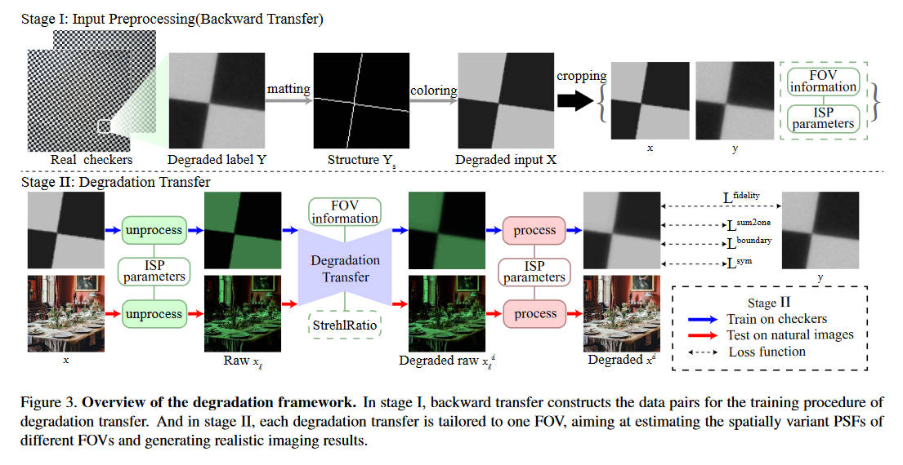

# 前言

简单来说，PSF就是光学系统的冲激响应。对于一个在光轴上的理想点光源（即一个冲激信号），相机所成的像就是该相机的PSF。事实上，PSF就表征着该光学系统的所有像差（除了畸变），也就描述了相机拍摄出来的照片是如何变得模糊的。如果能够获得相机的PSF，再加上去卷积操作（通常需要维纳滤波等抗噪声的方法），就能将退化图象恢复为理想图像。

# Camera Intrinsic Blur Kernel Estimation: A Reliable Framework

[https://openaccess.thecvf.com/content_cvpr_2015/html/Mosleh_Camera_Intrinsic_Blur_2015_CVPR_paper.html](https://openaccess.thecvf.com/content_cvpr_2015/html/Mosleh_Camera_Intrinsic_Blur_2015_CVPR_paper.html)

本文给出的成像模型如下

$$
b = S(v(d(h(i)))\ast k)+n
$$

其中$i$是物平面，$h$是一个平面映射(planar homography)，将物平面透视投影到像平面上。而紧随其后的$d$则代表着几何畸变(geometric distortion)，这是由于真实相机并不是完美的小孔成像系统。之后的$v$则代表着光学晕影(optical vignetting)，然后这一串的结果和PSF核$k$进行卷积，再通过采样函数$S$和一个加性噪声$n$（零均值高斯噪声），就得到了最终的图像$b$。

以往的工作为了估计$k$，通常都会依次估计$h,d,v$，然后再来估计$k$。这个估计鲁棒性不是很好，作者这里使用的方法绕过了对这三者的估计，记$u=v(d(h(i)))$，作者要直接获取到这个$u$，成像模型变为

$$
b = S(u\ast k) + n
$$

首先作者弄了四张图


第一张为棋盘格图，第二张图为期望为$0.5$的伯努利分布噪声，第三第四张图则为全黑和全白图。这些图像都是直接在电脑上合成的，然后将其在高分辨率显示屏上显示，再用待测相机去拍摄。之后需要将拍摄到的图和原始合成的图进行对齐。

首先从棋盘格图入手


作者使用Harris corner detector来进行角点检测。由于拍摄的时候是正对着拍的，所以各个角点之间的空间关系不变，合成图和拍摄图的映射关系非常直观。

对于一个格子内的四个角点，我们就可以通过双线性插值的方法，将拍摄图上的任意坐标映射到合成图上。首先，记合成图上的四个角点分别为$c_1=(\alpha_1, \beta_1),c_2=(\alpha_2, \beta_1),c_3=(\alpha_2, \beta_2),c_4=(\alpha_1, \beta_2)$，然后记拍摄图上的对应四个角点的坐标为$c_1'=(x_1, y_1),c_2'=(x_2, y_2),c_3'=(x_3, y_3),c_4'=(x_4, y_4)$

于是，任意在方格$C'$内的点的坐标$(x,y)$都可以用方格$C$内的坐标$(\alpha,\beta)$表示，

$$
\begin{bmatrix}
 x & y
\end{bmatrix}=
\begin{bmatrix}
 \alpha\beta & \alpha & \beta & 1
\end{bmatrix}
\begin{bmatrix}
1 & -1 & -1 & 1 \\
-1 & 1 & 0 & 0 \\
-1 & 0 & 1 & 0 \\
1 & 0 & 0 & 0
\end{bmatrix}
\begin{bmatrix}
c_1' \\
c_2' \\
c_3' \\
c_4'
\end{bmatrix}
$$

当然，这其中的坐标以方格的左下角为原点，并且进行归一化。

下一步，我们就可以通过warping的方式来获取前文提到的$u$（注，前文提到的$b$就是相机直接拍摄得到的伯努利噪声图像），算法如下


这里的图片$i$即为合成得到的伯努利噪声原图。这里描述的是对每一个棋盘格的方格内的坐标，在$i$上进行采样，然后将其值放到相机拍摄图像的对应坐标位置上。这一步主要是模拟了相机几何畸变和平面映射的过程。接下来再模拟晕影的过程

$$
u(x,y)=l(x,y)+i'(x,y)(w(x,y)-l(x,y))
$$

这里的$l$指的是相机对着全黑图片拍摄的结果，而$w$则是对着全白图片拍摄的结果。这样我们就得到了需要的$u$。

设$b,u$的大小为$M\times N$，PSF核的大小为$R\times R$，如果将成像模型转换成向量形式，并且省略掉采样函数的话（因为只是简单的线性映射），有

$$
\mathbf{b}=\mathbf{uk}+\mathbf{n}
$$

其中$\mathbf{b}\in\mathbb{R}^{MN},\mathbf{n}\in\mathbb{R}^{MN},\mathbf{k}\in\mathbb{R}^{RR},\mathbf{u}\in\mathbb{R}^{MN\times RR}$

伯努利噪声有均匀的谱密度函数（SDF），如果在理想的无噪声环境下，那么有

$$
|\mathcal{F}(b)|^2=
|\mathcal{F}(i)|^2
|\mathcal{F}(k)|^2
$$

其中$\mathcal F$是傅里叶变换。于是理想的PSF就是

$$
|\mathcal{F}(k')|^2=\dfrac{|\mathcal{F}(b)||\overline{\mathcal{F}(b)}|}{|\mathcal{F}(u)||\overline{\mathcal{F}(u)}|}
$$

使用梯度下降法来估计这里的$k$，就有

$$
\min_k E(k)=||\mathbf{\hat u}\mathbf{k}-\mathbf{\hat b}||^2+\lambda||\mathbf{k}||^2+\mu||\nabla \mathbf{k}||^2+\gamma|||\mathcal{F}(\mathbf{k})|-|\mathcal{F}(\mathbf{k'})|||^2
$$

其中第一项是为了更符合远图数据，第二项是为了让核稀疏，第三项是平滑项，第四项是为了更接近理想PSF。为了允许采集多张图像，这里的$\mathbf{\hat u}$是多个$\mathbf{u}$上下堆叠在一起的，同理$\mathbf{\hat b}$也是，这之后还有展开形式和其梯度，详情见原文，这里不再赘述。

总而言之，对着这个目标函数使用梯度下降法最后求得了我们需要的PSF核$k$。

# Direct PSF estimation using a random noise target

[https://www.spiedigitallibrary.org/conference-proceedings-of-spie/7537/75370B/Direct-PSF-estimation-using-a-random-noise-target/10.1117/12.837591.short](https://www.spiedigitallibrary.org/conference-proceedings-of-spie/7537/75370B/Direct-PSF-estimation-using-a-random-noise-target/10.1117/12.837591.short)


整个流程如下，首先是进行几何配准(geometric registration)，如下图


左边是数字图像原图，右边是相机拍摄到的图片。使用图中的四个标志点进行对准，计算得到一个投影矩阵，能够将数字图投影到拍摄图上。和其他思路差不多，都是通过模拟投影来应对相机的几何畸变等问题。现在两张图剩下的差异就为亮度、噪声、锐度等。

于是在几何配准后的下一步是色调映射，这里使用的是非线性的一条曲线。为了估计这条曲线的参数就需要使用数字图像左上角的灰度梯度图，需要用摄像机重新拍摄一张。在每一个灰色梯度块内提取出一个平均值，来和数字图像上的值建立映射关系，进而估计出曲线参数。然后对数字图像全局使用这个曲线，来让其亮度和拍摄的图像保持一致。

然后将图片分为$96\times 80$的小块，然后对每一个小块使用FFT，然后再通过计算就可以得到OTF（光传递函数），进一步的得到PSF。我们下面来解析一下这个过程。

在本文的模型中，相机的PSF是具有平移可变性的，每个空间位置的PSF是不一样的。如图


可以看到位于中间位置的PSF比较理想，而靠近边缘的则已经无法保持圆形了。于是，成像模型为

$$
i(x,y)=\sum_{x_0,y_0}h(x,y;x_0,y_0)\cdot o(x_0,y_0)+n(x,y)
$$

其中$o(\cdot,\cdot)$是输入信号，而$i(\cdot,\cdot)$是经过PSF后变模糊的图像。这里的$h$就是PSF，而$n$是加性噪声。

实践上我们不需要考虑每一个位置的PSF来计算某个点的输出，因为PSF能取值的范围很小，大部分都取$0$，又因为相近位置的PSF非常相似，所以可以考虑将图片分为$96\times 80$的小块，每一块内共享一个PSF。于是，成像模型变为

$$
i(x,y)=(p\ast o)(x,y)+n(x,y)
$$

在频域内就变为

$$
I(u,v)=P(u,v)O(u,v)+N(u,v)
$$

这里的$P$就是OTF。于是它的估计就很简单

$$
\hat P(u,v)=\dfrac{I(u,v)}{\hat O(u,v)}
$$

对OTF使用逆FFT就得到了PSF。

现在再来说一说数字图像的选择，这里选择的除了灰阶和标志物之外，背景是白噪声。由于白噪声在FFT之后还是白噪声，所以它是均匀的（homogeneous，我不是很理解什么意思），频域上也就不会出现在$0$附近的分量。如果分母上有$0$附近的分量就会影响OTF的估计（应该和去卷积操作中近似0的分量导致无法恢复图像是一个原理）。

在图像块上估计PSF确实避免了很多计算开销，但是也降低了估计的稳定性，于是本文又提出一个算法来规则化相邻的PSF。


如图，左边的大框表示了之前对图像进行切割的$96\times 80$的图像块，里面的小框表示了块内的像素。显然，根据前文所描述的，每个大框拥有一个PSF，这个PSF也是用$96\times 80$的图像进行表示的。为了进行PSF的平滑，将9个PSF的同一位置的像素提取出来（图中这一次选择了左上角），然后将其排列成$3\times 3$的一个矩阵，对其进行中值滤波，然后再将矩阵的值放回到原来的9个PSF中。如果在算法中发现PSF估计错误（例如异常值），则将其替换为邻居的PSF值。这里使用的滤波核为

$$
H = \begin{bmatrix}
 1 & 2 & 1\\
 2 & 4 & 2\\
 1 & 2 & 1
\end{bmatrix}
$$

最后就是一个阈值处理，将PSF中小于某一个值的量直接设置为0，从而进行降噪。显然，主要需要降噪的部分为PSF图像的边界部分，阈值窗的形状如下


形式化的定义如下

$$
S(x,y)=1-T(x)T(y)
$$

$$
T(n)=\begin{cases}
 1 & \text{ if } 0\leq|n|\leq\alpha\frac{N}{2} \\
 0.5\left[1+\cos\left(\pi\dfrac{n-\alpha\frac{N}{2}}{2(1-\alpha)\frac{N}{2}}\right)\right] & \text{ if } \alpha\frac{N}{2}\leq|n|\leq\frac{N}{2}
\end{cases}
$$

其中$N$为窗口大小，$\alpha$为可调参数。阈值过滤如下

$$
p(x,y)=\begin{cases}
 0 & \text{ if } \tilde{p}(x,y)<\tilde{p}_{max}S(x,y) \\
 \tilde{p}(x,y) & \text{ otherwise }
\end{cases}
$$

其中$\tilde{p}(x,y)$是过滤前的PSF，而$\tilde{p}_{max}$则是PSF中的最大值。

# 2D Sub-pixel Point Spread Function Measurement Using a Virtual Point-Like Source

[https://link.springer.com/article/10.1007/s11263-016-0948-8](https://link.springer.com/article/10.1007/s11263-016-0948-8)

本文使用的成像模型和第一篇是一样的

$$
b = S(g(h(a))\ast k)+n
$$

把透视投影和几何畸变通过校正的方式去掉，就得到

$$
b = S(a\ast k)+n
$$

如果$a$本身是一个冲激函数，那么最终的结果就是一个PSF

$$
b=S(k)+n
$$

但是现实中难以直接做出一个点光源，本文使用了一个平行光源和一个反射球面来制造一个非常近似的点光源。直接对着这个光源拍照就得到了PSF。

为了让这个反射光像一个点光源，相机放置的位置也是非常重要的，摆的不对反射光线就不近似于点光源了。作者这里通过光线追踪的方式来分析相机应该怎么放。

首先建立坐标系，以反射球面的球心为坐标系原点建立球面坐标，对于任意一个点都可以表示为

$$
\mathbf T  = \mathbf r R, \mathbf r = [\cos(\alpha),\sin(\alpha)\sin(\theta),\sin(\alpha)\cos(\theta)]^T
$$

其中$R$是到原点的距离，$\alpha$为极角（$x-y$平面），$\theta$为方位角（$y-z$）平面。


之后，让平行光从$\mathbf s = [-1, 0, 0]^T$的方向射入（即$x$轴反向），反射点在$\mathbf T$上，那么，反射光线的方向就可以表示为$\mathbf s'=[\cos(2\alpha),\sin(2\alpha)\sin(\theta),\sin(2\alpha)\cos(\theta)]^T$

于是，反射光线上的任意一点都可以用参数方程表示

$$
\begin{bmatrix}
 x\\
 y\\
 z
\end{bmatrix}=
\begin{bmatrix}
\cos(\alpha)\\
\sin(\alpha)\sin(\theta)\\
\sin(\alpha)\cos(\theta)
\end{bmatrix}R
+t
\begin{bmatrix}
\cos(2\alpha)\\
\sin(2\alpha)\sin(\theta)\\
\sin(2\alpha)\cos(\theta)
\end{bmatrix}
$$


让光轴对准原点，并且在$xy$平面内，与$x$轴形成一个夹角$\alpha_c$，此时反射后的光线如果能通过入瞳就可以进入成像系统。一个理想成像系统的入瞳半径可以通过焦距$f$和光圈数（f-numer）$N$计算得到

$$
\dfrac{D}{2} = \dfrac{f}{2N}
$$

然后该入瞳的圆环（圆环柱）在球心的直角坐标系下就可以表示为

$$
(-\sin(\alpha_c)x+\cos(\alpha_c)y)^2+z^2=\left(\dfrac{D}{2}\right)^2
$$

该圆所在的面垂直于光轴。上式只是定义了一个圆环柱，还需要描述圆环（入瞳）到原点的距离$H_c$

$$
\cos(\alpha_c)x+\sin(\alpha_c)y = H_c
$$

入射光和反射光向量构成了一个平面

$$
-\cos(\theta)y+\sin(\theta)z = 0
$$

上面几个式子联立消去$x,z$就得到了一个关于$y$的二次方程。这个联立的过程表示反射光与入瞳边缘的两个交点。

$$
\left(1+\dfrac{\cos(\alpha_c)^2}{\tan(\theta)^2}\right)y^2-2H_c\sin(\alpha_c)y+H_c^2\sin(\alpha_c)^2-\cos(\alpha_c)^2\left(\dfrac{D}{2}\right)^2 = 0
$$

我们可以通过限制$\theta$的取值边界来让上式有实数解

$$
\tan(\theta) = \pm\sqrt{\left(\dfrac{2H_c}{D}\right)^2\sin(\alpha_c)^2-\cos(\alpha_c)^2}
$$

将上式的解带入到描述反射光线上点的那个方程中就可以得到反射光线的参数$\alpha$（使用数值解法，不存在解析解）。当我们精确描述了射入成像系统的光线后，就可以通过光线和物面的交点来描述虚像的边界了

$$
\cos(\alpha_c)x+\sin(\alpha_c)y = H_c-H_o
$$

其中$H_o$是物面到入瞳的距离。虚像的形状和大小取决于物面的位置。定义虚像的大小$d$为，球面反射反射出来的虚像边缘的最小包围圆的直径。用下图来再解释一下这句话


蓝色的圈是成像边界，红色的圈是能够包住边界的最小圆，或者说外接圆。而所有的外接圆中直径最小的圆，其直径就是虚像的大小。因此最佳的对焦距离就是物面到入瞳的距离$H_o$，此时外接圆直径最小。

虚像的大小$d$孩取决于反射球的半径$R$和成像系统的结构。相比之下，衍射极限成像系统的理论分辨率可以用艾里斑的直径来表示，使用光圈数$N$计算为

$$
d_d=\dfrac{2.44\lambda N}{M}
$$

其中$\lambda$是光波长，$M$是成像系统的放大倍率

$$
M = \dfrac{f}{H_o-f}
$$

当保持$\alpha_c, f, H_c$不变时，光圈数、虚像大小、球面半径的关系如下图(a)所示


而(b)则展示了$N$不变而改变$\alpha_c$时的关系。(老实说看半天我也不知道到底怎么摆摄像机，感觉是让虚像大小小于衍射极限就行)

之后本文关注于如何估计亚像素级的PSF。首先获取$n\times n$张低分辨率图片$b_{i,j},i\in\{0,\cdots,n-1\}, j\in\{0,\cdots,n-1\}$，每张图片都是用之前的方法拍到的像素级PSF，唯一的区别是每张图片在拍摄前微小地平移球面镜，微小到亚像素级。

将图片$b_{i,j}$记作$\{u_k,v_l\}_{i, j},k\in\{0,\cdots,H-1\}, l\in\{0,\cdots,W-1\}$。于是所有的图片的像素就组成了一个非均匀网格$\{u,v\}$。于是两张图片的相对位置关系就可以通过一个亚像素级的步长$\Delta$计算出来，$\{u,v\}_{i+1, j}=\{u,v\}_{i, j}+\{\Delta, 0\}, \{u,v\}_{i, j+1}=\{u,v\}_{i, j}+\{0, \Delta\}$


于是，高分辨率的PSF就可以通过自然邻近差值从多张低分辨率PSF中重建出来。

$$
P(u,v) = \sum_{(u_{a_1},v_{a_2})\in B}w_{a_1,a_2}p(u_{a_1},v_{a_2})
$$

其中$B$是自然邻居集合，而$p(u_{a_1},v_{a_2})$表达式超分辨率网格$\{u,v\}_{SR}$上的点$(u,v)$的自然邻居点，$w_{a_1,a_2}$代表其对应的权重。

$$
w_{a_1,a_2}=\dfrac{A_{(u_{a_1},v_{a_2})}\cap A_{(u,v)}}{A_{(u,v)}}
$$

# # PSF Estimation Method of Simple-Lens Camera Using Normal Sinh-Arcsinh Model Based on Noise Image Pairs

[https://ieeexplore.ieee.org/abstract/document/9373384](https://ieeexplore.ieee.org/abstract/document/9373384)

本文的绝大部分内容和第一篇文章都一样，但是本文注意到第一篇文章对着全黑和全白图片拍摄的过程并没有考虑到颜色，所以本文在这一方面使用了三颜色的pattern


下面三张图，都是单颜色通道的0-255的渐变图像，分为18个阶梯，阶梯之间数值相差15。采集到的颜色值和原颜色值的关系可以表示为

$$
\begin{bmatrix}
 r'\\
 g'\\
 b'
\end{bmatrix}=
\begin{bmatrix}
 c_{r,r} & c_{g,r} & c_{b,r}\\
c_{r,g} & c_{g,g} & c_{b,g}\\
c_{r,b} & c_{g,b} & c_{b,b}
\end{bmatrix}
\begin{bmatrix}
 f_r(r)\\
 f_g(g)\\
 f_b(b)
\end{bmatrix}
$$

我们可以通过原始理论值和实际拍摄值，带入到这个等式中求出所有的参数$c$和$f$。从而在校正伯努利噪声的颜色时，可以使用$[r,g,b]^T=f^{-1}_{r,g,b}\left(C^{-1}\left[[r',g',t']^T\right]\right)$直接计算得到。

# Self-Supervised Spatially Variant PSF Estimation for Aberration-Aware Depth-from-Defocus

[https://ieeexplore.ieee.org/abstract/document/10446689/](https://ieeexplore.ieee.org/abstract/document/10446689/)

这篇文章是先估计PSF然后再用在Depth-from-Defocus任务上的，本文只关注其PSF估计部分。


方法很简单，首先使用相机拍出“Sharp”的图像，然后再拍出“Blur”的图像，使用神经网络拟合出PSF，将PSF和Sharp图像（一部分）卷积，然后计算卷积图和Blur（一部分）的误差。这个误差反向传播给神经网络就可以进行训练了。

拍摄sharp图和blur图的唯一区别在于相机的焦距（文中记作$d$）和光圈F值（文中记作$f_d$）。（但是我很怀疑本文所说的PSF是否是我们传统上的PSF。我们的PSF是和理想的delta函数对比的，但本文的PSF似乎是不同相机状态和最优相机状态之间的比较值。因为这个sharp图总得有它自己的PSF吧，不可能是理想的delta函数。不过这个训练的思想其实广泛体现在各类深度学习PSF估计上。）

本文观察到PSF是旋转对称的，形状只与离中心点的距离有关。所以训练的时候记录像素点的极坐标，将距离$IH$送入模型中进行训练，得到的PSF用极角$\theta$进行旋转，再和sharp图像进行卷积。

图中的PSF-Net使用UNet结构，误差如下

$$
\mathcal{L}=\mathcal{L}_{recon}+\alpha\mathcal{L}_{smooth}+\beta\mathcal{L}_{radial}
$$

$\alpha,\beta$是可调权重。其中第一项是重建误差，

$$
\mathcal{L}_{recon} = ||\mathbf{b}, \mathbf{s}\ast\mathbf{p}(\theta)||_1
$$

这里的$\mathbf b$是blur图的一个patch，$\mathbf s$是sharp图对应位置的patch，$\ast$是卷积操作，$\mathbf p(\theta)$代表着将模型输出的psf旋转$\theta$。

第二项是光滑项

$$
\mathcal L_{smooth} = \dfrac{1}{N_p}\sum^{N_p}_{i}|\delta_x p_i|+|\delta_yp_i|
$$

其中$\delta_x,\delta_y$分别是水平和竖直方向的梯度算子，$p_i$则是PSF中的一个像素，$N_p$是PSF的像素总数。这个光滑项主要起到一个抗噪声和平滑PSF的作用。

第三项是径向梯度误差。因为PSF都是中间高四周低的形状，为了防止PSF出现甜甜圈状等其他形状，引入了这个误差

$$
\mathcal{L}_{radial} = \dfrac{1}{K}\sum^{K-1}_{j=0}T(p_{\Omega_{j+1}}-p_{\Omega_{j}})
$$

$K$是一个可调参数，代表着预估的PSF半径$p_{\Omega_j}$代表着PSF中心周围$(2j+1)\times(2j+1)$的范围的平均值。$T$是一个阶跃函数，$\lambda\geq0$时，$T(\lambda)=\lambda$，其他情况$T(\lambda)=0$

# Blind Super-Resolution Kernel Estimation using an Internal-GAN

[https://proceedings.neurips.cc/paper/2019/hash/5fd0b37cd7dbbb00f97ba6ce92bf5add-Abstract.html](https://proceedings.neurips.cc/paper/2019/hash/5fd0b37cd7dbbb00f97ba6ce92bf5add-Abstract.html)

虽然本文是超分的工作，但是其直接启发了下面的一篇，所以还是介绍一下。

本文使用一个GAN，来让生成器生成一个下采样的图片，从而让判别器在patch-level上无法判断生成器生成的假图片和真实的图片在分布上的区别。


这里的判别器并不是判别图像是否真实，因为一个是原图一个是下采样的图根本就不一样。它输出一个map，表面该像素有多大可能是由原图的像素计算得到的。原文说的是：D trains to output a heat map, referred to as D-map (see fig. 2) indicating for each pixel, how likely is its surrounding patch to be drawn from the original patch-distribution. 我表示根本无法理解。然后作者给出的损失函数如下

$$
G^*(I_{LR})=\underset{G}{\arg\min}\max_{D}\{E_{x\sim patch(I_{LR})}[|D(x)-1|+|D(G(x))|]+R\}
$$

其中$R$是正则项后面再介绍，我严重怀疑这个公式有误，为什么会是$\max_D$？还是根据代码来看看吧

判别器的训练代码是

```python
def train_d(self):
        self.optimizer_D.zero_grad()
        d_pred_real = self.D.forward(self.d_input)
        g_output = self.G.forward(self.g_input)
        d_pred_fake = self.D.forward((g_output + torch.randn_like(g_output) / 255.).detach())
        loss_d_fake = self.criterionGAN(d_pred_fake, is_d_input_real=False)
        loss_d_real = self.criterionGAN(d_pred_real, is_d_input_real=True)
        loss_d = (loss_d_fake + loss_d_real) * 0.5
        loss_d.backward()
        self.optimizer_D.step()
```

首先这里的`d_pred_real`是对原图上拿下来的patch进行判别的结果，而`d_pred_fake`则是对生成器生成图片进行判别的结果。然后这里的`(loss_d_fake + loss_d_real) * 0.5`就是原公式中的$E_{x\sim patch}$，梯度下降法再怎么说也是求最小值。

然后再看生成器的训练代码

```python
def train_g(self):
        self.optimizer_G.zero_grad()
        g_pred = self.G.forward(self.g_input)
        d_pred_fake = self.D.forward(g_pred)
        loss_g = self.criterionGAN(d_last_layer=d_pred_fake, is_d_input_real=True)
        total_loss_g = loss_g + self.calc_constraints(g_pred)
        total_loss_g.backward()
        self.optimizer_G.step()
```

这里的`loss_g`其实相当于$|D(G(x))-1|$，而`self.calc_constraints(g_pred)`是我们后面要说的正则项。至此我认为之前的公式有误。

我们再来看看网络结构，首先是判别器


没有多少要说的，一个普通的全卷积网络。作者没有使用池化层，也没有strides，从而更好地判别小patch。

然后就是生成器


生成器是一个全卷积网络，但是是全线性的，不含任何非线性激活函数。这主要是因为图像降分辨率所用的卷积核就是一个线性操作。在训练完网络之后，将每一层的滤波器卷积起来就得到了超分辨率时需要用到的Kernel，和PSF有一些像。当然，我们知道多个线性层和单个线性层在能力上是等价的，作者这里使用多层的原因是多层易于训练。为了让Kernel更像回事，就加入了一些先验知识来作为正则项

$$
R=\alpha\mathcal{L}_{sum\_to\_1}+\beta\mathcal{L}_{boundaries}+\gamma\mathcal{L}_{sparse}+\delta\mathcal{L}_{center}
$$

- $\mathcal{L}_{sum\_to\_1}=|1-\sum_{i,j}k_{i,j}|$，使得卷积核加和为$1$。
- $\mathcal{L}_{boundaries}=\sum_{i,j}|k_{i,j}\cdot m_{i,j}|$惩罚靠近边缘的非零值，$m_{i,j}$是一个和距离有关的权重。
- $\mathcal{L}_{sparse}=\sum_{i,j}|k_{i,j}|^{1/2}$鼓励稀疏性，防止产生过渡平滑的Kernel。
- $\mathcal{L}_{center}=||(x_0,y_0)-\sum_{i,j}k_{i,j}\cdot(i,j)/\sum_{i,j}k_{i,j}||$来让Kernel的大部分数值集中在中心。

# Extreme-Quality Computational Imaging via Degradation Framework

[https://openaccess.thecvf.com/content/ICCV2021/html/Chen_Extreme-Quality_Computational_Imaging_via_Degradation_Framework_ICCV_2021_paper.html](https://openaccess.thecvf.com/content/ICCV2021/html/Chen_Extreme-Quality_Computational_Imaging_via_Degradation_Framework_ICCV_2021_paper.html)

这篇文章的思路基本和上篇文章一样，后面还附带了一个图像恢复网络，我们只讨论它PSF估计的部分。

在思路上，本文同样是用网络去生成一个Kernel（也就是PSF），然后让他去和理想图片卷积，然后将合成的图片和真实的图片进行比较来进行学习。



流程上，首先用相机对着棋盘格图片进行拍照，得到经由PSF退化的图像。将图像切成小块，然后通过边缘检测的方法检测棋盘格边缘，再进行上色，这样就得到了比较理想的未退化图像。然后我们就得到了退化前后的配对数据集。由于PSF是具有空间易变性的，所以切成小块之后每一块训练出来的PSF代表着那个位置的PSF。

将一个delta函数送入一个深度线性全卷积网络（同上一篇文章），得到一个PSF卷积核，将PSF和未退化图像卷积，得到预测的退化图象，然后将预测图像和真实的退化图象计算L1损失、其他正则项损失，从而更新网络。注意到这里为了保证训练的稳定性，不再使用GAN损失，变成了单纯的（半）监督学习，只不过数据是用别的办法合成的不需要手动采集。

总体的损失函数如下

$$
\mathcal{L} = \alpha\mathcal{L}_{fidelity}+\beta\mathcal{L}_{sum2one}+\gamma\mathcal{L}_{boundary}+\delta\mathcal{L}_{sym}
$$

中间两个同前面的文章，$\mathcal{L}_{fidelity}=||x^d-y||_1$就是L1损失，而

$$
\mathcal{L}_{sym} = \sum_{i,j}(k(i,j)-\dfrac{1}{2}((k(i,j)-k_{sym}(-i,-j))))^2
$$

则是一个对PSF的对称性约束。

另外，本文注意到FOV不同的位置上PSF的形状更不相似，FOV越大PSF就越不像一个delta函数。或者说，距离光轴越远越不像。所以本文在模型训练中考虑了FOV大小。实际上在代码中，FOV大小被分为三个层次，最近的部分使用较少的网络层数、预估的PSF尺寸较小（$19\times 19$）、$\gamma$取值更大（$1000$），而最远的部分使用更多网络层数，预估的PSF尺寸较大（$27\times 27$），$\gamma$取值更小（$1$）

# A Physics-Informed Blur Learning Framework for Imaging Systems

[https://openaccess.thecvf.com/content/CVPR2025/html/Chen_A_Physics-Informed_Blur_Learning_Framework_for_Imaging_Systems_CVPR_2025_paper.html](https://openaccess.thecvf.com/content/CVPR2025/html/Chen_A_Physics-Informed_Blur_Learning_Framework_for_Imaging_Systems_CVPR_2025_paper.html)

本文首先讨论了PSF的形成原理，并且给出了其光学上的模型公式，然后通过估计这个模型的参数，来计算出PSF。

有多种光学上的模型可以解释PSF，本文使用的是Seidel PSF model。它通过波前像差来计算PSF


波前像差就是理想的波前和真实的波前之间的、在出瞳位置的差距，这种相差导致了在像平面的失焦，于是就产生了PSF。在非相干成像系统中，PSF可由下式计算

$$
PSF(H,\lambda) = \left|\mathcal{F}\left(A(\mathbf p)\exp\left(\dfrac{i2\pi W(H,\lambda,\mathbf p)}{\lambda}\right)\right)\right|^2
$$

其中$W(H,\lambda,\mathbf p)$就是波前像差，$\mathbf p=[\rho, \theta]^T$是瞳平面上的点，用极坐标表示，其中$\rho\in[0, 1], \theta\in [0, 2\pi]$。$A(\mathbf p)$是瞳函数，通常是已知的。波前像差可以进一步分解为Seidel基，

$$
W(H,\lambda,\mathbf p) = \sum^\infty_{k=0}\sum^\infty_{l=0}\sum^\infty_{m=0}W_{klm}H^k\rho^l\cos^m(\dfrac{\pi}{2}-\theta)
$$

其中$k=2p+m, l=2n+m\quad (p,n,m\in \mathbb N)$，$W_{klm}$是Seidel系数，本文中只选取前$10$项来进行估计和使用。$\lambda$是光波长，$H$是归一化的场高度（field height），可以看上图来理解，在其他论文里大概就是FOV的意思。

但是Seidel基中的一些参数，例如$\rho^2$，会同时影响多个方向的SFR。并且，反向推导的问题是一个病态问题，而且他还是一个非线性变换。种种原因导致，在优化过程中会有梯度冲突问题。


本文提出了一种方法来解决这个问题。，首先修改波前相差的表达式

$$
W(H,\lambda,\mathbf p) = \sum_{(p,q,r)\in Q}W_{pqr}(H,\lambda)\rho^p(\sin\theta)^q(\cos\theta)^r
$$

其中

$$
Q=\{(2,2,0), (2,0,2), (3,1,0), (3,3,0), (4,2,0), (4,0,2), (5,1,0), (6,2,0), (6,0,2)\}
$$

这个修改后的表达式中的$\sin\theta, \cos\theta$确保了只会影响一个方向上的SFR。然后，在优化参数的时候只考虑一个较窄区域的SFR，而不是考虑全局的SFR。最后，优化过程是从中心到边缘逐渐地进行的。

上面只讲了PSF的模型是什么样的，要估计哪些参数，下面介绍具体要通过什么方式来估计。估计方法是二阶段的，第一阶段是单通道PSF的估计，然后是跨通道的PSF平移估计。


首先，还是要用相机拍棋盘格，获得RAW图像，进行去马赛克、单色化后计算SFR，作为训练目标。

搭建一个两层的MLP，记作$\mathcal{G}_{\Theta_1}$，输入的参数是我们之前介绍的场高度$H$，输出是我们所需要的$W_{pqr}^*$。这些输出的系数之后被用于计算SFR

$$
SFR^*(H,\phi) = h(g(\mathcal{G}_{\Theta_1}(H), H), \phi)
$$

其中$g$就是之前用来计算PSF的公式$|\mathcal F(\cdots)|^2$，而$h$是用于将PSF转化为SFR的公式，里面的$\phi$是相对于$+y$轴的角度，可以从第一张图上看出来。训练的损失函数如下

$$
\Theta_1^*(H)=\underset{\Theta_1}{\arg\min}\sum_H\sum^{2\pi}_{\phi=0}|SFR^*(H,\phi)-SFR(H,\phi)|
$$

在每一步优化过程中，$H$都被限制在一个小范围内，两次优化之间的$\Delta H\in(0.03, 0.1)$。

跨通道的PSF平移估计，主要是为了应对色差的影响。为了量化色差，定义下式

$$
\Delta CA(H,\lambda,\phi) = CA(H,\lambda,\phi) - CA(H,\lambda_G,\phi)
$$

其中$CA$表示色差区域（chromatic aberration area），$\Delta CA$是色差区域的差异，$\lambda\in\{\lambda_R,\lambda_B\}$。

在本文的模型中，色差受到PSF和旋转角的影响，

$$
CA^*(H,\lambda,\phi) = \mathcal{L}(PSF^*_S(H,\lambda,x),\phi)
$$

其中$\mathcal{L}$是一个映射函数，而$PSF^*_{S}$是平移后的$PSF^*$。为了估计平移，又构建了一个新的MLP，$\mathcal{G}_{\Theta_2}$，输入$PSF^*$（来自$\mathcal{G}_{\Theta_1}$）、波长$\lambda$、场高度$H$，输出PSF平移，最终得到平移后的PSF、

$$
PSF^*_S(H,\lambda,x)=T(\mathcal{G}_{\Theta_2}(H,\lambda), PSF^*(H,\lambda, x))
$$

其中的$T$就是平移操作，$\lambda\in\{\lambda_R, \lambda_B\}$。之后，损失函数如下

$$
\Theta_2^*(H, \lambda)=\underset{\Theta_2}{\arg\min}\sum_H\sum^{2\pi}_{\phi=0}|\Delta CA^*(H, \lambda, \phi)-\Delta CA(H, \lambda, \phi)|
$$

# A system for estimating optics blur PSFs from test chart images

TODO

