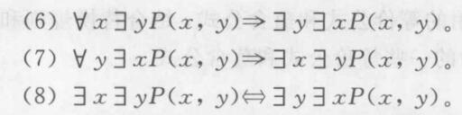
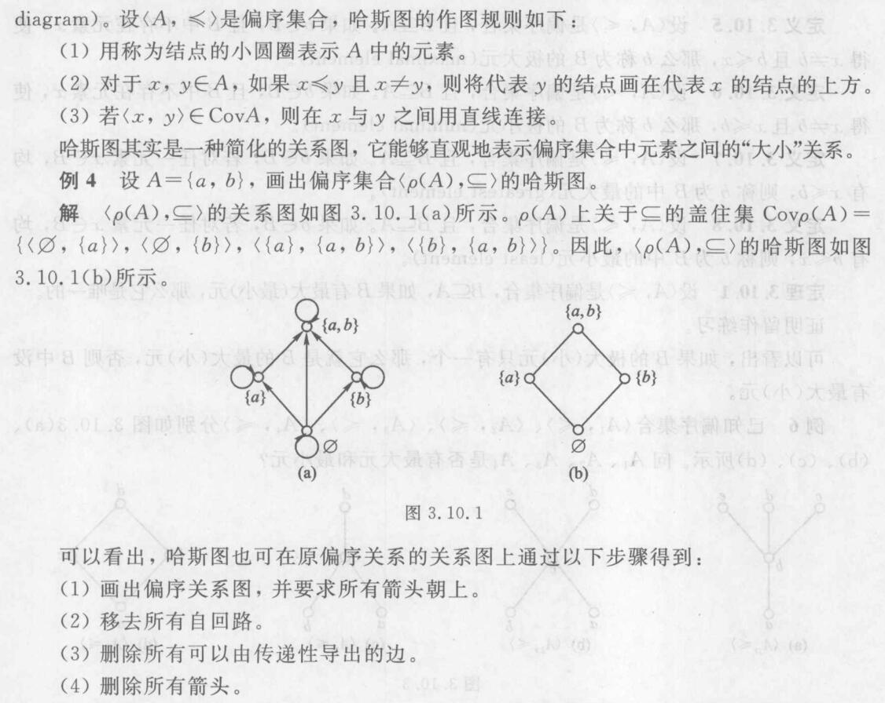

## 命题逻辑

### 联结词

1. 否定联结词

|   $P$   |  $\neg P$  |
|  :----:  | :----:  |
| 0 | 1 |
| 1  | 0 |

2. 合取联结词

|   $P$   | $Q$ |  $P\wedge V$  |
|  :-:  | :-: | :-: |
| 0 | 0 | 0 |
| 0 | 1 | 0 |
| 1 | 0 | 0 |
| 1 | 1 | 1 |

3. 析取联结词

|   $P$   | $Q$ |  $P\vee V$  |
|  :-:  | :-: | :-: |
| 0 | 0 | 0 |
| 0 | 1 | 1 |
| 1 | 0 | 1 |
| 1 | 1 | 1 |

4. 条件联结词

|   $P$   | $Q$ |  $P\to V$  |
|  :-:  | :-: | :-: |
| 0 | 0 | 1 |
| 0 | 1 | 1 |
| 1 | 0 | 0 |
| 1 | 1 | 1 |

5. 双条件联结词

|   $P$   | $Q$ |  $P\leftrightarrow V$  |
|  :-:  | :-: | :-: |
| 0 | 0 | 1 |
| 0 | 1 | 0 |
| 1 | 0 | 0 |
| 1 | 1 | 1 |

#### 联结词的运算优先级

TODO: 联结词的运算优先级

### 命题公式

#### 一些定义

**定义1，命题变元与常元**

用于代表取值为真$(T、1)$或假$(F、0)$之一的变量，称为命题变元，通常用大写字母或带下标或上标的大写字母表示，如$P、Q、R、P_1、P_2$等。将$T$和$F$称为命题常元。

通常把由命题常元、命题变元、联结词以及括弧组成的式子称为表达式,但是只有按照特定组合规则所形成的表达式才有实际意义。

**定义2，命题公式**

命题合式公式(简称命题公式):

(1)(基础)单个命题常元或命题变元是命题合式公式

(2)(归纳)如果A和B是命题公式,则$\neg A$、$(A\wedge B)$、$(A\vee B)$、$(A\to B)$、$(A\leftrightarrow B)$是命题合式公式。

(3)(极小性)只有有限次地应用条款(1)和(2)生成的表达式オ是命题合式公式

**定义3，子公式**

若$B$是命题公式$A$的一个连续段且$B$也是命题公式,则称$B$是$A$的个子公式。

#### 命题公式的赋值

对于有$n$个变元的公式，有$2^n$种不同赋值。

**永真式（重言式）**

一个命题公式在任何赋值下，其真值都为$T$，则称这个公式为永真式（重言式）

**永假式（矛盾式）**

一个命题公式在任何赋值下，其真值都为$F$，则称这个公式为永假式（矛盾式）

**偶然式**

既不是永真式也不是永假式，则为偶然式

**可满足式**

一个命题公式至少有一个赋值，使其真值为$T$，则称这个公式为可满足式。也即永真式和偶然式都是可满足式。不是可满足式的称为矛盾式。

### 逻辑等价与蕴含

#### 等价

**定义**

给定两个命题公式$A$和$B4$,设$P_1,P_2,\cdots,P_n$为所有出现在A和B中的命题变元，但$P_i$不一定在$A$和$B$中同时出现，若对于$P_1,P_2,\cdots,P_n$的任一赋值,$A$和$B$的真值都相同，则称$A$和$B$逻辑等价，记做$A\Leftrightarrow B$,读做“$A$等价于$B$”。

下面列出常见的命题等价公式

几个定理

**定理1（代入规则）**

设$A$、$B$是命题公式，其中$A$是重言式，$P$是$A$中的命题变元，如果将$A$中每一处出现的P均用B代入，则所得命题公式$A$仍然是一个重言式

**定理2**

设$A$、$B$是命题公式，则$A$和$B$逻辑等价,当且仅当$A\leftrightarrow B$是一个重言式。

**定理3（替换规则）**

设$A$、$X$、$Y$是命题公式，$X$是$A$的子公式,且有$X\Leftrightarrow Y$。如果将$A$中的$X$用$Y$来替换(不必每一处都替换)，则所得到的公式$B$与$A$等价,即$B\Leftrightarrow A$。

**定理4（传递规则）**

设$A$、$B$、$C$是命题公式，若$A\Leftrightarrow B$且$B\Leftrightarrow C$,则有$A\Leftrightarrow C$。

#### 蕴含

设$A$、$B$是命题公式，如果$A\to B$是一个重言式,则称$A$蕴含$B$,记做$A\to B$。

一些常见的蕴含公式

几个定理

**定理1**

设$A$和$B$是任意两个命题公式，$A\Leftrightarrow B$当且仅当$A\Rightarrow B$且$B\Rightarrow A$.

几个性质

**性质1**

设$A$、$B$是命题公式，如果$A\Rightarrow B$且$A$是重言式，则$B$也是重言式

**性质2**

蕴含关系是传递的，即$A\Rightarrow B$且$B\Rightarrow C$，则$A\Rightarrow C$.

**性质3**

如果$A\Rightarrow B$且$A\Rightarrow C$，则$A\Rightarrow B\wedge C$

**性质4**

如果$A\Rightarrow C$且$B\Rightarrow C$，则$A\vee B\Rightarrow C$

### 对偶式

**定义**

设有命题公式$A$，其中仅含有联结词$\neg,\vee,\wedge$，如果将$A$中的$\vee$替换为$\wedge$，$\wedge$替换为$\vee$，常元$T,F$也互相替换，所得到的公式记为$A^*$，则称$A^*$为$A$的对偶式。

显然有，$A$也是$A^*$的对偶式，并且$(A^*)^*=A$

几个定理

**定理1**

设$A$和$A^*$是对偶公式，其中仅含有联结词$\neg,\vee,\wedge$；$P_1,P_2,\cdots,P_n$是出现在$A$和$A^*$中的所有命题变元，于是有

$$
\neg A(P_1,P_2,\cdots,P_n)\Leftrightarrow A^*(\neg P_1,\neg P_2,\cdots,\neg P_n)
$$

$$
A(\neg P_1,\neg P_2,\cdots,\neg P_n)\Leftrightarrow\neg A^*(P_1,P_2,\cdots,P_n)
$$

**定理2**

设$A,B$是命题公式，则有

1. 如果$A\Leftrightarrow B$，则$A^*\Leftrightarrow B^*$
2. 如果$A\Rightarrow B$，则$B^*\Rightarrow A^*$

### 范式

#### 析取范式和合取范式

**析取式**

仅由若干命题变元和若干命题变元之否定通过联结词$\vee$构成的命题公式。

**合取式**

仅由若干命题变元和若干命题变元之否定通过联结词$\wedge$构成的命题公式。

**析取范式**

一个命题公式被称为析取范式，当且仅当它具有如下形式

$$
A_1\vee A_2\vee\cdots\vee A_n
$$

其中$A_1,A_2,\cdots,A_n$是合取式。

**合取范式**

一个命题公式被称为合取范式，当且仅当它具有如下形式

$$
A_1\wedge A_2\wedge\cdots\wedge A_n
$$

其中$A_1,A_2,\cdots,A_n$是析取式。

#### 主析取范式

**极小项**

一个含$n$个命题变元的合取式，如果其中每个变元和其否定不同时存在，但两者之一必须出现且仅出现一次，则称改合取式为极小项。

$n$个命题变元$P_1,P_2,\cdots,P_n$可构成$2^n$个不同的极小项，其形式为：

$$
\tilde{P_1}\wedge \tilde{P_2}\wedge\cdots\wedge \tilde{P_n}
$$

其中$\tilde{P_i}$或者是$P_i$，或者是$\neg P_i$

可以用$n$位二进制编码表示极小项，例如

$$
m_{010}=\neg P_1\wedge P_2\wedge\neg P_3
$$

有如下三个性质：

1. 每一个极小项当其编码与赋值相同时，其真值为$T$，在其余$2^n-1$种赋值下其真值均为$F$.
2. 任意两个不同的极小项的合取式永假。
3. 所有极小项的析取式永真。

**主析取范式**

设$P_1,P_2,\cdots,P_n$是命题公式$A$中包含的所有命题变元，若由$P_1,P_2,\cdots,P_n$的若干极小项析取所构成的析取范式与$A$等价，则称该析取范式是$A$的主析取范式。

有如下定理

**定理1**

在一个命题公式$A$的真值表中，使$A$的真值为$T$的所有赋值所对应的极小项构成的析取范式即为$A$的主析取范式。

#### 主合取范式

**极大项**

一个含$n$个命题变元的析取式，如果其中每个变元和其否定不同时存在，但两者之一必须出现且仅出现一次，则称改合取式为极大项。

$n$个命题变元$P_1,P_2,\cdots,P_n$可构成$2^n$个不同的极小项，其形式为：

$$
\tilde{P_1}\vee \tilde{P_2}\vee\cdots\vee \tilde{P_n}
$$

其中$\tilde{P_i}$或者是$P_i$，或者是$\neg P_i$

可以用$n$位二进制编码表示极大项，例如

$$
M_{101}=\neg P_1\vee P_2\vee\neg P_3
$$

（编码注意与极小项意义相反）

有如下三个性质：

1. 每一个极大项当其真值赋值与编码相同时，其真值为$F$，在其余$2^n-1$种赋值下其真值均为$T$.
2. 任意两个不同的极大项的析取式永真。
3. 所有极大项的合取式永假。

**主析取范式**

设$P_1,P_2,\cdots,P_n$是命题公式$A$中包含的所有命题变元，若由$P_1,P_2,\cdots,P_n$的若干极大项合取所构成的合取范式与$A$等价，则称该合取范式是$A$的主合取范式。

有如下定理

**定理1**

在一个命题公式$A$的真值表中，使$A$的真值为$F$的所有赋值所对应的极大项构成的合取范式即为$A$的主合取范式。

**定理**

设$A$的主析取范式的各个极小项的下标转为十进制，组成的集合为$S_1\{i_1,i_2,\cdots,i_k\}$；主合取范式的各个极大项的下标转为十进制，组成的集合为$S_2=\{j_1,j_2,\cdots,j_t\}$，则有

$$
S_1\cap S_2=\phi
$$

$$
S_1\cup S_2=\{0,1,2,\cdots,2^n-1\}
$$

#### 范式的计算

除了可以用真值表来算，还可以通过德摩根定律等将“$\to$”等不是析取、合取、否定的联结词转化，直到只剩析取、合取、否定。再通过添加、删除括号转化为主合取范式或主析取范式。

### 命题逻辑的推理理论

#### 推理规则

1. P规则：在推导过程中，前提可以在任何步骤引入。
2. T规则：在推导过程中，如果由已经推出的一个或多个公式蕴含$S$，则公式$S$可以引入到推导过程中。

#### 证明方法

1. 无义证明法。如果能证明$P$恒为假，则有$P\to Q$恒为真，即$P\Rightarrow Q$
2. 平凡证明法。如果能证明$Q$恒为真，则有$P\to Q$恒为真，即$P\Rightarrow Q$
3. 直接证明法。从一组前提出发，利用公认的推理规则，逻辑演绎得到有效结论。
4. 归谬法（即反证法）。

**定理**

$H_1,H_2,\cdots,H_m,C$是公式，如果存在公式$R$，使得$H_1,H_2,\cdots,H_m,\neg C\Rightarrow R\wedge\neg R$，则有$H_1,H_2,\cdots,H_m\Rightarrow C$

5. CP规则法。

$H_1,H_2,\cdots,H_n,R,C$是命题公式，根据输出律$E_{22}$推知

$$
(H_1\wedge H_2\wedge\cdots\wedge H_n)\to(R\to C)\Leftrightarrow(H_1\wedge H_2\wedge\cdots\wedge H_n\wedge R)\to C
$$

因此，如果能够证明$H_1,H_2,\cdots,H_n,R\Rightarrow C$，则有$H_1,H_2,\cdots,H_n\Rightarrow R\to C$

## 谓词逻辑

### 谓词和量词

#### 谓词

刻画单个个体的特性或者多个个体间关系的模式称为谓词。

#### 量词

1. 全称量词$\forall$
2. 存在量词$\exist$

**几个规则**

应当使用$\forall x(H(x)\to D(x))$，而不能表示为$\forall x(H(x)\wedge D(x))$。

应当使用$\exist x(H(x)\wedge D(x))$，而不能表示为$\exist x(H(x)\to D(x))$。

### 谓词公式

**定义**

谓词逻辑的合式公式（简称谓词公式）可由以下步骤生成
1. 原子公式（不出现联结词和量词的单个谓词）是谓词公式。
2. 如果$A$和$B$是谓词公式，则$\neg A,(A\wedge B),(A\vee B),(A\to B),(A\leftrightarrow B)$是谓词公式
3. 如果$A$是谓词公式，并且$A$中有未被量化的个体变元$x$，则$\forall xA(x)$和$\exist xA(x)$是谓词公式。
4. 只有有限次应用步骤1、2、3所得到的的公式才是谓词公式。

**子公式**

若$B$是谓词公式$A$的一个连续段且$B$也是谓词公式，则称$B$是$A$的一个子公式。

**辖域**

紧跟$\forall x$和$\exist x$之后的最小的子公式称为该量词的辖域。

**约束变元**

在$\forall x$和$\exist x$辖域内$x$的一切出现称之为约束出现，这个$x$叫做约束变元。

**自由变元**

个体变元的非约束出现称为自由出现，自由出现的个体变元称为自由变元。

**约束变元的换名规则**

1. 对某个约束变元换名时，需对量词的作用变元以及该量词辖域内所有受该量词约束的约束变元一起换名。
2. 换名后的变元符号应是量词辖域内未出现的符号，最好是整个公式中未出现的符号。

### 谓词验算的永真公式

#### 谓词公式的赋值

**定义1**

对于一个谓词公式，若给它指定一个个体域$E$，再给所有谓词符均指派出确定的关系(具体的特性或关系)，给所有命题变元指派出确定命题(或者指定$T$或$F$)，并为所有自由变元（注意不包含约束变元）分别指派$E$上确定的个体，则称为对谓词公式的一个赋值(指派或结识)。谓词公式经过赋值之后就变成了具有确定真值的命题。

**定义2**

设$A$是谓词公式，如果对于特定论域$E$上的任何赋值，$A$的真值都为真，则称谓词公式$A$在$E$上永真;如果对于特定论域$E$上的任何赋值，$A$的真值都为假，则称谓词公式$A$在$E$上永假;若特定论域$E$上存在一种赋值，使得$A$的真值都为真，则称谓词公式$A$在$E$上可满足。

**定义3**

设$A$是谓词公式，如果对于任何赋值，$A$的真值都为真，则称谓词公式$A$是永真式;如果对于任何赋值，$A$的真值都为假，则称谓词公式$A$是永假式;若存在一种赋值，使得$A$的真值为真，则称谓词公式$A$是可满足式。

#### 谓词演算的基本永真式

1. 命题逻辑的等价式和蕴含式可在谓词逻辑中推广使用
2. 量词的否定律

$$
\neg\forall xP(x)\Leftrightarrow \exist x\neg P(x)
$$

$$
\neg\exist xP(x)\Leftrightarrow \forall x\neg P(x)
$$

3. 量词辖域的扩张与收缩律

4. 量词的分配律

5. 多重量词律

6. 其他

$\forall xP(x)\Rightarrow P(y)$，$y$是论域中的任一确定个体。

$P(y)\Rightarrow\exist xP(x)$，$y$是论域中的某个确定个体。

$\forall xP(x)\Rightarrow\exist xP(x)$

### 谓词逻辑的推理理论

1. 存在指定原则（ES）

$$
\frac{\exist xP(x)}{\therefore P(a)}
$$

$a$是个体常元，注意所指定的个体常元要使得谓词为真。

2. 全称指定原则（US）

$$
\frac{\forall xP(x)}{\therefore P(y)}
$$

$y$是自由变元，也可以指定到个体常元$a$

$$
\frac{\forall xP(x)}{\therefore P(a)}
$$

注意如果同时指定$\exist xP(x)$和$\forall xQ(x)$，应当先指定$Q(a)$，再指定$P(a)$，才能保证两者都为真。

3. 存在推广原则（EG）

$$
\frac{P(a)}{\therefore\exist xP(x) }
$$

4. 全称推广原则（UG）

$$
\frac{\Gamma\Rightarrow P(x)}{\therefore\Gamma\Rightarrow\forall xP(x)}
$$

$\Gamma$是已知公理和前提的合取，$\Gamma$中没有自由变元$x$的出现。

## 集合

### 集合的表示方法

1. 列举法
2. 描述法：用自然语言或谓词描述集合中元素的共同特征。
3. 归纳定义法（见后）

### 集合间的关系

**外延性公理**

两个集合$A,B$相等，记为$A=B$，当且仅当它们有相同的元素，即

$$
A=B\Leftrightarrow \forall x(x\in A\leftrightarrow x\in B)
$$

两个集合不相等，通常记为$A\neq B$

**子集**

设$A、B$是任意的两个集合，若集合$A$的每个元素都是集合$B$的元素，则称$A$为$B$的子集或称$B$包含$A$,记为$A\subseteq B$或$B\supseteq A$，用逻辑公式表示为

$$
A\subseteq B\Leftrightarrow\forall x(x\in A\to x\in B)
$$

如果$A$不是$B$的子集，通常记为$A\nsubseteq B$

**真子集**

如果集合$A$的每一个元素都属于$B$，但集合$B$中至少有一个元素不属于$A$，则称$A$为$B$的真子集，记为$A\subset B$，用逻辑公式表示为

$$
A\subset B\Leftrightarrow\forall x(x\in A\to x\in B)\wedge \exist y(y\in B\wedge y\notin A)\Leftrightarrow(A\subseteq B)\wedge(A\neq B)
$$

**全集**

在一定范围内所有事物组成的集合称为该范围内的全集记为$U$，用逻辑公式表示为

$$
U = \{x|P(x)\vee\neg P(x)\}
$$

其中，$P(x)$是任意的谓词

**空集**

不含任何元素的集合称为空集，记为$\phi$，用逻辑公式表示为

$$
\phi = \{x|P(x)\wedge\neg P(x)\}
$$

其中，$P(x)$是任意的谓词，并且显然有$|\phi|=0$

几个定理

**定理1**

空集是任一集合的子集，并且是任何非空集合的真子集。

**定理2**

设$A,B,C$是集合，若$A\subseteq B$且$B\subseteq C$，则$A\subseteq C$。

**定理3**

集合$A,B$相等的充要条件是$A,B$互为子集。

**定理3.1**

对于任何集合$A$，有$A\subseteq A$

**定理4**

空集是唯一的。

### 集合的运算

**集合的交，交集**

$$
A\cap B = \{x|x\in A\wedge x\in B\}
$$

**集合的并，并集**

$$
A\cup B = \{x|x\in A\vee x\in B\}
$$

**集合的差，相对补集**

$$
A-B=\{x|x\in A\wedge x\notin B\}
$$

**集合的补，绝对补集**

$$
\bar{A}=U-A=\{x|x\in U\wedge x\notin A\}
$$

**集合的对称差**

$$
A\oplus B=(A-B)\cup(B-A)=\{x|(x\in A\wedge x\notin B)\vee(x\in B\wedge x\notin A)\}
$$

**集合的环积**

$$
A\otimes B=\overline{A\oplus B}=(A\cap B)\cup(\bar{A}\cap\bar{B})=\{x|(x\in A\wedge x\in B)\vee(x\notin A\wedge x\notin B)\}
$$

满足如下运算律

**幂集**

给定集合$A$，由$A$所有子集为元素构成的集合，称为$A$的幂集，记作$\rho(A)$。若$|A|=n$，则有$|\rho(A)=2^n|$

### 容斥原理

**定理1**

设$A_1,A_2$是有限集合，其元素个数分别为$|A_1|,|A_2|$，则$|A_1\cup A_2|=|A_1|+|A_2|-|A_1\cap A_2|$

**容斥原理**

将上式推广，得

$$
|A_1\cup A_2\cup\cdots\cup A_n|=\sum_{i=1}^n|A-i|-\sum_{1\leq i<j\leq n}|A_i\cap A_j|+\\
\sum_{1\leq i<j<k\leq n}|A_i\cap A_j\cap A_k|-\cdots+(-1)^{n+1}|A_1\cap A_2\cap\cdots\cap A_n|
$$

### 归纳证明

#### 集合的归纳定义

1. 基础条款：指出某些事物属于$S$，其功能是给集合$S$指定初始元素使其不为空。
2. 归纳条款：指出由集合$S$中的已有元素构造新元素的办法。
3. 极小性条款：断言一个事物除非能有限次应用基础条款和归纳条款构成，否则它不在集合$S$中。

#### 归纳法证明

1. 基础步骤。对于基础条款中的指定的每个初始元素$t$，证明命题$P(t)$为真。
2. 归纳步骤。证明如果事物$x,y,\cdots$有$P$性质，那么用归纳条款指定的方法组合它们所得的新元素也具有性质$P$

#### 数学归纳法

**第一原理**

1. （归纳基础）证明$P(0)$为真（可以用任何办法）
2. （归纳假设）任取$n(n\ge0)$，假设$P(n)$为真。
3. （归纳推理）由$P(n)$为真，推出$P(n+1)$也为真。

**第二原理**

1. （归纳基础）证明$P(0)$为真（可以用任何办法）
2. （归纳假设）假设对任意的$n<k$，均有$P(k)$为真。
3. （归纳推理）证明$P(n)$也为真。

### 集合的笛卡尔积

**序偶**

两个元素$a$和$b$组成的具有固定次序的序列称为序偶或二元组，记为$<a,b>$。对于序偶$<a,b>$，$a$称为第$1$元素，$b$称为第$2$元素。

**序偶的相等**

两个序偶$<a,b>$和$<c,d>$相等，记为$<a,b>=<c,d>$，当且仅当$a=c$且$b=d$。

**笛卡尔积（叉积）**

$$
A\times B=\{<a,b>|a\in A,b\in B\}
$$

对于多个集合，有

$$
A_1\times A_2\times\cdots\times A_n=\{<a_1,a_2, \cdots,a_n>|a_i\in A_i,1\leq i\leq n\}
$$

其中$A\times A\times\cdots\times A$（$n$个）可以记作$A^n$

规定$<a_1,a_2, \cdots,a_n>=<<a_1,a_2, \cdots,a_{n-1}>,a_n>$，而不等于$<a_1,<a_2, \cdots,a_n>>$等等其他序偶。

关于笛卡尔积有如下定理

**定理1**

1. $A\times(B\cup C)=(A\times B)\cup(A\times C)$
2. $A\times(B\cap C)=(A\times B)\cap(A\times C)$
3. $(A\cup B)\times C=(A\times C)\cup(B\times C)$
4. $(A\cap B)\times C=(A\times C)\cap(B\times C)$

**定理2**

如果$A_i(i=1,2,\cdots,n)$都是有限集合，那么

$$
|A_1\times A_2\times\cdots\times A_n|=|A_1|\cdot|A_2|\cdot\cdots\cdot|A_n|
$$

### 二元关系

#### 关系的定义

两个集合$A$和$B$的笛卡儿积$A\times B$的任一子集$R$,称为集合$A$到$B$上的二元关系。二元关系$R$是由序偶构成的集合，若$<x,y>\in R$，则称$x$与$y$有$R$关系，也记为$xRy$;否则,$<x,y>\notin R$，称$x$与$y$没有$R$关系，也记为$x\cancel{R}y$。

设$R$是集合$A$到$B$的二元关系。集合$A$称为$R$的前域，集合$B$称为$R$的陪域。集合$\{x|(\exist y)(<x,y>\in R)\}$称为$R$的定义域，记为$domR$。集合$\{y|(\exist x)(<x,y>)\in R)\}$称为$R$的值域，记为$ranR$。显然, $domR\subseteq A$和$ranR\subseteq B$。

#### 关系的表示

1. 关系矩阵

$$
r_{ij}=
\left\{\begin{matrix}
1, if<a_i,b_j>\in R\\
0, if<a_i,b_j>\notin R
\end{matrix}\right.
$$

2. 关系图

#### 关系的运算

所有集合的运算对于二元关系同样适用。

**复合运算**

设$R$为集合$A$到$B$的二元关系，$S$为$B$到$C$的二元关系，令

$$
R\circ S=\{<a,c>|a\in A\wedge c\in C\wedge(\exist b)(b\in B\wedge<a,b>\in R\wedge <b,c>\in S)\}
$$

称$R\circ S$为$R$与$S$的复合关系。

复合运算可以通过关系的矩阵的运算来实现

$$
\bm{M}_{R\circ S}=\bm{M}_R\odot\bm{M}_S
$$

其中$\odot$是布尔乘法运算，$c_{ij}=\bigvee_{k=1}^{n}(a_{ik}\wedge b_{kj})$

复合运算有如下定理

**定理1**

$(R\circ S)\circ T=R\circ(S\circ T)$

**关系的逆，逆关系**

$$
R^{-1}=\{<b,a>|<a,b>\in R\}
$$

关系矩阵即为原矩阵的转置

关系图即将箭头反向

有如下定理

**定理1**

1. $(R^{-1})^{-1}=R$
2. $(R_1\cup R_2)^{-1}=R_1^{-1}\cup R_2^{-1}$
3. $(R_1\cap R_2)^{-1}=R_1^{-1}\cap R_2^{-1}$
4. $(\overline{R})^{-1}=\overline{R^{-1}}$，其中$\overline{R}=(A\times B)-R$，$\overline{R^{-1}}=(B\times A)-R^{-1}$。
5. $(R_1-R_2)^{-1}=R_1^{-1}-R_2^{-1}$

**定理2**

$$
(R\circ S)^{-1}=S^{-1}\circ R^{-1}
$$

### 集合上的二元关系及其特性

#### 集合上的二元关系

集合$A$与$A$的笛卡尔积$A\times A$的子集称为$A$上的二元关系。

**相等关系**

$$
I_A=\{<a,a>|a\in A\}
$$

**$R$的幂次**

设$R$是$A$上的二元关系，$n\in Z^+$，称$R\circ R\circ\cdots\circ R$(n个)为$R$的$n$次幂。记为$R^n$

约定$R^0=I_A$

有如下定理

**定理1**

1. $R^m\circ R^n=R^{m+n}$
2. $(R^m)^n=R^{mn}$

**定理2**

设存在$i,j\in R$，使得$R^i=R^j$，则有

1. 对任意$k\ge 0, R^{i+k}=R^{j+k}$
2. 对任意$k,m\ge 0, R^{i+md+k}=R^{i+k}$，其中$d=j-i$
3. 记$S=\{R_0,R^1,\cdots,R^{j-1}\}$，对于任意$n\in N$，均有$R^n\in S$

#### 二元关系的特性

1. 自反性。对于$A$中的每个元素$a$，都有$aRa$，则称$R$在$A$上是自反的。
2. 反自反性。对于$A$中的每个元素$a$，都有$a\cancel{R}a$。空集上的空关系即是自反的也是反自反的。
3. 对称性。对于任意$a,b\in A$，若有$aRb$，则必有$bRa$。
4. 反对称性。对于任意$a,b\in A$，若有$aRb$且$bRa$，则必有$a=b$。若关系图上只有零个或多个自回路，则既是对称的，又是反对称的。
5. 传递性。对于任意$a,b,c\in A$，若$aRb,bRc$则必有$aRc$。

### 关系的闭包运算

设$R$是集合$A$上的二元关系，如果$A$上另外一个二元关系$R'$满足：
1. $R'$是自反的（对称的，传递的）
2. $R'\subseteq R$
3. 对于$A$上任何自反的（对称的，传递的）关系$R''$，若$R''\subseteq R$，有$R''\subseteq R'$，则称$R'$是$R$的自反（对称，传递）闭包，记为$r(R)(s(R),t(R))$。

有如下定理

**定理1**

1. $R$是自反的当且仅当$r(R)=R$
2. $R$是对称的当且仅当$s(R)=R$
3. $R$是传递的当且仅当$t(R)=R$

**定理2**

1. $r(R)=R\cup I_A$
2. $s(R)=R\cup R^{-1}$
3. $t(R)=\bigcup_{i=1}^{\infty}R^i$

**定理3**

假设$|A|=n$，那么$t(R)=\bigcup_{i=1}^{n}R^i$

**定理4**

1. 如果$R$是自反的，那么$s(R),t(R)$也是自反的。
2. 如果$R$是对称的，那么$r(R),t(R)$也是对称的。
3. 如果$R$是传递的，那么$r(R)$也是传递的。

**定理5**

1. $sr(R)=rs(R)$，（$sr(R)=s(r(R))$以下运算顺序相同）。
2. $tr(R)=rt(R)$
3. $ts(R)\subseteq st(R)$

### 等价关系

#### 集合的划分

给定非空集合$A$和集合簇$\pi=\{A_1,A_2,\cdots,A_m\}$，如果

1. $A_i\subseteq A$且$A_i\neq\phi$
2. $A=\bigcup_{i=1}^{m}A_i$
3. $A_i\cap A_j=\phi, i\neq j$

那么称$\pi$是$A$的一个划分，若$\pi$满足1.2.则称$\pi$是$A$的一个覆盖。

#### 等价关系和等价类

**等价关系**

$R$是$A$上的二元关系，若$R$是自反的、对称的、传递的，则称$R$是等价关系。

**等价类**

设$R$是非空集合$A$上的等价关系，对于任意$a\in A$，称集合$[a]_R=\{x|x\in A,xRa\}$为$a$关于$R$的等价类，$a$称为等价类$[a]_R$的代表元素。如果等价类个数有限，则$R$的不同等价类的个数叫做$R$的秩，否则秩是无限的。

有如下定理

**定理1**

设$R$是非空集合$A$上的等价关系，对于$a,b\in A$有$aRb$，当且仅当$[a]_R=[b]_R$

**商集**

设$R$是集合$A$上的等价关系，由$R$确定的所有等价类组成的集合，称为集合$A$上关于$R$的商集，记为$A/R$

$$
A/R = \{[x]_R|x\in A\}
$$

有如下定理

**定理1**

1. 任取$x\in A$，$[x]_R\neq\phi$
2. 任取$x,y\in A$，要么$[x]_R=[y]_R$，要么$[x]_R\cap[y]_R=\phi$
3. $\bigcup_{x\in A}[x]_R=A$

**定理2**

设$\pi$是非空集合$A$的一个划分，则$A$上的二元关系$R=\bigcup_{B\in\pi} B\times B$是$A$上的等价关系（称为由划分$\pi$诱导的$A$上的等价关系）。

**定理3**

设$R_1$和$R_1$是非空集合$A$上的等价关系，则$R_1=R_2\Leftrightarrow A/R_1=A/R_2$

**定理4**

设$R$是非空集合$A$上的任意一个等价关系,$\pi$是$A$的任意一个划分，那么$R$诱导出$\pi$当且仅当$\pi$诱导出$R$。即说明等价关系和集合的划分是一一对应的。

### 序关系

#### 偏序集合的概念与表示

**偏序**

如果$A$上的关系$R$是自反的，反对称的和传递的，那么$R$是$A$上的偏序，通常用符号$\preceq$表示，称序偶$<A,\preceq>$为偏序集合。通常用$x\prec y$表示$x\preceq y$且$x\neq y$

**可比与不可比**

在偏序集合$<A,\preceq>$中，对于元素$a,b\in A$，如果$a\preceq b$或者$b\preceq a$，那么称$a$或$b$是可比的，否则不可比的。

**盖住**

在偏序集合$<A,\preceq>$中，对于$x,y\in A$，如果$x\prec y$且没有其他元素$z\in A$满足$x\prec z\prec y$，则称$y$盖住$x$

**哈斯图**

**链**

设$<A,\preceq>$是一个偏序集合，$B\subseteq A$。如果$B$中的任意两个元素都是可比的，那么称$B$为$<A，\preceq>$中的链，$B$中元素的个数称为该链的长度。如果$B$中的任意两个不同的元素都是不可比的，那么称$B$为$<A，\preceq>$中的反链。

#### 偏序集合中的特殊元素

**极大元**

设$<A，\preceq>$是偏序集合，且$B\subseteq A$。如果$b\in B$，且$B$中不存在元素$x$，使得$x\neq b$且$b\preceq x$，那么$b$称为$B$的极大元。

**极小元**

设$<A，\preceq>$是偏序集合，且$B\subseteq A$。如果$b\in B$，且$B$中不存在元素$x$，使得$x\neq b$且$x\preceq b$，那么$b$称为$B$的极大元。

**最大元**

设$<A，\preceq>$是偏序集合，且$B\subseteq A$。如果$b\in B$，对于任意元素$x\in B$，均有$x\preceq b$，那么$b$称为$B$的最大元。

**最小元**

设$<A，\preceq>$是偏序集合，且$B\subseteq A$。如果$b\in B$，对于任意元素$x\in B$，均有$b\preceq x$，那么$b$称为$B$的最小元。

又如下定理

**定理1**

设$<A，\preceq>$是偏序集合，且$B\subseteq A$。如果$B$有最大（最小元），那么它是唯一的。

**上界**

设$<A，\preceq>$是偏序集合，且$B\subseteq A$。如果$a\in A$，对于任意元素$x\in B$，均有$b\preceq a$，那么$a$称为$B$的上界。

**下界**

设$<A，\preceq>$是偏序集合，且$B\subseteq A$。如果$a\in A$，对于任意元素$x\in B$，均有$a\preceq b$，那么$a$称为$B$的下界。

**最小上界（上确界）**

设$<A，\preceq>$是偏序集合，且$B\subseteq A$。$a$为$B$的上界，若对$B$的任意上界$a'$均有$a\preceq a'$，则称$a$为$B$的最小上界或上确界。

**最大下界（下确界）**

设$<A，\preceq>$是偏序集合，且$B\subseteq A$。$a$为$B$的下界，若对$B$的任意下界$a'$均有$a'\preceq a$，则称$a$为$B$的最大下界或下确界。

有如下定理

**定理1**

若$B$有最小上界（最大下界），那么它是唯一的。

