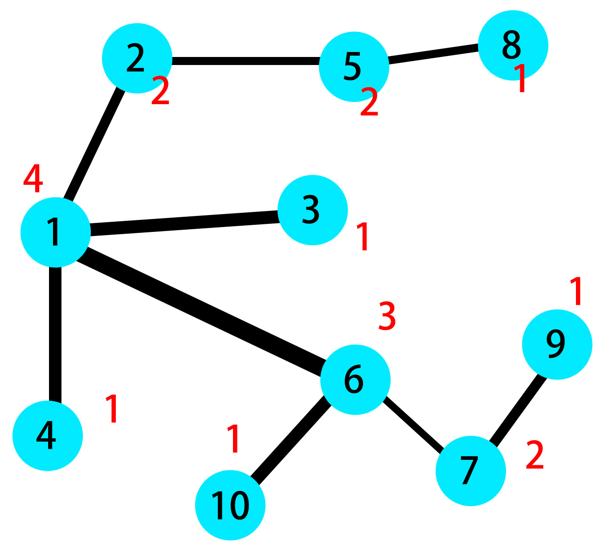
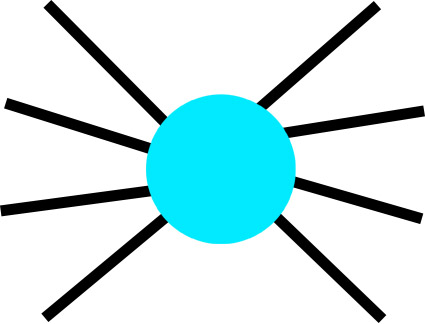
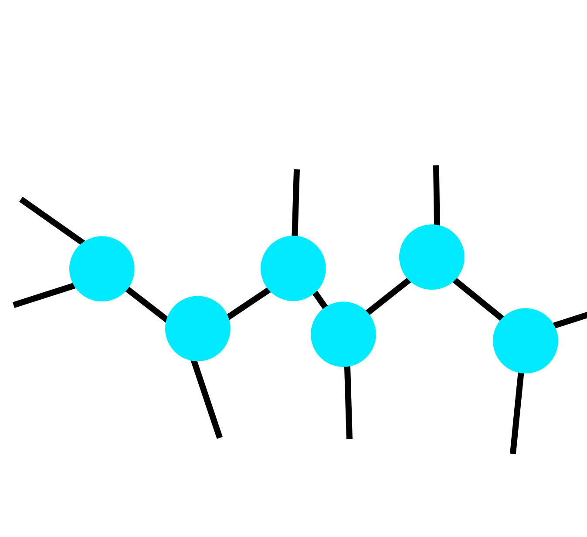

# 网络设备管理

## 题目描述

​	叮叮叮！网络设备管理员欢欢在行动

​	欢欢就职于一家庞大的数据管理分析公司 

​	公司有一个存储数据的庞大网络，把每个数据存储器看做一个节点，这个存储网络可以看做是一个树型结构，每天有庞大的数据流在节点之间穿梭

​	随着公司的发展，这个网络越来越庞大，数据的传输速度也越来越慢，通过研究，欢欢发现，每个节点的传输速度，只与与这个节点连接的节点数量有关，比如仅和一个节点连接的节点传输数据会很快，而和 100 个节点连接的节点传输数据会很慢

​	欢欢准备提交一份研究报告，报告将会指出，若对于网络中的所有节点，与该节点相连的节点数量不超过 d，那么网络的整体传输速度将会大幅提高。

​	欢欢准备通过添加新的网络设备来降低与某节点相连的节点的数量

​	简而言之，对于网络设备a，我们可以添加新的设备b，使得原来与a相连的若干节点断开与a的连接并与b连接，并且使a,b连接，显然，添加新的网络设备后，这个网络仍旧是一个树形结构这样通过添加若干新的网络设备，我们可以把所有网络设备的相连网络设备数量降低到不超过d台 (包括与新添加的网络设备相接的网络设备数量不超过 d)

​	欢欢发现，有很多种解决方案

​	聪明的你知道欢欢最少添加多少台网络设备吗？

​	注意: 欢欢添加新的设备后，网络的结构仍保持为树形结构


### 输入

​	单组输入
​	第一行两个正整数 $n$, $d$ $(1\le n\le 10^5,3\le d\le n)$
​	接下来$n-1$行，每行两个正整数$a$，$b$ $(1\le a, b\le n)$，说明设备$a$与设备$b$相连接，数据保证设备网络为树形结构。

### 输出

​	一个正整数，最小添加的网络设备数量，注意欢欢可以添加0台设备。

### 样例


| 样例输入                                                     | 样例输出 |
| ------------------------------------------------------------ | -------- |
| 10 3<br/>2 1<br/>3 1<br/>4 1<br/>5 2<br/>6 1<br/>7 6<br/>8 5<br/>9 7<br/>10 6 | 1        |

## AC代码

```c++
#include <iostream>
#define MAXN 100005

using namespace std;

int arr[MAXN];

int main(){
    int n,d;
    cin>>n>>d;
    for(int i=1;i<n;i++){
        int a,b;
        scanf("%d%d",&a,&b);
        arr[a]+=1;
        arr[b]+=1;
    }
    int ans=0;
    for(int i=1;i<=n;i++){
        if(arr[i]>d){
            int tmp = (d-1)*2;
            if(arr[i]-tmp<=0){
                ans+=1;
            }
            else if((arr[i]-tmp)%(d-2)==0)
                ans += 1 + (arr[i]-tmp)/(d-2); 
            else
                ans += 1 + (arr[i]-tmp)/(d-2)+1; 
        }
    }
    cout<<ans;
    return 0;
}


```

## 正确性证明

先给出样例的示意图



其中红色数字表示与这个节点直接相连的节点的个数。显然只有1号节点连了大于3个节点，我们可以新增一个节点A，将2、3号与A相连，4、6号不变，然后将1与A相连，现在1与A连了三个节点，符合要求。不过这不是唯一的连法。


这种有最大连接节点的结构，很容易让人回想起烷烃。显然的，饱和烷烃的碳链无论怎么排布，所连的氢原子的数目不会改变。每个碳原子也都会连四个原子。


类比到这道题，我们要做的，就是将形如下图的点（假设上限为连3个）



变为如下的一些点，当然这里的点怎么排布都不影响，只要他最大的利用了链接上限，就是答案。



解释一下核心代码

```c++
for(int i=1;i<=n;i++){
        if(arr[i]>d){//枚举超过链接上限的节点
            int tmp = (d-1)*2; //点链两端，能“向外”链接d-1个点，必须要向“内部”链接一个点，才能构成点链，这个arr[i]-tmp得到的是还需要“向外”链接的数量。
            if(arr[i]-tmp<=0){//特判一下，如果只用新增一个节点，并且有一个节点没有占满上限
                ans+=1;
            }
            else if((arr[i]-tmp)%(d-2)==0)//内部每个节点都只能“向外”链接d-2个节点，如果能全部占满每个内部节点的上限，ans如下
                ans += 1 + (arr[i]-tmp)/(d-2); 
            else//不能占满则ans如下
                ans += 1 + (arr[i]-tmp)/(d-2)+1; 
        }
```

