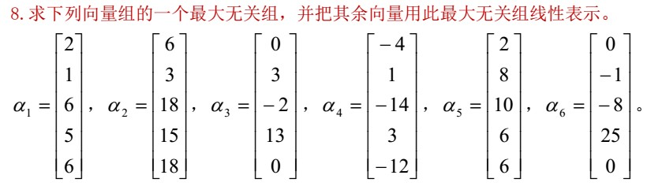
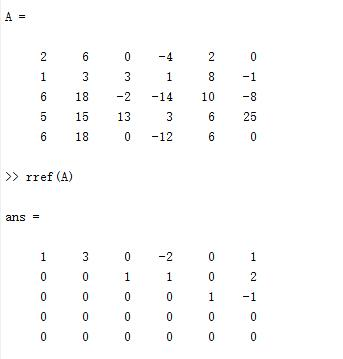

[TOC]

## 矩阵

### 几个特殊矩阵

#### 方阵

行数与列数相同的矩阵$\bold{A}_{n\times n}$称为$n$阶矩阵或$n$阶方阵

#### 零矩阵

元素都是零的矩阵称为零矩阵，记作$\bold O$

#### 三角矩阵

**上三角矩阵**

主对角线以下的元素全为零的方阵，即

$$
\bold{A}_n=\begin{bmatrix}
a_{11}  & a_{12} & \cdots & a_{1n}\\
0  & a_{22} & \cdots & a_{2n}\\
\vdots  & \vdots &  & \vdots\\
0  & 0 & \cdots & a_{nn}
\end{bmatrix}
$$

**下三角矩阵**

主对角线以上的元素全为零的方阵，即

$$
\bold{A}_n=\begin{bmatrix}
a_{11}  & 0 & \cdots & 0\\
a_{21}  & a_{22} & \cdots & 0\\
\vdots  & \vdots &  & \vdots\\
a_{n1}  & a_{n2} & \cdots & a_{nn}
\end{bmatrix}
$$

#### 对角阵

主对角线（左上到右下的对角线；右上到左下的是副对角线）以外的元素全为零的方阵，即

$$
\bold{A}_n=\begin{bmatrix}
a_{11}  & & & \\
  & a_{22} & & \\
  &  & \ddots & \\
  &  &  & a_{nn}
\end{bmatrix}
$$

对角矩阵常记为$\Lambda$或$diag(a_{11},a_{22},\cdots,a_{nn})$

#### 单位矩阵

主对角线上全为1的对角矩阵称为单位矩阵，记作$\bold{E}_n$，即

$$
\bold{E}_n=\begin{bmatrix}
1  & & & \\
  & 1 & & \\
  &  & \ddots & \\
  &  &  & 1
\end{bmatrix}
$$

#### 系数矩阵

对于线性方程组

$$
\left\{\begin{matrix}
2x_1-2x_2+6x_4=-2 \\
2x_1-x_2+2x_3+4x_4=-2 \\
3x_1-x_2+4x_3+4x_4=-3 \\
x_1+x_2+x_3+8x_4=2
\end{matrix}\right.
$$

其系数矩阵为

$$
\bold{A}=\begin{bmatrix}
2  & -2 & 0 & 6\\
2  & -1 & 2 & 4\\
3  & -1 & 4 & 4\\
1  & 1  & 1 & 8
\end{bmatrix}
$$

#### 增广矩阵

由线性方程组所有系数和常数项所构成的矩阵称为线性方程组的增广矩阵，并记为$\tilde{\bold{A}}=(\bold{A,b})$或$\tilde{\bold{A}}=[\bold{A,b}]$

$$
\tilde{\bold{A}}=[\bold{A,b}]=\begin{bmatrix}
2  & -2 & 0 & 6 & -2\\
2  & -1 & 2 & 4 & -2\\
3  & -1 & 4 & 4 & -3\\
1  & 1  & 1 & 8 & 2
\end{bmatrix}
$$

#### 对称矩阵

满足$\bold{A}^T=\bold{A}$的矩阵称为对称矩阵，满足$\bold{A}^T=-\bold{A}$的矩阵称为反对称矩阵。

#### 行阶梯型矩阵

满足以下两个条件

1. 如果有零行（元素全为0的行），则零行位于非零行的下方
2. 非零行（元素不全为0的行）的首个非零元素，其前面零元素的个数逐行增加。

最简行阶梯型矩阵：进一步满足非零行的首非零元均为1，且所在列的其余元素为0.

#### 初等矩阵

由$n$阶单位矩阵$\bold{E}$经过一次初等变换所得到的矩阵称为初等矩阵或初等方阵。

#### 奇异矩阵

行列式为0的矩阵称为奇异矩阵。不为0的称为非奇异矩阵。

#### 可逆矩阵

见后

#### 伴随矩阵

矩阵$\bold{A}$的各个元素的代数余子式$A_{ij}$所构成的如下矩阵

$$
\bold{A}^*=
\begin{bmatrix}
A_{11} & A_{21} & \cdots & A_{n1}\\
A_{12} & A_{22} & \cdots & A_{n2}\\
\vdots & \vdots &  & \vdots\\
A_{1n} & A_{2n} & \cdots & A_{nn}
\end{bmatrix}
$$

即$\bold{A}^*=(A_{ij})^T_{n\times n}$，称为$A$的伴随矩阵。

并且伴随矩阵满足$\bold{AA^*}=\bold{A^*A}=\bold{|A|E}$

并且可推知，当$\bold{|A|}\ne 0$时，有$\bold{|A^*|}=\bold{|A|}^{n-1}$

另外注意，伴随矩阵的序号和原矩阵的序号相当于进行了转置。

#### 正交矩阵

见后

### 矩阵的运算

#### 加减法

对于矩阵$\bold{A}=(a_{ij})_{m\times n},\bold{B}=(b_{ij})_{m\times n}$，定义

$$
\bold{A\pm B}=\begin{bmatrix}
a_{11}\pm b_{11}  & a_{12}\pm b_{12} & \cdots & a_{1n}\pm b_{1n}\\
a_{21}\pm b_{21}  & a_{22}\pm b_{22} & \cdots & a_{2n}\pm b_{2n}\\
\vdots  & \vdots &  & \vdots\\
a_{m1}\pm b_{m1}  & a_{m2}\pm b_{m2} & \cdots & a_{mn}\pm b_{mn}
\end{bmatrix}
$$

#### 数乘

$$
\lambda\bold{A}=\begin{bmatrix}
\lambda a_{11}  & \lambda a_{12} & \cdots & \lambda a_{1n}\\
\lambda a_{21}  & \lambda a_{22} & \cdots & \lambda a_{2n}\\
\vdots  & \vdots &  & \vdots\\
\lambda a_{m1}  & \lambda a_{m2} & \cdots & \lambda a_{mn}
\end{bmatrix}
$$

#### 线性运算的运算规律

矩阵的加减法和数乘统称为矩阵的线性运算，满足以下运算律

1. $\bold{A+B=B+A}$
2. $\bold{(A+B)+C=A+(B+C)}$
3. $\bold{A+O=A}$
4. $\bold{A+(-A)=O}$
5. $1\bold{A=A}$
6. $(\lambda\mu)\bold{A}=\lambda(\mu\bold{A})=\mu(\lambda\bold{A})$
7. $(\lambda+\mu)\bold{A}=\lambda\bold{A}+\mu\bold{A}$
8. $\lambda(\bold{A+B})=\lambda \bold{A}+\lambda \bold{B}$

#### 乘积

设矩阵$\bold{A}=(a_{ij})_{m\times s},\bold{B}=(b_{ij})_{s\times n}$，其乘积是一个$m\times n$矩阵，记为$\bold{C}=(c_{ij})_{m\times n}$

$$
c_{ij}=\sum^{s}_{k=1}a_{ik}b_{kj}=a_{i1}b_{1j}+a_{i2}b_{2j}+\cdots+a_{is}b_{sj}
$$

$$
(i=1,2,\cdots,m;j=1,2,\cdots,n)
$$

由定义知，只有左边矩阵的列数等于右边矩阵的行数时，两个矩阵才能相乘。

矩阵乘法满足如下运算规律

1. $\bold{(AB)C=A(BC)}$
2. $\bold{A(B+C)=AB+AC,(A+B)C=AC+BC}$
3. $\lambda(\bold{AB})=(\lambda\bold{A)B}=\bold{A}(\lambda\bold{B})$
4. $\bold{A}_{m\times n}\bold{E}_n=\bold{E}_m\bold{A}_{m\times n}=\bold{A}_{m\times n}$
5. $\bold{A}^k\bold{A}^l=\bold{A}^{k+l},(\bold{A}^k)^l=\bold{A}^{kl}$

注意，由于矩阵乘法不满足交换律，故一般情况下，$(\bold{AB}^k)\ne\bold{A}^k\bold{B}^k$

#### 转置

将矩阵$\bold{A}$中的行换成同序数的列而得到的矩阵，称之为$\bold{A}$的转置矩阵，记作$\bold{A}^T$或$\bold{A}'$，即若

$$
\bold{A}=\begin{bmatrix}
a_{11}  & a_{12} & \cdots & a_{1n}\\
a_{21}  & a_{22} & \cdots & a_{2n}\\
\vdots  & \vdots &  & \vdots\\
 a_{m1}  & a_{m2} & & a_{mn}
\end{bmatrix}
$$

$$
\bold{A}^T=\begin{bmatrix}
a_{11}  & a_{21} & \cdots & a_{m1}\\
a_{12}  & a_{22} & \cdots & a_{m2}\\
\vdots  & \vdots &  & \vdots\\
 a_{1n}  & a_{2n} & & a_{mn}
\end{bmatrix}
$$

转置满足以下运算律

1. $(\bold{A}^T)^T=\bold{A}$
2. $(\bold{A+B})^T=\bold{A}^T+\bold{B}^T$
3. $(\lambda\bold{A})^T=\lambda\bold{A}^T$
4. $(\bold{AB})^T=\bold{B}^T\bold{A}^T$

### 可逆矩阵

设$\bold{A}$为$n$阶方阵，若存在$n$阶方阵$\bold{B}$，使得$\bold{AB=BA=E}_n$，则称$\bold{A}$为可逆矩阵，或称其为可逆的。称$\bold{B}$为$\bold{A}$的逆矩阵。$\bold{B}=\bold{A}^{-1}$.

设$\bold{A},\bold{B}$都为$n$阶方阵，若$\bold{AB=E}_n$，则$\bold{A},\bold{B}$都可逆，并且

$$
\bold{A}^{-1}=\bold{B},\bold{B}^{-1}=\bold{A}
$$

#### 可逆矩阵的性质

1. 若$\bold{A}$可逆，则$\bold{A}$的逆矩阵唯一.
2. 若$\bold{A}$可逆，则$\bold{A}^{-1}$也可逆，并且$\bold{A}=(\bold{A}^{-1})^{-1}$
3. 若$\bold{A}$可逆，数$\lambda\ne0$，则$\lambda\bold{A}$可逆，并且$(\lambda\bold{A})^{-1}=\frac{1}{\lambda}\bold{A}^{-1}$
4. 若$\bold{A}$、$\bold{B}$均为$n$阶可逆方阵，则$\bold{A}\bold{B}$也可逆，且$(\bold{A}\bold{B})^{-1}=\bold{B}^{-1}\bold{A}^{-1}$
5. 若$\bold{A}$可逆，则$\bold{A}^{T}$也可逆，并且$(\bold{A}^T)^{-1}=(\bold{A}^{-1})^{T}$

#### 逆矩阵的求法

1. 借用伴随矩阵和行列式，见行列式一章
2. 初等变换法

设有方阵$\bm A$，将其和同阶单位阵写在一起$(A,E)$，然后通过初等行变换（只能是行变换），化成$(E,A')$的形式，然后$A'$就是逆矩阵。

### 分块矩阵

加减法、数乘、乘法与普通矩阵相似。转置时除了将整个矩阵，还要将每个元素本身转置。 

### 初等变换

下面三种变换称之为初等行变换

1. 交换两行的位置
2. 以非零数$k$乘某行
3. 把某一行的$k$倍加到另一行上

初等列变换只用把上述的行换成列即可。两种变换通称初等变换。显然初等变换是可逆的。

### 矩阵等价

如果矩阵$\bold{A}$经有限次初等变换成矩阵$\bold{B}$，那么称这两个矩阵等价，记作$\bold{A} \sim \bold{B}$

等价关系具有：自反性、对称性、传递性。

相似一定等价，等价不一定相似。
合同一定等价，等价不一定合同。
合同不一定相似，相似不一定合同。

### 矩阵的秩

设$\bold{A}$为$m\times n$矩阵，$\bold{B}$是与$\bold{A}$等价的行阶梯型矩阵，若矩阵$\bold{B}$的非零行数为$r$，则称矩阵$\bold{B}$的秩为$r$，矩阵$\bold{A}$的秩也为$r$，记作$R(\bold{A})=R(\bold{B})=r$

#### 矩阵的秩的性质
1. $0\leq R(\bold{A}_{m\times n})\leq min\{m,n\}$
2. $R(\bold{A})=0\Leftrightarrow \bold{A=O}$
3. $R(\bold{A}^T)=R(\bold{A})$
4. 若$\bold{A}\sim\bold{B}$，则$R(\bold{A})=R(\bold{B})$
5. 若$\bold{P},\bold{Q}$可逆，则$R(\bold{A})=R(\bold{PA})=R(\bold{AQ})=R(\bold{PAQ})$（可逆矩阵不影响矩阵的秩）（初等变换不影响矩阵的秩）
6. $max\{R(\bold{A}),R(\bold{B})\}\leq R(\bold{A,B})\leq R(\bold{A})+R(\bold{B})$
7. $R(\bold{A\pm B})\leq R(\bold{A})+R(\bold{B});R(\bold{AB})\leq min\{R(\bold{A}),R(\bold{B})\}$
8. 若$\bold{A}_{m\times n}\bold{B}_{n\times l}=\bold{O}$，则$R(\bold{A})+R(\bold{B})\leq n$
9. $\bold{A}_{m\times n}$行满秩$\Leftrightarrow R(\bold{A})=m\Leftrightarrow\bold{A}$的等价标准型为$(\bold{I}_m,\bold{O})$（$\bold{I}$是单位矩阵）。$\bold{A}_{m\times n}$列满秩$\Leftrightarrow R(\bold{A})=n\Leftrightarrow\bold{A}$的等价标准型为$(\bold{I}_n,\bold{O})^T$。
10. 若$\bold{A}$为$n$阶方阵，则$R(\bold{A})=n\Leftrightarrow \bold{A}$是可逆矩阵
11. 若$\bold{A},\bold{B}$均为$n$阶方阵，则$R(\bold{AB})\ge R(\bold{A})+R(\bold{B})-n$
12. $R(\bold{ABC})\ge R(\bold{AB})+R(\bold{BC})-R(\bold{B})$
13. $R(\bold{A}_{m\times n})=n\Leftrightarrow$齐次线性方程组$\bold{Ax=0}$只有零解。
14. 
$$
R\begin{pmatrix}
\bold{A}  & 0\\
0  & \bold{B}
\end{pmatrix}=R(\bold{A})+R(\bold{B})
$$
15. 矩阵的秩等于矩阵的行秩也等于矩阵的列秩

### 对于一个矩阵一些相互等价的命题

#### 第一组
设$\bold{A}$为$n$阶方阵，那么下列命题等价

1. 满秩
2. 非奇异
3. 可逆
4. $\bold{Ax=0}$只有零解
5. $|\bold{A}|\ne0$
6. $\bold{A}$可以经过有限次初等行变换华为单位矩阵$\bold{E}_n$
7. $\bold{A}$可以表示为有限个初等矩阵的乘积。
8. 特征值均非零

#### 第二组
设$\bold{A}$为$n$阶方阵，那么下列命题等价

1. 降秩
2. 奇异
3. 不可逆
4. $\bold{Ax=0}$不只有零解
5. $|\bold{A}|=0$
6. $\bold{A}$不可以经过有限次初等行变换华为单位矩阵$\bold{E}_n$
7. $\bold{A}$不可以表示为有限个初等矩阵的乘积。
8. 特征值至少有一个为零

#### 第三组

设$f(x_1,\cdots,x_n)=\bm{x}^T\bm{Ax}$是$n$元实二次型，则下列命题等价

1. $f=\bm{x}^T\bm{Ax}$是正定二次型，即$\bm{A}$是正定矩阵
2. $\bm{A}$的特征值均为正数
3. $f=\bm{x}^T\bm{Ax}$的正惯性指数为$n$
4. $\bm{A}$与单位矩阵$\bm{E}$合同
5. 存在可逆矩阵$\bm B$，使得$\bm{A=B}^T\bm B$
6. 顺序主子式均大于零

#### 第四组

设$f(x_1,\cdots,x_n)=\bm{x}^T\bm{Ax}$是$n$元实二次型，则下列命题等价

1. $f$是负定二次型
2. $f$的负惯性指数为$n$
3. $\bm A$的特征值全为负数
4. $\bm A$合同于$-\bm E$
5. $\bm A$的奇数阶顺序主子式均为负数，偶数阶顺序主子式均为负数

## 行列式

### 二阶行列式

$$
D=\begin{vmatrix}
a_{11} & a_{12} \\
a_{21} & a_{22}
\end{vmatrix}=a_{11}a_{22}-a_{12}a_{21}
$$

### n阶行列式

#### 余子式与代数余子式

在$n$阶行列式

$$
D=\begin{vmatrix}
a_{11} & a_{12} & \cdots & a_{1n}\\
a_{21} & a_{22} & \cdots & a_{2n}\\
\vdots & \vdots & & \vdots\\
a_{n1} & a_{n2} & \cdots & a_{nn}
\end{vmatrix}
$$

中划掉元素所在的第$i$行与第$j$列后，剩下的$(n-1)^2$个元素按原来的次序构成的$n-1$阶行列式称为元素$a_{ij}$的余子式，记为$M_{ij}$，并称$(-1)^{i+j}M_{ij}$为元素$a_{ij}$的代数余子式，记为$A_{ij}$。

#### 计算

$$
D=\begin{vmatrix}
a_{11} & a_{12} & \cdots & a_{1n}\\
a_{21} & a_{22} & \cdots & a_{2n}\\
\vdots & \vdots & & \vdots\\
a_{n1} & a_{n2} & \cdots & a_{nn}
\end{vmatrix}
$$

$$
=a_{11}A_{11}+a_{12}A_{12}+\cdots+a_{1n}A_{1n}=\sum_{k=1}^{n}a_{k1}A_{k1}
$$

上式为该行列式按第一行的展开定义。也可以按其他行（或者列）展开。

易知对于对角矩阵和上下三角矩阵，其行列式为对角线上元素的乘积。对次三角矩阵则不等于副对角线上元素的乘积。单位矩阵的行列式等于$1$.

### 行列式的性质

1. 行列式与其转置行列式相等，$|\bold{A}|=|\bold{A}^T|$
2. 行列式中某行（或列）元素的公因子可以提到行列式之外

    1. 某行（或列）元素全为零的行列式等于0
    2. 对于$n$阶矩阵$\bold{A}$，有$|k\bold{A}|=k^n|\bold{A}|$
3. 交换某两行（或列）的位置，行列式的值变号.

    1. 如果行列式中有两行（或两列）元素相同，则行列式为0.
    2. 行列式中若有两行（或两列）对应元素成比例，则行列式为0
4. 若行列式某一行（或列）的元素是两项之和，则该行列式可以写成两个行列式之和，即

$$
\begin{vmatrix}
a_{11} & \cdots & a_{1j} & \cdots & a_{1n}\\
\vdots & & \vdots &  & \vdots\\
a_{i1}+b_{i1}  & \cdots & a_{ij}+b_{ij} & \cdots & a_{in}+b_{in}\\
\vdots &  & \vdots &  & \vdots\\
a_{n1}  & \cdots & a_{nj} & \cdots & a_{nn}
\end{vmatrix}
$$

$$
=\begin{vmatrix}
a_{11} & \cdots & a_{1j} & \cdots & a_{1n}\\
\vdots & & \vdots &  & \vdots\\
a_{i1} & \cdots & a_{ij} & \cdots & a_{in}\\
\vdots &  & \vdots &  & \vdots\\
a_{n1}  & \cdots & a_{nj} & \cdots & a_{nn}
\end{vmatrix}+
\begin{vmatrix}
a_{11} & \cdots & a_{1j} & \cdots & a_{1n}\\
\vdots & & \vdots &  & \vdots\\
b_{i1}  & \cdots & b_{ij} & \cdots & b_{in}\\
\vdots &  & \vdots &  & \vdots\\
a_{n1}  & \cdots & a_{nj} & \cdots & a_{nn}
\end{vmatrix}
$$

5. 将某一行（或列）的任意$k$倍加到另一行（或列）上去，行列式的值不变
6. 对于$n$阶行列式D，有

$$
\sum_{j=1}^na_{ij}A_{kj}=
\left\{\begin{matrix}
D,i=k\\
0,i\ne k
\end{matrix}\right.
$$

$$
\sum_{i=1}^na_{ij}A_{ik}=
\left\{\begin{matrix}
D,j=k\\
0,j\ne k
\end{matrix}\right.
$$

7. 设$\bold{A,B}$均为$n$阶方阵，则$|\bold{AB}|=\bold{|A||B|}$

### 范德蒙行列式

$$
V_n=\begin{vmatrix}
1 & 1 & 1 & \cdots & 1\\
x_1 & x_2 & x_3 & \cdots & x_n\\
x_1^2 & x_2^2 & x_3^2 & \cdots & x_n^2\\
\vdots & \vdots & \vdots &  & \vdots\\
x_1^{n-1} & x_2^{n-1} & x_3^{n-1} & \cdots & x_n^{n-1}
\end{vmatrix}
$$

有

$$
V_n=\prod_{1\leq j<i\leq n}(x_i-x_j) 
$$

### 行列式求逆矩阵

$\bold{A}$为可逆矩阵的充分必要条件是$|\bold{A}|\ne 0$，且有

$$
\bold{A}^{-1}=\frac{1}{|\bold{A}|}\bold{A}^*
$$

### 行列式求解非齐次线性方程组（克莱默法则）

对于线性方程组$\bold{Ax=b}$，定义

$$
D=|\bold{A}|\\
D_1=|[\bold{b},\bold{a}_2,\bold{a}_3,\cdots,\bold{a}_n]|\\
D_2=|[\bold{a}_1,\bold{b},\bold{a}_3,\cdots,\bold{a}_n]|\\
\cdots\\
D_n=|[\bold{a}_1,\bold{a}_2,\bold{a}_3,\cdots,\bold{b}]|\\
$$

当$D\ne0$时，该方程组有唯一解，其解为

$$
x_1=\frac{D_1}{D},x_2=\frac{D_2}{D},\cdots,x_n=\frac{D_n}{D}
$$

## n维向量与向量空间

前提：本章默认为列向量。

### 向量的运算

#### 线性运算
加减法和数乘和矩阵一样，不再介绍。

#### 向量乘法
也和矩阵一样，但只有两种情况

$$
\bm{\alpha}^T\bm{\beta}=
\begin{bmatrix}
a_1&a_2&\cdots&a_n
\end{bmatrix}\begin{bmatrix}
b1\\b2\\\vdots\\b3
\end{bmatrix}=
a_1b_1+a_2b_2+\cdots+a_nb_n
$$

$$
\bm{\alpha}\bm{\beta}^T=
\begin{bmatrix}
a_1\\a_2\\\vdots\\a_n
\end{bmatrix}\begin{bmatrix}
b1&b2&\cdots&b3
\end{bmatrix}=
\begin{bmatrix}
a_1b_1 & a_1b_2 & \cdots & a_1b_n\\
a_2b_1 & a_2b_2 & \cdots & a_2b_n\\
\vdots & \vdots &  & \vdots\\
a_nb_1 & a_nb_2 & \cdots & a_nb_n
\end{bmatrix}
$$

#### 向量运算的性质
和矩阵相同，看成行或列为1的矩阵即可。

### 向量组的线性相关性

#### 向量组的线性表示

设$n$维向量组$\bm{\alpha}_1,\bm{\alpha}_2,\cdots,\bm{\alpha}_s$，对于任何一组实数$k_1,k_2,\cdots,k_s$，称$k_1\bm{\alpha}_1,k_2\bm{\alpha}_2,\cdots,k_s\bm{\alpha}_s$为向量组的一个线性组合。

设$\bm{b}$为$n$维向量，若存在一组数$\lambda_1,\lambda_2,\cdots,\lambda_s$使得$\bm{b}=\lambda_1\bm{\alpha}_1,\lambda_2\bm{\alpha}_2,\cdots,\lambda_s\bm{\alpha}_s$，则称$\bm{b}$可由$\bm{\alpha}_1,\bm{\alpha}_2,\cdots,\bm{\alpha}_s$线性表示。

线性方程组$\bm{Ax=b}$有解的充分必要条件是$\bm{b}$可由$\bm{A}$的列向量组$\bm{\alpha}_1,\bm{\alpha}_2,\cdots,\bm{\alpha}_n$线性表示.

#### 向量组的线性相关性定义及性质

设有$n$维向量组$\bm{\alpha}_1,\bm{\alpha}_2,\cdots,\bm{\alpha}_m$，如果存在不全为零的数$k_1,k_2,\cdots,k_m$，使得

$$
k_1\bm{\alpha}_1+k_2\bm{\alpha}_2+\cdots+k_m\bm{\alpha}_m=0
$$

则称向量组线性相关，否则称线性无关。

可以得到如下结论：

1. 包含零向量的向量组必线性相关
2. 当向量组只包含一个向量时，若为零向量，则线性相关；否则线性无关。
3. 非零向量组若只有两个向量，则线性相关的充要条件是两个向量的对应分量成比例。
4. 向量组线性相关的充要条件是至少存在其中的一个向量可由其余向量线性表示
5. 当$t>n$，含有$t$个$n$维向量的向量组必线性相关。
6. 向量组$\bm{\alpha}_1,\bm{\alpha}_2,\cdots,\bm{\alpha}_m$线性无关，而向量组$\bm{\alpha}_1,\bm{\alpha}_2,\cdots,\bm{\alpha}_m,\bm{b}$线性相关，则$\bm{b}$可由$\bm{\alpha}_1,\bm{\alpha}_2,\cdots,\bm{\alpha}_m$唯一线性表示
7. $\bm{\alpha}_1,\bm{\alpha}_2,\cdots,\bm{\alpha}_m$线性无关，则任一部分组$\bm{\alpha}_1,\bm{\alpha}_2,\cdots,\bm{\alpha}_r(r<m)$必线性无关
8. $\bm{\alpha}_1,\bm{\alpha}_2,\cdots,\bm{\alpha}_m$线性相关，则增加向量后的向量组$\bm{\alpha}_1,\bm{\alpha}_2,\cdots,\bm{\alpha}_s(s>m)$必线性相关。
9. 设$\bm{\alpha}_1,\bm{\alpha}_2,\cdots,\bm{\alpha}_m$为$m$个$m$维列向量。则$\bm{\alpha}_1,\bm{\alpha}_2,\cdots,\bm{\alpha}_m$线性无关$\Leftrightarrow$行列式$|[\bm{\alpha}_1,\bm{\alpha}_2,\cdots,\bm{\alpha}_m]|\ne0$;$\bm{\alpha}_1,\bm{\alpha}_2,\cdots,\bm{\alpha}_m$线性相关$\Leftrightarrow$行列式$|[\bm{\alpha}_1,\bm{\alpha}_2,\cdots,\bm{\alpha}_m]|=0$
10. 从几何角度理解：设$\bm{\alpha,\beta,\gamma}$为三维向量，向量组$\bm{\alpha,\beta}$线性相关$\Leftrightarrow\bm{\alpha,\beta}$共线;向量组$\bm{\alpha,\beta,\gamma}$线性相关$\Leftrightarrow\bm{\alpha,\beta,\gamma}$共面

### 向量组的秩和极大无关组

设有两个向量组，每个向量组中的每一个向量都可以由另一个向量组线性表示，则称两个向量组等价。

设有向量组$\bm{\alpha}_1,\bm{\alpha}_2,\cdots,\bm{\alpha}_s$，而$\bm{\alpha}_1,\bm{\alpha}_2,\cdots,\bm{\alpha}_r$是向量组中的$r$个向量$(r\leq s)$，若满足

1. 向量组$\bm{\alpha}_1,\bm{\alpha}_2,\cdots,\bm{\alpha}_r$线性无关;
2. 向量组$\bm{\alpha}_1,\bm{\alpha}_2,\cdots,\bm{\alpha}_s$中的任$r+1$个向量（如果有）线性相关

则称向量组$\bm{\alpha}_1,\bm{\alpha}_2,\cdots,\bm{\alpha}_r$是向量组$\bm{\alpha}_1,\bm{\alpha}_2,\cdots,\bm{\alpha}_s$的一个极大无关组，极大无关组所含向量个数$r$称为向量组的秩，记作$R(\bm{\alpha}_1,\bm{\alpha}_2,\cdots,\bm{\alpha}_s)=r$.

只含零向量的向量组，规定秩为0；向量组$\bm{\alpha}_1,\bm{\alpha}_2,\cdots,\bm{\alpha}_s$线性无关时，其秩为$s$.

有如下定理

1. 阶梯型矩阵$J$的行秩和列秩相等，恰等于$J$的非零行数，并且$J$的主元（非零行的首个元素）所在的列构成列向量组的一个极大无关组。
2. 矩阵的初等行（列）变换不改变矩阵的列（行）（注意与前一句相反）向量组的线性相关性，从而不改变矩阵的列（行）秩。
3. 矩阵的秩等于矩阵的行秩等于矩阵的列秩。
4. 设$\bm{A}$是$m\times n$矩阵，则

矩阵$A$的列向量组线性相关（无关）的充要条件为$R(\bm{A})<n(R(\bm{A})=n)$

矩阵$A$的行向量组线性相关（无关）的充要条件为$R(\bm{A})<m(R(\bm{A})=m)$

5. 若向量组$I$可由向量组$II$线性表示，则$I$的秩不超过$II$的秩；
6. 等价向量组的秩相等。

#### 极大无关组表示其他向量

转化为行最简形为

显然极大无关组是$\alpha_1,\alpha_3,\alpha_5$。

并且有$\alpha_2=3\alpha_1,\alpha_4=-2\alpha_1+\alpha_3,\alpha_6=\alpha_1+2\alpha_3-\alpha_5$

### 向量空间

#### 向量空间的定义
设$\bm{V}$是非空$n$维向量的集合，如果$\bm{V}$对向量的加法和数乘封闭，即

1. 若$\bm{a,b\in V}$，有$\bm{a+b}\in V$;
2. 若$\bm{a\in B},\lambda\in R$，有$\lambda\bm{a\in V}$（特别注意$\lambda=0$的情况）

则称$\bm{V}$为一个向量空间

向量空间必须含有零向量。

**子空间的定义**

设$\bm{V}$和$\bm{H}$都是向量空间，若$\bm{H}\subset V$，则称$\bm{H}$是$\bm{V}$的子空间。

**线性变换的定义**

已知$\bm{A}$为$n$阶方阵，则称映射$f:\bm{R}^n\to \bm{R}^n,\bm{x}\to \bm{y},\bm{y}=\bm{Ax}$为$\bm{R}^n$上的线性变换，$\bm{A}$称为线性变换矩阵.

#### 向量的内积与正交矩阵

**向量的内积**

设$n$维向量$\bm{x}=[x_1,x_2,\cdots,x_n]^T$，$\bm{y}=[y_1,y_2,\cdots,y_n]^T$，称

$$
<\bm{x},\bm{y}>=x_1y_1+x_2y_2+\cdots+x_ny_n
$$

为向量$\bm{x,y}$的内积。

内积具有以下性质

1.  $<\bm{x},\bm{y}>=<\bm{y},\bm{x}>$
2.  $<k\bm{x},\bm{y}>=<\bm{x},k\bm{y}>=k<\bm{x},\bm{y}>$，$k$是实数
3.  $<\bm{x+y},\bm{z}>=<\bm{x},\bm{z}>+<\bm{y},\bm{z}>$
4.  $<\bm{x},\bm{x}>\ge0,<\bm{x},\bm{x}>=0$当且仅当$\bm{x}=\bm{0}$
5.  柯西-施瓦茨不等式：$<\bm{x},\bm{y}>^2\leq<\bm{x},\bm{x}><\bm{y},\bm{y}>$

**向量的范数**

设$n$维向量$\bm{x}=[x_1,x_2,\cdots,x_n]^T$，称

$$
||\bm{x}||=\sqrt{\bm{x}^T\bm{x}}=\sqrt{<\bm{x},\bm{x}>}=\sqrt{x_1^2+x_2^2+\cdots+x_n^2}
$$

为向量$\bm{x}$的范数。

范数具有以下性质

1. $||\bm{x}||\ge0,||\bm{x}||=0$当且仅当$\bm{x}=\bm{0}$
2. $||k\bm{x}||=|k|||\bm{x}||$，k为实数
3. $||\bm{x}+\bm{y}||\leq||\bm{x}||+||\bm{y}||$

**向量的夹角与正交**

设$\bm{x,y}$是$n$维非零向量，称

$$
\theta=\arccos\frac{\bm{x}^T\bm{y}}{||\bm{x}||||\bm{y}||}=\arccos\frac{<\bm{x},\bm{y}>}{||\bm{x}||||\bm{y}||}
$$

为向量$\bm{x,y}$的夹角。特别的，当$<\bm{x},\bm{y}>=0时$，$\theta=\pm\frac{\pi}{2}$，称两向量正交（或垂直）。

两两正交的向量组称为正交向量组。由单位向量构成的正交向量组称为标准（规范）标准正交组

有如下定理：

1. 不含零向量的正交向量组必线性无关。

**施密特正交化方法**

设向量组$\bm{\alpha}_1,\bm{\alpha}_2,\cdots,\bm{\alpha}_m$线性无关，令

$$
\bm{\beta}_1=\bm{\alpha}_1\\
\bm{\beta}_2=\bm{\alpha}_2-\frac{<\bm{\alpha}_2,\bm{\beta}_1>}{<\bm{\beta}_1,\bm{\beta}_1>}\bm{\beta}_1\\
\bm{\beta}_3=\bm{\alpha}_3-\frac{<\bm{\alpha}_3,\bm{\beta}_1>}{<\bm{\beta}_1,\bm{\beta}_1>}\bm{\beta}_1-\frac{<\bm{\alpha}_3,\bm{\beta}_2>}{<\bm{\beta}_2,\bm{\beta}_2>}\bm{\beta}_2\\
\cdots\\
\bm{\beta}_m=\bm{\alpha}_m-\sum_{j=1}^{m-1}\frac{<\bm{\alpha}_m,\bm{\beta}_j>}{<\bm{\beta}_j,\bm{\beta}_j>}\bm{\beta}_j
$$

则$\bm{\beta}_1,\bm{\beta}_2,\cdots,\bm{\beta}_m$是与$\bm{\alpha}_1,\bm{\alpha}_2,\cdots,\bm{\alpha}_m$等价的正交向量组

若进一步单位化，即令$\bm{\eta}_j=\frac{\bm{\beta}j}{||\bm{\beta}_j||}$，则$\bm{\eta}_1,\bm{\eta}_2,\cdots,\bm{\eta}_m$是一个与$\bm{\alpha}_1,\bm{\alpha}_2,\cdots,\bm{\alpha}_m$等价的标准正交向量组.

**正交矩阵**

设$\bm{A}$为$n$阶方阵，若满足$\bm{A}^T\bm{A}=\bm{E}$，则称$\bm{A}$为正交矩阵。

有如下性质：

1. 若$\bm{A}$为正交矩阵，则$\bm{A}^T=\bm{A}^{-1}$
2. 若$\bm{A}$为正交矩阵，则$\bm{A}^T$和$\bm{A}^{-1}$和$\bm{A}^{*}$也为正交矩阵
3. 若$\bm{A},\bm{B}$为$n$阶正交矩阵，则$\bm{AB}$也为正交矩阵
4. 若$\bm{A}$为正交矩阵，则$|\bm{A}|=\pm1$

有如下定理：

$n$阶方阵$\bm{A}$为正交矩阵的充要条件是$\bm{A}$的列（行）向量组是标准向量组。

### 基、维数与坐标

#### 向量空间的基与维数

设$\bm{V}$是向量空间，如果向量$\bm{\alpha}_1,\bm{\alpha}_2,\cdots,\bm{\alpha}_r\in\bm{V}$，满足

1. $\bm{\alpha}_1,\bm{\alpha}_2,\cdots,\bm{\alpha}_r$线性无关
2. $\bm{V}$中任一向量都可以由$\bm{\alpha}_1,\bm{\alpha}_2,\cdots,\bm{\alpha}_r$线性表示

则称向量组$\bm{\alpha}_1,\bm{\alpha}_2,\cdots,\bm{\alpha}_r$是向量空间$\bm{V}$的一组基，$r$称为向量空间的维数，记为$dim\bm{V}=r$，规定零向量构成的向量空间的维数为0.

类似的还有正交基和标准（规范）正交基的概念。

#### 向量的坐标

设$\bm{V}$是$r$维向量空间，$\bm{\alpha}_1,\bm{\alpha}_2,\cdots,\bm{\alpha}_r$是$\bm{V}$的一组基，则$\bm{V}$中的任一向量$\bm{x}$可由$\bm{\alpha}_1,\bm{\alpha}_2,\cdots,\bm{\alpha}_r$唯一线性表示为$\bm{x}=x_1\bm{\alpha}_1+\cdots+x_r\bm{\alpha}_r$，数组$x_1,x_2,\cdots,x_r$称为向量$\bm{x}$在基$\bm{\alpha}_1,\bm{\alpha}_2,\cdots,\bm{\alpha}_r$下的坐标。

**过渡矩阵与基变换公式**

设$\bm{\alpha}_1,\bm{\alpha}_2,\cdots,\bm{\alpha}_r$和$\bm{\beta}_1,\bm{\beta}_2,\cdots,\bm{\beta}_r$是$r$维向量空间$\bm{V}$的两组基，则两个向量组等价，从而有$\bm{\beta}_j=k_{1j}\bm{\alpha}_1+\cdots+k_{rj}\bm{\alpha}_r$，即

$$
[\bm{\beta}_1,\cdots,\bm{\beta}_r]=[\bm{\alpha}_1,\cdots,\bm{\alpha}_r]
\begin{bmatrix}
k_{11} & \cdots & k_{1r}\\
\vdots &  & \vdots\\
k_{r1} & \cdots & k_{rr}
\end{bmatrix}
=[\bm{\alpha}_1,\cdots,\bm{\alpha}_r]\bm{K}
$$

称$\bm{K}$是由$\bm{A}$到$\bm{B}$的过度矩阵，上式为基变换公式。另外$\bm{K}$一定是可逆矩阵。

**坐标变换公式**

设$\bm{\alpha}$在两组基$\bm{A,B}$下的坐标分别为$[x_1,\cdots,x_r]^T$和$[y_1,\cdots,y_r]^T$，则有

$$
\begin{bmatrix}
x_1 \\
\vdots \\
x_r
\end{bmatrix}
=\bm{K}
\begin{bmatrix}
y_1 \\
\vdots \\
y_r
\end{bmatrix}
or
\begin{bmatrix}
y_1 \\
\vdots \\
y_r
\end{bmatrix}
=\bm{K}^{-1}
\begin{bmatrix}
x_1 \\
\vdots \\
x_r
\end{bmatrix}
$$

一般有$\bm{K}=\bm{A}^{-1}\bm{B}$

## 线性方程组

### 解法

#### 高斯消元法
即通过对增广矩阵进行初等行变换（只能是行变换），化为简单的形式进行求解。

#### 克莱默法则

见前

### 性质定理

1. 齐次线性方程组$\bold{A}_{m\times n}\bold{x=0}$有非零解的充要条件是$R(\bold{A})=r<n$，且有无穷多解，自由量为$n-r$个（解空间的维数为$n-r$）。这个充要条件可以替换为$|\bm A|=0$及其他等价命题。
2. 非齐次线性方程组$\bold{A}_{m\times n}\bold{x=b}$有解的充要条件是$R(\bold{A})=R(\~\bold{A})=r$，且当

    1. $r=n$时有唯一解，称为适定线性方程组
    2. $r<n$时有无穷多解，自由量是$n-r$个，称为欠定线性方程组 

### 线性方程组解的结构

#### 齐次情况

设$\bm{\xi}_1,\bm{\xi}_2,\cdots,\bm{\xi}_t$是$\bm{Ax=0}$的解，则$c_1\bm{\xi}_1+c_2\bm{\xi}_2+\cdots+c_t\bm{\xi}_t$也是解，$c_i$为任意常数。

齐次线性方程组$\bm{Ax=0}$的解空间的一组基$\bm{\xi}_1,\bm{\xi}_2,\cdots,\bm{\xi}_{n-r}$也称为方程组的一个基础解系。

换言之，基础解系$\bm{\xi}_1,\bm{\xi}_2,\cdots,\bm{\xi}_{n-r}$是$\bm{Ax=0}$的解向量，且满足

1. $\bm{\xi}_1,\bm{\xi}_2,\cdots,\bm{\xi}_{n-r}$线性无关
2. $\bm{Ax=0}$的任一解都可由$\bm{\xi}_1,\bm{\xi}_2,\cdots,\bm{\xi}_{n-r}$线性表示

通过基础解系可以写出通解为$\bm{x}=c_1\bm{\xi}_1+c_2\bm{\xi}_2+\cdots+c_{n-r}\bm{\xi}_{n-r}$，$c_i$为任意常数。

#### 非齐次情况

有如下性质：

1. 设$\bm{x}=\bm{\eta}_1+\bm{\eta}_2+\cdots+\bm{\eta}_{t}$为$\bm{Ax=b}$的解，令$\bm{\eta}=c_1\bm{\eta}_1+c_2\bm{\eta}_2+\cdots+c_{t}\bm{\eta}_{t}$，当$c_1+\cdots+c_t=0$时，$\bm{\eta}$为$\bm{Ax=0}$的解，当$c_1+\cdots+c_t=1$时$\bm{\eta}$为$\bm{Ax=b}$的解
2. 设$\bm\xi$为$\bm{Ax=0}$的解，$\bm\eta$为$\bm{Ax=b}$的解，则$\bm{x=\xi+\eta}$仍为$\bm{Ax=b}$的解。
3. 非齐次线性方程组的解集关于加法和数乘不封闭，因此不构成向量空间

由此可知，$\bm{Ax=b}(R(\bm{A})=R(\~{\bm{A}})=r$的通解为

$$
\bm x=k_1\bm{\xi}_1+\cdots+k_{n-r}\bm{\xi}_{n-r}+\bm\eta^*
$$

其中$\bm{x}=\bm{\xi}_1+\bm{\xi}_2+\cdots+\bm{\xi}_{n-r}$为导出组$\bm{Ax=0}$的一个基础解系，$\bm\eta^*$为$\bm{Ax=b}$的任意一个解，称为特解。

## 相似矩阵与二次型

### 特征值和特征向量

设$\bm{A}$为$n$阶矩阵，如果存在数$\lambda$和$n$维非零（注意非零）列向量$\bm\alpha$使得

$$
\bm A\bm\alpha=\lambda\bm\alpha
$$

则称$\lambda$为$\bm A$的特征值，$\bm\alpha$为$\bm A$对于这个$\lambda$的特征向量。

由上式可知，$\bm\alpha$必是如下方程的非零解

$$
(\lambda\bm E-\bm A)\bm x=\bm 0
$$

显然有非零解当且仅当$|\lambda\bm E-\bm A|=0$，$\lambda\bm E-\bm A$称为特征矩阵，$|\lambda\bm E-\bm A|$称为特征多项式，$|\lambda\bm E-\bm A|=0$称为特征方程。

**特征值和特征向量的求解步骤**

1. 求$|\lambda\bm E-\bm A|=0$的全体根，记为$\lambda_1,\lambda_2,\cdots,\lambda_n$
2. 对于每个特征值$\lambda_i$，求出对应其次线性方程组$(\lambda_i\bm E-\bm A)\bm x=\bm0$的一个基础解系$\bm{\alpha}_1,\cdots,\bm{\alpha}_s$，并以此求出$\lambda_i$对应的全部特征向量$k_1\bm{\alpha}_1,\cdots,k_s\bm{\alpha}_s$。其中$k_1,\cdots,k_s$是任意不全为零的常数。

### 特征值和特征向量的性质

1. 设$\lambda$为$\bm A$的任一特征值，$\bm\alpha$为其对应的特征向量，则$f(\lambda)$是$f(\bm A)$的特征值，其对应的特征向量还是$\bm\alpha$，其中$f(x)$是$x$的$m$次多项式。
2. 设$\lambda$为$\bm A$的任一非零特征值，$\bm\alpha$为其对应的特征向量，则$\bm A^*$的特征值为$|\bm A|/\lambda$。特征向量仍为$\bm\alpha$
3. 若矩阵$\bm A$可逆，则$1/\lambda$是$A^{-1}$的特征值。特征向量仍为$\bm\alpha$
4. 转置矩阵由于行列式不变，所以特征值不变。但是特征向量并不一定一样。
5. 设$n$阶矩阵$\bm A$的$n$个特征值为$\lambda_1,\lambda_2,\cdots,\lambda_n$（重根按重数计算），则

    1. $\lambda_1+\lambda_2+\cdots+\lambda_n=a_{11}+a_{22}+\cdots+a_{nn}=tr(\bm A)$,$tr(\bm A)$称之为矩阵的迹
    2. $\lambda_1\lambda_2\cdots\lambda_n=|\bm A|$
6. 矩阵可逆$\Leftrightarrow$所有特征值均非0
7. 若$\lambda_1,\lambda_2,\cdots,\lambda_m$是$\bm A$的互不相同的特征值，$\bm{\alpha}_1,\bm{\alpha}_2,\cdots,\bm{\alpha}_m$是对应的特征向量，则$\bm{\alpha}_1,\bm{\alpha}_2,\cdots,\bm{\alpha}_m$线性无关
8. 设$\lambda$是$k$重特征值，对于$\lambda$的线性无关的特征向量的最大个数为$l$，则$k\ge l$

### 相似矩阵

#### 相似矩阵的定义和性质

设$\bm{A,B}$为$n$阶矩阵，若存在$n$阶可逆矩阵$\bm P$，使得

$$
\bm P^{-1}\bm A\bm P=\bm B
$$

则称$\bm A$与$\bm B$相似，记作$\bm A\sim \bm B$

具有以下性质：自反性、传递性、对称性。

以及

1. 如果两矩阵相似，则具有相同的特征多项式，从而有相同的特征值。但特征向量不一定相同。并且特征多项式相同并不能推出两矩阵相似。
2. 两矩阵相似，则具有相同的秩。
3. 两矩阵相似，则具有相同的迹。
4. 两矩阵相似，则具有相同的行列式。
5. 若$\bm A\sim \bm B$，且$\bm A$可逆，则$\bm B$可逆，并且有$\bm A^{-1}\sim \bm B^{-1}$
6. 若$\bm A\sim \bm B$，则对任一多项式$g(x)$，有$g(\bm A)\sim g(\bm B)$

#### 矩阵可对角化的条件

设$\bm A$为$n$阶矩阵，如果存在一个$n$阶可逆矩阵$\bm P$，使得$\bm P^{-1}\bm A\bm P$为对角矩阵，则称$\bm A$可对角化。

有如下定理：

1. $\bm A$可对角化的充要条件是$\bm A$有$n$个线性无关的特征向量。
2. $n$阶矩阵$\bm A$的$n$个特征值互不相同$\Rightarrow$$\bm A$可对角化
3. $\bm A$可对角化的充要条件是对于$\bm A$的每个$k$重特征值$\lambda$，都有$R(\lambda\bm E-\bm A)=n-k$

### 实对称矩阵的对角化

实对称矩阵一定能对角化

并且有如下定理：

1. 实对称矩阵的特征值都为实数
2. 实对称矩阵的不同特征值所对应的特征向量必正交
3. 设$\bm A$为$n$阶实对称矩阵，则存在正交矩阵$\bm Q$使得

$$
\bm Q^T\bm{AQ}=\bm Q^{-1}\bm{AQ}=
\begin{bmatrix}
\lambda_1 &  &  & \\
 & \lambda_2 &  & \\
 &  & \ddots & \\
 &  &  & \lambda_n
\end{bmatrix}
$$

其中$\lambda_i$为$\bm A$的特征值。

4. 设$\bm A$为$n$阶实对称矩阵，$\lambda$为$\bm A$的$k$重特征值，则$\bm A$必有$k$个对于特征值$\lambda$的线性无关的特征向量

**求解对角阵的方法**

1. 求$\bm A$的全部不同特征值$\lambda_1,\lambda_2,\cdots,\lambda_s$
2. 对于每个不同的特征值，求出齐次线性方程组$(\lambda_i\bm E-\bm A)\bm x=\bm 0$的基础解系，将其正交化、单位化
3. 将所得的正交单位特征向量作为列向量组构成正交矩阵（注意特征向量和特征值的顺序）$\bm Q$，则$\bm Q^T\bm{AQ}=\bm Q^{-1}\bm{AQ}=diag(\lambda_1,\lambda_2,\cdots,\lambda_n)$

### 二次型及其标准型

#### n元二次型的定义如下

$$
f(x_1,\cdots,x_n)=a_{11}x_1^2+2a_{12}x_1x_2+\cdots+2a_{1n}x_1x_n+a_{22}x_2^2+2a_{2n}x_2x_n+\cdots+a_{nn}x_{n}^2\\=
(x_1,\cdots,x_n)
\begin{bmatrix}
a_{11}x_1+a_{12}x_2+\cdots+a_{1n}x_n\\
a_{21}x_1+a_{22}x_2+\cdots+a_{2n}x_n\\
\vdots\\
a_{n1}x_1+a_{n2}x_2+\cdots+a_{nn}x_n
\end{bmatrix}\\=
(x_1,\cdots,x_n)
\begin{bmatrix}
a_{11} & a_{12} & \cdots & a_{1n}\\
a_{21} & a_{22} & \cdots & a_{2n}\\
\vdots & \vdots & & \vdots\\
a_{n1} & a_{n2} & \cdots & a_{nn}
\end{bmatrix}
\begin{bmatrix}
x_1\\
x_2\\
\vdots\\
x_n
\end{bmatrix}
$$

亦可表示为$f(\bm x)=\bm x^T\bm {Ax}$。其中$\bm A^T=\bm A$为实对称矩阵。$\bm A$称为二次型式的矩阵，其秩称为二次型式的秩。

仅含平方项的二次型称之为标准型。

显然$\bm x^T\bm {Ax}$为标准型的充要条件是$\bm A$为对角矩阵。

$\bm A$可以直接读出，先写一个对角矩阵，对角线的元素值即为平方项的系数，对角线以上的元素找对应项的系数除以2，之后再将对角线以上的元素“对称地”写到对角线以下的元素

#### 矩阵的合同

设$\bm{A,B}$为$n$阶矩阵，若存在$n$阶可逆矩阵$\bm C$，使得$\bm C^{T}\bm A\bm C=\bm B$则称$\bm A$与$\bm B$合同，记作$\bm A\simeq \bm B$

具有以下性质：自反性、传递性、对称性。

以及若$\bm{A,B}$合同，且$\bm A$为对称矩阵，则$\bm B$也为对称矩阵，且$R(\bm A)=R(\bm B)$

#### 化二次型为标准型

有三种方法

**1.正交变换法**

若$\bm Q$为正交矩阵，则称线性变换$\bm{x=Qy}$为正交变换。

对于任意$n$元二次型

$$
f(x_1,x_2,\cdots,x_n)=\bm{x}^T\bm{Ax}
$$

总存在正交变换$\bm{x=Qy}$，使得

$$
f(x_1,x_2,\cdots,x_n)\xlongequal{\bm{x=Qy}}\lambda_1y_1^2+\lambda_2y_2^2+\cdots+\lambda_ny_n^2
$$

其中$\lambda_1,\lambda_2,\cdots,\lambda_n$为$\bm A$的全部特征值。

$\bm Q$的计算方法：

1. 求$\bm A$的特征向量
2. 将所有特征向量正交化、单位化
3. 再将得到的向量组成列向量组，即为$\bm Q$。注意组合的顺序

**2.配方法**

例如：

$$
f(x_1,x_2.x_3)=2(x_1^2+2x_1x_2+4x_1x_3)+x_2^2+14x_2x_3-x_3^2\\
=2(x_1+x_2+2x_3)^2-(x_2-3x_3)^2
$$

令

$$
\left\{\begin{matrix}
y_1=x_1+x_2+2x_3 \\
y_2=x_2-3x_3 \\
y_3=x_3
\end{matrix}\right.
$$

则有

$$
\left\{\begin{matrix}
x_1=y_1-y_2-5y_3 \\
x_2=y_2+3y_3 \\
x_3=y_3
\end{matrix}\right.
$$

即

$$
\bm x=
\begin{bmatrix}
x_1 \\
x_2 \\
x_3
\end{bmatrix}
=
\begin{bmatrix}
1 & -1 & -5 \\
0 & 1 & 3 \\
0 & 0 & 1
\end{bmatrix}
=\bm{Qy}
$$

**3.初等变换法**

对$2n\times n$矩阵实施一次初等列变换及相应的初等行变换，直至把$\bm A$化为对角矩阵$\bm \Lambda$，即

$$
\begin{bmatrix}
\bm A \\
\bm E
\end{bmatrix}
\sim
\begin{bmatrix}
\bm \Lambda \\
\bm Q
\end{bmatrix}
$$

且有$\bm{Q}^T\bm{AQ}=\bm\Lambda$

#### 二次型的规范型

设实二次型$f(x_1,x_2,\cdots,x_n)$经过可逆线性变换转化为标准型

$$
f(x_1,x_2,\cdots,x_n)=d_1y_1^2+\cdots+d_py_p^2-d_{p+1}y_{p+1}^2-\cdots-d_ry_r^2
$$

其中$r$是二次型的秩，$d_i>0$，则可以再做一次线性变换

$$
\left\{\begin{matrix}
y_1=\frac{1}{\sqrt{d_1}}z_1 \\
\vdots \\
y_r = \frac{1}{\sqrt{d_r}}z_r \\
y_{r+1}=z_{r+1} \\
\vdots\\
y_n=z_n         
\end{matrix}\right.
$$

则得到

$$
f(x_1,x_2,\cdots,x_n)=z_1^2+\cdots+z_p^2-z_{p+1}^2-\cdots-z_r^2
$$

称为规范标准型，简称规范型。

二次型的标准型是不唯一的，但规范标准型是唯一的（并且对于实二次型来说一定存在规范型）。这也被称作惯性定律。

标准型中正平方项的个数$p$称为正惯性指数，负平方项的个数$q$称为负惯性指数。$p-q$称为二次型的符号差。

并且有如下定理

**定理**

任何实对称矩阵必合同于如下形式的对角矩阵

$$
\begin{bmatrix}
\bm{E}_p  &  & \\
  & -\bm{E}_q & \\
  &  & \bm{0}
\end{bmatrix}
$$

### 正定二次型

对于任何非零（强调非零）向量$\bm{x}=(x_1,\cdots,x_n)$都有

$$
f(x_1,\cdots,x_n)=\bm{x}^T\bm{Ax}>0(<0)
$$

则称$f$是正定（负定）二次型，$\bm{A}$称为正定（负定）矩阵。

如果上式取$\ge(\leq)$，则为半正定（半负定）二次型。

如果$f$既不是半正定的，也不是半负定的，则称为不定的。

有如下定理

**定理1**

可逆的线性变换不改变二次型的正定性

**定理2**

$\bm{A,B}$合同，则$\bm{A}$正定的充要条件是$\bm{B}$正定。

**定理3**

若$\bm A$是$n$阶正定矩阵，则

1. $\bm A$的主对角线元$a_{ii}>0$
2. $|\bm A|>0$

**$k$阶顺序主子式**

设$\bm A$为$n$阶方阵，依次取$\bm A$的前$k$行与前$k$列所构成的子式的行列式称为矩阵$\bm A$的$k$阶顺序主子式。

显然$n$阶方阵$\bm A$的顺序主子式有且只有$n$个。

有如下定理

**霍尔维茨定理**

$n$元实二次型$f=\bm{x}^T\bm{Ax}$正定的充要条件是$\bm A$的$n$个顺序主子式均大于零。

