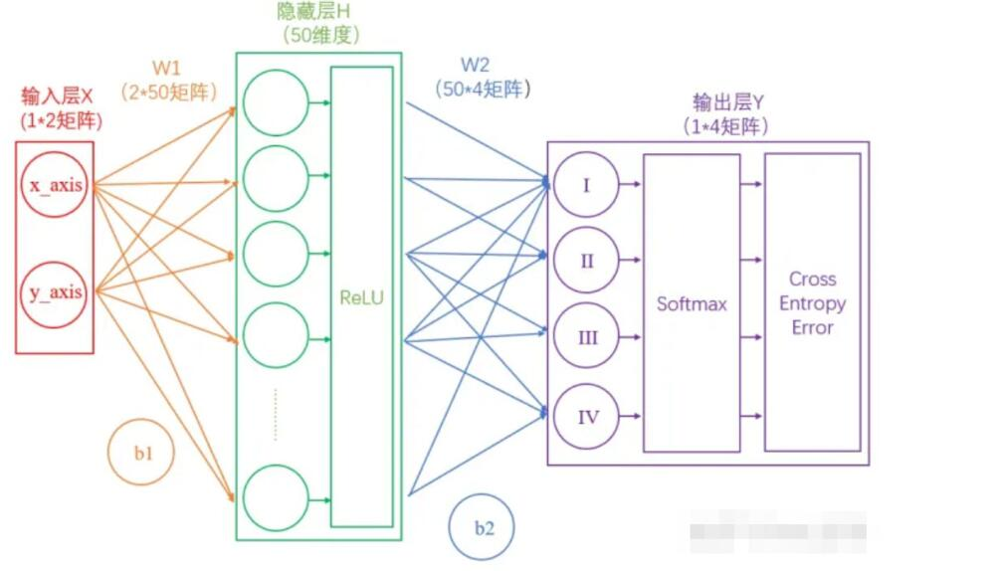
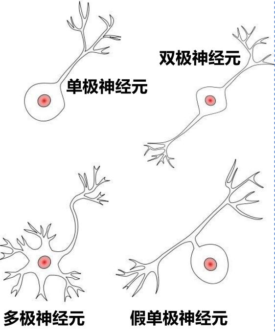
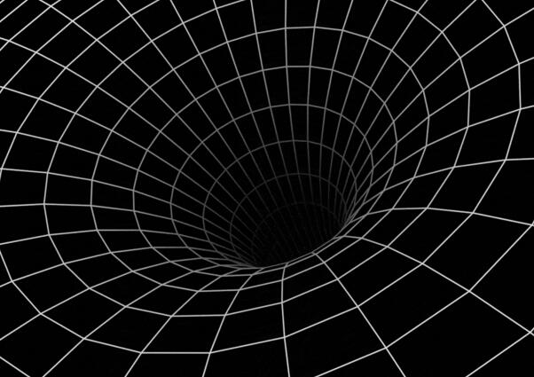
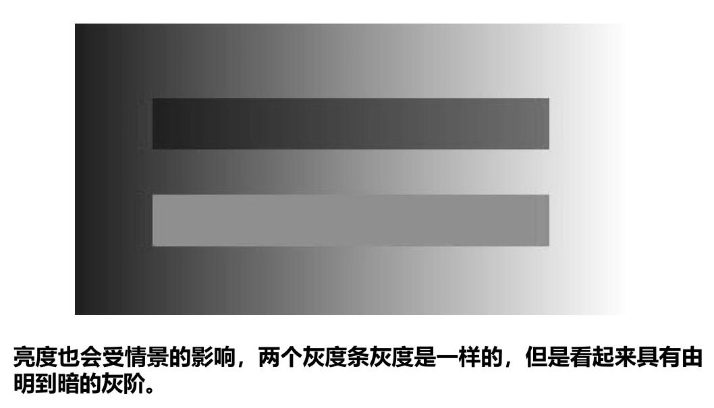
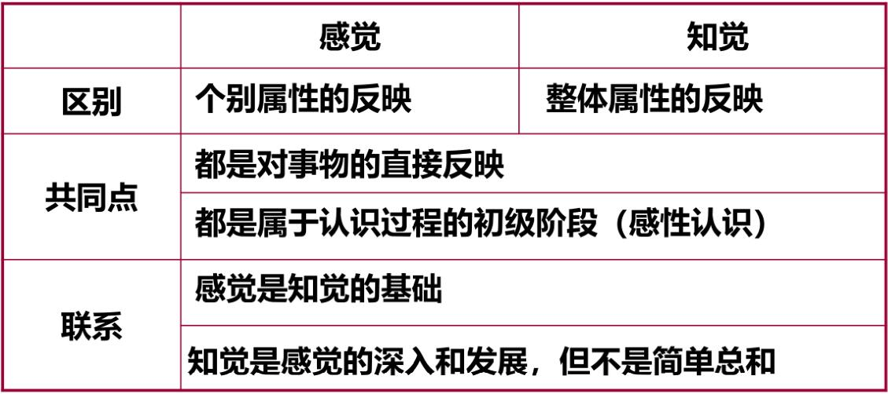
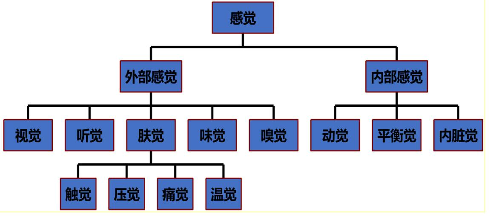
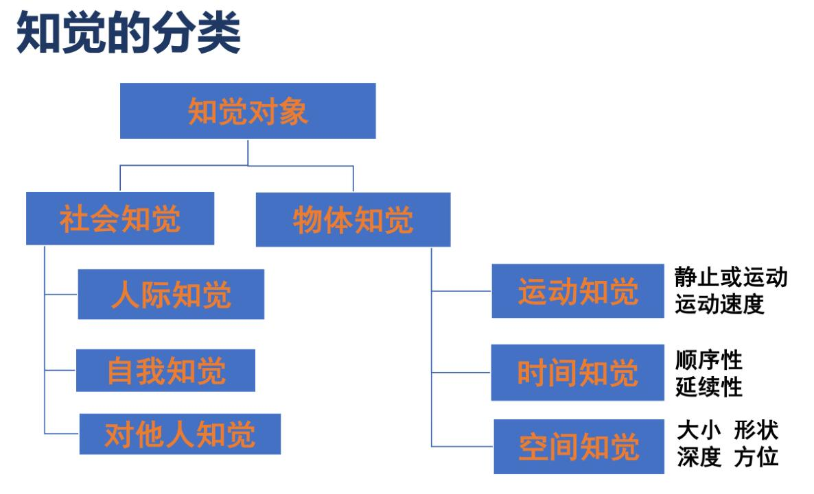
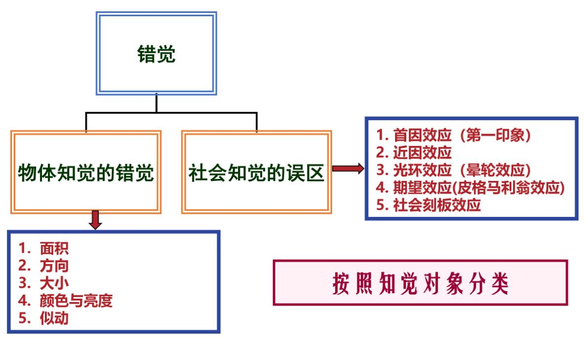

# 认知与计算

## 认知

内涵：自身以及与外界交互中的能动的过程总称。

外延：包括感觉、知觉、学习、记忆、注意、思维、想 象、语言、决策和行为等。

动态：根据任务需求自主完成“感知一分析一决策一执行”的动态过程，并能够应对意外情形。

## 认知金字塔

## 元认知

对认知的认知，依据认知对象对认知过程进行主动的监则以及连续的协调

## 认知信息的来源

嗅觉、味觉、视觉、听觉、触觉、平衡感、第六感等等。

## 脑的构成与功能

间脑位于两侧大脑半球之间，是脑干与大脑半球连接的中继站。

丘脑是间脑中最大的卵圆形灰质团块，对称分布于第三脑室两侧。除了嗅觉输入以外，其余感觉通道的信息都需要经过丘脑中的相应区域后到达初级感觉皮质

上丘脑位于背侧丘脑的后上方,包括缰三角、缰连合丘脑髓纹、松果体和后连合。松果体对光线敏感，与光照引起内分泌调节改变有关。

下丘脑是有调节自主功能、内分泌和内脏功能的皮质下中枢，下丘脑的某些细胞既是神经元又是内分泌细胞。调节体温、摄食、水盐平衡、内分泌。参与情绪过程并控制垂体来调节生理周期的节律。还可以通过向血液释放激素来远距离神经调控。

基底节是锥体外系统的中继站，各核之间有密切的纤维联系。基底节与大脑皮质及小脑协同调节随意运动、肌张力和姿势反射，也参与复杂行为的调节。

杏仁体与情绪控制、恐惧感、动机、非语言的情绪解读等有关。

**大脑区块**

额叶：中央前回是人脑控制运动的中枢，前额叶是人类高级认知活动的生理基础，负责计划、调节和控制人 的心理活动，对人的高级的、目标导向的行为有重要作 用；前额叶受损的人会带来诸多缺陷，如无法抑制自己 的行为、无法控制自己的情绪、无法有效的做计划与执 行计划、无法有工作记忆。(反向理解额叶功能)

顶叶：人类重要的感觉中枢，响应疼痛、触摸、品尝、温度、压力等感觉，顶叶还与注意功能、空间分辨以及数学逻辑相关。

颞叶：负责处理听觉信息，也与记忆和情感有关。

枕叶：负责处理视觉信息。

岛叶：与情绪功能及自主功能有关。

**注意点**

1. 大脑左右半球的分工并不是那么泾渭分明，功能的单侧化只具有相对的意义。
2. 大脑组织的两个基本原则是功能整合和功能分化，需要考虑局部属性和连接属性两个方面。
3. 大脑组织存在个体差异性，获得大脑组织的一般的特征和了解个体差异是相辅相成的，人脑的可塑性。
4. 无论如何分区，大脑作为整体大于各部分之和。

## 脑的三位一体

人脑的三位一体学说：古脑，也叫做爬行脑；旧脑，也叫做哺乳脑；最后一个是新脑，也就是大脑的新皮质

古脑：平衡、自动机能、呼吸心跳

旧脑：情感、直觉、哺乳、搏斗、逃避

新脑：高阶认知功能，老鼠失去了脑皮质，仍然可以正常活动

## 认知系统的模拟方法

1. 功能模拟（逻辑主义，符号运算系统，例如电梯）
2. 结构模拟（连接主义，人工神经网络，例如人脸识别）
3. 行为模拟（涌现主义，集智、群智、社会化，例如无人机蜂群）

# 方法与技术

## 心理学方法

这里验证大脑功能的方法有

- 反应时法
- 比较法
- 眼动分析法
- 口语报告法
- 内隐联想测验
- 计算机模拟法
- 损伤研究法

心理学方法设置的要点

1. 输入输出设置要精简全面
2. 测试流程简洁
3. 测试结果、测试流程、输入和输出之间的关系平衡
4. 定性分析和定量分析

## 人工成像系统的基本性能指标

基本指标（最小角分辨率，空间分辨率）如下

$$
1.22\lambda /nD
$$

其中$D$是口径，$n$是折射率，$\lambda$是入射波长。

## 空间分辨率的影响因素

见上

## 时间分辨率的影响因素

时间分辨率指的是帧率

## 脑成像包括的技术方法

- CT（计算机断层扫描）
- PET（正电子发射计算机断层扫描技术）
- SPECT（单光子发射计算机断层显像技术）
- 干涉成像
- MRI（磁共振成像技术）
- 光声成像技术
- FMRI（功能磁共振成像技术）
- EEG (脑电波)
- MEG（脑磁图）

## 脑电图和脑磁图的基本概念

# 神经与信息

## 新函数的出现对科技的推动作用

函数的发展：

1. 参数多
2. 形式复杂
3. 数函数并不能理解为传统的“显示表达”
4. 重大函数的发现，都能推进科学技术的显著进步

## 神经网络

理论上两层神经网络已经可以拟合任意函数

单个人工神经元可以用一个简单函数表示，人工神经元的串联相当于函数的嵌套，并联相当于函数间的线性组合。

## 激活函数的性质

1. 输连续并可导的非线性函数，可导的激活函数可以直接利用数值优化的方法来学习网络参数；
2. 测激活函数及其导函数要尽可能的简单，有利于提高网络的计算效率。
3. 激活函数的导函数的值域要在一个合适的区间内，不能太大也不能太小，否则回影响训练的效率和稳定性。

神经网络的传播都是形如Y=WX+b的矩阵运算；为了给矩阵运算加入非线性，需要在隐藏层中加入激活层；输出层结果需要经过Softmax层处理为概率值，并通过交叉熵损失来量化当前网络的优劣

## 神经系统的组成

神经系统主要由神经元、神经胶质细胞两种细胞组成。

数量众多的神经胶质细胞，几十倍于神经元，占脑容量的一半，有神经胶水之称，通常其胞体较小。

神经胶质细胞在形态上与神经元最大的区别是虽然有突起但没有形成明显的轴突，自身不传递信息。

## 神经元的组成及其功能

神经元是神经系统的基本结构和功能单位之一，可以分为细胞体、树突、轴突以及轴突终末。

细胞体又被称为核周体，其由细胞膜、细胞核、细胞质、细胞器组成，进行着维持生命的各种代谢活动。细胞质内有尼氏体(Nissl Body)，强嗜碱性，均匀分布，合成蛋白质、酶类、肤类。

树突表面有大量细小的突起，即树突棘。树突棘实际上是树突上的小突起。在树突棘的顶部有突触的连接点，负责接受刺激，并把刺激传向胞体(神经元之间通过神经递质传递神经信号的连接称为突触)。

神经元只有**一个**长细而均匀的轴突，轴突以及套在外面的髓鞘，被称为神经纤维，比树突长得多。轴突在细胞起始部被称为轴丘，轴丘内没有尼氏体，其兴奋性最高，往往是动作电位发起的地方。轴突进行动作电位的快速传导和物质的转运。

在脑和脊髓里，细胞体密集的部位色泽灰暗，叫灰质。在灰质里，功能相同的神经元细胞体汇集在一起，调节人体的某一项相应的生理功能，这部分结构就叫作神经中枢。

神经纤维主要集中在周围神经系统里，许多神经纤维集结成束，外面包着由结缔组织形成的膜，就成为一条神经。神经纤维末端的细小分支叫神经末梢，神经末梢分布在全身各处。

在脑和脊髓里，也有神经纤维分布，它们汇集的部位色泽亮白，叫白质。白质内的神经纤维，有的能向上传导兴奋，有的能向下传导兴奋。

神经胶质细胞的作用有：

1. 支持作用
2. 绝缘作用
3. 屏障作用
4. 营养性作用
5. 修复和再生作用
6. 维持神经元周围的K+平衡
7. 摄取神经递质

神经信息传播一般分两个阶段，即神经元内的传导过程和神经元间的传递过程。

在神经信号传播过程中，神经元的四个部分要产生四种类型的信号活动：输入信号、整合信号、传导信号和输出信号。

树突是神经元的输入和接受成分，细胞体是神经元的整合或总合成分，轴突为神经元的信号传送或传导成分，轴突终末为神经元的输出或分泌成分。

神经元机能最大的特点是特异的信息传递和处理，且具有传递信息的绝缘性和极性。

## 神经元类型

**按形状分**

1. 只有一个远离胞体的突起，此突起能分支形成树突和轴突，常见于无脊椎动物；
2. 两个突起，一个树突，一个轴突，一端接收一端传递，听觉、嗅觉、视觉等信息传递系统；
3. 一个轴突和多个树突，多见于运动和感觉系统中；
4. 一个树突，一个轴突，多见于脊髓背根神经节，躯体感觉神经细胞。

**按功能分**

1. 感觉神经元，或称传入神经元，多为假单极或双极神经元
2. 运动神经元，或称传出神经元，多为多极神经元
3. 中间神经元，介于前两种神经元之间，多为多极神经元。

**根据释放的神经递质分**

1. 胆碱能神经元
2. 胺能神经元
3. 肤能神经元
4. 氨基酸能神经元

## 神经信息的产生过程

在脑和神经元的细胞膜上一些称为离子通道的蛋白质分子允许离子流动，导致神经元细胞膜内、外的电位差，称之为膜电位。

在没有任何外来刺激情况下的膜电位称为静息电位，这时膜内相对膜外约为-70毫伏。

当神经元受到刺激发生兴奋时，在静息电位的基础上会发生瞬时的电位变化，这时膜内外的极性改变(即所谓的去极化作用)，此时的膜电位称之为动作电位(此时膜内可比膜外高出30–50毫伏)，它是神经元传导兴奋的电信号。

Na进K出。

## 神经信息编码

发放率编码：单个神经元强烈并且独立地放电，激活了下游的读出神经元

相关性编码：较弱但同步性的发放同样可以激活下游的读出神经元

发放率编码的效率比较低，但是抗噪音干扰的能力很强。

相关性编码可能会与外界刺激绑定，感觉神经元通过时间特征不同的激发模式，来代表不同的外界感觉刺激，例如 光、声音、味觉、嗅觉与触觉信号。

在一定条件下，神经系统可以在两种编码策略间进行动 态地“切换”，以达到更好的信息编码效果，这就是“动态 编码”。一个特殊的例子就是适应性期间，神经系统在接受 到恒定不变的刺激时，其反应强度会随着时间逐渐衰减。这 也就是所谓的“久居兰室，不闻其香”现象。

# 视觉与计算

## 眼睛的组成结构及其功能，其与人工成像系统相比所具有的优势

视觉信息感知和传递的过程中，眼睛执行两个功能：

1. 眼睛光学系统在眼底视网膜上形成外界物体的影像；
2. 视网膜将物像的电磁波能转换为视觉的神经冲动。

波长低于可见光的光分辨率高，但是衰减快，传播距离短。波长高于可见光的光虽然分辨率低，但是衰减慢，传播距离远。

眼睛分为：

1. 瞳孔

相当于相机的光圈。外面光线强的时候，瞳孔缩小；光线弱的时候，瞳孔变大，从而使眼睛里接受的光线总是恰到好处。一旦失调，则曝光不当。

2. 虹膜

相当于光圈的叶片。如果光线过强，虹膜内瞳孔括约肌收缩，则瞳孔缩小；光线变弱，虹膜开大肌收缩，瞳孔变大。根据虹膜内含色素的不同，虹膜呈现不同的颜色。白种人虹膜色素较少，呈灰蓝色；黄种人色素较多，呈棕黄色；黑人色素最多，呈黑色。

3. 巩膜

相当于相机壳。对眼球的内部结构起保护作用，占据整个眼球后面约5/6的范围，俗称眼白。

4. 晶状体

相当于全自动变焦镜头。位于瞳孔虹膜后面，呈双凸透镜。正常人既能看近又能看远，全依赖于晶状体的调节。看远时，睫状肌放松，悬韧带绷紧，晶状体变扁平，折光力减少；看近时，睫状肌收缩，悬韧带放松，晶状体依靠其本身弹性变凸，折光力增加。

通过如此调节，使光线能聚焦在视网膜黄斑上。如果通过调节，光线不能聚焦在视网膜上，就存在屈光不正。

- 光线聚焦在视网膜之前称为近视眼；聚焦在视网膜之后称为远视眼；
- 不能聚焦在一个点，称为散光眼；
- 如果晶状体的调节功能失调，如年老时，晶状体不能变凸，称为老视，即老花眼；
- 如果晶状体变混浊，就称为白内障。

5. 视网膜

视网膜相当于胶卷。起感光功能。感光最敏锐的那部分，称为黄斑。虽然视网膜很薄，结构却很复杂，分为10层，感光的细胞主要是视锥细胞和视杆细胞。视锥细胞主要负责明视觉和色觉，视杆细胞主要负责暗视觉。自然视网膜让人工技术难以望其项背。

视网膜又称为外周脑，与脑组织同源，起源于外胚层。

6. 脉络膜

相当于照相机的暗箱。主要由血管组成，因此还兼有营养眼球的责任。

## 立体视觉的分类

**单眼立体视觉**

**双眼立体视觉**

## 单眼立体视觉的因素因素

可以通过通过透视原理（绘画上的那个）来感知立体，也可以通过空气透视（想象大雾天远近的清晰度不一样），也可以通过光和阴影关系，也可以通过重叠效应、视野、单眼运动视差、调节效应、像的大小。

重叠效应：当两个图像重叠、轮廓线相交时，交点轮廓线平滑连续的图像比轮廓线不连续的看起来更近。见下

视野：人眼的视野颇宽，水平方向约220◦，垂直方向约130◦，呈一椭圆状。所以宽荧幕的立体感比窄银幕强。

单眼运动视差：由于视线方向的连续变化，单眼的视网膜成像也不断发生变化，这样，借助时间顺序的比较便形成立体视觉。这种利用观看者与物体间的相对运动使空间物体的相互位置产生变化，从而判断出物体间的前后关系，相当于连续地从几个方向观看景物，类似于有几只眼睛观看景物的状况。

当用单眼观看物体时，若眼睛位置不动，调节效应便是对深度感的唯一心理暗示，若允许观看位置移动的话，便可利用双眼视差这种效应从各个方向来观看物体，从而产生出深度感，这个效应便称为单眼运动视差。显然，单眼运动视差对静态物体不起作用。单眼运动视差这一视觉因素形成立体视觉的有效距离为300m以内。

调节效应：当人眼观看距离不同的物体时，为使物体能在视网膜上成像，人眼通过改变睫状肌的张弛程度来改变眼球晶状体的曲率，从而使晶状体凸透镜的焦距产生变化，达到视网膜上清晰成像。大脑就可以通过这个东西来判断远近。这一视觉因素单独起作用时，距离超过5m便失效了。

像的大小：视网膜成像的相对大小同样大小的物体，当观看距离不同时，在视网膜上成像的大小也不一样。

## 双眼立体视觉

双眼立体视觉：主要用于短距事物的感知。双眼立体视觉主要因素是双眼视差。

## 视觉的恒常性包括那些内容

当客观条件在一定范围内改变时，大脑知觉映象在相当程度上却保持着它的稳定性，即知觉恒常性。知觉恒常性是在日常生活中造成的，是先天和经历独特影响的。

外部世界投影在视网膜上产生了图象，大脑经过因素分解把这些影响传感器信息的条件，如照明条件、观察者的距和方位等因素分出去，得到纯粹的关于对象的信息，这些信息是不随这些条件而变的，因此被称为恒常性。

**双稳态视觉**

要么看见花瓶，要么看见人脸。即使可以切换，也只能同时看到一个。

**大脑预设的前提**

大脑预设了光从上面照下来，会看到左边凸，右边凹。如果预设光从下面来则相反。

**情景**

**亮度**

**分类**

大小恒常性，形状恒常性，方向恒常性，颜色恒常性，明度恒常性

其他恒常性：距离恒常性，速度恒常性，年龄恒常性，声音恒常性，语音恒常性

## 大脑解决问题的思路

大脑解决似是而非问题的思路是一个“猜测与印证＂动态交互过程。

在日常生活中，很多时候只需要一两个回合就能成功识别。但的确有的时候一个图像看得不太清楚，我们会盯着 它左看右看，大脑内部可能就进行了信息的上传、下传的交替，不断地进行“猜测-印证-猜测-印证”，只要印证结果 是否定的，这个过程就会一直进行下去，直到得到肯定的结果。

## 图像模糊的原因

- 透镜缺陷
- 相机抖动
- 场景运动
- 深度散焦

# 感知与运动

## 感觉与知觉的基本概念

人类对自身和外部世界的认知，都是从经验中获得的，而经验来源于感觉和知觉。

感觉：是人脑对客观事物个别属性和特征的直接反映。

知觉：人脑对客观事物各种属性、多种特征及其相互联系的综合性和整体性反映

## 感觉与知觉的区别和联系

感觉是人脑对客观事物个别属性和特征的直接反映，知觉则是人脑对客观事物各种属性、多种特征及其相互联系的综合性和整体性反映。

感觉系统处理的是某种感受器感受到的未经整合的具体刺激信息，知觉系统处理的则是多种感受器整合组织后的信息。

## 人类五种基本的感觉系统

其中肤觉又叫躯体感觉。肤觉下面还可以加一个痒觉。内部感觉还可以把动觉分为震动觉和运动觉，还可以再加上饥感、渴感。

其中物种基本感觉是：听觉、视觉、嗅觉、味觉、躯体感觉。

## 典型感觉的感受器及其适宜刺激

感受刺激的步骤为：

1. 感受器感受物理刺激
2. 神经元将刺激转化为神经信息
3. 大脑加工信息后产生知觉或有意识的感觉体验

感觉剥离实验告诉我们：生命活动的维持需要一定水平的外界刺激。

## 感觉信息编码时，刺激信息的基本属性

刺激信息只有四个基本属性：模态-位置-强度-时间

- 模态：标记线性编码（感受器特异性）
- 位置：空间分布编码
- 强度：动作电位频率编码
- 时间：时间适应率编码

## 知觉的特性及影响因素

知觉的特性为：

1. 选择性

我们并非对一切刺激都全部接收，我们有选择地接受少数事物作为知觉的对象。例如双稳态视觉。

影响因素有：客观上：对象与背景的差别；对象的活动性；对象各部分的组合；主观上：兴趣；需要；情绪

对象和背景是相互依存、相互转化的。

2. 整体性

对象可能由不同的部分组成，但我们的知觉并不看做孤立的部分，而是当作一个整体。

组织定律：接近律（距离上近的容易被知觉组织在一起）、相似律（物理属性相似的容易被组织在一起）、连续律（具有连续性或者共同运动方向的刺激）、封闭律（倾向于将缺损的轮廓加以补充使知觉成为一个完整的封闭图形）。

影响因素：对象各组成部分的强度；对象各组成部分的相互关系；个体生活经验和知识储备。

3. 理解性

人在知觉客观事物时，总是根据已有的认知经验来解释它，赋予它一定的意义，并用词把它标志出来。

影响因素：个人的知觉经验；言语的指导作用；实践活动的任务。

4. 恒常性

当知觉的客观条件在定范围内改变时，知觉的印象仍然相对地保持不变，知觉的这种特性称为知觉的恒常性。

**大小恒常性**

指在一定范围内，个体对物体大小的知觉不完全随距离变化而变化，也不随视网膜上视像大小的变化其知觉映象仍按实际大小知觉的特征。

**形状恒常性**

物体形状的知觉不因它在网膜上投影的变化而变化。

**明度恒常性**

当照明条件改变时，人知觉到的物体相对明度保持不变的知觉特征。

**颜色恒常性**

指有颜色的物体（熟悉的），当其表面颜色受到照明等条件的影响而改变时，个体对颜色的知觉不因色光改变而改变，趋于保持相对不变的知觉特征。

## 错觉的分类

错觉是对客观事物的一种不正确的、歪曲的知觉。

错觉是知觉的一种特殊状态。

物体知觉的错觉的原因假说有：

1. 眼动说
2. 常性误用说
3. 神经位移说
4. 混淆或错误比较说
5. 对比和同化说

社会知觉误区有：

1. 第一印象
2. 近因效应
3. 光环效应
4. 期望效应
5. 心理定势
6. 生活中的刻板印象

## 听觉信号的转换过程

1. 耳道引起鼓膜震动
2. 鼓膜的震动引起三块小骨-锥骨、镫骨和钻骨上相震动,能将声音传递至充满淋巴液的内耳
3. 内耳可产生神经冲动,冲动沿听神经转为神经能,从那儿声音的信息就传到大脑

## 等响曲线的理解

由于耳朵的结构，我们感受到的响度和声音的频率有关，不仅局限于声压级的影响。

## 听声辩位的原理

- 耳间时差：声音到达两耳的时间不同，分辨率为10$\mu s$
- 耳间强差：声音在两耳的强度不同，分辨率为1dB

# 学习与记忆

## 脑神经科学，学习、记忆的定义

学习：人或动物通过神经系统获取新信息和新知识的神经过程

记忆：对所获取信息的保存和读取的过程

## 多媒体解释学习认知模型

多媒体学习把认知分为三个基本过程

1. 选择

对所呈现的语词和图像相关部分予以注意，把感觉记忆中的信息转化到工作记忆中。

2. 组织

对已经选择的语词进行组织，以形成连贯的言语模型；对已经选择的图像进行组织，以形成连贯的图像模型；在工作记忆中深层加工信息。

3. 整合

将声音表征和图像表征相互联系起来，并与原有知识相结合；把长时记忆中的知识转换到工作记忆中同时也调整长时记忆内容。

学习过程中最重要的是认知表征。

认知表征是指个体经知觉而将其外在环境中的物体或事件转换为内在心理事件的过程，人类获得知识的过程就是对事件进行认知表征的过程。认知表征的实质其实就是观念、事件和事物在心中是如何被储存和被概念化的。

## 赫布理论 突触可塑性

突触可塑性（Synaptic plasticity）是指神经细胞间的连接，即突触，其连接强度可调节的特性。突触的形态和功能可发生较为持久的改变的特性或现象。

赫布理论(Hebbian theory)描述了学习过程中突触可塑性的基本原理，即突触前神经元向突触后神经元的持续重复的刺激可以导致突触传递效能的增加。

赫布理论也是非监督学习的生物学基础。

## STDP 学习规则

Henry Markram提出STDP(Spike Timing Dependent Plasticity) ：根据神经元学习的先后顺序，调整神经元之间连接的强弱——即大脑中神经元之间权重连接的更新规则。

STDP可以说是赫布理论的一种延伸。赫布理论强调两个神经元经常一起活动，则二者的连接会增强。

STDP则进一步说明，两个神经元之间的活动，如果其他神经元的信息在本身活动产生之前，则两神经元之间的连接会增强。如果神经元本身产生活动之后才接受其他神经元传来的信息，则两神经元之间的额连接会减弱。如果两个神经元的发放在时间上离的越近，他们之间的绑定关系就越紧密。（这段话摘自老师PPT，我的评价是狗屁不通，见下面的例子）

对于神经元$i$而言，如果神经元$i$传递信息之后，神经元$j$才产生反应，那么类似于因果关系，它和传递信息的神经元之间连接$G(j->i)$会加强。

如果$i$产生反应之后，$j$才传递信息来，那么这个信息就有可能被忽略，$i$和$j$的连接$G(j->i)$就会减弱。

当突触前神经元的峰电位先于突触后神经元峰电位产生，即$t^{pre}_j<t^{post}_i$，则连接两个神经元间的突触权值变大；反之，权值变小。

突触前脉冲先于突触后脉冲到达时，能够引起长时程增强$LTP$；反之引起长时程抑制$LTD$

## 脉冲神经网络 脉冲形式处理

传统神经网络算法仍然依据于使用高精度的浮点数进行运算， 然而人脑并不会使用浮点数进行运算。 在人的传感系统和大脑中， 信息会以动作电压或称之为电脉冲（electric spike）的形式传递，接受，和处理。因此，产生了脉冲神经网络——第三代人工神经网络。

## 迁移学习：脑认知和人工智能领域定义、包含的类型

**脑认知领域中**

迁移学习：一种学习对另一种学习的影响。

知识可以迁移，动作技能、情感、态度、习惯等都可以迁移。

迁移学习分为：

- 顺向迁移：先前的学习对后来学习的影响
- 逆向迁移：后来的学习对先前学习的迁移

也可以分为

- 正迁移（positive transfer）：指一种学习中学得的经验对另一种学习起促进作用
- 负迁移（negative transfer）：指一种学习中学得的经验对另一种学习起阻碍作用

也可以分为

- 水平迁移(侧向迁移）：已习得的概念、规则或解决问题的方法在新的情境中的运用
- 垂直迁移(纵向迁移）：:低级概念和规则向高级概念和规则的迁移

也可以分为

- 特殊迁移（special transfer）：具体知识和动作技能的迁移
- 一般迁移（nonspecial transfer）：原理和态度的迁移。这一类迁移是教育的核心。

**人工智能领域中**

迁移学习涉及到两个概念，分别是域和任务。域，与特定数据集的特征空间和特征的边际概率分布有关；任务，与数据集的标签空间和目标预测函数有关。迁移学习的目的是将从某一个域（通常称为源域）任务中学习到的知识迁移至另一个域（通常称为目标域）的任务上。

迁移学习的方法包括

- 基于数据

主要通过改变源域数据来达到知识迁移的目的。例如数据增强，提升源域数据的丰富程度，减小源域数据与目标域数据的差异。

- 基于特征对齐/转换

主要通过将源域和目标域的特征进行对齐或转换来进行知识的迁移。例如DANN模型。

- 基于模型

通过调整模型的参数、集成模型等方式来进行知识迁移。例如将在源域内训练好的模型在目标域数据上加以微调。

## 元学习定义 学会学习 选择题

**脑认知领域中**

元学习是学习者意识到并逐渐控制自己已经习惯化了的感知、查询、学习和成长的过程，这一过程体现了“学会学习”的内涵。

**人工智能领域中**

利用元数据来理解如何提升学习在解决问题时的灵活性，从而提升现有学习算法性能或诱导学习算法对自身进行调整和学习的手段。元学习最大的颠覆性在于其将学习的对象由数据提升至了学习任务。

## 学习形成记忆的分子机制

海兔，神经系统只有2w个神经细胞。具有一种可以保护鳃的简单保护性反射，可以用来研究基本的学习机制。

“短期记忆”的机制是由于离子通道受影响，使更多的钙离子进入神经末梢。由此，导致神经突触释放更多的神经递质，从而使反射加强。这些转变是由几个离子通道蛋白的磷酸化所致。

长期记忆需要生成新的蛋白质。

长期记忆与短期记忆均发生在突触部分。

## 短期记忆到长期记忆

持续重复的刺激。

## 记忆的基本过程

1. 编码或登录。感知外界事物或接受外界信息(外界刺激)的阶段，也即通过感觉系统向脑内输入讯号一学习过程。
2. 存储：获取的信息在脑内贮存和保持的阶段。
3. 提取或再现：将贮存于脑内的信息提取出来使之再现于意识中的过程一一回忆过程。
4. 遗忘：是对识记过的材料不能再认与回忆，或者错误的再认与回忆。

## 记忆的类型

## 短期记忆

如前图所述。

短期记忆中，乱序的、无意义的东西，比有序的、有意义的东西记忆容量要小。

## 长期记忆分类

老实说我觉得记住深度为2的节点就行，更下面的了解一下。

## 多重存储记忆模型 电话号码、圆周率形成长期记忆

该模型认为，信息首先被存储在感觉记忆中，被注意选择的事件将进入短时记忆。一旦进入短时记忆，如果事件被复述则可以进入长时记忆，并且信息在每一个阶段都可能遗失，其原因可能是衰退、干扰，或者两者的结合。

多重存储记忆模型有两个重要过程：

- 注意。感觉记忆通过“注意”进入短时记忆，没注意的就很快消失。
- 复述。短时记忆的保留时间也很短。但是，通过复述(重复背诵)可以使得信息在短时记忆中保持更长的时间并且可以存储到更加持久的长时记忆中。

## 工作记忆模型定义 绘制 Baddeley-Hitch 工作记忆模型

工作记忆是指在执行认知任务过程中，用于已知的或新的信息提供暂时储存与加工的容量有限的系统。这种记忆一般持续数秒，易被抹去，并随时更换。

工作记忆=短时记忆+控制加工系统

Baddeley-Hitch工作记忆模型认为工作记忆由语音回路视觉空间模板和中央执行系统组成。

- 语音回路负责以声音为基础的信息储存与控制，

- 视觉空间模板主要负责储存和加工视觉信息，

- 中央执行系统是工作记忆的核心，负责各子系统之间以及它们与长时记忆的联系、注意资源的协调和策略的选择与计划等。

由于有些东西不能被原版模型解释，Baddeley又加入了情景缓冲区的概念。

## 不同脑区的功能 不同脑区负责不同形式的记忆产生与存储

**非陈述性记忆**

- 小脑：运动性技巧记忆
- 杏仁核：情绪性记忆
- 纹状体：习惯化行为记忆

**陈述性记忆**

- 间脑（丘脑）：连接大脑皮层，是短期记忆向长期记忆过度的关键脑区。
- 前额皮层工：作记忆，长时情节记忆和抽象的语义记忆。
- 海马(内侧颞叶)： 短期(几分钟到数周) 空间方位和情节性事件记忆。海马相当于大脑中的图书管理员，将信息长期储存于大脑皮层。

## HM 病人

HM，被切除了双侧颞叶内侧。记忆维持不到30秒，虽然无法记得刚讲过的话、刚阅读过的文字、刚看过的照片，但其它的心智功能并不受到影响。

这称为顺行性失忆。

## 海马体

长期记忆存储转换、空间位置定向

## 记忆遗忘曲线 密集学习 间隔学习

艾宾浩斯遗忘曲线，过于著名，无需介绍。

这个告诉我们，应该采用间隔学习而不是密集学习。比如我们应该一个星期背十遍单词，而不是一天背十遍。

## 人工智能专业 记忆存在在哪里 并举出一个例子

PPT没给，我猜测是存在神经网络之中。

例子：利用预训练好的GAN（生成对抗网络）作为记忆存储器；提取GAN中的知识记忆，并作为先验指导人脸图像的修复。

## 贝叶斯大脑定义 贝叶斯定理

大脑可能遵循贝叶斯定理。大脑不是外部世界刺激信号的“记录机”，而是在先验知识引导下，主动进行加工、推理与生成预测。

## 贝叶斯网络

贝叶斯准则和图论相结合形成贝叶斯网络。

# 沟通与语言

## 语言的广义和严格定义

语言就广义而言，是一套共同采用的沟通符号、表达方式与处理规则。

严格来讲，语言是由语音、词汇和语法构成并能表达人类思想的符号系统。

## 不同生物的沟通方式

- 果蝇：嗅觉、拍打、唱歌
- 蜜蜂：跳舞
- 长尾猴：吼叫
- 红毛猩猩：手势

## 研究动物沟通有助于了解人类语言演化

无

## 人类语言关键不在于喉咙结构，而在于脑区！

无

## 人类语言演化历程

30w年前有口语（喉头位置推断），17w年前有语法（FOXP2基因），5w年前有壁画，6000年前有文字。

## 语言不是人类独有的

无

## 布罗卡失语症 表达性失语症

Broca区（按高中来说是S区）负责说话、发音。Broca去病变引起运动性失语症或表达性失语症。阅读、理解、书写不受影响，知道想说什么，但是发音困难。

## 韦尼克失语症 感知性失语症

Wernicke区（H区）负责听懂说话。病变时可以正常流利讲话，但是话可能没有意义，并且不能听懂他人讲话。并且自己意识不到自己的问题。也叫听觉性失语症。

## 其他失语症：失读症 失写症 命名型失语症

视觉性语言中枢也称阅读中枢（V区）。病变时，不能读懂字，称为失读症。

书写性语言中枢也称书写中枢（W区）。病变时，写字、绘画等精细运动出现障碍，称为失写症。

命名型失语症即患者不能说出一个东西的名字，得靠手势描述等方法才能指明手边的物件。

## 心理词典 大脑中词汇组织方式

心理词典根据单词间的意义关系组织起来。比如car和truck、bus、taxi关联起来。cat和dog、rabbit、mouse关联起来。

不同性质的词汇会被储存在不同的脑区。

## 语言对认知的影响

不同语言的母语者对于一些事物的认知有区别。

## 自然语言处理的发展历程

1. NLP-规则时代

机器只能理解规则和逻辑，把语言抽象成规则和逻辑

2. NLP-统计模型时代

一个句子是否合理，取决于其出现在自然语言中的可能性

3. NLP-DL1代

本质上还是概率模型，用NN计算概率语言模型的参数。这是一个过渡期，使用向量法。

4. NLP-DL2代

RNN及类RNN时期。

5. NLP-DL3代

使用预训练语言模型（Transformer-GPT/BERT）

## 每个人的语言区定位都不同。虽然每个人都有类似的语言区， 但是语言区在大脑的定位都不同。

无

# 情感与计算-报偿与成瘾

## 动机的定义 与 分类

动机是引起个体活动，维持并促使活动朝向某一目标进行的内部动力。

动机可以分为两类：

- 生理动机：为了降低基本生理需求（很奇怪的一句话，难道不是维持吗）。这个动机的行为称为摄取行为，为了维持生理恒定。
- 奖赏动机：并无非要不可的理由，不符合降低基本需求的条件。这个动机的行为称为欲望行为，为满足奖赏（报偿）动机。

## 动机激发过程

## 动物动机强弱

**定义**

动机的强弱可由“获得奖励”的努力去评估。

在缺乏立即目标的情况下，动物产生奖赏动机，并必须利用过去学习的经验来预测获得奖赏的可能性。可能包含：

1. 经典条件反射：又称为经典制约。例如巴甫洛夫狗与食物关联。不受意识控制的非自愿行为。
2. ，目标导向的操作条件反射：又称为操作性制约。这是受意识控制的自愿行为。（强化学习的原理）

**测量方法实验**

静脉自身给药模型，脑电击奖赏模型，条件性位置偏爱。

**可卡因剂量实验测量动机大小**

**多巴胺与动机关系**

多巴胺可以引起兴奋、欣快的感觉。

多巴胺的水平对于“报偿效应”十分关键。

当人作出某一决策后，如果被证实正确并产生了好的结果，大脑会向负责决策的区域发送“报偿”信号，这会促进人的认知能力进一步提升，形成良性循环，这被称作报偿效应。

而报偿效应和奖赏动机的关系见前。

**脑电击奖赏模型测量多巴胺与动机关系**

**环境连结实验喜爱程度去评估动机大小**

**更喜爱哪个环境来比较动机大小**

见上

**药品上市之前的实验**

无

## 引起兴奋、欣快感觉的脑内物质

有三种: 多巴胺、血清素和内啡肽

## 多巴胺报偿途径

有两条，起点都位于中脑，一条成瘾通路，一条与惯性学习、程序性记忆有关

## 多巴胺何时释放、设计实验验证

多巴胺在期待奖赏的时候会大量释放。

多巴胺神经元对奖赏出现反应。

多巴胺神经元对预测奖赏反应，但对奖赏出现没有反应。

多巴胺神经元对预测奖赏反应，但对奖赏未出现产生抑制反应。

## 多巴胺突出效能调整过程

关于大脑奖赏系统，多巴胺的作用不是实现奖赏，而是奖赏的预期，也就是说某种行为能够导致获得奖赏的期望有多大。

强化学习的过程就是使得每个行为决策的改进都朝向提高奖赏期望的方向。

多巴胺强化学习的作用要依赖试错学习过程的记忆，因此海马和杏仁核作用很关键，有短期和长期作用，**短期作用**依赖于突触间隙中多巴胺浓度的调整，能够短期强化某种行为或者大脑网络，**长期作用**则依赖突触后神经元受体数量的调整，能够长时间强化某种行为或者大脑网络。**两者**可以统称为多巴胺突触效能调整。

## 成瘾带来痛苦 不是快乐

毒品“绑架”脑中的报赏中枢。

成瘾性最高的毒品如海洛因，甚至可能打一、两次就会成瘾。成瘾后会产生耐受性，造成需要更大量的药物，才能得到同样的效果，否则就会产生身心双重痛苦。因此大部分人一旦上瘾，不是为了追求快乐，而是为了避免戒掉的痛苦才会继续。

## 毒品戒断症状定义 与多巴胺水平的关系

戒断时期，多巴胺急速下降，比药物使用前还低。

## 成瘾的正负强化机制

所有的毒品都有两种作用，毒品通过两种作用协同作用引起**精神依赖**和**生理依赖**，即正性强化与负性强化。

- 正性强化:初期吸毒后可产生强烈的欣快感和松弛宁静感，这种感觉能满足吸毒者的心理需要，产生精神依赖，吸毒者会再次吸毒;

- 负性强化:成瘾后，停止吸毒后会产生难以忍受的痛苦，也就是通常所说的“戒断症状”产生身体依赖，吸毒者只得继续追求药物。这两种强化使人成瘾并难以自拔。

## 成瘾对脑造成长期性伤害

古柯碱、酒精、鸦片类与安非他命等滥用药物，都会霸占脑部原有的报偿线路。

重复使用这些药物，会造成脑部化学与构造上的长期变化，因而改变报偿系统神经元处理信息与互动的方式。

## 成瘾难以戒除的原因：树突棘、神经结构、多巴胺系统

树突棘增加可放大神经元间的信号，也可能让脑部对引发联想的东西过度反应，或许这便是成瘾难以戒除的关键。

其他几个见上节。

## 烟瘾成瘾过程

尼古丁会刺激抑欲系统，直到其活性会超过欲求系统。大脑迅速产生适应，大幅增强欲求系统的活性，试图恢复平衡。

尼古丁效应逐渐消退后，抑欲系统不再受到刺激而回到较低的活性状态。但因为受到戒断相关适应的促进作用，欲求系统超越了抑欲系统的活性，因而渴望可以抑欲的事--再抽一根烟。

## 赌瘾和毒瘾没什么区别 都会类似方式重组神经回路

无

## 咖啡不会上瘾 只会产生依赖性 致瘾药物必须摄取量逐渐增加才能发挥作用

无

# 情感与计算-理性与感性

## 前额叶

**主要功能**

执行具有意义的目标导向行为

**组成部分** 

背外侧、腹内侧、眶额回

**每部分的主要功能**

前两部分负责认知处理。眶额回主要和情绪处理相关。

## 灵长类生物的前额叶面积更大

无

## 前额受损病人心智产生的影响 设计实验

1. 无法抑制自己的行为
2. 无法控制自己的情绪
3. 无法有效的做计划与执行计划
4. 无法有工作记忆

前额叶是有限理性。

## 情绪不是什么 关于情绪的说法 情绪与认知关系

不是情景的思考整合。不是推理。当人们情绪激动时，它不能透过称述心中的想法来了解这个情绪。

- 刺激→ 激发→ 认知→ 感觉。
- 情绪刺激的评估理论：情绪是对任何被评为好的有正感觉倾向，对任何被评为不好的有远离感觉倾向，这个评估的历程是潜意识的。刺激→ 评估→ 动作倾向→ 感觉。
- 感情优先理论。刺激→ 潜意识的感情→ 感觉

情绪和认知是分开的，但相互作用的心智功能，是靠着不同但有互动的大脑系统来媒介运作的

## 恐惧情绪 高低通路 解释盲视病人

- 低通道：丘脑到杏仁核：恐惧感受可以在快速且无意识状态下刺激杏仁核。

- 高通道：丘脑到视觉皮层看清晰图像之后，再传回杏仁核。

模糊图像比清晰图像更让人产生恐惧情绪

盲视（blindsight）的人看不见物体却能躲避障碍，是因为走了低通道。

## 情绪的长短通路 各有什么特点 画图表示

长通路称为“理性脑”，短通路称为“情绪脑”。

除了路径长短外：长通路携带信息多，对信息的加工更为精细，需要更长时间。短通路只能携带少量信息，速度很快。

## 人脑三位一体 爬行脑 哺乳脑 新脑

见前。

补充：古脑（爬行脑）是本能脑或者生存脑；旧脑（哺乳脑），主要是边缘系统，是情绪脑；新脑（新皮质，新哺乳动物脑），是视觉脑或智慧脑或理性脑。

## 6 种基本情绪、对应脑区

生气（眶额皮质，扣带前回）、快乐（没写）、厌恶（前脑岛，扣带前回）、惊讶（没写）、伤心（杏仁核，右侧颞极）、恐惧（杏仁核）

## 杏仁核受伤病人 

不知恐惧：分辨表情、画恐惧表情、恐惧制约

## 恐惧制约实验

无

## 意识记忆与海马 情绪记忆与杏仁核

海马区：情景记忆（意识记忆、情节记忆）

杏仁核：情绪记忆

意识记忆和情绪记忆脑机制不同。

## 镁光灯记忆

无

## 3 岁以内的孩子没有记忆，但有创伤性记忆

无

## 情绪与决策

## 情绪与心理障碍、焦虑、社会感情

焦虑是来自内心，恐惧是来自外界。

焦虑是一个不可化解的恐惧。

罪恶感、羞耻心、嫉妒、困窘、骄傲等，这些与社会行为有关的感情，发展的时间都晚于另一些比较基本的感情像是快乐、恐怖等

社会感情引领我们的复杂的社会行为，包括渴望帮助他人以及想要惩罚欺骗着，即使需要付出代价也在所不惜

## PTSD 相关脑结构和功能的变化

1. 前扣带回：体积变小，活性降低；认知功能有关；与前额叶构成注意监控系统；检测冲突和可能出现的错误

2. 内侧前额叶：体积变小，活性降低；认知功能有关；情绪控制密切相关

3. 杏仁核：过度活跃，经常产生异常情绪反映；恐惧

4. 海马：体积变小，影响记忆形成

## 感情调节方式：分心，重新评估

- 分心：把注意力转到别的事情上，往往通常是暂时的

- 重新评估：借由重新思考某个事件的意义，来改变你对它的感受。擅长重新评估的人，多半情绪比较稳定(EQ较高)。看心理医生能获得的好处，也是因为改善了重新评估的能力，用比较建设性的方式去看事情。

# 情感与计算-选择与决策

## 画图表示选择引起的情绪变化、并解释

## 极大化者和满足化者定义

- 极大化者：做任何决定都寻求最好的结果，不停的在各种选择之间比较，期待找到一个最好的选择
- 满足化者：只要找到了符合自己标准的东西，就立即停止，不会继续找下去。

## 选择多失落感越深的原因分析

**机会成本**

为了得到某种利益而所要放弃另一些利益的最大价值，被放弃的就是机会成本

**沉没成本**

人们在做出决策时，往往会受到过去的决策和损失的影响，从而导致对当前决策的不满和后悔。

当人们已经投入了一定的时间、金钱或其他资源，但是最终决策并不理想，这些投入就会成为沉没成本。

**后悔心理**

后悔心理是指当人们面临难以避免的选择时，经常会因为过去的决策而后悔，

**损失规避心理**

失去的痛苦要远大于得到的快感。

**适应心理**

适应现象简单的说是指我们会对事物产生习惯，所以生命中很少会有事物像我们所预期的一样好。

**高期待高失望**

## 选择障碍的建议

- 选择何时做选择（限制选择范围）
- 学习接受“够好了”
- 错过的就别烦恼
- 控制你的期待

## 该用脑袋的哪个部分做决策

## 定势效应 及 建议

定势效应：人们在认知活动中习惯用已有的知识经验，来看待当前的问题。也会因为在固定的环境中工作和生活，久而久之形成一种固定的思维模式。也习惯于从固定的角度来观察、思考和接受事物。

这种认知捷径，有时会忽略更有效或者更适合的方法

# 人工与系统

## 类脑研究的目标

目标是人造超级大脑。

数值计算为基础的虚拟超级脑和以虚拟脑与生物脑为基础的脑机一体化超级大脑

## 为了实现类脑计算系统，从哪些方面理解脑计算？

- 明确不同尺度脑信息处理的基本单元
- 明确脑信息处理的重要原理和过程
- 揭示脑功能进化的过程和原理

## 类脑研究存在的挑战

## 脑机接口的定义和应用

脑机接口(BCI)，也称作脑机融合技术，就是通过芯片和传感器，用大脑控制各种设备，也可以向大脑反馈触觉信息，再来指导输出，形成一个闭环。对患者或者常人难以企及的应用场景有着重要意义。

## 正常人和心理变态罪犯的在处理负性情绪时的活性脑区不一样

无

## 人工智能发展所面临的风险并解释

## 2019 年两项人工智能伦理原则 八项原则

