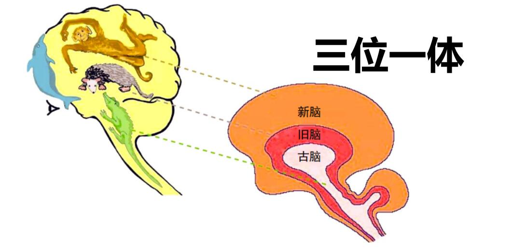

# 认知与计算

## 认知

内涵：自身以及与外界交互中的能动和过程总称。

外延：包括感觉、知觉、学习、记忆、注意、思维、想 象、语言、决策和行为等。

动态：根据任务需求自主完成“感知一分析一决策一执行”的动态过程，并能够应对意外情形。

## 认知金字塔

## 元认知

对认知的认知，依据认知对象对认知过程进行主动的监则以及连续的协调

## 认知信息的来源

嗅觉、味觉、视觉、听觉、触觉、平衡感、第六感等等。

## 脑的构成与功能

间脑位于两侧大脑半球之间，是脑干与大脑半球连接的中继站。

丘脑是间脑中最大的卵圆形灰质团块，对称分布于第脑室两侧。除了嗅觉输入以外，其余感觉通道的信息都需要经过丘脑中的相应区域后到达初级感觉皮质

上丘脑位于背侧丘脑的后上方,包括缰三角、缰连合丘脑髓纹、松果体和后连合。松果体对光线敏感，与光照引起内分泌调节改变有关。

下丘脑是有调节自主功能、内分泌和内脏功能的皮质下中枢，下丘脑的某些细胞既是神经元又是内分泌细胞。调节体温、摄食、水盐平衡、内分泌。参与情绪过程并控制垂体来调节生理周期的节律。还可以通过向血液释放激素来远距离神经调控。

基底节是锥体外系统的中继站，各核之间有密切的纤维联系。基底节与大脑皮质及小脑协同调节随意运动、肌张力和姿势反射，也参与复杂行为的调节。

杏仁体与情绪控制、恐惧感、动机、非语言的情绪解读等有关。

**大脑区块**

额叶：中央前回是人脑控制运动的中枢，前额叶是人类高级认知活动的生理基础，负责计划、调节和控制人 的心理活动，对人的高级的、目标导向的行为有重要作 用；前额叶受损的人会带来诸多缺陷，如无法抑制自己 的行为、无法控制自己的情绪、无法有效的做计划与执 行计划、无法有工作记忆。(反向理解额叶功能)

顶叶：人类重要的感觉中枢，响应疼痛、触摸、品尝、温度、压力等感觉，顶叶还与注意功能、空间分辨以及 数学逻辑相关。

颠叶：负责处理听觉信息，也与记忆和情感有关。

枕叶：负责处理视觉信息。

岛叶：与情绪功能及自主功能有关。

**注意点**

1. 大脑左右半球的分工并不是那么泾渭分明，功能的单侧化只具有相对的意义。
2. 大脑组织的两个基本原则是功能整合和功能分化，需要考虑局部属性和连接属性两个方面。
3. 大脑组织存在个体差异性，获得大脑组织的一般的特征和了解个体差异是相辅相成的，人脑的可塑性。
4. 无论如何分区，大脑作为整体大于各部分之和。

## 脑的三位一体

人脑的三位一体学说：古脑，也叫做爬行脑；旧脑，也叫做哺乳脑；最后一个是新脑，也就是大脑的新皮质

古脑：平衡、自动机能、呼吸心跳

旧脑：情感、直觉、哺乳、搏斗、逃避

新脑：高阶认知功能，老鼠失去了脑皮质，仍然可以正常活动

## 认知系统的模拟方法

1. 功能模拟（逻辑主义，符号运算系统，例如电梯）
2. 结构模拟（连接主义，人工神经网络，例如人脸识别）
3. 行为模拟（涌现主义，集智、群智、社会化，例如无人机蜂群）

# 方法与技术

## 心理学方法

这里验证大脑功能的方法有

- 反应时法
- 比较法
- 眼动分析法
- 口语报告法
- 内隐联想测验
- 计算机模拟法
- 损伤研究法

心理学方法设置的要点

1. 输入输出设置要精简全面
2. 测试流程简洁
3. 测试结果、测试流程、输入和输出之间的关系平衡
4. 定性分析和定量分析

## 人工成像系统

基本指标（最小角分辨率）如下

$$
1.22\lambda /nD
$$
