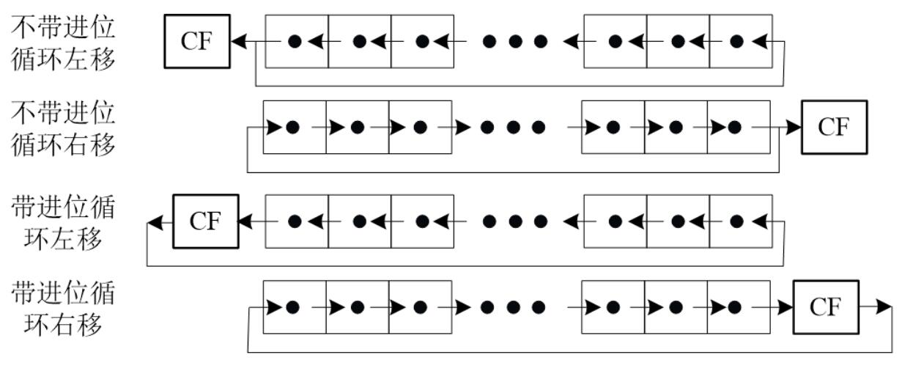

# 简称表

| 简称        | 含义        |
|:---------:|:---------:|
| CPU       | 中央处理器     |
| PC        | 程序计数器     |
| IR        | 指令寄存器     |
| CU        | 控制单元      |
| ALU       | 算术逻辑单元    |
| ACC       | 累加器       |
| MQ        | 乘商寄存器     |
| X         | 操作数寄存器    |
| MAR       | 存储器地址寄存器  |
| MDR       | 存储器数据寄存器  |
| MM        | 主寄存器      |
| I/O       | 输入输出设备    |

| 简称        | 含义        |
|:---------:|:---------:|
| SATA      | 串行ATA总线   |
| PCI       | 外围设备互联    |
| DMA       | 直接存储器访问   |
| DMI       | 直接媒体接口    |
| QPI       | 快速通道互联    |
| FSB       | 前端总线      |
| PCH       | 平台控制中心    |
| IOH       | 输入/输出中心   |
| ICH       | 控制器集线器    |
| MCH       | 内存控制器集线器  |
| NVRAM     | 非易失型随机存储器 |
| SCSI      | 小型计算机系统接口 |

| 简称        | 含义          |
|:---------:|:-----------:|
| RAM       | 随机存储器       |
| ROM       | 只读存储器       |
| SRAM      | 静态随机读写存储器   |
| DRAM      | 动态随机读写存储器   |
| DDR SDRAM | 双倍数据率同步DRAM |
| MROM      | 掩模ROM       |
| PROM      | 可一次编程ROM    |
| EPROM     | 可擦除的PROM    |
| EEPROM    | 电可擦除的EPROM  |
| EAROM     | 电改写ROM      |
| SIMM      | 单列直插式存储器模块  |
| DIMM      | 双列直插式存储器模块  |
| FIFO      | 先进先出算法      |
| LRU       | 近期最少使用算法    |
| TLB       | 转换后援缓冲器，快表  |

# 计算机的性能描述

## 机器字长

指CPU一次能处理的数据位数

## 存储容量

存储容量=存储单元个数×存储字长。其中MAR反应存储单元个数，MDR反应存储字长。

## 运行速度

### 主频/时钟周期

主频与时钟周期二者互为倒数

### CPI

执行一条指令（平均）需要的时钟周期数

$$
CPI = \dfrac{\text{所有指令的时钟周期之和}}{\text{指令总数}}\\
= \sum(\text{各类指令的CPI}\times \text{该类指令的比例})
$$

### MIPS

每秒钟CPU能执行的指令总条数（百万条/秒）

$$
MIPS = \dfrac{\text{指令条数}}{\text{执行时间}\times 10^6}
$$

$$
= \dfrac{\text{指令条数}}{\left(\dfrac{\text{所有指令CPU时钟周期数之和}}{f}\right)\times 10^6}\\
$$

$$
= \dfrac{f}{\text{CPI}\times 10^6}
$$

其中最后一个公式又称为全性能公式

## Amdahl定律

**加速比**

$$
\text{加速比} = \dfrac{\text{改进后的系统性能}}{\text{改进前的系统性能}}\\
$$

$$
= \dfrac{\text{改进前的系统执行时间}}{\text{改进后的系统执行时间}}
$$

**可改进比例$f_e$**

可改进部分在原系统执行时间中所占的比例

**部件加速比$r_e$**

可改进部分改进后性能提高的程度

**Amdahl定律**

假设改进前的系统执行时间为$T_0$，改进后的系统执行时间为$T_n$，则

$$
T_n = T_0\bigg(1-f_e+\dfrac{f_e}{r_e}\bigg)
$$

若加速比用$S_p$表示，则有

$$
S_p = \dfrac{1}{1-f_e+\dfrac{f_e}{r_e}}
$$

有多个部件同时可以改进时

$$
S_p = \dfrac{1}{(1-\sum f_e)+\sum(\dfrac{f_e}{r_e})}
$$

# 总线和IO

## 分类

- 按照总线的传输方式不同（定时），可以分为同步总线和异步总线；
- 按照总线中数据线的多少不同（传送信息），可以分为并行总线和串行总线。
- 按照总线的使用方式不同，可以分为专用总线和公用总线。
- 按照连接部件不同，可分为片内总线、系统总线、通信总线
- 按照系统总线传输信息的不同，又可分为数据总线、地址总线、控制总线

## 总线带宽

$$
\text{总线带宽} = \text{数据线宽度}\times \text{总线频率}
$$

## 总线结构

可以分为单总线和多总线结构。

## 总线控制

## 中断

# 存储系统

## 主存

### 技术指标

**存储容量**

$$
\text{存储容量}=\text{存储单元个数}\times\text{存储字长}
$$

上式的单位是位，如果用字节需要除以8。

**存储器带宽**

$$
B_m = \dfrac{n}{t_m}
$$

其中$n$为每次读出/写入的字节数，$t_m$为存储周期

### 半导体存储芯片的译码驱动方式

### DRAM的刷新

### 存储器芯片的扩展

## Cache

### Cache的命中率

在一个程序执行期间，设$N_c$为访问Cache的总命中次数，$N_m$为访问主存的总次数，则命中率$h$（hit rate）为

$$
h = \dfrac{N_c}{N_c+N_m}
$$

设$t_c$为命中时的Cache访问时间，$t_m$为未命中时的主存访问时间，通常$t_m >> tc$ ，$1-h$表示未命中率（缺失率，miss rate）

当Cache和主存同时访问时，Cache-主存系统的平均访问时间$ta$为：

$$
t_a = ht_c + (1-h)t_m
$$

当Cache和主存不同时访问时，Cache-主存系统的平均访问时间$ta$为（我们一般考虑同时访问的情况）：

$$
t_a = ht_c+(1-h)(t_m+t_c) = t_c+(1-h)t_m
$$

### Cache-主存系统的效率

$$
e = \dfrac{t_c}{t_a} = \dfrac{\text{访问Cache的时间}}{\text{平均访问时间}}\times 100\%
$$

$$
= \dfrac{t_c}{t_c+(1-h)\times t_m}\times 100\%
$$

### Cache-主存系统的加速比

$$
S_p = \dfrac{t_m}{t_a} = \dfrac{t_m}{t_c+(1-h)\times t_m} = \dfrac{1}{1-h+\dfrac{1}{r}}
$$

其中，$r=t_m/t_c$为从主存到Cache速度提升的倍数。

### Cache-主存系统的成本

假设计算机中的主存与Cache的容量分别为$S_1$和$S_2$,显然$S_1 >> S_2$；

主存与Cache的单位价格分别为$C_1$和$C_2$，且$C_1$是价格较低的。

那么Cache—主存系统的平均价格$C$为

$$
C = \dfrac{C_1\times S_1+C_2\times S_2}{S_1+S_2}
$$

### Cache的映射

### 替换算法

### 多级Cache

## 虚拟存储器

## 外部存储器

### 磁盘

**非格式化容量**

$$
\text{非格式化容量} = \text{位密度}\times\dfrac{\text{内圈磁道周长}+\text{外圈磁道周长}}{2}\times\text{每盘面磁道数}\times\text{盘面数}
$$

**格式化容量**

$$
\text{格式化容量} = \text{每扇区字节数}\times\text{每道扇区数}\times\text{每盘面磁道数}\times\text{盘面数}
$$

**平均存取时间**

$$
\text{平均存取时间} = \text{平均寻道时间}+\text{平均等待时间}+\text{传输时间}
$$

**数据传输率**

$$
\text{数据传输率} = \text{每个扇区的字节数}\times\text{每道扇区数}\times\text{磁盘的转速}
$$

# 数据表示

## 带符号的定点小数

其一般形式为

$$
X_s.X_{-1}X_{-2}\cdots X_{-(n-1)}
$$

其中第一位是符号位，后面的每一位都在小数点后，也就是说定点小数一定是纯小数，不含整数部分。

## 原码、反码、补码、移码

原码转换为另外三个码的规则

| 原码符号 | 反码     | 补码   | 移码     |
|:----:|:-------:|:----:|:------:|
| 正    | 相同      | 相同   | 符号位改为1 |
| 负    | 除符号位外取反 | 反码+1 | 符号位与补码相反 |
假设不含符号位有$n$位，则原码和反码的范围为$-2^{n}+1\sim 2^{n}-1$，补码和移码的范围为$-2^{n}\sim 2^{n}-1$

以上是定点整数的转换方法，定点小数的转换方法相同，数据范围不同

假设不含符号位有$n$位，则原码和反码的范围为$-(1-2^n)\sim 1-2^n$，补码和移码的范围为$-1\sim 1-2^n$

## 浮点数

浮点数$N$由三部分来决定，阶码$E$，尾数$M$和阶码的底$B$

$$
N = B^E\cdot M
$$

阶码的底$B$一般隐含表示，取决于机器本身。阶码是定点整数，尾数是定点小数。

### 非规格化浮点数

非规格化浮点数不要求定点小数的第一位是1.其数据范围如下，假设尾数部分$n+1$位，阶码部分$k+1$位，均用补码表示

| 阶码最小值    | $-2^k$                  | 阶码最大值    | $2^k-1$                  |
|:--------:|:-----------------------:|:--------:|:------------------------:|
| 尾数最小负值   | $-1$                    | 尾数最大负值   | $-2^{-n}$                |
| 尾数最小正值   | $2^{-n}$                | 尾数最大正值   | $1-2^{-n}$               |
| 可表示的最小负数 | $-1\times 2^{2^k-1}$    | 可表示的最大负数 | $-2^{-n}\times 2^{-2^k}$ |
| 可表示的最小正数 | $2^{-n}\times 2^{-2^k}$ | 可表示的最大正数 | $(1-2^{-n})\times 2^{2^k-1}$ |

### 规格化浮点数
要求定点小数的第一位是1.在用补码表示时，符号位和第一位如果不同，则为规格化浮点数。

| 阶码最小值    | $-2^k$                  | 阶码最大值    | $2^k-1$                  |
|:--------:|:-----------------------:|:--------:|:------------------------:|
| 尾数最小负值   | $-1$                    | 尾数最大负值   | $-(1/2+2^{-n})$                |
| 尾数最小正值   | $+1/2$                | 尾数最大正值   | $1-2^{-n}$               |
| 可表示的最小负数 | $-1\times 2^{2^k-1}$    | 可表示的最大负数 | $-(1/2+2^{-n})\times 2^{-2^k}$ |
| 可表示的最小正数 | $1/2\times 2^{-2^k}$ | 可表示的最大正数 | $(1-2^{-n})\times 2^{2^k-1}$ |

### IEEE754标准浮点数

以单精度为例，单精度有32位长，最高位($S$)是浮点数的符号位，接下来8位是指数($E$)，最后23位是尾数($F$)。

其表示为

$$
(-1)^S\times (1+F)\times 2^{(E-Bias)}
$$

其中，尾数本来应该为1.xxxxx，但是我们将第一位暗含了，所以式子中为$1+F$，那23位尾数只包含小数点后面的数。这个尾数永远为正，不需要考虑补码等问题，符号由符号位提供。

而$Bias$提供了一种类似于移码的方式来表示正负，在单精度中，Bias为$127$，也就是说，如果我们要表示$2^6$，则$E = 6+127 = 133$，而133才是会被记录在那8位尾数中的数字。

单精度表示对象表如下

|指数|尾数|表示对象|
|:-:|:-:|:-:|
|0|0|0|
|0|非0|$\pm$非规格化数|
|1-254|任意|$\pm$浮点数|
|255|0|$\pm$无穷|
|255|非0|NaN|

其中浮点数的表示范围为$\pm[1,2)\times 2^{[-126,127]}$

双精度浮点数的Bias为1023。

## ASCII码

## 汉字编码

$$
\text{国标码} = (\text{区位码})_{16} + 2020H
$$

$$
\text{机内码} = (\text{国标码})_{16} + 8080H
$$

$$
\text{机内码} = (\text{区位码})_{16} + A0A0H
$$

## Unicode与UTF-8

## 检错与纠错码

### 校验码的码距

$$
d_{min} \geq t+e+1, 且e>t
$$

其中$d_{min}$为编码码距，$t$为可纠错的位数，$e$为可检错的位数

$d_{min}\geq 2$的数据校验码具有检错的能力

### 奇偶校验

### 海明码

设信息码为$n$位，欲检测$1$位错误，增添$k$位校验位，组成$m=n+k$位的校验码，应满足

$$
2^k\geq n+k-1
$$

### CRC码

# 运算方法与运算器

## 机器数的逻辑运算

按位与、或、非、异或等等。

## 机器数的移位运算

### 算术移位

正数的原码、补码、反码，左移右移都补0.

负数的原码左右都补0；补码右补1，左移补0；反码左右都补1.

运算的结果$p+q$位，保留前$p$位，常见的舍入方法有：

1. 恒舍（切断）。实现简单，误差大。
2. 冯诺依曼舍入法，又称恒置1法，把保留部分$p$位的最低位置1.实现简单，平均误差接近0，应用较多。
3. 下舍上入法，即0舍1入。用$q$位的最高位作为标志。如果为0，则全部舍去；如果为1，则在保留的$p$位的最低位上加1.
4. 查表舍入法，或ROM舍入法。每次经查表来读得相应的处理结果。表的设计通常是当尾数最低$k-1$位全1时用截断法，其余用舍入法。实现速度快，虽然增加了硬件，但是整体性能最佳。

### 逻辑移位

把所有码都看成无符号码，左移右移都添加0，多出来的位直接舍弃。

### 循环移位

## 一位全加器

输入$X_i,Y_i,C_i$，表示两个加数和一个进位。

输出$Z_i,C_{i+1}$，表示结果和进位。

$$
Z_i = X_i\oplus Y_i\oplus C_i
$$

$$
C_{i+1} = (X_i\cdot Y_i)+(X_i+ Y_i)\cdot C_i
$$

若果令$G_i = X_i\cdot Y_i, P_i = X_i+ Y_i$，则$C_{i+1}=G_i+P_i\cdot C_i$

当然$P_i=X_i\oplus Y_i$其实是等效的，有些地方会这么写。

$G_i$为进位产生函数：若本位两个输入均为$1$，必向高位产生进位，与低位进位无关。

$P_i$为进位传递函数：当$P_i =1$时，若低位有进位，本位将产生进位。

## n位加减法器

### 串行（行波）进位的并行加减法器

$n$个全加器串接起来，就可以进行两个$n$位数的相加减。进位信号是逐级形成的。

### 并行加法器的快速进位

1. 并行进位（先行进位、同时进位、CLA）方式

即把$C_{i+2}$用$C_{i+1}$表示，把$C_{i+3}$用$C_{i+2}$表示，以此类推，然后从一开始就得到进位信息。

2. 分组并行进位

单级先行进位，即，组内并行，组间串行。因为全部都并行电路很复杂，所以采用这个方法。

多级先行进位，即组内并行，组间并行。

## ALU电路

既能完成算术运算又能完成逻辑运算的部件。

## 定点数加减运算

### 补码

两个数连同符号位一起相加，符号位产生的进位丢掉。减法则是把右边的加数变成相反数的补码再来相加。得到的结果也是补码。

### 符号扩展

将采用给定位数表示的数转换成具有更多位数的某种表示形式。

对于补码，正数用0填充，负数用1填充。

### 溢出判断

有两种情况，一种是正溢，即两个正数相加。一种是负溢，即两个负数相加。

1. 采用符号位判断。如果正数相加符号位变成1了，那么正溢。如果负数相加符号位变成0了，那么负溢。
2. 采用进位法。如果正数相加，最高有效位产生进位而符号位不产生进位，那么正溢。如果负数相加最高有效位不产生进位，而符号位产生进位，那么负溢。
3. 采用变形补码（双符号位补码，模4补码）。计算方法相同，都是相加然后进位。如果符号位为00，则为正数；11则为负数，01则为正溢，10则为负溢。

### 标志信息

零标志ZF=1表示结果为0，不论有符号还是无符号都有意义。

符号SF表示结果的符号，即最高位。对于无符号数没有意义。

CF表示无符号加减运算时的借进位。加法时CF=1表示溢出，减法时CF=1表示借位。对于有符号数没有意义。

溢出表示OF=1表示有符号数的运算结果发生了溢出。对于无符号数没有意义。

### BCD加法器

对于一位数，加出来的结果如果大于9，则加6进位。

### 移码加减运算

1. 两个移码直接相加
2. 将结果的符号取反

## 定点数乘法运算

乘法用加法和移位实现，参照手算竖式乘法。

原码乘法，略。

部分积这个概念可能会考。

1. 补码乘法——校正法

计算x\*y

当y>0时，不管被乘数x的正负都直接按原码乘法计算，只是移位时按补码规则进行。

y<0时，可以先把[y]补的符号位丢掉不管，仍按原码乘法运算，最后再加上[-x]补进行校正。

综上，表达式为

$$
=[X]_补\cdot 0.y_1y_2\cdots y_n + [-X]_补\cdot y_0
$$

2. 补码乘法——比较法（Booth法）

我们可以证明，$[-X]_补=-[X]_补$，布斯法从这里入手。

$$
[X\cdot Y]_补 = [X]_补\cdot(-y_0\cdot 2^0+y_1\cdot 2^{-1}+y_2\cdot 2^{-2}+\cdots+y_n\cdot 2^{-n})
$$

$$
= [X]_补\cdot[-y_0\cdot 2^0+(y_1\cdot 2^{0}-y_1\cdot 2^{-1})+(y_2\cdot 2^{-1}-y_2\cdot 2^{-2})+\cdots+(y_n\cdot 2^{-(n-1)}-y_n\cdot 2^{-n})]
$$

$$
= [X]_补\cdot[(y_1-y_0)\cdot 2^0+(y_2-y_1)\cdot 2^{-1}+\cdots+(y_n-y_{n-1})\cdot 2^{-(n-1)}+(y_{n+1}-y_n)\cdot 2^{-n}]
$$

其中$y_{n+1}=0$，写出来只是方便起见。

于是我们可以方便的递推

$$
[z_0]_补 = 0
$$

$$
[z_1]_补 = 2^{-1}\{(y_{n+1}-y_n)[x]_补+[z_0]_补\}
$$

$$
\vdots
$$

$$
[z_n]_补=2^{-1}\{(y_2-y_1)[x]_补+[z_{n-1}]_补\}
$$

$$
[x\cdot y]_补 = [z_n]_补+(y_1-y_0)[x]_补
$$

3. 阵列乘法器

原码和补码的乘法算法，利用加法和移位进行，属于串行乘法，它是一行行地来实现竖式乘法的。而阵列乘法器，通过电路实现了整个竖式乘法，速度快。

## 定点数除法运算

类似的，除法是用减法和移位实现。

原码除法分为恢复余数法和加减交替法

1. 恢复余数法是直接作减法试探方法，不管被除数（或余数）减除数是否够减，都一律先做减法。

若余数为正，表示够减，该位商上“1”；若余数为负，表示不够减，该位商上“0”，并要恢复原来的被除数（或余数）。

2. 加减交替法

符号位不参与运算；上商 n+1 次；第一次上商判溢出；左移 n 次，加 n+1 或n+2次；用移位的次数判断除法是否结束；若最终余数为负，需恢复余数。

补码除法：补码除法共上商 n +1 次（末位恒置 1）第一次为商符；第一次商可判溢出；加 n+1 次 左移 n 次；用移位的次数判断除法是否结束；精度误差最大为$2^{-n}$

## 浮点数加减运算

步骤如下

1. 使两个数的小数点位置对齐
2. 将尾数按定点加减运算计算
3. 将尾数计算结果重新规格化
4. 尾数在规格化后进行舍入
5. 判断是否溢出

## 浮点数乘除运算

步骤如下

1. 阶码采用补码（对于IEEE754则不是补码，总之是定点加减）定点加减运算
2. 尾数乘除同定点运算
3. 规格化
4. 舍入
5. 溢出判断

## 运算器的组成和结构

# 指令系统

## 存储模式

大端存储（大部分RISC），小端存储（Intel/AMD）

堆栈（Stack）：具有先进后出(FILO)操作规则的被特殊定义的主存区域。

使用堆栈时用三个专用地址寄存器来管理

- 堆栈指针（Stack Pointer，SP）：指示当前可操作的堆栈单元。
- 堆栈基址（Stack Base，SB）：指示堆栈的底部。
- 堆栈界限（Stack Limit，SL）：指示堆栈的最顶端

堆栈界限$=$堆栈基址$\pm$堆栈大小。

## 寄存器组织

寄存器按功能可以分为通用寄存器和专用寄存器。按可操作性分为可见与不可见寄存器。

典型寄存器有地址寄存器(AR)、数据寄存器(DR)、指令寄存器(IR)、程序计数器(PC)、堆栈指针寄存器(SP)、标志寄存器(FR)等。

## 指令格式

为了使指令能够有效地指挥计算机完成各种操作，一条指令应包含两个基本要素：操作码和地址码，其基本格式为：操作码字段+地址码字段。

指令功能不同，需要的操作数数量也不同。地址码字段为指令指定源操作数、目的操作数和下条指令地址等信息，格式为：源操作数+目的操作数+下条指令地址。

按照地址码字段的数量，指令可以分为四地址、三地址、两地址、单地址和零地址指令。

- 四地址指令：op,rd, rs1, rs2,ni;

rs1 op rs2->rd, ni提供顺序或转移地址

- 三地址指令：op,rd,rs1,rs2

rs1 op rs2->rd, PC提供顺序地址

- 二地址指令：op,rd,rs1

rd op rs1->rd或rs1 op ACC->rd, PC提供顺序地址

- 单地址指令：op rd

rd op ACC -> ACC或rd自身操作->rd, PC提供顺序地址；或rd提供转移地址。ACC为累加器或操作码隐含指定的操作数。

- 零地址指令：op

由操作码指定操作数（隐含寻址）或无需操作数。

### 定长操作码

对所有指令的操作码用相同位数的二进制数进行编码，即为定长操作码编码方式。

某计算机的指令系统需要设置$N$条指令，若所有指令的操作码均用$n$位二进制数表示，则应满足关系式：

$$
N\leq 2^n
$$

从$2^n$个编码中选出$N$个编码分配给$N$条指令，即可完成操作码设计。

### 变长操作码

对不同类型的指令操作码用不固定长度的二进制数进行编码即为变长操作码或扩展操作码编码方式。

扩展操作码技术是指令优化技术，其技术核心是：

- 使程序中指令的平均操作码长度尽可能短，以减少操作码在程序中的总位数；
- 尽可能充分地利用指令的二进制数位，以增加指令字表示的操作信息。

扩展操作码的设计原则：

- 如果指令字长固定，则长地址码对应短操作码，操作码长度随地址码长度缩短而增加。
- 如果指令字长可变，则以指令的使用频率作为设计依据，频率高的用短操作码，长的用长操作码。用到了霍夫曼编码。
- 设计总是从短操作码开始，并且保证短码不能是长码的前缀。

## 寻址

1. 隐含寻址：操作数的存放地由操作码指定。
2. 立即寻址：操作数在指令中。
3. 寄存器寻址：操作数在指令指定的寄存器中。
4. 直接寻址：操作数地址在指令中，操作数在主存单元中，访问一次主存便可获得操作数。
5. （存储器）间接寻址：操作数地址的地址在指令中，操作数在主存单元中。
6. 寄存器间接寻址：操作数地址在指令指定的寄存器中，操作数在主存单元中，访问一次主存即可获得操作数。
7. 相对寻址：操作数地址由程序计数器和指令提供的地址偏移量决定，操作数在主存单元中，访问一次主存即可获得操作数。
8. 基址寻址：操作数地址由基址寄存器和指令提供的地址偏移量决定，操作数在主存单元中,访问一次主存即可获得操作数。
9. 变址寻址：操作数地址由变址寄存器和指令提供的地址偏移量决定，操作数在主存单元中。
10. 堆栈寻址：该寻址方式通常由指令操作码指定，用在涉及堆栈操作的指令中，所寻址的操作数在堆栈中。

