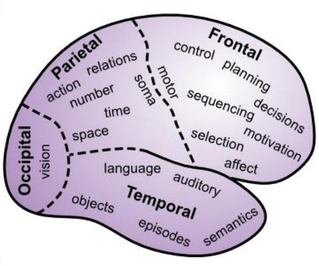
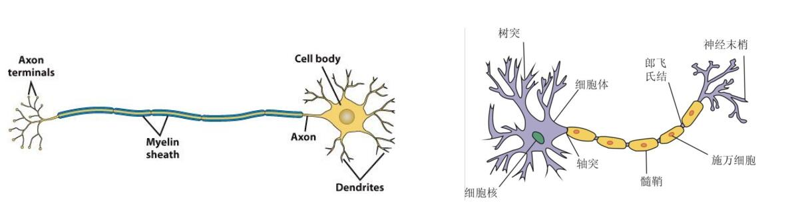
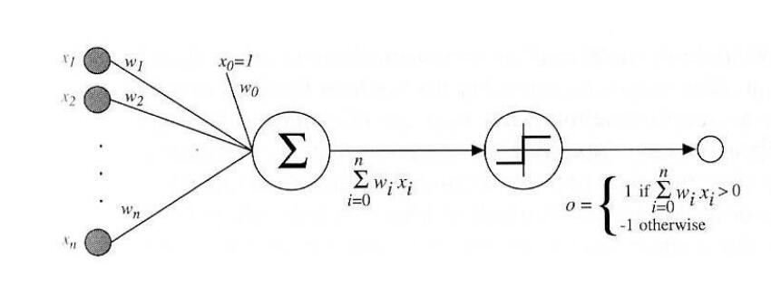

# 中英文词汇对照

因为这门课是英语试卷，有些专有名词还是得记录

|英文|中文|
|-|-|
|neurons|神经元|
|cortex|皮质（尤指大脑皮层）|
|neocortex|新皮质|
|synapses|突触|
|synaptic|突触的|
|dopamine|多巴胺|
|amnesia|失忆|
|prefrontal cortex|额叶前皮质|
|lobe|脑叶|
|subcortical|皮质下的|
|hippocampus|海马区|
|amygdala|杏仁核|
|thalamus|丘脑|
|basal ganglia|基底核|
|cerebellum|小脑|
|occipital lobe|枕叶|
|temporal lobe|颞叶|
|frontal lobe|额叶|
|parietal lobe|顶叶|
|arousal|激励|
|modulatory functions|调节功能|
|Reinforcement Learning|强化学习|
|Motor Control|运动控制|
|Executive Function|执行功能|
|motor coordination|运动协调|
|semantic|语义的|
|spike||
|dendrites|树突|
|axon|轴突|
|excitatory pyramidal neurons|兴奋性椎体神经元|
|inhibitory interneurons|抑制性中间神经元|
|white matter|白质|
|Likelihood function|似然函数|

# 绪论

## 大脑

在大脑新皮质上，每个神经元都有约10k个来自其他神经元的输入，通过突触连接。而大脑中总体有20billion规模的神经元。

虽然每两个神经元之间的连接相对而言影响较小，但是通过学习机制（learning mechanisms），这些神经元们可以实现非常复杂的信息处理功能。

大脑的学习过程并不要求单个神经元非常复杂，它其实是信息整合的一个简单形式

1. 准确描述神经元的反应特性
2. 在聚合神经网络上实现复杂的信息处理

## 认知计算的基本问题

1. 视觉
2. 注意力
3. 多巴胺与奖励机制
4. 记忆
5. 含义（Meaning）
6. 任务导向行为

## 我们应该关注大脑的什么？

David Marr认为，我们只需要独立地关注三个层次：

1. 计算层次。即大脑中在进行什么计算，什么信息在被处理？
2. 算法层次。大脑中的计算是如何进行的，信息处理的步骤是什么？
3. 实现层面。硬件如何实现这些算法？

注意独立，我们就可以抛弃实现，只研究计算和算法层次。

这部分的研究的简明历史如下

1. 1960s~1990s，主要的研究是认为人脑和传统计算机差不多，所以研究主要面向逻辑和符号命题
2. 后来，基于概率的研究变得流行，贝叶斯概率的框架使用广泛，他强调大脑在信息处理过程中的分级性质。但是贝叶斯理论对大脑在神经层面的拟合不是很好，实际上大脑不像一个通用的计算设备
3. 神经网络

## 脑区域之下皮质

### 海马区（Hippocampus）

是旧皮质，在短期记忆中有很重要的作用。

### 杏仁核（Amyglada）

对情绪显著刺激（emotionally salient stimuli）很重要，并且可以向大脑的其他部分发送警报（alert）。

它在基于奖惩机制的强化运动（和认知）动作（reinforcing motor (and cognitive) actions）中也发挥重要的作用。

### 丘脑（Thalamus）

为感官信息进入大脑新皮质提供了主要通道。也可能对注意力、激励和其他调节功能很重要。它在感知和注意力以及运动控制和强化学习中发挥作用。

### 基底核（Basal Ganglia）

它是下皮质的一系列区域的集合，在运动控制、强化学习和执行功能（Executive Function）中发挥关键作用

它帮助做出最后的“GO”指令，决定是否执行大脑皮层建议的特定动作，以及决定是否更新前额叶的认知计划。

### 小脑（Cerebellum）

其神经元占了脑的一半，在运动协调中有重要作用。在大部分认知任务中也处于活跃状态。

## 脑区域之新皮质

Brodmann根据解剖结果把大脑分为四个区域。

### 枕叶（Occipital lobe）

这里包含初级的视觉皮层，在枕叶的非常末端的位置。然后包含向外辐射的高级视觉中枢。

### 颞叶（Temporal lobe）

包含初级的听觉皮层，以及联系到高级听觉和语言处理的区域。

与此同时，视觉看到的物体转换到语言、语言转换到视觉的功能也是在这里进行的。这也是我们为什么能进行阅读的原因。

颞叶也对语义知识（semantic knowledg）很重要，也就是你对事物的深层理解。

这里包含了我们对于他人的面容、名字，事实、事件、物体、文字的认知。

### 额叶

额叶的前部，或叫前额叶，是大脑执行功能的区域。这里是所有高级shots被called的区域。

在这里，你的所有计划被整理出来，然后受基本动机和情绪的影响后，才真正决定你会如何行动。

这里也是处理最抽象、最有挑战性的认知形式的关键所在。

额叶皮层的内侧和腹侧区域对于情绪和动机非常重要。

### 顶叶（Parietal lobe）

这里对encoding空间位置、数字、数学、抽象关系和其他有关“智慧”的东西很重要。

它给视觉信息指导运动动作提供了主要的通道。

## 神经元

大脑神经元如此复杂，其是为了一个非常简单的整体功能“检测（detection）”服务的。

神经元接受数以千计的输入，但其中重要且有意义的只有一些特定模式（specific pattern）的输入，这些有价值的输入被称为“spike”，这也是神经元之间交流的基础。

神经元接受信号后，将它们与阈值比较，然后加入到总体的输出中，再用这个总体的输出和其他神经元交流。

## 把神经元看作是Detector

发送神经元和接收神经元用突触连接，大部分突触都连接在接收端的树突上。这些信号通过树突进入细胞体，进行信息的处理与综合。

输出的阈值判断发生在输出端的最开始，也就是轴突。

突触网络的效能或者说权重，指的是发送神经元发送的信号能以多大程度影响到接收神经元。

从计算上说，权重决定了一个神经元接受什么。权重越大，神经元对这个输入就更敏感，反之亦然。

学习的过程就是不断地调整神经元之间连接的权重，来达到想要的输出。

## 大脑新皮质的神经网络

有85%的神经元是兴奋性锥体神经元（excitatory pyramidal neurons），它们的连接跨度很广，可以跨越不同的脑区，有时候甚至可以跨越整个大脑。学习行为主要就发生在这些兴奋性神经元中；有15%是抑制性中间神经元（inhibitory interneurons），它们的连接更加局部化。某种意义上，可以理解为兴奋性神经元的散热器。

## 新皮质的层级结构

新皮质具有6种不同的层，每种脑区都有这种6层结构。但是拥有不同功能的脑区，其6层结构的厚度也各有不同，暗示了层级结构的功能。

新皮质中负责数据输入的脑区（Input Area）接收感知的输入（例如视觉；通常会经过丘脑），这些脑区的Layer 4通常会更大。这是因为来自丘脑的轴突都连接到这里。这些输入层（input layer）有一种特别的兴奋性神经元，称为星状细胞（stellate cell）。这些细胞的树突非常浓密，并且似乎尤其善于收集这一层的局部轴突输入。

新皮质中的隐藏脑区（Hidden Area），并不直接接受感觉输入，也不直接输出运动动作。它们是这个输入和输出的中间部分。我们可以理解为，这些区域从感官输入中创建越来越复杂和抽象的类别（catagories），然后再从这些高级类别中，协助选择出正确的运动动作。这些脑区的superficial layers 2/3会更厚，包含了许多锥体神经元，并且都放在很好的位置来实现这些抽象化功能。

新皮质中的输出脑区（Output Area），拥有直接作用于肌肉控制区的突触，发出电信号后，可以直接影响物理运动。这些输出层有更厚的deep layer 5/6，会把轴突发送给许多下皮质区域。

## 新皮质中的连接模式

信息传输包含正向传播和反向传播两个过程。

正向传播时，信息从感官信息流向大脑中更高级、更深的部分，从而形成了越来越抽象和复杂的类别（catagories）

反向传播时，信息从隐藏层和输出层出发，回到这些区域在正向传播时的前级区域，从而支持自上而下的行为认知控制、直接注意力，并且帮助解决感官输入中的歧义。

所以说，区域之间的连接很大程度上是双向的，发送前向信息的区域通常也会收到下级区域的信息。这种双向连接对于使网络能够跨层聚合到连贯的整体活动状态很重要，对于错误驱动（error-driven）的学习也很重要。

## 类别和分布式表示（Categorization and Distributed Representations）

如上，当我们看到一个人时，在最低的一层中，这里我们获得的表示只有一些最基本的特征。在下一层，我们把这些特征连起来，变成更复杂的视觉特征。在下一层，我们把面部特征全部组合了起来，形成了对于面容的认知。最后，我们把这张脸和语义上的各种东西关联起来，例如名字，性别，性格。

这个过程可以通过fMRI来显示，不同视觉刺激的脑部活动区域高度重合。

## 神经元的数学公式

一个基本的积分和激发神经元（A Basic Integrate-and-Fire Neuron）

$$
\tau_m\dfrac{du(t)}{dt}=u_{res}-u(t)+R_mi(t)
$$

其中$\tau_m$是神经元的膜时间常数，其由通道的平均电导决定。$u_{res}$是神经元的静息电位。$i(t)$是输入电流，其由突触前神经元放电产生，并且是众多这种放电的和。$R_m$是神经元对电流的电阻。

具体来说，$i(t)$还受到突触连接强度的影响，

$$
i(t) = \sum_j\sum_{t^f_j} w_jf(t-t^f_j)
$$

其中$f(\cdot)$代表激活函数，$t$表示突触$j$的突触前神经元的放电时间，该时间由膜电位$u$达到阈值$\theta$的时间决定。

$$
u(t^f) = \theta
$$

# 神经网络基础概念

## 神经元及其数学模型

神经元大体上由四个部分组成：细胞体、轴突、树突、突触

在神经元的信息处理过程中，树突相当于信息的接收器，细胞体相当于加和、处理信息的东西，轴突相当于信息的发射器，突触就是信息传递的连接点。

神经元只有当输入信息达到阈值后才会兴奋。所有这些信息都是电化学信息。学习则是突触间电化学过程效率的变化的过程。

于是我们就可以把神经元抽象成一个数学模型。这其实是一个有向图，每个节点代表神经元的细胞体。每个节点一般的多个输入对应树突，一个输出（有时有多个）对应轴突。神经元的兴奋阈值在这里是节点的激活函数，而突触间的效率在这里就是边的权重。例如下图

其中一个经典的模型是感知器：

他这里的中间的两个大节点可以理解为把一个节点拆成两个部分。感知器的作用是把一系列输入分为两个类型中的一类。

## 大脑分区和基础的神经网络

大脑分区和功能之前探讨过了，这里不再赘述。

神经网络面对的问题是，对于一组历史数据$\{(x_1,y_1),(x_2,y_2),\cdots,(x_l,y_l)\}$，要找出一个函数$f(x)=\hat y$，使得对未来的数据$x$，$\hat y$是一个良好的预测。

单输入的神经元如下：

拓展到多输入为

$f$一般称为激活函数，典型的有：

**阶跃函数、符号函数**

$$
f(x) = step(x)
$$

$$
f(x)=sgn(x)
$$

**线性函数**

$$
f(x)=kx+b
$$

**sigmoid函数**

$$
f(x) = \sigma(x) = \dfrac{1}{1+e^{-x}}
$$

特别的，其导数为

$$
\sigma'(x) = \sigma(x)(1-\sigma(x))
$$

其范围为$(0,1)$，输出中心为$0.5$。指数运算会比较慢，并且$x$很大时，出现梯度消失问题。

**双曲正切**

$$
f(x) = \tanh(x)=\dfrac{2}{1+e^{-2x}}-1
$$

长得和Sigmoid很像，但是其范围为$(-1,1)$，输出中心为$0$。问题和sigmoid相同。

**ReLU**

$$
f(x)=\max(0,x)
$$

其没有指数运算，且不会梯度消失。但输入为负数时，完全失效。

**Leaky ReLU**

即在$x\geq 0$时，$f(x)=x$，在$x<0$时，$f(x)=ax$，其中$a$是一个相对于$1$很小的正常数。其对ReLU进行了微小的修正，使得在负数输入时有效。

有了这些东西，我们就可以构造神经网络了，其中最简单的单层（Single Layer）（实际上是双层）神经网络如下。

这样的神经网络作用极其有限。只能用在线性分类任务上，大部分函数都不是线性的，或者不是线性可分的。

于是就有了多层的神经网络，在上图的输入层和输出层之间添加一个或非常多个隐藏层。

这样，神经网络就能处理更多复杂的分类问题。但是，多层神经网络的问题是难以训练。

## 正向传播和反向传播

反向传播算法的出现解决了训练的问题。

假设神经元$j$的期望输出是$t_j$，实际输出是$o_j$，那么误差就是

$$
E = \dfrac{1}{2}\sum_j(t_j-o_j)^2
$$

我们要优化的是每个连接的权重，我们就要找到每个权重对于误差的影响，偏导数

$$
\dfrac{\partial E}{\partial w_{ij}}
$$

其中$w_{ij}$是神经元$i$到$j$的权重

我们经常会用梯度下降法来优化权重，其迭代方向为

$$
\Delta w_{ij} = -\eta\dfrac{\partial E}{\partial w_{ij}}
$$

假设上一层的输入是$b_i$，这一层的输入为$\beta_j$，那么有$\beta_j = \sum_i w_{ij}b_i$

注意到$w_{ij}$首先影响输入值$\beta_j$，再影响到输出值$o_j$，最后才能影响到$E$。所以

$$
\dfrac{\partial E}{\partial w_{ij}} = \dfrac{\partial E}{\partial o_j}\cdot \dfrac{\partial o_j}{\partial \beta_j}\cdot\dfrac{\partial \beta_j}{\partial w_{ij}}
$$

其中，显然有$\dfrac{\partial \beta_j}{\partial w_{ij}}=b_i$

设$g_j = -\dfrac{\partial E}{\partial o_j}\cdot \dfrac{\partial o_j}{\partial \beta_j}$，如果激活函数为$\sigma(x)$，假设神经元阈值为$\theta_j$，则

$$
g_j = -(t_j-o_j)\sigma'(\beta_j-\theta_j) = o_j(1-o_j)(t_j-o_j)
$$

于是更新公式为

$$
w_{ij}\leftarrow w_{ij}+\Delta w_{ij} = w_{ij} + ng_jb_i
$$

# 学习

## 贝叶斯推理和学习

传统的频率学派认为，可以用大量试验中，事件出现的频率来估计概率。

但是贝叶斯学派不同，贝叶斯学派同时利用样本信息和先验知识。

频率学派通过大量独立实验将概率解释为统计均值（大数定律）。贝叶斯学派则将概率解释为信念度（degree of belief）（不需要大量的实验）。

频率学派把模型参数看做固定量，把样本看做随机变量。而贝叶斯学派则都看作随机变量。

贝叶斯推理在如下情况时，比频率方法更为有效：

- 样本数量十分有限
- 避免过拟合
- 我们有理由相信某个模型更为合适，但是这个理由不包含在样本数据里
- 我们更想知道某个事实有多大的可能性，而不是可能性最大的事实是什么

贝叶斯学派经常用到以下概率公式

**条件概率**

$$
P(A|B) = \dfrac{P(AB)}{P(B)}
$$

值得注意的是$P(A|B)\neq P(B|A)$通常成立

**事件的积的概率**

$P(AB) = P(A|B)P(B)$

有$P(AB)=P(BA)$

**全概率公式**

$$
P(A) = P(AB_1)+P(AB_2)+\cdots+P(AB_n)
$$

其中$B_1+B_2+\cdots+B_n$是必然事件，它们两两互斥。

于是再由条件概率，得到全概率公式为：

$$
P(A)=\sum^n_{i=1}P(A|B_i)P(B_i)
$$

**贝叶斯公式**

$$
P(B_i|A) = \dfrac{P(A|B_i)P(B_i)}{P(A)}=\dfrac{P(A|B_i)P(B_i)}{\sum^n_{i=1}P(A|B_i)P(B_i)}
$$

将贝叶斯公式写在模型中，得到

$$
P(model|data) = \dfrac{P(data|model)P(model)}{P(data)}
$$

也即

$$
P(\theta|X)=\dfrac{P(X|\theta)P(\theta)}{P(X)}
$$

其中$P(\theta|X)$是模型的后验概率，$P(X|\theta)$是数据的似然函数（Likelihood Function），$P(\theta)$是模型的先验概率，$P(X)$为证据。

### 先验概率

先验概率分布即$P(\theta)$，他的目的是，在我们得到任何样本之前，先capture我们对于$\theta$的先验知识。

### 似然函数

记为$L(\theta|X)=P(X|\theta)$，固定$X$时，关于参数$\theta$的似然函数，（在数值上）等于给定参数$\theta$后变量$X$的概率。

### 后验概率

贝叶斯推断的目标就是，使用样本数据$X$，来更新我们的先验概率$P(\theta)$，就得到了后验概率

### 最大后验估计（MAP）

$$
h_{MAP} = \arg\max_{h\in H} P(h|D) = \arg\max_{h\in H}\dfrac{P(D|h)P(h)}{P(D)}
$$

由于分母是常数，所以有

$$
h_{MAP} = \arg\max_{h\in H}P(D|h)P(h)
$$

### 最大似然估计（MLP）

$$
h_{MLP} = \arg\max_{h\in H}P(D/h)
$$

在有些时候，所有$H$的估计的先验概率是一样的（或者可以假设为一样的），就可以用最大似然估计。

### 贝叶斯过程

$$
P(X|\theta)=\dfrac{P(\theta|X)P(X)}{P(\theta)}
$$

假设你对某些特定的参数$\theta$感兴趣，那么通用的步骤如下

1. 通过先验知识确定$P(\theta)$
2. 通过试验等办法收集$X$
3. 用贝叶斯公式得到后验概率
4. 后验概率作为下一次迭代的先验概率，下次迭代时要获取新的$X$

### 贝叶斯分类器

假设总共有$N$类，其label分别为$y=\{c_1,c_2,\cdots,c_N\}$。对于一个样本$x$，设其属于$c_j$类，其被错误归类为$c_i$时，损失大小为$\lambda_{ij}$

样本$x$被归类为$c_i$的条件风险（或期望损失）就为

$$
R(c_i|x) = \sum^N_{j=1}\lambda_{ij}P(c_j|x)
$$

我们的任务是最小化损失，即最小化

$$
R(h) = E_x[R(h(x)|x)]
$$

为了最小化总体风险，我们只需要在每个样本上都选择那个能使条件风险最小的类别。即

$$
h^*(x)=\arg\min_{c\in y}R(c|x)
$$

此时$h^*(x)$就是贝叶斯最优分类器。与之对应的总体风险$R(h^*)$称为贝叶斯风险。

具体来说，若目标是最小化分类错误率，我们是损失可以写作

$$
\lambda_{ij}\left\{\begin{matrix}
0, & i=j\\
1, & i\neq j
\end{matrix}\right.
$$

此时条件概率可以算出来，

$$
R(c|x) = 1-P(c|x)
$$

于是最优分类器就为

$$
h^*(x) = \arg\max_{c\in y}P(c|x)
$$

即对每个样本$x$，都选择能使其后验概率最大的类别$c$

对于$P(c|x)$怎样得出，判别式模型对于给定的$x$，通过直接建模$P(c|x)$来预测$c$。而生成式模型，先对联合概率$P(x,c)$建模，再通过贝叶斯公式得到$P(c|x)$

$$
P(c|x)=\dfrac{P(x,c)}{P(x)} = \dfrac{P(c)P(x|c)}{P(x)}
$$

### 朴素贝叶斯分类器

之前的贝叶斯公式的问题是$P(x|c)$是一个联合概率，其并不方便直接从训练样本里面得出。朴素贝叶斯假设属性条件独立，那么有

$$
P(c|x)=\dfrac{P(c)P(x|c)}{P(x)}=\dfrac{P(c)}{P(x)}\prod^d_{i=1}P(x_i|c)
$$

其中$d$为属性数目，$x_i$为$x$在第$i$个属性上的取值。

于是朴素贝叶斯分类器就为

$$
h_{nb} = \arg\max_{c\in y} P(c)\prod^d_{i=1}P(x_i|c)
$$

若有充足的独立同分布样本，则可容易地估计出类先验概率

$$
P(c) = \dfrac{|D_c|}{|D|}
$$

即类$c$的个数在所有样本个数中的占比。

对于离散属性，条件概率可以估计为

$$
P(x_i|c)=\dfrac{|D_{c,x_i}|}{|D_c|}
$$

$D_{c,x_i}$指的是，$D_c$中，在第$i$个属性上取值为$x_i$的样本组成的集合。

对于连续属性，可以考虑概率密度函数，例如$P(x_i|c)\sim N(\mu_{c,i},\sigma^2_{c,i})$，其中$\mu_{c,i},\sigma^2_{c,i}$是第$c$类样本在第$i$个属性上取值的均值和方差。

### 贝叶斯网络

贝叶斯网络是一个有向无环图。其中节点代表随机变量$\{X_1,X_2,\cdots,X_n\}$。如果两个节点之间有因果关系，那么用一条有向边连接，起点是原因，终点是结果。

这个因果关系由参数$\theta$描述，所以贝叶斯网络可以表述为一个图$G$和参数$\theta$，即$B=< G,\theta >$。假设属性$x_i$在图中的父节点为$\pi_i$（注意可以有多个父节点），则$\theta_{x_i|\pi_i}=P_B(x_i|\pi_i)$

贝叶斯网假设每个属性与它的非后裔属性独立，于是有

$$
P_B(x_1,x_2,\cdots,x_d) = \prod^d_{i=1}P_B(x_i|\pi_i) = \prod^d_{i=1}\theta_{x_i|\pi_i}
$$

例如

## 有监督学习

即训练集除了属性，还有标签。

其训练、验证、预测程序框架如下

一般来说，其有如下步骤

1. 决定数据集的类型
2. 获取数据集
3. 决定学习的模型，以及学习的算法
4. 完成程序设计，在训练集上跑
5. 评估正确率等指标，然后选择继续修正参数再次训练或者结束。

有监督学习的任务主要分为两个：回归、分类。回归就是对输入给出预测的输出，例如预测未来某一天的温度；分类则是对样本进行划分，使其属于某一个类别。

### 回归任务

其一般如下。设样本为$\{(x^{(1)}, y^{(1)}), (x^{(2)}, y^{(2)}), \cdots, (x^{(m)}, y^{(m)})\}$。程序对于$x$给出的预测是$h_\theta(x)=\hat y$，其中$h_\theta$就是我们的预测函数，或者说模型，而$\theta$是模型参数。我们的目标是求出

$$
\theta^* = \arg\min_{\theta}\sum^m_{i=1}(\hat y^{(i)}-y^{(i)})^2=\arg\min_\theta J(\theta)
$$

至于如何求出，一般会使用数值最优化方法，例如梯度下降。搜索方向即是$-\eta\nabla J(\theta)$
